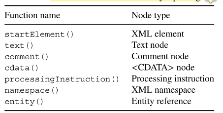
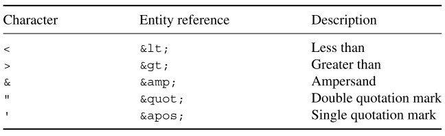
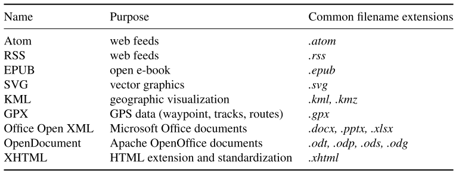
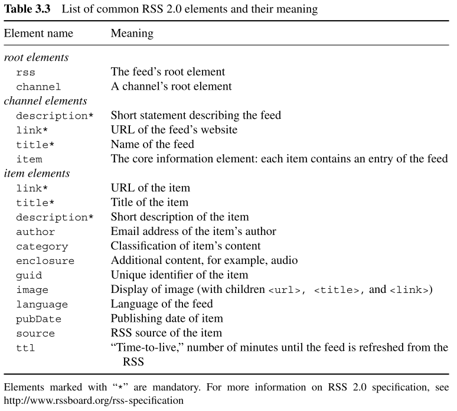
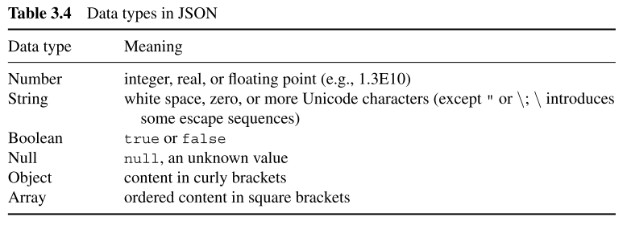
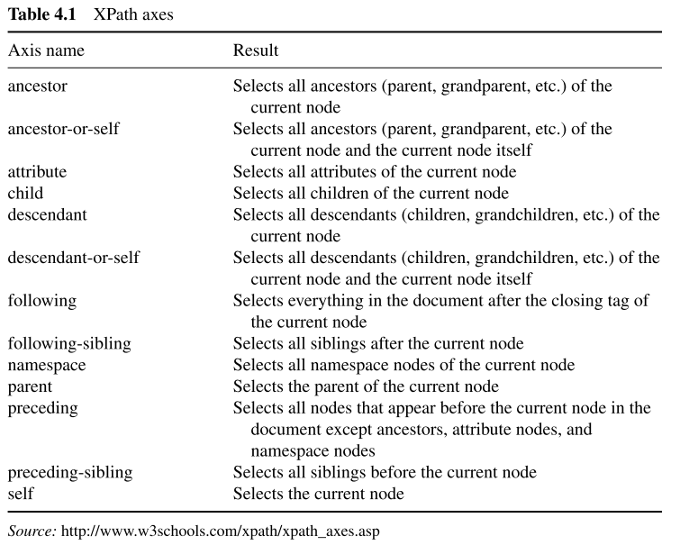
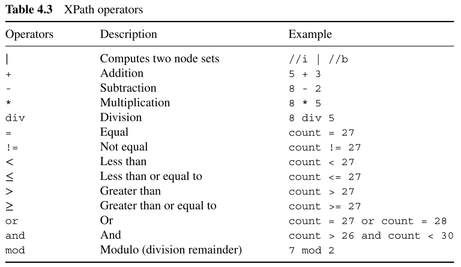
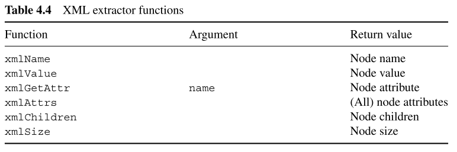

```{r setup, include=FALSE}
knitr::opts_chunk$set(echo = TRUE)
```

# Chapter 1 Introduction  
```{r}
library(stringr)
library(XML)
library(maps)
library(magrittr)
```

```{r}
heritage_page <- htmlParse(file = "files/List of World Heritage in Danger - Wikipedia.html", 
                           encoding = "UTF-8")


tables <- readHTMLTable(doc = heritage_page, stringsAsFactors = F)
danger_table <- tables[[2]]
colnames(danger_table) <- c("name", "image", "location", "criteria", "area", "year", "endangered", "reason", "refs")
```

```{r}
danger_table$criteria <- ifelse(grepl("Natural", danger_table$criteria), "nat", "cult")
danger_table$criteria %>% table()
```


```{r}
danger_table$year <- as.numeric(danger_table$year)
```


```{r}
l <- danger_table$endangered %>% nchar
danger_table$endangered <- substr(danger_table$endangered, l-4, l-1) %>% as.numeric()
```


```{r}
danger_table$location[1:3]
reg_y <- "[/][ -]*[[:digit:]]*[.]*[[:digit:]]*[;]"
reg_x <- "[;][ -]*[[:digit:]]*[.]*[[:digit:]]*"
```


```{r}
y_coords <- str_extract(string = danger_table$location, pattern = reg_y)
x_coords <- str_extract(string = danger_table$location, pattern = reg_x)
```

```{r}
y_coords <- str_extract(y_coords, "[-]?[[:digit:]]+[.]*[:digit:]*")
x_coords <- str_extract(x_coords, "[-]?[:digit:]+[.]*[:digit:]*")
```

```{r}
danger_table$y_coord <- y_coords
danger_table$x_coord <- x_coords

danger_table[, c("x_coord", "y_coord")]
```

```{r}
danger_table <- danger_table[, c("name", "criteria", "year", "endangered", "x_coord", "y_coord")]
```

```{r}
p <- ifelse(danger_table$criteria == "nat", 19, 2)
c <- ifelse(danger_table$criteria == "nat", "red", "blue")
map("world", col = "grey", lwd = 0.5, mar = rep(0.1, 4))
points(danger_table$x_coord, danger_table$y_coord, pch = p, col = c, cex = 0.7)
box(which = "figure", col = "grey", lwd = 0.1)
legend(x = -180, y = -85, 
       legend = c("natural", "cultural"), 
       col = c("red", "blue"), 
       pch = c(19, 2), 
       bty = "n", 
       xpd = TRUE)
```

```{r}
danger_table$yend <- cut(danger_table$endangered, breaks = seq(1985, 2020, 5))
danger_table$yend %>% table() %>% sort() %>% barplot()
```

```{r}
danger_table$endangered %>% hist()
```


**Technologies for disseminating, extracting, and storing web data**  
```{r}
knitr::include_graphics("technologies-for-disseminate-extracting-storing-web-data.PNG")
```


# Chapter 2 HTML  
An HTML file is basically nothing but plain text—it can be opened and edited with any text editor. What makes HTML so powerful is its marked up structure.  

The markup definitions rely on predefined character sequences—the tags—that enclose parts of the text.  

## Syntax rules  
### Tags, elements, and attributes  
Plain text is turned into an HTML document by tags that can be interpreted by a browser. The combination of start tag, content, and end tag is called *element*  
```
<title>First HTML</title>
```

### Reserved and special characters  
- character entities: `&;`  
```
the wrong format 
<p> 5 < 6 but 7 > 3 </p>

the right format
<p> 5$lt; 6 but 7 &gt; 3 </p>
```

**HTML entities**  
```{r}
knitr::include_graphics("HTML-entities.png")
```

[For more comprehensive list of HTML entities](http://unicode-table.com 2.2.5).  


## Tags and attributes  
### The anchor tag <a>  
The anchor tag <a> is what turns HTML from just a markup language into a hypertext markup language by enabling HTML documents to link to other documents. Much of the site-to-site navigation in browsers works via anchor elements.  

In fact, <a> elements are even more flexible as they can not only link to other files, but also link to specific parts of a document.  

### The metadata tag <meta>  
The <meta> tag is an empty tag written in the head element of an HTML document. <meta> elements do not have to be closed and thus differ from the general rule that empty elements have to be closed with a dash /.  

### The external reference tag <link>  
The link tag is used to link to and include information and external files. All information is provided with attributes.  

### Emphasizing tags <b>, <i>, <strong>  
Tags like <b>, <i>, <strong> are layout tags that refer to bold, italics, and strong emphasis.  

### The paragraphs tag <p>  
The <p> tag labels its content as being a paragraph and ensures that line breaks are inserted <p> before and after its content.  

### Heading tags <h1>, <h2>, <h3>, ...  
In order to define levels of headlines - level 1 to level 6 --HTML provides a series of tags <h1>, <h2>, ... down to <h6>.  

### Listing content with <ul>, <ol>, and <dl>  
Several tags exist to list content. They are used depending on whether they wrap around an ordered list (<ol>), an unordered list (ul), or a description list (<dl>). The former two tags make use of nested <li> elements to define list items, while the latter needs two further elements: <dt> for keyword and <dd> for its description.  

### The organizational tags <div> and <span>  
Another way of defining the appearance of parts of the HTML document are the <div> and <span> tags. While <div> and <span> themselves do not change the appearance of the content they enclose, these tags are used to group parts of the document—the former is used to define groups across lines, tags, and paragraphs, while the latter is used for in-line grouping.  

Grouping parts of an HTML document is handy when combined with Cascading Style
Sheets (CSS), a language for describing the layout of HTML and other markup documents like XML, SVG, and XHTML.  

The purpose ofCSS is to separate content from layout to improve the document’s accessi-
bility. Defining styles outside ofan HTML and assigning them via the class attribute enables the web designer to reuse styles across elements and documents. This enables developers to change a style in one single place—within the CSS file—with effects on all elements and documents using this style.  

### The <form> tag and its companions  
An advanced feature of HTML are forms. HTML forms do more than just layout content. They enable users to interact with servers by sending data to them instead of only receiving data from them.  

```
<form name="submitPW" action="Passed.html" method="get">
password:
        <input name="pw" type="text" value="">
        <input type="submit" value="SubmitButtonText">
</form>
```

The form in the example consists of one <form> element and two <input> elements nested within the former. The <form> tag has a name attribute, an action attribute, and a specific method. The name of the form servers as an internal identifier. The action and method attributes define what the browser is supposed to do once *submit button* is pressed. action defines the location of the response.  

The most common protocol for requesting and receiving resources on the Web is HTTP (Hypertext Transfer Protocol). The `method` attribute refers to the HTTP method that is used to send the information to the server. Most likely it will be POST or GET.  


### The foreign script tag <script>  
HTML itself is not a programming language. HTML is a markup language that describes content and defines its presentation. Once an HTML file is loaded in the browser, it remains stable and does not change by events or user interaction.  

The <script> element is a container for scripts that enable HTML to include functionality from other programming languages. This other language will frequently be JavaScript. JavaScript allows the browser to change the content and structure of the document after it has been loaded from the server, enabling user interaction and event handling.  


### Table tags <table>, <tr>, <td>, and <th>  
```
	 <table>
	 <tr> <th>Rank</th> <th>Nominal GDP</th> <th>Name</th> </tr>
 	 <tr> <th></th> <th>(per capita, USD)</th> <th></th> </tr>
	 <tr> <td>1</td> <td>170,373</td> <td>Lichtenstein</td> </tr>
	 <tr> <td>2</td> <td>167,021</td> <td>Monaco</td> </tr>
 	 <tr> <td>3</td> <td>115,377</td> <td>Luxembourg</td> </tr>
	 <tr> <td>4</td> <td>98,565</td> <td>Norway</td> </tr>
         <tr> <td>5</td> <td>92,682</td> <td>Qatar</td> </tr>
	 </table>
```


## Parsing  
Parsing HTML occurs at both steps—by the browser to display HTML content nicely, and also by parsers in R to construct useful representations ofHTML documents in our programming environment.  


### What is parsing  
The difference between reading and parsing is not just a semantic one. Instead, reading functions differ from parsing functions in that the former do not care to understand the formal grammar that underlies HTML but merely recognize the sequence of symbols included in the HTML file.  

```{r}
fortunes <- readLines(con = "/home/yincy/git/Wiley-ADCR/ch-2-html/fortunes.html")
fortunes
```

```{r}
parsed_fortunes <- htmlParse(file = "/home/yincy/git/Wiley-ADCR/ch-2-html/fortunes.html")
parsed_fortunes
```

### Discarding nodes  
Discarding unnecessary parts ofweb documents in the parsing stage can help mitigate memory issues and enhance extraction speed. Handlers provide a comfortable way to manipulate (i.e., delete, add, modify) nodes in the tree construction stage.  

```{r}
h1 <- list("body" = function(x) {NULL})
parsed_fortunes <- htmlTreeParse(file = "/home/yincy/git/Wiley-ADCR/ch-2-html/fortunes.html", 
                                 handlers = h1, 
                                 asTree = T)

parsed_fortunes
```

```{r}
h1 <- list("div" = function(x)NULL, 
           "title" = function(x)NULL)

parsed_fortunes <- htmlTreeParse(file = "/home/yincy/git/Wiley-ADCR/ch-2-html/fortunes.html", 
                                 handlers = h1, 
                                 asTree = T)
parsed_fortunes
```

```{r}

```


```{r}
h2 <- list(
        startElement = function(node, ...){
                name = xmlName(node)
                if(name %in% c("div", "title")){
                        NULL
                }else{
                        node
                }
        }, 
        comment = function(node){
                NULL
        }
)


parsed_fortunes <- htmlTreeParse(file = "/home/yincy/git/Wiley-ADCR/ch-2-html/fortunes.html", 
                                 handlers = h2, 
                                 asTree = T)

parsed_fortunes
```


### Extracting information in the building process  
```{r}
getItalics <- function(){
        i_container = character()
        list(i = function(node, ...){
                i_container <<- c(i_container, xmlValue(node))
        }, 
        returnI = function(){
                i_container
        })
}
```


```{r}
h3 <- getItalics()
```

```{r}
htmlTreeParse(file = "/home/yincy/git/Wiley-ADCR/ch-2-html/fortunes.html", 
              handlers = h3) %>% 
        invisible()

h3$returnI()
```


# Chapter 3 XML and JSON  
## XML syntax rules  
### Elements and attributes  
**XML declaration**  
```
<?xml version=1.0 encoding="ISO-8859-1"?>
```

**root element**
An XML file must contain one and only one root element that embraces the whole document.  


**element syntax**

Information is usually stored in elements. An XML element is defined by its start tag and the content. An element frequently has an end tag, but can also be closed in the start tag with aslash /.  

- *other elements*  
- *attributes*, bits of information that describe the element in more detail. Attributes, like elements, are slots for information, but they cannot contain further elements or attributes.  
- *data* of any form any length, for example, text, numbers or symbols.  
- *a mixture of everything*, which sounds complicated but is a rather ordinary case when elements contain other elements that contain data.  
- *nothing*, which means really nothing - no data, no other element, not even white spaces.  


### XML structure  
**naming rules**    
- element names can be composed of letters, numbers, and other characters, like in <name1>...</name1>  
- names must not start with a number  
- Names must not start with a punctuation character  
- Names must not start with the letters xml  
- element names and attribute names are case sensitive  
- names must not contain spaces  

As in HTML, there are some characters that cannot be used literally in the content as they are needed for markup. To represent these characters in the content, they have to be replaced by escape sequences.

```{r}

```

### Comments and character data  
```
<!-- an arbitrary comment -->
```
Everything in between <!-- and --> is not treated as part of the XML code and therefore ignored by parsers. Comments may be used between tags or within element content, but not within element or attribute names.  

The use of escape sequences can be cumbersome when the elements to be escaped are common in the data values.  

```
1 < 3 < pi < 9 <= sqrt(81) < 1'081 > -2 > -999
```

```
1 &lt; 3 &lt; pi &lt; 9 &lt;= sqrt(81) &lt; 1&apos;081 &gt; -2 &gt; -999
```

to avoid this mess using CDATA  
```
<![CDATA[
1 < 3 < pi < 9 <= sqrt(81) < 1'081 > -2 > -999
]]>
```

All characters in the CDATA section are taken as is. The difference between comments and a CDATA section is that a comment is not part of the document.  

### XMLsyntax summary  
The XML syntax comprises the following set of rules  

- An XML document must have a root element  
- All elements must have a start tag and be closed, except for the declaration, which is not part of the actual XML document.  
- XML element must be properly nested.  
- XML attribute values must be quoted.  
- Tags are named with characters and numbers, but may not start with a number or 'xml'  
- Tag names may not contain spaces and are case sensitive.  
- Space character are preserved.  
- Some characters are illegal and have to be replaced by meta characters.  
- Comments can be included as follows: <!-- comment -->.  
- Content can be excluded from parsing using: <![CDATA[...]]>.  


## XML extensions and technologies  
We have seen that XML has advantages compared to HTML for exchanging data on the Web as it is extensible - and thus flexible. However, flexibility also carries the potential for uncertainty or inconsistency, for example, when the same element names are used for different content. Several extensions and technologies exist that improve the usability of XML by suggesting standards or providing techniques to set such standards. Some of the most important of these techniques are described in this section.  

```
<root xmlns:h='http://www.w3.org/1999/xhtml' xmlns:t='http://funnybooknames.com/crockford'>
        
        <h:head>
                <h:title>Bacis HTML Sample Page</h:title>
        </h:head>
        
        <t:book id='1'>
                <t:author>Douglas Crockford</t:author>
                <t:title>JavaScript: The Good Parts</t:title>
        <t:/book>
</root>
```
In this example, namespaces are declared in the root element using the xmlns attribute and two prefixes, h and t. The namespace name, that is, the namespace attribute value, usually carries a Uniform Resource Identifier (URI) that points to some Internet address.  

**Namespace rules**  
- Namespaces can be declared in the root element or in the start tag of any other element. In the latter case, all children of this element are considered part of this namespace.  

- The namespace name does not necessarily have to be a working URL. Parsers will never try to follow the link, not even a URI. Any other string is fine. However, it is common practice to use URIs for two resons: first, as they are a long, unique string of characters, duplicates are unlikely, and second, actual URLs can point the human reader to pages where more information about the namespace is given.  

- Prefixes do not have to be explicitly stated, so the declaration can either be `xmlns` or `xmlns:prefix` . If the `prefix` is dropped, the xmlns is assumed to be the default namespace and any element without a prefix is considered to be in that namespace. When prefixes are used, it is bound to a namespace in the declaration. Attributes, however, never belong to the default namespace.  


### Extensions of XML  
**XML markup languages**  
```{r}

```


**Common RSS 2.0 elements and their meaning**  
```{r}

```


## XML and R in practice  
```{r}
pasred_stocks <- xmlParse(file = "/home//git/Wiley-ADCR/ch-3-xml/stocks/technology.xml", 
                          validate = TRUE)
```


### Bacis operations on XMLdocuments  
```{r}
bond <- xmlParse(file = "/home/yincy/git/Wiley-ADCR/ch-3-xml/bond.xml")
bond %>% class()
```

```{r}
bond %>% xmlRoot()
```

the root element name  
```{r}
bond %>% xmlRoot() %>% xmlName()
```

the root element's number of children  
```{r}
bond %>% xmlRoot() %>% xmlSize()
```

```{r}
bond %>% xmlRoot() %>% class()
```

```{r}
bond %>% xmlRoot() %>% .["movie"]
```

```{r}
xmlParse(file = "/home/yincy/git/Wiley-ADCR/ch-3-xml/rsscode.rss")
```

## A short example JSON document  
```{r}

```


## JSON and R in practice  
```{r, message=FALSE, warning=FALSE}
library(RJSONIO)
library(jsonlite) # build upon RJSONIO
library(magrittr)
library(stringr)
```

check the valid of the document  
```{r}
isValidJSON(content = "f:/git/Wiley-ADCR/ch-3-xml/indy.json")
```


```{r}
indy <- RJSONIO::fromJSON(content = "f:/git/Wiley-ADCR/ch-3-xml/indy.json")
indy %>% class()
```

```{r}
indy_vec <- indy %>% unlist(recursive = T, use.names = T)
indy_vec[str_detect(names(indy_vec), "name")]
```

```{r}
indy_vec %>% unlist(recursive = T, use.names = T) %>% class()

### From XML to data frames or list  
Single vectors can be extracted with `xmlSApply()`, a wrapper function for `lapply()` and `sapply()` that is built to deal with children of a given XML node.  

```{r}
xmlSApply(bond %>% xmlRoot %>% .[[1]], xmlValue)
```

```{r}
xmlSApply(bond %>% xmlRoot, xmlAttrs)
```


```{r}
xmlSApply(bond %>% xmlRoot, xmlGetAttr, name = "id")
```

As long as XML documents are flat in the hierarchical sense, that is, the root node’s most distant relatives are grandchildren or children, they can usually be transformed easily into a data frame with `xmlToDataFrame()`.  

```{r}
bond %>% xmlRoot() %>% .[[1]]
```

```{r}
xmlToDataFrame(bond %>% xmlRoot)
```

```{r}
xmlToList(bond %>% xmlRoot())
```


### Event-driven parsing  
Event-driven parsing differs from DOM- style parsing in that it skips the construction of the complete DOM at the C level. Instead, event-driven parsers sequentially traverse over an XML file, and once they find a specified element of interest they prompt an instant, user-defined reaction to this event. This procedure provides a huge advantage over DOM-style parsers because the machine’s memory never has to hold the complete document.  

```{r}
branchFun <- function(){
        container_close <- numeric()
        container_date <- numeric()
        
        "apple" = function(node, ...){
                date = xmlValue(xmlChildren(node)[[c("date")]])
                container_date <<- c(container_date, date)
                close <- xmlValue(xmlChildren(node)[[c("close")]])
                container_close <<- c(container_close, close)
        }
        getContainer <- function(){
                data.frame(date = container_date, 
                           close = container_close)
        }
        list(Apple = apple, getStore = getContainer)
}
```

```{r}
h5 <- branchFun()
h5
```

```{r}
xmlEventParse(file = "/home/yincy/git/Wiley-ADCR/ch-3-xml/stocks/technology.xml", 
              branches = h5, 
              handlers = list())

apple.stock <- h5$getStore()
apple.stock %>% head()
```


## JSON  
check the valid of JSON file  
```{r}
isValidJSON(content = "f:/git/Wiley-ADCR/ch-3-xml/indy.json")
```

```{r}
indy <- RJSONIO::fromJSON(content = "f:/git/Wiley-ADCR/ch-3-xml/indy.json")
indy %>% class()
```


```{r}
indy_vec <- unlist(indy, recursive = T, use.names = T)
indy_vec %>% class()

indy_vec[str_detect(string = names(indy_vec), "year")]
```

the data types are retained   
```{r}
sapply(indy[[1]], "[[", "year") 
```

```{r}
library(plyr)
indy.unlist <- sapply(indy[[1]], unlist)

indy.df <- do.call("rbind.fill", lapply(lapply(indy.unlist, t), data.frame, stringAsFactors = F))
```

```{r}
indy.df %>% names()
```

```{r}
peanuts.json <- RJSONIO::fromJSON(content = "f:/git/Wiley-ADCR/ch-3-xml/peanuts.json", 
                         nullValue = NA, 
                         simplify = F)

peanuts.df <- do.call("rbind", lapply(peanuts.json, data.frame, stringAsFactors = F))
```


```{r}
peanuts.json <- toJSON(x = peanuts.df, pretty = T)
file.output <- file(description = "peanuts_out.json")
writeLines(text = peanuts.json, con = file.output)
close(file.output)
```


```{r}
library(jsonlite)
```


```{r}
x <- '[1, 2, true, false]'
fromJSON(x)

x <- '["foo", true, false]'
fromJSON(x)

x <- '[1, "foo", null, false]'
fromJSON(x)
```

jsonlite conveniently mapping into the desired R object  
```{r}
peanuts.json <- fromJSON(txt = "f:/git/Wiley-ADCR/ch-3-xml/peanuts.json")
peanuts.json
```

```{r}
(indy <- fromJSON(txt = "f:/git/Wiley-ADCR/ch-3-xml/indy.json"))
```


```{r}
indy.json <- RJSONIO::fromJSON("f:/git/Wiley-ADCR/ch-3-xml/indy.json")
indy.json[[1]] %>% sapply("[[", "budget")
```


```{r}
potus <- xmlParse(file = "f:/git/Wiley-ADCR/materials/ch-3-xml/")
```


# XPath  
XPath only works on the DOM representation of a document and cannot be applied on the native code.  
```{r}
parsed_doc <- htmlParse(file = "f:/git/Wiley-ADCR/ch-2-html/fortunes.html")
parsed_doc %>% print()
```

## Identifying node sets with XPath  
```{r}
xpx <- "//i"
xpathSApply(doc = parsed_doc, 
            path = xpx, 
            fun = xmlValue)
```

```{r}
xpathSApply(doc = parsed_doc, 
            path = "//p//i", 
            fun = xmlValue)
```

```{r}
xpathSApply(doc = parsed_doc, 
            path = "/html/body/div/p/i", 
            fun = xmlValue)
```

```{r}
xpathSApply(doc = parsed_doc, 
            path = "//body//i", 
            fun = xmlValue)
```

```{r}
xpathSApply(doc = parsed_doc, 
            path = "/html/body/div/*/i", 
            fun = xmlValue)
```

```{r}
xpathSApply(doc = parsed_doc, 
            path = "//title/..")
```

```{r}
xpathApply(parsed_doc, 
           "//address|//title")
```

```{r}
twoQueries <- c(address = "//address", title = "//title")

xpathSApply(parsed_doc, 
            path = twoQueries)
```

### Node relations  
```{r}
parsed_doc
```

```{r}
xpathSApply(doc = parsed_doc, 
            path = "//a/ancestor::div//i")
```

```{r}
xpathSApply(doc = parsed_doc, 
            path = "//p/preceding-sibling::h1")
```

```{r}
xpathSApply(doc = parsed_doc, 
            path = "//title/parent::*")
```

```{r}

```

### XPath predicates  
Predicates are nothing but simple functions that are applied to a node's name, value, or attribute, and which evaluate whether a condition (or set of condition) is true or false.  


#### Numerical predicates  
important XPath functions  
```{r}
knitr::include_graphics("figures/some-important-XPath-functions.png")
```

XPath operators  
```{r}

```


```{r}
xpathSApply(parsed_doc, 
            "//div[position() = 1]/p/i")
```


```{r}
xpathSApply(doc = parsed_doc, 
            path = "//div/p[last()]")
```

```{r}
xpathSApply(doc = parsed_doc, 
            path = "//div/p[last() - 1]")
```

select node based on the number of children node  
```{r}
xpathSApply(doc = parsed_doc, 
            path = "//div[count(.//a) > 0]")
```

```{r}
xpathSApply(doc = parsed_doc, 
            path = "//div[count(./@*) > 2]")
```

```{r}
xpathSApply(doc = parsed_doc, 
            path = "//*[string-length(text()) > 50]")
```


#### Textual predicates  
```{r}
xpathSApply(doc = parsed_doc, 
            path = "//div[@date='October/2011']")
```

```{r}
xpathSApply(doc = parsed_doc, 
            path = "//*[contains(text(), 'magic')]")
```

```{r}
xpathSApply(doc = parsed_doc, 
            path = "//div[starts-with(./@id, 'R')]")
```

```{r}
xpathSApply(doc = parsed_doc, 
            path = "//div[substring-after(./@date, '/')='2003']//i")
```


## Extracting node elements  
get value information  
```{r}
xpathSApply(doc = parsed_doc, 
            path = "//title")

xpathSApply(doc = parsed_doc, 
            path = "//title", 
            fun = xmlValue)
```

get attributes information  
```{r}
xpathSApply(doc = parsed_doc, 
            path = "//div", 
            fun = xmlAttrs)
```


```{r}
xpathSApply(doc = parsed_doc, 
            path = "//div", 
            fun = xmlGetAttr, 
            name = "id")

xpathSApply(doc = parsed_doc, 
            path = "//div", 
            fun = xmlGetAttr, 
            name = "lang")
```

**XML extractor functions**  
```{r}

```


### Extending the fun argument  
```{r}
lowerCaseFun <- function(x){
        x <- tolower(xmlValue(x))
        return(x)
}

xpathSApply(doc = parsed_doc, 
            path = "//div//i", 
            fun = lowerCaseFun)
```


```{r}
dateFun <- function(x){
        require(stringr)
        date <- xmlGetAttr(node = x, name = "date")
        year <- str_extract(date, "[0-9]{4}")
        return(year)
}

xpathSApply(doc = parsed_doc, 
            path = "//div", 
            fun = dateFun)
```


```{r}
idFun <- function(x){
        id <- xmlGetAttr(node = x, name = "id")
        id <- ifelse(is.null(id), "not specified", id)
        return(id)
}

xpathSApply(doc = parsed_doc, 
            path = "//div", 
            fun = idFun)
```


#### Using variables in XPath expressions  
```{r}
parsed_doc <- xmlParse(file = "f:/git/Wiley-ADCR/ch-3-xml/stocks/technology.xml")

companies <- c("Apple", "IBM", "Google")
xpx <- sprintf(fmt = "//%s/close", companies)
```

```{r}
getClose <- function(node){
        value <- xmlValue(node)
        company <- xmlName(node = xmlParent(x = node))
        mat <- c(company = company, value = value)
}

xpathSApply(doc = parsed_doc, 
            path = xpx, 
            fun = getClose) %>% 
        t() %>% 
        as.data.frame() %>% 
        head()
```


### XML namespaces  
```{r}
parsed_doc <- xmlParse(file = "../XML-and-Web-technology/Data/GovTrack/cosponsorGraph.xml")
parsed_doc %>% xmlRoot()
xmlNamespace(parsed_doc %>% xmlRoot)

xpathSApply(doc = parsed_doc, 
            path = "//x:code", 
            namespaces = c(x = "http://www.r-project.org"), 
            fun = xmlValue) %>% length()
```


### Little XPath helper tools  


