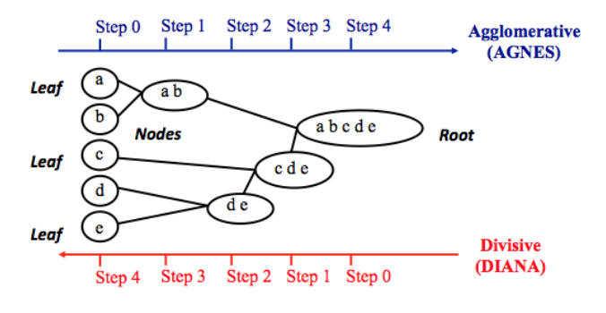

```{r setup, include=FALSE}
knitr::opts_chunk$set(echo = TRUE)
```

**The goal of clustering is to identify pattern or groups of similar objects within a data set of interest**.  

# I Basics  
## Introduction to R  

## Data Preparation  
To perform a cluster analysis in R, generally, the data should be prepared as follow:  
1. Rows are observations (individuals) and columns are variables.  
2. Any missing value in the data must be removed or estimated.  
3. The data must be standardized (i.e., scaled) to make variables comparable. Recall that, standardization consists of transforming the variables such that they have mean zero and standard deviation one.   

```{r}
library(magrittr)
data("USArrests")

df <- USArrests
df <- na.omit(df) # remove observations that contain missing values
df <- scale(df)
df %>% head()
```

|**Functions**|**Description**|  
|:--|:--|
|`dist(fviz_dist, get_dist)`| Distance Matrix Computation and Visualization|
|`get_clust_tendency`|Assessing Clustering Tendency|
|`fviz_nbclust(fviz_gap_stat)`|Determining the Optimal Number of Clusters|
|`fviz_dend`|Enhanced Visualization of Dendrogram|
|`fviz_cluster`|Visualize Clustering Results|
|`fviz_mclust`|Visualize Model-based Clustering Results|
|`fviz_silhouette`|Visualize Silhouette Information from Clustering|
|`hcut`|Computes Hierarchical Clustering and Cut the Tree|
|`hkmeans`|Hierarchical k-means clustering|
|`eclust`|Visual enhancement of clustering analysis|


Required R Packages  
```{r}
library(cluster)
library(factoextra)
```


## Clustering Distance Measures  
The classification of observations into groups requires some methods for computing the **distance** or the (dis)**similarity** between each pair of observations. The result of this computation is known as a dissimilarity or **distance matrix**.  

### Methods for measuring distances  
1. **Euclidean distance**  
The distance between two points.  
$$
d_{euc}(x,y) = \sqrt{\sum_{i=1}^{n}(x_{i} - y_{i})^2}
$$
2. **Manhattan distance**  
$$
d_{man}(x, y) = \sum_{i=1}^{n}|(x_{i} - y_{i})|
$$
> $x$ and $y$ are two vectors of length n.  


> below is correlation base distance, which is widely used for gene expression data analysis. Correlation-based distance is defined by subtracting the correlation coefficient from 1.  

3. **Pearson correlation distance**  
Pearson correlation measures the degree of a **linear relationship** between two profiles.  

$$
d_{cor}(x,y) = 1 - \frac{\sum_{i=1}^{n}(x_{i} - \overline{x})(y_{i} - \overline{y})}{\sqrt{\sum_{i=1}^{n}(x_{i}-\overline{x})^{2}\sum_{i=1}^{n}(y_{i}-\overline{y})^{2}}}
$$

4. **Eisen cosine correlation distance**  
It's a special case of Pearson's correlation distance with $\overline{x}$ and $\overline{y}$ both replaced by zero.  

$$
d_{eisen}(x,y) = 1 - \frac{|\sum_{i=1}^{n}x_{i} \cdot y_{i}|}{\sqrt{\sum_{i=1}^{2}x_{i}^{2} \cdot \sum_{i=1}^{n}y_{i}^{2}}}
$$

5. **Spearman correlation distance**  
The spearman correlation method computes the correlation between the rank of x and the rank of y variables.  

$$
d_{spear}(x, y) = 1 - \frac{\sum_{i=1}^{n}(x'_{i} - \overline{x'})(y'_{i} - \overline{y'})}{\sqrt{\sum_{i=1}^{n}(x'_{i} - \overline{x'})^{2} \cdot \sum_{i=1}^{n}(y'_{i} - \overline{y'})^{2}}}
$$

Where $x'_{i} = rank(x_{i})$ and $y'_{i} = rank(y)$.  

6. **Kendall correlation distance**  
Kendall correlation method measures the correspondence between the ranking of x and y variables. The total number of possible pairings of x with y observations is $\frac{n\cdot(n-1)}{2}$, where n is the size of x and y. Begin by ordering the pairs by the x values. If x and y are correlated, then they would have the same relative rank orders. Now, for each $y_{i}$, count the number of $y_{j} > y_{i}$ (concordant pairs (c)) and the number of $y_{j} < y_{i}$ (discordant pairs (d)).  

$$
d_{kend}(x,y) = 1 - \frac{n_{c} - n_{d}}{\frac{1}{2} \cdot n \cdot (n - 1)}
$$

- $n_{c}$: total number of concordant pairs  
- $n_{d}$: total number of discordant pairs  
- $n$: size of x and y  


> 1. pearson correlation analysis is the most commonly used method. It is also known as a parametric correlation which depends on the distribution of the data.  
2. Kendall and Spearman correlations are non-parametric and they are used to perform rank-based correlation analysis.  


### What type of distance measures should we choose?  
The choice of distance measures is very important, as it has a strong influence on the clustering results. For most common clustering software, the default distance measure is the Euclidean distance.  

Correlation-based distance considers two objects to be similar if their features are highly correlated, even though the observed values may be far apart in terms of Euclidean distance.  

The distance between two objects is 0 when they are perfectly correlated. Pearson’s correlation is quite sensitive to outliers. This does not matter when clustering samples, because the correlation is over thousands of genes. When clustering genes, it is important to be aware of the possible impact of outliers. This can be mitigated by using Spearman’s correlation instead of Pearson’s correlation.  

If Euclidean distance is chosen, then observations with high values of features will be clustered together. The same holds true for observations with low values of features.  

### Data standardization  
The value of distance measures is intimately related to the scale on which measurements are made. Therefore, variables are often scaled (i.e. standardized) before measuring the inter-observation dissimilarities. This is particularly recommended when variables are measured in different scales (e.g: kilograms, kilometers, centimeters,...); otherwise, the dissimilarity measures obtained will be severely affected.  

**The goal is to make the variables comparable**. Generally variables are scaled to have i) standard deviation one and ii) mean zero.  

The standardization of data is an approach widely used in the context of gene expression data analysis before clustering. We might also want to scale the data when the mean and/or the standard deviation of variables are largely different.  

When scaling variables, the data can be transformed as follow:  

$$\frac{x_{i} - center(x)}{scale(x)}$$

Where `center(x)` can be the mean or the median of x values, and `scale(x)` can be the standard deviation(SD), the interquartile range, or the MAD (median absolute deviation).  


### Distance matrix computation  
```{r}
ss <- sample(50, 15)
df <- USArrests[ss, ]
df_scaled <- scale(df)
```

1. `dist()` in `stats` package accepts only numeric data as input  

2. `get_dist()` in `factoextra` package accepts only numeric data as input. compare to the standard `dist()` function, it supports correlation-based distance measures including 'pearson', 'kendall' and 'spearman' methods.  

3. `daisy()` function in `cluster` package able to handle other variable types (e.g. nominal, ordinal, (a)symmetric binary). In that case, the Gower's coefficient will be automatically used as the metric. It's one of the most popular measures of proximity for mixed data types.  

> All these functions compute distance between rows of the data.  

Euclidean distance  
```{r}
dist.eucl <- dist(x = df_scaled, method = "euclidean")
round(as.matrix(dist.eucl)[1:3, 1:3], 1)
```

Correlation based distances  
```{r}
dist_cor <- get_dist(x = df_scaled, method = "pearson")
round(as.matrix(dist_cor)[1:3, 1:3], 1)
```

Computing distance for mixed data  
```{r}
library(cluster)
data("flower")
flower %>% head()
```

```{r}
str(flower)
```

```{r}
dd <- daisy(x = flower, metric = "gower")

round(as.matrix(dd)[1:3, 1:3], 1)
```

### Visualizing distance matrices  
A simple solution for visualizing the distance matrices is to use the function `fviz_dist()` in `factoextra` package.  

```{r}
library(factoextra)
fviz_dist(dist.eucl)
```


# II Partitioning Clustering  
Partitioning clustering are clustering methods used to classify observations, within a data set, into multiple groups based on their similarity. The algorithms require the analyst to specify the number of clusters to be generated.  

## K-means 
In k-means clustering, each cluster is represented by its center (i.e, centroid) which corresponds to the mean of points assigned to the cluster. **The K-means method is sensitive to anomalous data points and outliers**.  

The basic idea behind k-means clustering consists of defining clusters so that the total intra-cluster variation (known as total within-cluster variation) is minimized.  

**intra-cluster distance**  

$$
W(C_{K}) = \sum_{x_{i} \in C_{k}}(x_{i} - u_{k})^{2}
$$

- $x_{i}$ design a data point belonging to the cluster $C_{k}$.  
- $u_{k}$ is the mean value of the points assigned to the cluster $C_{k}$.  

Each observation ($x_{i}$) is assigned to a given cluster such that the sum of squares (SS) distance of the observation to their assigned clsuter centers $u_{k}$ is minimum.  


**total intra-cluster distance**  

$$
tot.withinss = \sum_{k=1}^{k}W(C_{k}) = \sum_{k=1}^{k}\sum_{x_{i} \in C_{k}}(x_{i} - u_{k})^{2}
$$

**K-means algorithm can be summarized as follow**  

1. Specify the number of clusters (K) to be created (by the analyst).  

2. Select randomly k objects from the data set as the initial cluster centers or means.  

3. Assigns each observation to their closest centroid, based on the Euclidean distance between the object and the centroid.  

4. For each of the k clusters update the *cluster centroid* by calculating the new mean values of all the data points in the cluster. The centroid of a $K_{th}$ cluster is a vector of length p containing the means of all variables for the observations in the $k_{th}$ cluster; p is the number of variables.  

5. Iteratively minimize the total within sum of square. That is, iterate steps 3 and 4 until the cluster assignments stop changing or maximum number of iterations is reached.  


### example
```{r}
data("USArrests")
df <- scale(USArrests)
df %>% head

# estimate the optimal number of clusters
library(factoextra)
fviz_nbclust(x = df, FUNcluster = kmeans, method = "wss") +
    geom_vline(xintercept = 4, linetype = 2)

km.res <- kmeans(df, centers = 4, nstart = 25)
```

`nstart = 25`. This means that R will try 25 different random starting assignments and then select the best results corresponding to the one with the lowest within cluster variation.  

```{r}
km.res
```

```{r}
aggregate(USArrests, by = list(cluster = km.res$cluster), FUN = mean)
```

```{r}
apply(USArrests, 2, FUN = function(x){
    tapply(x, INDEX = km.res$cluster, FUN = mean)
})
```

```{r}
dd <- cbind(USArrests, cluster = km.res$cluster)
dd %>% head()
```


```{r}
fviz_cluster(object = km.res, 
             data = df, 
             palette = c("#2E9FDF", "#00AFBB", "#E7B800", "#FC4E07"), 
             ellipse.type = "euclid", 
             star.plot = F, 
             repel = T, 
             ggtheme = theme_minimal(), 
             show.clust.cent = F)
```

**K-means clustering advantages and disadvantages**  

weaknesses:  
1. It assumes prior knowledge of the data and requires the analyst to choose the appropriate number of cluster (k) in advance.  

2. The final results obtained is sensitive to the initial random selection of cluster centers. Why is this a problem? Because, for every different run of the algorithm on the same data set, you may choose different set of initial centers. This may lead to different clustering results on different runs of the algorithm.  

3. It’s sensitive to outliers.  

4. If you rearrange your data, it’s very possible that you’ll get a different solution every time you change the ordering of your data.  


Solutions to these weaknesses:  
1. Compute k-means for a range of k values, for example by varying k between 2 and 10. Then, choose the best k by comparing the clustering results obtained for the different k values.  

2. Compute K-means algorithm several times with different initial cluster centers. The run with the lowest total within-cluster sum of square is selected as the final clustering solution.  

3. To avoid distortions caused by excessive outliers, it’s possible to use PAM algorithm, which is less sensitive to outliers.  


## K-medoids (PAM)  
K-medoids clustering or PAM (Partitioning Around Medoids) each cluster is represented by one of the objects in the cluster. PAM is less sensitive to outliers compared to k-means.

1. Select k object to become the medoids, or in case these objects were provided use them as the medoids.  
2. Calculate the dissimilarity matrix if it was not provided.  
3. Assign every object to its cloest medoid.  
4. For each cluster search if any of the object of the cluster decreases the average dissimilarity coefficient, if it does, select the enttity that decreases this coefficient the most as the medoid for this cluster.  
5. If at least one medoid has changed go to step 3, else end the algorithm.  


### Computing PAM in R  
```{r}
data("USArrests")

df <- scale(USArrests)
df %>% head
```

The function `pam()` in `cluster` package and `pamk()` in `fpc` package can be used to compute PAM.  

### Estimating the optimal number of clusters  
```{r}
fviz_nbclust(x = df, FUNcluster = pam, method = "silhouette") +
    theme_classic()
```

```{r}
pam.res <- pam(x = df, k = 2)
pam.res %>% names()

cbind(USArrests, cluster = pam.res$clustering)
```

```{r}
library(RColorBrewer)
fviz_cluster(object = pam.res, 
             palette = brewer.pal(n = 3, name = "Set1")[1:2], 
             ellipse.type = "t", 
             repel = T, 
             ggtheme = theme_classic()) +
    theme(legend.position = "bottom")
```

> Note that, for large data set, `pam()` may need too much memory or too much computation time. In this case, the function `clara()` is preferable.   


## CLARA - Clustering Large Applications  
CLARA algorithm (Clustering Large Applications), which is an extension to PAM adapted for large data sets in order to reduce computing time, this is achieved using the sampling approach.  

1. Split randomly the data sets in multiple subsets with fixed size (sampsize).  
2. Compute PAM algorithm on each subset and choose the corresponding k representative objects (medoids). Assign each observation of the entire data set to the closest medoid.  
3. Calculate the mean (or the sum) of the dissimilarities of the observations to their closest medoid. This is used as a measure of the goodness of the clustering.  
4. Retain the sub-data set for which the mean (or sum) is minimal. A furether analysis is carried out on the final partition.  

```{r}
set.seed(1234)
df <- rbind(cbind(rnorm(200, 0, 8), rnorm(200, 0, 8)), 
            cbind(rnorm(300, 50, 8), rnorm(300, 50, 8)))

colnames(df) <- c("x", "y")
rownames(df) <- paste("S", 1:nrow(df), sep = "")
df %>% head
```

The function `clara()` in `cluster` package can be used to compute CLARA.  

### Estimating the optimal number of clusters  
```{r}
fviz_nbclust(x = df, 
             FUNcluster = clara, 
             method = "silhouette") +
    theme_classic()
```

```{r}
clara.res <- clara(x = df, 
                   k = 2, 
                   samples = 50, 
                   pamLike = T)
clara.res
```

```{r}
clara.res %>% names()
```

```{r}
cbind(df, cluster = clara.res$clustering) %>% head
```

```{r}
fviz_cluster(object = clara.res, 
             palette = brewer.pal(n = 3, name = "Set1")[1:2], 
             ellipse.type = "t", 
             geom = "point") +
    theme_classic()
```


# III Hierarchical Clustering  
**Hierarchical clustering** [or **hierarchical cluster analysis** (**HCA**)] is an alternative approach to partitioning clustering for grouping objects based on their similarity. In contrast to partitioning clustering, hierarchical clustering does not require to pre-specify the number of clusters to be produced.  

Hierarchical clustering can be subdivided into two types:  

- **Agglomerative clustering** in which, each observation is initially considered as a cluster of its own (leaf). Then, the most similar clusters are successively merged until there is just one single big cluster (root).  

- **Divise clustering**, an inverse of agglomerative clustering, begins with the root, in which all objects are included in one cluster. Then the most heterogeneous clusters are successively divided until all observation are in their own cluster.  

## Chapter 7
## Agglomerative Clustering  
The **agglomerative clustering** is the most common type of hierarchical clustering use to group objects in clusters based on their similarity. It’s also known as AGNES (*Agglomerative Nesting*). The algorithm starts by treating each object as a singleton cluster. Next, pairs of clusters are successively merged until all clusters have been merged into one big cluster containing all objects. The result is a tree-based representation of the objects, named *dendrogram*.  

Agglomerative clustering works in a “bottom-up” manner. That is, each object is initially considered as a single-element cluster (leaf). At each step of the algorithm, the two clusters that are the most similar are combined into a new bigger cluster
(nodes). This procedure is iterated until all points are member of just one single big cluster (root).  

The inverse of agglomerative clustering is divisive clustering, which is also known as DIANA (Divise Analysis) and it works in a “top-down” manner. It begins with the root, in which all objects are included in a single cluster. At each step of iteration, the most heterogeneous cluster is divided into two. The process is iterated until all objects are in their own cluster.  

```{r, fig.align='center'}

```

> Note that, agglomerative clustering is good at identifying small clusters. Divisive clustering is good at identifying large clusters.  

```{r}
data("USArrests")
df <- scale(USArrests)
df %>% head
```

```{r}
res.dist <- dist(x = df, method = "euclidean")
res.dist %>% as.matrix() %>% .[1:3, 1:3]
```

### Linkage  
The linkage function takes the distance information, returned by the function dist(), and groups pairs of objects into clusters based on their similarity. Next, these newly formed clusters are linked to each other to create bigger clusters. This process is iterated until all the objects in the original data set are linked together in a hierarchical tree.  

```{r}
res.hc <- hclust(d = res.dist, method = "ward.D2")
```

- **d**: a dissimilarity structure as produced by the **dist()** function.  
- **method**: The agglomeration (linkage) method to be used for computing distance between clusters. Allowed values is one of "ward.D", "ward.D2", "single", "complete", "average", "mcquitty", "median" or "centroid".  

The most common likage methods are described below:  

1. *Maximum or complete linkage*: The distance between two clusters is defined as the maximum value of all pairwise distances between the elements in cluster 1 and the elements in clsuter 2. It tends to produce more compact clusters.  

2. *Minimum or single linkage*: The distance between two clsuters is defined as the minimum value of all pairwise distances between the elements in cluster 1 and the elements in cluster 2. It tends to produce long, "loose" clusters.  

3. *Mean or average linkage*: The distance between two clusters is defined as the average distance between the elements in cluster 1 and the elements in cluster 2.  

4. *Centroid linkage*: The distance between two clusters is defined as the distance between the centroid for cluster 1 (a mean vector of length p variables) and the centroid for clsuter 2.  

5. *Ward's minimum variance method*: It minmizes the total within-cluster variance. At each step the pair of clusters with minimum between-cluster distance are merged.  

> Complete linkage and Ward's method are generally prefered.  

```{r}
fviz_dend(x = res.hc, cex = 0.5)
```

> Note that, conclusions about the proximity of two objects can be drawn only based on the height where branches containing those two objects first are fused. We cannot use the proximity of two objects along the horizontal axis as a criteria of their similarity.  

### Verify the cluster tree  
After linking the objects in a data set into a hierarchical cluster tree, you might want to assess that the distances (i.e., heights) in the tree reflect the original distances accurately.  

One way to measure how well the cluster tree generated by the `hclust()` function reflects your data is to compute the correlation between the *cophenetic* distances and the original distance data generated by the `dist()` function. If the clustering is valid, the linking of objects in the cluster tree should have a strong correlation with the distances between objects in the original distance matrix.  

The closer the value of the correlation coeffcient is to 1, the more accurately the
clustering solution reflects your data. Values above 0.75 are felt to be good. The “average” linkage method appears to produce high values of this statistic. This may be one reason that it is so popular.  

The R base function `cophenetic()` can be used to compute the cophenetic distances for hierarchical clustering.  

```{r}
res.coph <- cophenetic(res.hc)

# correlation between cophenetic distance and the origional distance  
cor(res.dist, res.coph)
```

```{r}
res.hc2 <- hclust(res.dist, method = "average")

cor(res.dist, cophenetic(res.hc2))
```

### Cut the dendrogram into different groups  
You can cut the hierarchical tree at a given height in order to partition your data into clusters. The R base function `cutree()` can be used to cut a tree, generated by the `hclust()` function, into several groups either by specifying the desired number of groups or the cut height. It returns a vector containing the cluster number of each observation.  

```{r}
# cut the tree into 4 groups
grp <- cutree(res.hc, k = 4)
grp %>% head
table(grp)
```

```{r}
rownames(df)[grp == 1]
```

```{r}
fviz_dend(x = res.hc, 
          k = 4, 
          cex = 0.5, 
          k_colors = brewer.pal(4, "Set1"), 
          color_labels_by_k = T, 
          rect = T)
```

```{r}
fviz_cluster(list(data = df, cluster = grp), 
             palette = brewer.pal(4, "Set1"), 
             ellipse = T, 
             repel = T, 
             show.clust.cent = F) +
    theme_classic()
```

### Cluster R package  
The R package `cluster` makes it easy to perform cluster analysis in R. It provides the function `agnes()` and `diana()` for computing agglomerative and divisive clustering, respectively. These functions perform all the necessary steps for you. You don't need to execute the `scale()`, `dist()` and `hclust()` function separately.  

```{r}
library(cluster)
# Agglomerative Nesting (Hierarchical Clustering)
res.agnes <- agnes(x = USArrests, 
                   stand = T, 
                   metric = "euclidean", 
                   method = "ward")

# Divisive Analysis Clustering
res.diana <- diana(x = USArrests, 
                   stand = T, 
                   metric = "euclidean")
```

```{r}
fviz_dend(x = res.agnes, 
          cex = 0.6, 
          k = 4, 
          rect = T, 
          rect_fill = T)
```

## Chapter 8
## Comparing Dendrograms  
The *dendextend* package provides serveral functions for comparing dendrograms.  

- **tanglegram()** for visual comparison of two dendrograms.  
- **cor.dendlist()** for computing a correlation matrix between dendrograms.  

```{r}
data("USArrests")
df <- scale(USArrests)

df <- df[sample(nrow(USArrests), 10, F), ]
```


### Comparing dendrograms  
```{r}
library(dendextend)
res.dist <- dist(df, method = "euclidean")
hc1 <- hclust(res.dist, method = "average")
hc2 <- hclust(res.dist, method = "ward.D2")

dend1 <- as.dendrogram(hc1)
dend2 <- as.dendrogram(hc2)

dend_list <- dendlist("average" = dend1, "ward.D2" = dend2)
```


#### Visual comparison of two dendrograms  
To visually compare two dendrograms, we'll use the *tanglegram()* function from `dendextend` package, which plots the two dendrograms side by side, with their labels connected by lines.  

The quality of the alignment of the two trees can be measured using the function `entanglement()`. Entanglement is a measure between 1 (full entanglement) and 0 (no entanglement). A lower entanglement coefficient corresponds to a good alignment.  

```{r}
tanglegram(dend1, dend2, 
           sort = T, 
           highlight_distinct_edges = F, 
           common_subtrees_color_lines = F, 
           common_subtrees_color_branches = T, 
           main = paste("entanglement =", round(entanglement(dend_list), 2)), 
           margin_inner = 6)
```


#### Correlation matrix between a list of dendrograms  
The function `cor.dendlist()` is used to compute "Baker" or "Cophenetic" correlation matrix between a list of trees. The value can be range between -1 to 1. With near 0 values meaning that the two trees are not statistically similar.  

```{r}
# cophenetic correlation matrix
cor.dendlist(dend_list, method = "cophenetic")
```

```{r}
# Baker correlation matrix
cor.dendlist(dend_list, method = "baker")
```

The correlation between two trees can be also computed as follow  

```{r}
# cophenetic correlation coefficient
cor_cophenetic(dend1, dend2)
```

```{r}
# baker correlation coefficient
cor_bakers_gamma(dend1, dend2)
```

multiple dendrograms  

```{r}
dend1 <- df %>% dist %>% hclust("complete")%>% as.dendrogram 
dend2 <- df %>% dist %>% hclust("single")%>% as.dendrogram 
dend3 <- df %>% dist %>% hclust("average")%>% as.dendrogram 
dend4 <- df %>% dist %>% hclust("centroid")%>% as.dendrogram

dend_list <- dendlist("Complete" = dend1, 
                      "Single" = dend2, 
                      "Average" = dend3, 
                      "Centroid" = dend4)

cors <- cor.dendlist(dend_list)

round(cors, 2)
```


```{r}
library(corrplot)
corrplot(corr = cors, method = "pie", type = "lower")
```


## Chapter 9  
## Visualizing Dendrograms  
```{r, message=FALSE, warning=FALSE}
library(factoextra)
library(RColorBrewer)
library(igraph)

data("USArrests")

dd <- scale(USArrests) %>% dist(method = "euclidean")
hc <- hclust(dd, method = "ward.D2")
```

To visualize the dendrogram, we'll use the following R functions and packages  

- `fviz_dend()` to plot the dendrogram.  
- `dendextend` package to manipulate dendrograms.  

```{r}
fviz_dend(x = hc, 
          k = 4, 
          cex = 0.5, 
          k_colors = brewer.pal(4, "Set1"), 
          color_labels_by_k = T, 
          rect = T, 
          rect_border = brewer.pal(4, "Set1"), 
          rect_fill = F, 
          horiz = F, 
          type = "phylogenic", 
          repel = T) +
    theme(axis.text = element_text(size = 0))
```

#### Zooming in the dendrogram  
```{r}
fviz_dend(x = hc, 
          xlim = c(1, 20), 
          ylim = c(1, 8))
```

#### Plotting a sub-tree of dendrograms  
```{r}
dend_plot <- fviz_dend(hc, 
                       k = 4, 
                       cex = 0.5, 
                       k_colors = "jco")
dend_data <- attr(dend_plot, which = "dendrogram") # extract dendrogram data 

# cut the dendrogram at height h = 10
dend_cuts <- cut(dend_data, h = 10)
fviz_dend(dend_cuts$upper)
```

```{r}
fviz_dend(dend_cuts$lower[[1]], main = "Subtree 1")
```

```{r}
fviz_dend(dend_cuts$lower[[2]], 
          main = "Subtree 2", 
          type = "circular") +
    theme(axis.text = element_text(size = 0))
```


### Manipulating dendrograms using dendextend  
```{r}
data("USArrests")

dend <- USArrests %>% 
    scale %>% 
    dist() %>% 
    hclust(method = "ward.D2") %>% 
    as.dendrogram()

plot(dend)
```

The function `set()` in `dendextend` package can be used to change the parameters of a dendrogram.  

```
set(object, what, value)
```

- **object**: a dendrogram object  
- **what**: a character indicating what is the property of the tree that should be set/updated.  
- **value**: a vector with the value to set in the tree (the type of the value depends on the "what").  

Possible values for the argument **what** include:  

|**Value for the argument what**|**Description**|
|:--|:--|
|labels|set the labels|
|labels_colors <br> labels_cex|set the color and the size of labels|
|leaves_pch <br> leaves_cex <br> leaves_col|set the point type, size and color <br> for leaves|
|nodes_pch <br> nodes_cex <br> nodes_col|set the point type, size and color for nodes|
|hang_leaves|hang the leaves|
|branches_k_color|color the branches|
|branches_col <br> branches_lwd <br> branches_lty| set the color, line width and the line type of branches|
|by_labels_branches_col <br> by_labels_branches_lwd <br> by_labels_branches_lty|set the color, the line width and the line type of branches with specific labels|
|clear_branches <br> clear_leaves|clear branches and leaves|


```{r}
library(dendextend)

mycols <- brewer.pal(4, "Set1")

dend <- as.dendrogram(hc) %>% 
    set("branches_lwd", 1) %>% 
    set("branches_k_color", mycols, k = 4) %>% 
    set("labels_colors", mycols, k = 4) %>% 
    set("labels_cex", 0.5)

fviz_dend(dend)
```


## Chapter 10
## Heatmap: Static & Interactive  
A heatmap (or heat map) is another way to visualize hierarchical clustering. It’s also called a false colored image, where data values are transformed to color scale.  

There are multiple of R packages and functions for drawing heatmaps  

- *heatmap()* in `stats` package draws a simple heatmap  
- *heatmap.2()* in `gplots` package draws an enhanced heatmap compared to the `stats` package  
- *pheatmap()* in `pheatmap` package draws pretty heatmaps and provides more control to change the appearance of heatmaps.  
- *d3heatmap()* in `d3heatmap` package draws an interactive/clickable heatmap  
- *Heatmap()* in `ComplexHeatmap` R/Bioconductor package draws, annotates and arranges complex heatmaps (very usefull for genomic data analysis).  

### R base heatmap()
```{r}
df <- scale(mtcars)

heatmap(df, scale = "none")
```

```{r}
col <- colorRampPalette(colors = c("red", "white", "blue"))(256)
col1 <- colorRampPalette(colors = RColorBrewer::brewer.pal(10, "RdYlBu"))(256)
```

using the argument `RowSideColors` and `ColSideColors` to annotate rows and columns.  

```{r}
heatmap(x = df, 
        scale = "none", 
        col = col, 
        RowSideColors = rep(c("blue", "pink"), each = 16), 
        ColSideColors = c(rep("purple", 5), rep("orange", 6)))
```

### Enhanced heat maps: heatmap.2()  
The functions `heatmap.2()` in `gplots` package provides many extentions to the standard R `heatmap()` function.  

```{r}
library(gplots)

heatmap.2(x = df, 
          scale = "none", 
          density.info = "none", 
          trace = "none", 
          hclustfun = function(x) hclust(x, method = "ward.D2"), 
          col = redblue(20))
```

### Pretty heat maps: pheatmap()  
```{r}
library(pheatmap)

pheatmap(df, cutree_rows = 4)
```


### Interactive heat maps: d3heatmap()  
```{r}
library(d3heatmap)

d3heatmap(scale(mtcars), 
          colors = "RdYlBu", 
          k_row = 4, # number of groups in rows 
          k_col = 2) # number of groups in columns
```

### Enhancing heatmaps using dendextend  
```{r}
library(dendextend)

# order for rows
Rowv <- mtcars %>% 
    scale() %>% 
    dist() %>% 
    hclust() %>% 
    as.dendrogram() %>% 
    set("branches_k_color", k = 3) %>% 
    set("branches_lwd", 1.2) %>% 
    ladderize()

# order for columns: we must transpose the data
Colv <- mtcars %>% 
    scale %>% 
    t() %>% 
    dist() %>% 
    hclust %>% 
    as.dendrogram() %>% 
    set("branches_k_color", k = 2, value = c("orange", "blue")) %>% 
    set("branches_lwd", 1.2) %>% 
    ladderize()
```

```{r}
heatmap(scale(mtcars), 
        Rowv = Rowv, 
        Colv = Colv, 
        col = bluered(100), 
        scale = "none")
```

```{r}
heatmap.2(scale(mtcars), 
          scale = "none", 
          col = bluered(100), 
          Rowv = Rowv, 
          Colv = Colv, 
          density.info = "none", 
          trace = "none")
```

```{r}
d3heatmap(x = scale(mtcars), 
          colors = "RdBu", 
          Rowv = Rowv, 
          Colv = Colv)
```

### Complex heatmap  
**ComplexHeatmap** is an R/bioconductor package, developed by Zuguang Gu, which provides a flexible solution to arrange and annotate multiple heatmaps. It allows also to visualize the association between different data from different sources.  

```{r}
library(ComplexHeatmap)

Heatmap(df, 
        name = "mtcars", 
        column_title = "Variables", 
        row_title = "Samples", 
        row_names_gp = gpar(fontsize = 7)) # text size for row names
```

```{r}
library(circlize)

mycols <- colorRamp2(breaks = c(-2, 0, 2), 
                     colors = c("green", "white", "red"))

Heatmap(df, name = "mtcars", col = mycols)
```

```{r}
library(RColorBrewer)

Heatmap(df, 
        name =  "mtcars", 
        col = colorRamp2(breaks = c(-2, 0, 2), brewer.pal(3, "RdBu")))
```


```{r}
library(dendextend)

row_dend <- df %>% dist %>% hclust()
col_dend <- df %>% t() %>% dist() %>% hclust()

Heatmap(df, 
        name = "mtcars", 
        row_names_gp = gpar(fontsize = 6.5), 
        cluster_rows = color_branches(row_dend, k = 4), 
        cluster_columns = color_branches(col_dend, k = 2))
```

```{r}
set.seed(2)
Heatmap(df, 
        name = "mtcars", 
        k = 2)
```

```{r}
Heatmap(df, 
        name = "mtcars", 
        split = mtcars$cyl, 
        row_names_gp = gpar(fontsize = 7))
```


```{r}
Heatmap(df, 
        name = "mtcars", 
        split = data.frame(cyl = mtcars$cyl, am = mtcars$am))
```


##### Heatmap annotation  
The HeatmapAnnotation class is used to define annotation on row or column.  

```
HeatmapAnnotation(df, name, col, show_legend)
```

- **df**: a data.frame with column names  
- **name**: the name of the heatmap annotation  
- **col**: a list of colors which contains color mapping to columns in df  

```{r}
df <- df %>% t
```


A vector, containing discrete or continuous values, is used to annotate rows or columns. We'll use the qualitative variables `cyl` and `am`, and the continuous variable `mpg` to annotate columns.  

```{r}
# annotation data frame
anno_df <- data.frame(cyl = mtcars$cyl, 
                      am = mtcars$am, 
                      mpg = mtcars$mpg)

# define colors for each levels of qualitative variables
# define gradient color for continuous variable (mpg)

col <- list(cyl = c("4" = "green", "6" = "gray", "8" = "darkred"), 
            am = c("0" = "yellow", "1" = "orange"), 
            mpg = circlize::colorRamp2(breaks = c(17, 25), 
                                       colors = c("lightblue", "purple")))

# create the heatmap annotation
ha <- HeatmapAnnotation(df = anno_df, col = col, show_legend = F)

# combine the heatmap and the annotation
Heatmap(df, 
        name = "mtcars", 
        top_annotation = ha)
```


# Part IV Cluster Validation  
The cluster validation consists of measuring the goodness of clustering results. Before applying any clustering algorithm to a data set, the first thing to do is to assess the clustering tendency. That is, whether applying clustering is suitable for the data. If yes, then how many clusters are there. Next, you can perform hierarchical clustering or partitioning clustering (with a pre-specified number of clusters). Finally, you can use a number of measures, described in this part, to evaluate the goodness of the clustering results.  

## Chapter 11
## Assessing Clustering Tendency  
Before applying any clustering method on your data, it’s important to evaluate whether the data sets contains meaningful clusters (i.e.: non-random structures) or not. If yes, then how many clusters are there. This process is defined as the assessing of clustering tendency or the feasibility of the clustering analysis.  

A big issue, in cluster analysis, is that clustering methods will return clusters even if the data does not contain any clusters. In other words, if you blindly apply a clustering method on a data set, it will divide the data into clusters because that is what it supposed to do.  

```{r}
data(iris)
df <- iris[, -5]

random_df <- apply(df, 2, 
                   function(x){
                       runif(length(x), min(x), max(x))
                   }) %>% 
    as.data.frame()

df <- iris.scaled <- scale(df)
random_df <- scale(random_df)
```

We start by visualizing the data to assess whether they contains any meaningful clusters.
As the data contain more than two variables, we need to reduce the dimensionality in order to plot a scatter plot. This can be done using principal component analysis
(PCA) algorithm (R function: `prcomp()`). After performing PCA, we use the function `fviz_pca_ind()` [`factoextra` R package] to visualize the output.  

```{r}
fviz_pca_ind(prcomp(df),
             title = "PCA - Iris data", 
             habillage = iris$Species, 
             palette = "jco", 
             geom = "point", 
             ggtheme = theme_classic(), 
             legend = "bottom")
```


```{r}
fviz_pca_ind(prcomp(random_df), 
             title = "PCA - Random data", 
             geom = "point", 
             ggtheme = theme_classic(), 
             legend = "bottom")
```


### Why assessing clustering tendency?  
In order to illustrate why it’s important to assess cluster tendency, we start by computing k-means clustering (Chapter 4) and hierarchical clustering (Chapter 7) on the two data sets (the real and the random data). The function `fviz_cluster()` and `fviz_dend()` [in `factoextra` R package] will be used to visualize the results.  

```{r}
set.seed(123)
# k-means on iris dataset  
km.res <- kmeans(df, 3)

fviz_cluster(list(data = df, cluster = km.res$cluster), 
             ellipse.type = "norm", 
             geom = "point", 
             stand = F, 
             palette = "jco", 
             ggtheme = theme_classic())
```

```{r}
km.res2 <- kmeans(random_df, 3)

fviz_cluster(list(data = random_df, cluster = km.res2$cluster), 
             ellipse.type = "norm", 
             geom = "point", 
             stand = F, 
             palette = "jco", 
             ggtheme = theme_classic())
```

```{r}
fviz_dend(hclust(dist(random_df)), 
          k = 3, 
          k_colors = "jco", 
          as.ggplot = TRUE, 
          show_labels = F)
```

### Methods for assessing clustering tendency  
Two methods for evaluating the clustering tendency:  

1. a statistical (*Hopkins statistic*)  
2. a visual methods (*Visual Assessment of cluster Tendency* (VAT) algorithm).  


#### Statistical methods
The Hopkins statistic is used to assess the clustering tendency of a data set by measuring the probability that a given data set is generated by a uniform data distribution. In other words, it tests the spatial randomness of the data.

For example, let D be a real data set. The Hopkins statistic can be calculated as follow:  

1. Sample uniformly n points (*p~1~, ..., p~n~*) from D.  

2. For each point p~i~ from D, find it's nearest neighbor p~j~; then compute the distance between p~i~ and p~j~ and denote as x~i~ = dist(p~i~, p~j~)  

3. Generate a simulated data set (*random~D~*) drawn from a random uniform distribution with n points (q~1~, ..., q~n~) and the same variation as the original real data set D.  

4. For each point q~i~ from random~D~, find it's nearest neighbor q~j~ in D; then compute the distance between q~i~ and q~j~ and denote it y~i~ = dist(q~i~, q~j~)  

5. Calculate the Hopkins statistic (H) as the mean nearest neighbor distance in the random data set divided by the sum of the mean nearest neighbor distances in the real and across the simulated data set.  

The formula is defined as follow:  

$$H = \frac{\sum_{i=1}^{n}y_{i}}{\sum_{i=1}^{n}x_{i} + \sum_{i=1}^{n}y_{i}}$$

A value of H about 0.5 means that $\sum_{i=1}^{n}y_{i}$ and $\sum_{i=1}^{n}x_{i}$ are close to each other, and thus the data D is uniformly distributed.  

The null and the alternative hypotheses are defined as follow:  

- **Null hypothesis**: the data set D is uniformly distributed  
- **Alternative hypothesis**: the data set D is not uniformly distributed.  

The R function `hopkins()` in `clustertend` package can be used to statistically evaluate clustering tendency in R.  

```{r}
library(clustertend)
```

```
hopkins(data, n)
```
- **data**: a data frame or matrix.  
- **n**: the number of points to be selected from the data.  

```{r}
set.seed(123)
hopkins(df, n = nrow(df) - 1)
```

```{r}
set.seed(123)
hopkins(random_df, n = nrow(random_df) - 1)
```

It can be seen that the iris data set is highly clusterable.  

#### Visual methods  
The algorithm for visual assessment of cluster tendency (VAT) approach is as follow:  

1. Compute the dissimilarity (DM) matrix between the objects in the data set using the Euclidean distance measure.  

2. Reorder the DM so that similar objects are close to one another. This process create an ordered dissimilarity matrix (ODM).  

3. The ODM is displayed as an ordered dissimilarity image (ODI), which is the visual output of VAT.  

```{r}
p1 <- fviz_dist(dist(df), show_labels = F) +
    labs(title = "Iris data")
p2 <- fviz_dist(dist(random_df), show_labels = F) +
    labs(title = "Random data")
```

```{r}
library(patchwork)

p1 | p2
```

## Chapter 12  
## Detemining the Optimal Number of Clusters  
Determining the optimal number of clusters in a data set is a fundamental issue in partitioning clustering, such as k-means clustering (Chapter 4), which requires the user to specify the number of clusters k to be generated.  

Unfortunately, there is no definitive answer to this question. The optimal number of clusters is somehow subjective and depends on the method used for measuring similarities and the parameters used for partitioning.   

A simple and popular solution consists of inspecting the dendrogram produced using hierarchical clustering (Chapter 7) to see if it suggests a particular number of clusters. Unfortunately, this approach is also subjective.  

Methods used to determining the optimal number of clusters:  

1. Direct methods: consists of optimizing a criterion, such as the within cluster sums of squares or the average silhouette. The corresponding methods are named elbow and silhouette methods, respectively.  

2. Statistical testing methods: consists of comparing evidence against null hypothesis. An example is the gap statistic.  

In addition to elbow, silhouette and gap statistic methods, there are more than thirty other indices and methods that have been published for identifying the optimal number of clusters. 

### Elbow method  
Recall that, the basic idea behind partitioning methods, such as k-means clustering (Chapter 4), is to define clusters such that the total intra-cluster variation [or total within-cluster sum of square (WSS)] is minimized. The total WSS measures the compactness of the clustering and we want it to be as small as possible.  

The Elbow method looks at the total WSS as a function of the number of clusters: One should choose a number of clusters so that adding another cluster doesn’t improve much better the total WSS.  

The optimal number of clusters can be defined as follow:  
1. Compute clustering algorithm (e.g., k-means clustering) for different values of k.  

2. For each k, calculate the total within-cluster sum of square (wss).  

3. Plot the curve of wss according to the number of clusters k.  

4. The ocation of a bend (knee) in the plot is generally consisdered as an indicator of the appropriate number of clusters.  


### Average silhouette method  
The average silhouette measures the quality of a clustering. That is, it determines how well each object lies within its clusters. A high average silhouette width indicates a good clustering.  

Average silhouette method computes the average silhouette of observations for di?erent values of k. The optimal number of clusters k is the one that maximize the average silhouette over a range of possible values for k.  

The algorithm is similar to the elbow method and can be computed as follow:  

1. Compute clustering algorithm (e.g., k-means clustering) for di?erent values of k. For instance, by varying k from 1 to 10 clusters.  

2. For each k, calculate the average silhouette of observations (avg.sil).  

3. Plot the curve of avg.sil according to the number of clusters k.  

4. The location of the maximum is considered as the appropriate number of clusters.  


### Gap statistic method  
The *gap statistic* approach can be applied to any clustering method.  

The gap statistic compares the total within intra-cluster variation for di?erent values of k with their expected values under null reference distribution of the data. The estimate of the optimal clusters will be value that maximize the gap statistic. This means that the clustering structure is far away from the random uniform distribution of points.  

The algorithm works as follow:  

1. Cluster the observed data, varying the number of clusters from k = 1, ..., k~max~, and compute the corresponding total within intra-cluster variation W~k~.  

2. Generate B reference data sets with a random uniform distribution. Cluster each of these reference data sets with varying number of clusters k = 1, ..., k~max~, and compute the corresponding total within intra-cluster variation W~kb~.  

3. Compute the estimated gap statistic as the deviation of the observed Wk value from its expected value W~kb~ under the null hypothesis: $Gap(k) = \frac{{1}}{B}\sum_{b=1}^{B}log(W_{kb}^{*}) - log(W_{k})$ . Compute also the standard deviation of the statistics.  

4. Choose the number of clusters as the smallest value of k such that the gap statistic is within one standard deviation of the gap at k + 1: Gap(k) >= Gap(k+1) - s~k+1~.  

> Note that, using B = 500 gives quite precise results so that the gap plot is basically unchanged after an another run.  


### Computing the number of clusters  
Two funcions for determining the optimal number of clusters:  

1. `fviz_nbclust()` function in factoextra can be used to compute the three different methods (elbow, silhouette and gap statistic) for any partitioning clustering methods. Note that the `hcut()` function is available only in `factoextra` package. It computes hierachical clustering and cut the tree in k pre-specific clusters.  

2. `NbClust()` function in `NbClust` package provides 30 indices for determining the relevant number of clusters and propose to users the best clustering scheme from the different results obtained by varying all combinations of number of clusters, distance measures, and clustering methods. It can simultaneously computes all the indices and determine the number of clusters in a single function call.  

```{r}
library(NbClust)
library(factoextra)

df <- USArrests %>% scale

# elbow method
fviz_nbclust(x = df, 
             FUNcluster = kmeans, 
             method = "wss") +
    geom_vline(xintercept = 4, linetype = 2) +
    labs(subtitle = "Elbow method")

# silhouette method
fviz_nbclust(df, kmeans, method = "silhouette") +
    labs(subtitle = "Silhouette method")

# Gap statistic 
# nboot = 50 to keep the function speedy
# recommended value nboot = 500 for real analysis

set.seed(123)
fviz_nbclust(df, kmeans, nstart = 25, method = "gap_stat", nboot = 50) +
    labs(subtitle = "Gap statistic method")
```

#### NbClust() functions: 30 indices for choosing the best number of clusters
```
NbClust(data, diss, distance, min.nc, max.nc, method)
```

- data: matrix  

- diss: dissimilarity matrix to be used. By default, diss = NULL, but if it is provided, distance should be NULL.  

- distance: the distance measure to be used to compute the dissimilarity matrix. Possible values include: 'euclidean', 'manhattan' or 'NULL'.  

- min.nc, max.nc: minimal and maximal number of clusters.  

- method: The cluster analysis method to be used including 'ward.D2', 'ward.D', 'single', 'complete', 'average', 'kmeans' and more.  

- to compute `NbClust()` for kmeans, use method = 'kmeans'.  
- to compute `NbClust()` for hierarchical clustering, method should be one of 'ward.D', 'ward.D2', 'single', 'complete', and 'average'.  

```{r}
library(NbClust)

nb <- NbClust(data = df, 
              distance = "euclidean", 
              min.nc = 2, 
              max.nc = 10, 
              method = "kmeans")

fviz_nbclust(nb)
```

## Chapter 13  
## Cluster Validation Statistics  
The term **cluster validation** is used to design the procedure of evaluating the goodness of clustering algorithm results. This is important to avoid finding patterns in a random data, as well as, in the situation where you want to compare two clustering algorithms.  

Generally, clustering validation statistics can be categorized into 3 classes:  

1. **Internal cluster validation**, which uses the internal information of the cluster- ing process to evaluate the goodness of a clustering structure without reference to external information. It can be also used for estimating the number of clusters and the appropriate clustering algorithm without any external data.  

2. **External cluster validation**, which consists in comparing the results of a cluster analysis to an externally known result, such as externally provided class labels. It measures the extent to which cluster labels match externally supplied class labels. Since we know the “true” cluster number in advance, this approach is mainly used for selecting the right clustering algorithm for a specific data set.  

3. **Relative cluster validation**, which evaluates the clustering structure by vary- ing di?erent parameter values for the same algorithm (e.g.,: varying the number of clusters k). It’s generally used for determining the optimal number of clusters.  

### Internal measures for cluster validation  
Internal validation measures reflect often the compactness, the connectedness and the separation of the cluster partitions.  

1. **Compactness or cluster cohesion**: Measures how close are the objects within the same cluster. A lower within-cluster variation is an indicator of a good compactness (i.e., a good clustering). The di?erent indices for evaluating the compactness of clusters are base on distance measures such as the cluster-wise within average/median distances between observations.  

2. **Separation**: Measures how well-separated a cluster is from other clus- ters. The indices used as separation measures include:  

    - distances between cluster center  
    - the pairwise minimum distances between objects in different clusters
    
3. **Connectivity**: corresponds to what extent items are placed in the same cluster as their nearest neighbors in the data space. The connectivity has a value between 0 and infinity and should be minimized.  

Generally most of the indices used for internal clustering validation combine compactness and separation measures as follow:  

$$Index = \frac{a {*} Separation}{b{*}Compactness}$$

Where a and b are weights.  


#### Silhouette coefficient  
The silhouette analysis measures how well an observation is clustered and it estimates the **average distance between clusters**. The silhouette plot displays a measure of how close each point in one cluster is to points in the neighboring clusters.  

For each observation i, the silhouette width s~i~ is calculated as follows:

1. For each observation i, calculate the average dissimilarity a~i~ between i and all other points of the cluster to which i belongs.  

2. For all other clusters C, to which i does not belong, calculate the average dissimilarity d(i, C) of i to all observations of C. The smallest of these d(i, C) is defined as bi = min~C~d(i, C). The value of b~i~ can be seen as the dissimilarity between i and its “neighbor” cluster, i.e., the nearest one to which it does not belong.  

3. Finally the silhouette width of the observation i is defined by the formula: Si =(b~i~ - a~i~)/max(a~i~,b~i~).  

**Silhouette width can be interpreted as follow**:  

- Observations with a large S~i~ (almost 1) are very well clustered.  
- A small S~i~ (around 0) means that the observation lies between two clusters.
- Observations with a negative S~i~ are probably placed in the wrong cluster.  


#### Dunn index  
The Dunn index is another internal clustering validation measure which can be computed as follow:

1. For each cluster, compute the distance between each of the objects in the cluster and the objects in the other clusters.  

2. Use the minimum of this pairwise distance as the inter-cluster separation (min.separation).  

3. For each cluster, compute the distance between the objects in the same cluster.  

4. Use the maximal intra-cluster distance (i.e maximum diameter) as the intra- cluster compactness.  

5. Calculate the Dunn index (D) as follow: $$D = \frac{min.separation}{max.diameter}$$

If the data set contains compact and well-separated clusters, the diameter of the clusters is expected to be small and the distance between the clusters is expected to be large. Thus, Dunn index should be maximized.  

### External measures for clustering validation  
The aim is to compare the identified clusters (by k-means, pam or hierarchical clustering) to an external reference.  

It’s possible to quantify the agreement between partitioning clusters and external reference using either the corrected Rand index and Meila’s variation index VI, which are implemented in the R function `cluster.stats()`[`fpc` package].  

External clustering validation, can be used to select suitable clustering algorithm for a given data set.  

### Computing cluster validation   
```{r}
df <- iris[, -5]
df <- df %>% scale
```

the function `eclust()` in `factorextra` which provides several advantages:  

- It simplifies the workflow of clustering analysis  

- It can be used to compute hierarchical clustering and partitioning clustering in a single line function call  

- Compared to the standard partitioning functions (kmeans, pam, clara and fanny) which requires the user to specify the optimal number of clusters, the function eclust() computes automatically the gap statistic for estimating the right number of clusters.  

- It provides silhouette information for all partitioning methods and hierarchical clustering  

- It draws beautiful graphs using ggplot2  

```{r}
km.res <- eclust(x = df, 
                 FUNcluster = "kmeans", 
                 k = 3, 
                 nstart = 25, 
                 graph = F)

fviz_cluster(km.res, 
             geom = "point", 
             ellipse.type = "norm", 
             palette = "jco", 
             ggtheme = theme_minimal())
```

```{r}
hc.res <- eclust(x = df, 
                 FUNcluster = "hclust", 
                 k = 3, 
                 hc_metric = "euclidean", 
                 hc_method = "ward.D2", 
                 graph = F)

fviz_dend(hc.res, show_labels = F, palette = "jco", as.ggplot = T)
```

```{r}
fviz_silhouette(km.res, palette = "jco", 
                ggtheme = theme_classic(), 
                print.summary = F)
```

```{r}
km.res$silinfo
```


- P-value for Hierarchical Clustering  

# V Advanced Clustering  
- Hybrid Methods  
- Fuzzy Clustering  
- Model-Based Clustering  
- Density-Based Clustering  


