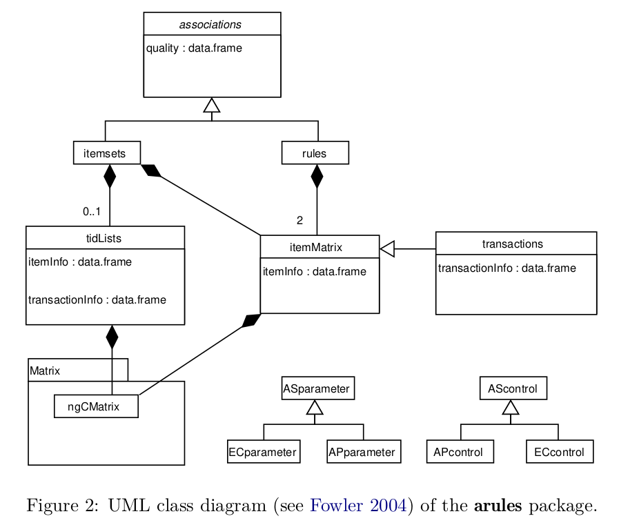

```{r setup, include=FALSE}
knitr::opts_chunk$set(echo = TRUE)
```

# Introduction
Mining frequent itemsets and association rules is a popular and well researched method for discovering interesting relations between variables in large databases. 

Finding frequent itemsets can be seen as a simplification of the unsupervised learning problem called "mode finding" or "bump hunting". The goal is to find prototype values so that the probability density evaluated at these values is sufficiently large.  

The *support* `supp(X)` of an itemset X is defined as the proportion of transactions in the data set which contain the intemset.   

The *confidence* of a rule is defined `conf(X -> Y) = supp(X U Y) / supp(X)`.  

Confidence can be interpreted as an estimate of the probability P(Y|X), the probability of finding the RHS of the rule in transsactions under the condition that these transactions also contain the LHS.  

A practical solution to the problem of finding too many association rules satisfying the support and confidence constrains is to further filter or rank found rules using additional interest measures. A popular measure for this purpose is *lift*. The lift of a rule is defined as `lift(X -> Y) = supp(X U Y) / (supp(X)*supp(Y))`, and can be interpreted as the deviation of the support of the whole rule from the support expected under independence given the supports of the LHS and the RHS. Greater lift values indicate stronger associations.  

Apriori and Eclat can be used to mine frequent itemsets, maximal frequent itemsets and closed frequent itemsets. The implementation of Apriori can additionally be used to generate association rules.  


# Data structure overview
For input data the classes `transactions` and `tidLists` (transaction ID lists, an alternative way to represent transaction data) are provided. The output of the mining algorithms comprises the classes *itemsets* and *rules* representing sets of itemsets or rules, respectively. Both classes directly extend a common virtual class called associations which provides a common interface. In this structure it is easy to add a new type of associations by adding a new class that extends associations.  

Items in `associations` and `transactions` are implemented by the `itemMatrix` class which provides a facade for the sparse matrix implementation `ngCMatrix` from the R package `Matrix`.  

To control the behavior of the mining algorithms, the two classes `ASparameter` and `AScontrol` are used. Since each algorithm can use additional algorithm-specific parameters, we implemented for each interfaced algorithm its own set of control classes. We used the prefix ‘AP’ for Apriori and ‘EC’ for Eclat. In this way, it is easy to extend the control classes when interfacing a new algorithm.

```{r, fig.align='center', out.width='80%'}

```

Note also that we need to store collections of itemsets with possibly duplicated elements (identical rows), i.e, itemsets containing exactly the same items. This is necessary, since a transaction database can contain different transactions with the same items. Such a database is still a set of transactions since each transaction also contains a unique transaction ID.  


# Mining algorithm interfaces


