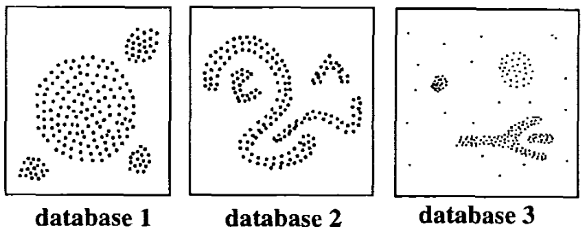

```{r setup, include=FALSE}
knitr::opts_chunk$set(echo = TRUE)
```


**DBSCAN (Density-Based Spatial Clustering and Application with Noise)**, is a density-based clusering algorithm, introduced in Ester et al. 1996, which can be used to identify clusters of any shape in a data set containing noise and outliers.  

The basic idea behind the density-based clustering approach is derived from a human intuitive clustering method. For instance, by looking at the figure below, one can easily identify four clusters along with several points of noise, because of the di?erences in the density of points.  

Clusters are dense regions in the data space, separated by regions of lower density of
points. The DBSCAN algorithm is based on this intuitive notion of “clusters” and “noise”. The key idea is that for each point of a cluster, the neighborhood of a given radius has to contain at least a minimum number of points.  


```{r}

```

Partitioning methods (K-means, PAM clustering) and hierarchical clustering are suitable for finding spherical-shaped clusters or convex clusters. In other words, they work well only for compact and well separated clusters. Moreover, they are also severely a?ected by the presence of noise and outliers in the data.  


# Algorithm
The goal is to identify dense regions, which can be measured by the number of objects close to a given point.  

Two important parameters are required for DBSCAN: *epsilon* (“eps”) and *minimum points* (“MinPts”). The parameter eps defines the radius of neighborhood around a point x. It’s called called the $\epsilon-neighborhood$ of x. The parameter MinPts is the minimum number of neighbors within “eps” radius.  

Any point x in the data set, with a neighbor count greater than or equal to MinPts, is marked as a *core point*. We say that x is border point, if the number of its neighbors is less than MinPts, but it belongs to the $\epsilon-neighborhood$ of some core point z. Finally, if a point is neither a core nor a border point, then it is called a noise point or an outlier.  

- **Direct density reachable**: A point "A" is directly reachable from another point "B" if: 1) 'A' is in the $\epsilon - neighborhood$ of 'B' and 2) 'B' is a core point.  

- **Density reachable**: A point 'A' is density reachable from 'B' if there are a set of core points leading from 'B' to 'A'.  

- **Density connected**: Two points 'A' and 'B' are density connected if there are a core point 'C', such that both 'A' and 'B' are density reachable from 'C'.  

A density-based cluster is defined as a group of density connected points.  


The algorithm of density-based clustering works as follow:  

1. For each point $x_{i}$, compute the distance between $x_{i}$ and the other points. Finds all neighbor within distance $eps$ of the starting point ($x_{i}$). Each point, with a neighbor count greater than or equal to *MinPts*, is marked as *core point* or *visited*.  

2. For each *core point*, if it's not already assigned to a cluster, create a new cluster. Find recursively all its density connected points and assign them to the same cluster as the core point.  

3. Iterate through the remaining unvisited points in the data set.  

Those points that do not belong to any cluster are treated as outliers or noise.  


## parameter estimation
- `MinPts`: The larger the data set, the larger the value of minPts should be chosen. minPts must be chosen at least 3.  

- $\epsilon$: The value for $\epsilon$ can then be chosen by using a k-distance graph, plotting the distance to the $k = minPts$ nearest neighbor. Good values of $\epsilon$ are where this plot shows a strong bend.  

One limitation of DBSCAN is that it is sensitive to the choice of $\epsilon$, in particular if clusters have different densities. If $\epsilon$ is too small, sparser clusters will be defined as noise. If $\epsilon$ is too large, denser clusters may be merged together.  

## determine the optimal eps value
The method proposed here consists of computing the k-nearest neighbor distances in a matrix of points.  

The idea is to calculate, the average of the distances of every point to its k nearest neighbors. The value of k will be specified by the user and corresponds to MinPts.

Next, these k-distances are plotted in an ascending order. The aim is to determine the “knee”, which corresponds to the optimal eps parameter.  

A knee corresponds to a threshold where a sharp change occurs along the k-distance curve.  

The function `kNNdistplot()` function in `dbscan` package can be used to draw the k-distance plot.  

```{r}
dbscan::kNNdistplot(df, k = 5)
abline(h = c(0.15, 0.2), lty = 2)
```


## example
```{r}
library(fpc)
library(dbscan)
library(factoextra)

data("multishapes", package = "factoextra")
index <- sample(nrow(multishapes), 1000, replace = F)
df <- multishapes[index, 1:2]


set.seed(123)
db <- fpc::dbscan(data = df, 
                  eps = 0.19, 
                  MinPts = 5)

fviz_cluster(object = db, 
             data = df, 
             stand = F, 
             ellipse = F, 
             show.clust.cent = F, 
             geom = "point", 
             palette = "jco", 
             ggtheme = theme_classic())
```

```{r}
predict(db, data = multishapes[index, 1:2], newdata = multishapes[-index, 1:2]) %>% table
```


