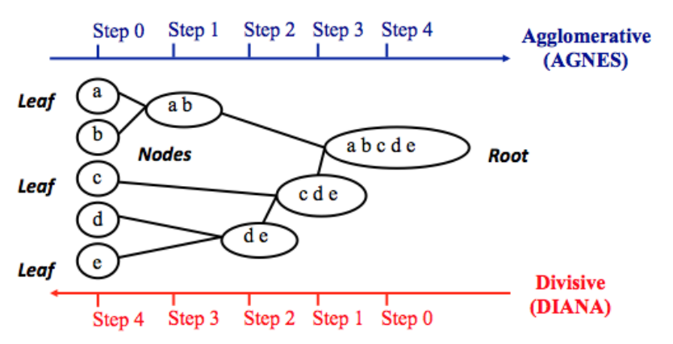

```{r setup, include=FALSE}
knitr::opts_chunk$set(echo = TRUE)
```

# Agglomerative Clustering  
The **agglomerative clustering** is the most common type of hierarchical clustering use to group objects in clusters based on their similarity. It’s also known as AGNES (Agglomerative Nesting). The algorithm starts by treating each object as a single- ton cluster. Next, pairs of clusters are successively merged until all clusters have been merged into one big cluster containing all objects. The result is a tree-based representation of the objects, named *dendrogram*.  

Agglomerative clustering is good at identifying small clsuters. Divisive clustering is good at identifying large clusters.  

```{r}

```

**Agglomerative clustering**  

1. Preparing data  
2. Computing (dis)similarity information between every pair of objects in the data set.  
3. Using linkage function to group objects into hierarchical cluster tree, based on the distance information generated at step 1. Objects/clusters that are in close proximity are linked together using the linkage function.  
4. Determining where to cut the hierarchical tree into clusters. This creates a partition of the data.  

### example
```{r}
data("USArrests")
df <- scale(USArrests)
df %>% head

# calculate the distance
res.dist <- dist(df, method = "euclidean")
```

**Linkage**  
The linkage function takes the distance information, returned by the function dist(), and groups pairs of objects into clusters based on their similarity. Next, these newly formed clusters are linked to each other to create bigger clusters. This process is iterated until all the objects in the original data set are linked together in a hierarchical tree.  

```{r}
res.hc <- hclust(d = res.dist, method = "ward.D2")
```

**The most commonly used linkage methods**  

1. `Maximum or complete linkage`: The distance between two clusters is defined as the maximum value of all pairwise distance between the elements in cluster 1 and the elements in cluster 2. It tends to produce more compact clusters.  

2. `Minimum or single linkage`: The distance between two clusters is defined as the minimum value of all pairwise distance between the elements in cluster 1 and the cluster 2. It tends to produce long, 'loose' clusters.  

3. `Mean or avarage linkage`: The distance between two clusters is defined as the average distance between the elements in cluster 1 and the elements in cluster 2.  

4. `Centroid linkage`: The distance between two clusters is defined as the distance between the centroid for cluster 1 (a mean vector of length p variables) and the centroid for cluster 2.  

5. `Ward's minimum variance method`: It minimizes the total within-cluster variance. At each step the pair of clusters with minimum between-cluster distance are merged.  

```{r}
fviz_dend(x = res.hc, 
          cex = 0.5)
```

```{r}
res.coph <- cophenetic(res.hc)

cor(res.coph, res.dist)
```

## Cut the dendrogram
```{r}
grp <- cutree(tree = res.hc, k = 4)
grp %>% head
```

```{r}
grp %>% table

cbind(USArrests, grp)
```

```{r}
fviz_dend(x = res.hc, 
          k = 4, 
          cex = 0.5, 
          k_colors = c("#2E9FDF", "#00AFBB", "#E7B800", "#FC4E07"), 
          color_labels_by_k = T, 
          rect = T)
```

```{r}
fviz_cluster(object = list(data = df, cluster = grp), 
             palette = c("#2E9FDF", "#00AFBB", "#E7B800", "#FC4E07"), 
             ellipse.type = "t", 
             repel = T, 
             show.clust.cent = F)
```

The R package `cluster` makes it easy to perform cluster analysis in R. It provides the function `agnes()` and `diana()` for computing agglomerative and divisive clustering.  

```{r}
library(cluster)

res.agens <- agnes(x = USArrests, 
                   stand = T, 
                   metric = "euclidean", 
                   method = "ward")

res.diana <- diana(x = USArrests, 
                   stand = T, 
                   metric = "euclidean")
```

```{r}
fviz_dend(x = res.agens, 
          cex = 0.6, 
          k = 4)
```

```{r}
fviz_dend(x = res.diana, 
          k = 4, 
          cex = 0.6)
```


