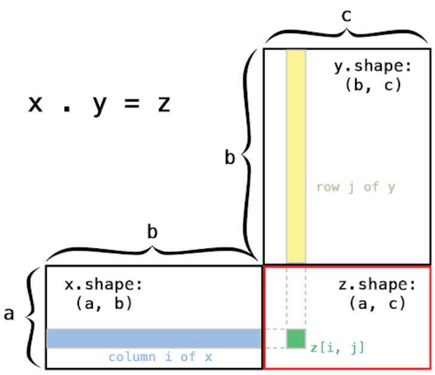
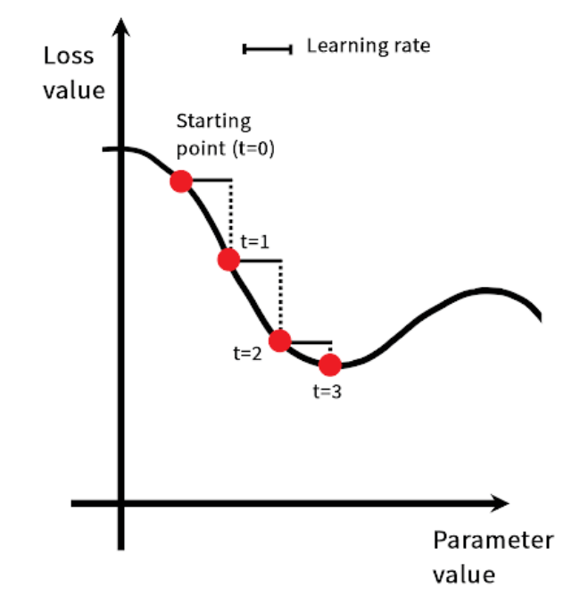
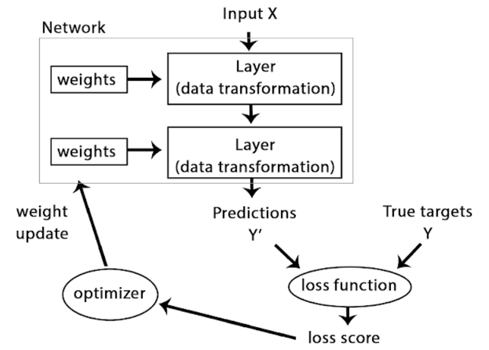

```{r setup, include=FALSE}
knitr::opts_chunk$set(echo = TRUE)
```

# Data representations for neural networks
In general, all current machine-learning systems use tensors as their basic data structure. Tensors are a generalization of vectors and matrices to an arbitrary number of dimensions (note that in the context of tensors, 'dimension' is often called 'axis').  

In R, `vectors` are used to create and manipulate 1D tensors and `matrices` are used for 2D tensors. For higher level dimensions `array` object are used.  

## Scalars (0D tensors)
A tensor that contains only one number is called a `scalar` (or scalar tensor, or 0-dimensional tensor, or 0D tensor). While R does not have a data type to represent scalars (all numeric objects are vectors, matrices, or arrays), an R vector that is always length 1 is conceptually similar to scalar.  

## Vectors (1D tensors)
A one dimensional array of numbers is called a `vector`, or 1D tensor. A 1D tensor is said to have exactly one axis. We can convert the R vector to an `array` object in order to inspect it's dimensions.  

```{r}
x <- c(12, 3, 6, 14, 10)
str(x)

x %>% as.array() %>% dim()
```

This vector has five entries and so called a 5-dimensional vector.  

Don't confuse a 5D vector with a 5D tensor! A 5D vector has only one axis and has five dimensions along its axis, wherease a 5D tensor has five axes (and may have any number of dimensions along each axis). *Dimensionality* can denote either the number of entries along a specific axis (as in the case of our 5D vector) or the number of axes in a tensor (such as a 5D tensor), which can be confusing at times. In the latter case, it's technically more correct to talk about `a tensor of rank 5` (the rank of a tensor being the number of axes), but the ambiguous notation 5D tensor is common regardless.  

## Matrices (2D tensors)
A two dimensional array of numbers is a matrix, or 2D tensor. A matrix has two axes (often referred to `rows` and `columns`). You can visually interpret a matrix as a rectangular grid of numbers.  

```{r}
x <- matrix(rep(0, 3*5), nrow = 3, ncol = 5)
x
dim(x)
```

## 3D tensors and higher-dimensional tensors
If you pack such matrices in a new array, you obtain a 3D tensor, which you can visually interpret as a cube of numbers.  

```{r}
x <- array(rep(0, 2*3*2), dim = c(2, 3, 2))
str(x)
dim(x)
```

By packing 3D tensors in an array, you can create a 4D tensor, and so on. In deep learning, you will generally manipulate tensors that are 0D to 4D, although you may go up to 5D if you process video data.  

## Key attributes
A tensor is defined by three key attributes:  

- **Number of axes** (rank): For instance, a 3D tensor has three axes, and a matrix has two axes.  

- **Shape**: This is an integer vector that describes how many dimensions the tensor has along each axis. For instance, the previous matrix example has shape (3, 5), and the 3D tensor example has shape (3, 3, 5). A vector has a shape with a single element, such as (5). You can access the dimensions of any array using `dim()` function.  

- **Data type**: This is the type of the data contained in the tensor, for instance, a tensor's type could be `integer` or `double`. On rare occasions, you may see a `character` tensor. However, since tensors live in pre-allocated contiguous memory segments, and strings, being variable-length, would preclude the use of this implementation, they are more rarely used.  

## MNIST example
```{r}
library(keras)
mnist <- dataset_mnist()
train_images <- mnist$train$x
train_labels <- mnist$train$y
test_images <- mnist$test$x
test_labels <- mnist$test$y
```

```{r}
# the number of axes (tensors)
train_images %>% dim() %>% length()

# the sahpes
train_images %>% dim()

# data type
train_images %>% typeof()
```

```{r}
train_images[2, , ] %>% as.raster(max = 255) %>% plot()
```

## The notation of data batches
In general, the first axis in all data tensors you'll come across in deep learning will be the *sample axis* (sometimes called the *sample dimension*). In the MNIST example, samples are images of digits.  

In addition, deep-learning models don't process an entire dataset at once, rather, they break the data into small batches. Concretely, here's one batch of our MNIST digits, with batch size of 128.  

```{r}
batch <- train_images[1:128, ,]
```

## Real-world examples of data tensors
The data you'll manipulate wil almost always fall into one of the following categories:  

- **Vector data**: 2D tensor of shape (samples, features).  
- **Timeseries data or sequence data**: 3D tensors of shape (samples, timesteps, features).  
- **Video**: 5D tensors of shape (samples, frames, height, width, channels) or (samples, frames, channels, height, width).  


# tensor operations
## Element-wise operations


## Operations involving tensors of different dimensions
The R `sweep()` function enables you to perform operations between higher dimension tensors and lower dimension tensors. With `sweep()` we could perform the matrix + vector addition.  

```{r}
# x is a tensor of random values with shape (64, 3, 32, 10)
x <- array(round(runif(1000, 0, 9)), dim = c(64, 3, 32, 10))

# y is a tensor of 5s of shape (32, 10)
y <- array(5, dim = c(32, 10))

# the output z has shape (64, 3, 32, 10) like x
z <- sweep(x, c(3, 4), y, pmax)
```

## tensor dot
The dot operation also called *tensor product* (not to be confused with an element-wise product) is the most common, most usefull tensor operation. Contrary to element-wise operations, it combines entries in the input tensors.  

Element-wise product is done with the `*` operator in R, whereas dot products use the `%*%` operator.  

As soon as one of the two tensors has more than one dimension, `%*%` is no longer symmetric, which is to say that `x %*% y` isn't the same as `y %*% x`.  

```{r}

```

More generally, you can take the dot product between higher-dimensional tensors, following the same rules for shape compatibility as outlined for 2D case.  

$$
(a, b, c, d) \cdot (d) \rightarrow (a, b, c)
$$

$$
(a, b, c, d) \cdot (d, e) \rightarrow (a, b, c, e)
$$

## tensor reshaping
### array_reshape()
We use the `array_reshape()` function rather than the `dim()` function to reshape the array. This is so that the data is re-interpreted using row-major semantics (as opposed to R's default column-major semantics), which is in turn compatible with the way that the numerical libraries called by `Keras` interpret array dimensions. You should always use the `array_reshape()` function when reshaping R arrays that will be passed to `Keras`.  

Reshaping a tensor means rearranging its rows and columns to match a target shape. Naturally, the reshaped tensor has the same total number of coefficients as the initial tensor.  

```{r}
x <- matrix(c(0, 1, 
              2, 3, 
              4, 5), 
            nrow = 3, ncol = 2, byrow = T)
x

x <- array_reshape(x, dim = c(6, 1))
x

x <- array_reshape(x, dim = c(2, 3))
x
```

### t()
```{r}
x <- matrix(0, nrow = 300, ncol = 20)
dim(x)

x <- t(x)
dim(x)
```

## geometric interpretation of deep learning
You just learned that neural networks consist entirely of chains of tensor operations and that all of these tensor operations are just geometric transformations of the input data. It follows that you can interpret a neural network as a very complex geometric transformation in a high-dimensional space, implemented via a long series of simple steps.  

In 3D, the following mental image may prove useful. Imagine two sheets of colored paper: one red and one blue. Put one on top of the other. Now crumple them together into a small ball. That crumpled paper ball is your input data, and each sheet of paper is a class of data in a classification problem. What a neural network (or any other machine-learning model) is meant to do is figure out a transformation of the paper ball that would uncrumple it, so as to make the two classes cleanly separable again. With deep learning, this would be implemented as a series of simple transformations of the 3D space, such as those you could apply on the paper ball with your fingers, one movement at a time.  

```{r}

```

Uncrumpling paper balls is what machine learning is about: finding neat representations for complex, highly folded data manifolds.  

**The training loop**  
1. Draw a batch of training samples x and corresponding targets y.  
2. Run the network on `x` (called a *forward pass*) to obtain predictions `y_pred`.  
3. Compute the loss of the network on the batch, a measure of the mismatch between `y_pred` and `y`.  
4. Update all weights of the network in a way that slightly reduces the loss on this batch.  

## derivative of a tensor operation: the gradient
A *gradient* is the derivative of a tensor operation. It's the generalization of the concept of derivatives to functions of multidimensional inputs: that is, to functions that take tensor as inputs.  

Consider an input vector a, a matrix `W`, a target `y`, and a loss function loss. You can use W to compute a target candidate `y_pred`, and compute the loss, or mismatch, between the target candidate `y_pred` and the target `y`.  

```
y_pred = dot(W, x)
loss_value = loss(y_pred, y)
```

If the data inputs x and y are frozen, then this can be interpreted as a function mapping values of W to loss values.  

```
loss_values = f(W)
```

Let's say the current value of $W$ is $W_{0}$. Then the derivative of $f$ in the point $W_{0}$ is a tensor $gradient(f)(W_{0})$ with the same shape as $W$, where each coefficient $gradient(f)(W_{0})[i,j]$ indicates the direction and magnitude of the change in `loss_value` you'd observe when modifying $W_{0}[i, j]$. That tensor $gradient(f)(W_{0})$ is the gradient of the function $f(W) = loss_value$ in $W_{0}$.  

The derivative of a function $f(x)$ of a singe coefficient can be interpreted as the slope of the curve of $f$. Likewise, $gradient(f)(W_{0})$ can be interpreted as the tensor describing the *curvature* of $f(W)$ around $W_{0}$.  

For this reason, in much the same way that, for a function $f(x)$, you can reduce the value of $f(x)$ by moving $x$ by a little in the opposite direction from the derivative, with a function $f(W)$ of a tensor, you can reduce $f(W)$ by moving $W$ in the opposite direction from the gradient: for example, $W_{1} = W_{0} - step \cdot gradient(f)(W_{0})$ (where `step` is a small scaling factor). That means going against the curvature, which intuitively should put you lower on the curve. Note that the scaling factor `step` is needed because $gradient(f)(W_{0})$ only approximates the curvature when you're close to $W_{0}$, so you don't want to get too far from $W_{0}$.  

1. Draw a batch of training samples x and corresponding targets y.  
2. Run the network on x to obtain predictions `y_pred`.  
3. Compute the loss of the network on the batch, a measure of the mismatch between `y_pred` and `y`.  
4. Compute the gradient of the loss with regard to the network's parameters (a *backward pass*).  
5. Move the parameters a little in the opposite direction from the gradient - for example $W = W - (step \cdot gradient)$ - thus reducing the loss on the batch a bit.  

What we've just described is called *mini-batch stochastic gradient descent* (minibatch SGD). the term *stochastic* refers to the fact that each batch of data is draw at random (*stochastic* is a scientific synonym of *random*). Below illustrates what happens in 1D, when the network has only one parameter and you have only one training sample.   

```{r}

```

As you can see, intuitively it's important to pick a reasonable value for the `step` factor. If it's too small, the descent down the curve will take many iterations, and it could get stck in a local minimal. If `step` is too large, your updates may end up taking you to completely random locations on the curve.  

Note that a variant of the mini-batch SGD algorithm could be to draw a single sample and target at each iteration, rather that drawing a batch of data. This would be *true* SGD (as opposed to *mini-batch* SGD). Alternatively, going to the opposite extreme, you could run every step on all data available, which is called batch SGD. Each update would then be more accurate, but for more expensive. The efficient compromise between these two extremes is to use mini-batches of reasonable size.  

## Chaining derivatives: the backpropagation algorithm
In practice, a neural-network function consists of many tensor operations chained together, each of which has a simple, known derivative. For instance, this is a network $f$ composed of three tensor operations $a, b$ and $c$, with weight matrices $W_{1}, W_{2}$, and $W_{3}$.  

$$
f(W_{1}, W_{2}, W_{3}) = a(W_{1}, b(W_{2}, c(W_{3})))
$$

Calculus tells us that such a chain of functions can be differentiated using the following identity, called the *chain rule:* $f(g(x)) = f'(g(x)) \cdot g'(x)$. Applying the chain rule to the computation of the gradient values of a neural network gives rise to an algorithm called *backpropagation* (also sometimes called *reverse-mode differentiation*). Backpropagation starts with the final loss value and works backward from the top layers to the bottom layers, applying the chain rule to compute the contribution that each parameter had in the loss value.   


## Example

```{r}
library(keras)

mnist <- dataset_mnist()
# saveRDS(mnist, "/home/yincy/git/Data/R/tensorflow/mnist.rds")
train_images <- mnist$train$x
train_images <- array_reshape(train_images, c(60000, 28 * 28))
train_images <- train_images / 255
train_labels <- mnist$train$y

test_images <- mnist$test$x
test_images <- array_reshape(test_images, c(10000, 28 * 28))
test_images <- test_images / 255
test_labels <- mnist$test$y
```

```{r}
str(train_images)
str(train_labels)
```

```{r}
str(test_images)
str(test_labels)
```

```{r}
network <- keras_model_sequential() %>% 
    layer_dense(units = 512, activation = "relu", input_shape = c(28 * 28)) %>% 
    layer_dense(units = 10, activation = "softmax")
```

```{r}
network %>% compile(
    optimizer = 'rmsprop', 
    loss = "categorical_crossentropy", 
    metrics = c("accuracy")
)
```

unlike most object you work with in R, Keras models are modified in-place. This because Keras models are directed acyclic graphs of layers whose state is updated during training.  

```{r}
train_labels <- to_categorical(train_labels)
train_labels %>% dim

test_labels <- to_categorical(test_labels)
test_labels %>% dim
```

```{r}
network %>% fit(train_images, train_labels, epochs = 5, batch_size = 128)
```

```{r}
metrics <- network %>% evaluate(test_images, test_labels)
metrics
```

```{r}
# network %>% predict_classes(test_images[1:10, ])
network %>% predict(test_images[1:10, ]) %>% k_argmax()
```

The `loss` is the quantity you'll attempt to minimize during training, so it should represent a meaure of success for the task you're trying to solve.  

The `optimizer` specifies the exact way in which the gradient of the loss will be used to update parameters: for instance, it could be the RMSProp optimizer, SGD with momentum, and so on.  


**The relationship between the network, layers, loss function, and optimizer**.  
```{r}

```

Different layers are appropriate for different tensor formats and different types of data processing.  

Building deep-learning models in Keras is done by clipping together compatible layers to form useful data-transformation pipelines.  

The notion of *layer compatibility* here refers specifically to the fact that every layer will only accept input tensors of a certain shape and will return output tensors of a certain shape.  

```
layer <- layer_dense(units = 32, input_shape = c(784))
```

We're creating a layer that will only accept as input 2D tensors where the first dimension is 784 (the first dimension, the batch dimension, is unspecified, and thus any value would be accepted). This layer will return a tensor where the first dimension has been transformed to be 32.  

Thus this layer can only be connected to a downstream layer that expects 32-dimensional vectors as input. When using Keras, you don't have to worry about compatibility, because the layers you add to your models are dynamically built to match the shape of the incoming layer.  

```{r}
model <- keras_model_sequential() %>% 
    layer_dense(units = 32, input_shape = c(784)) %>% 
    layer_dense(units = 32)
```

The second layer didn't receive an input shape argument - instead, it automatically inferred its input shape as being the output shape of the layer that came before.  

The topology of a network defines a *hypothesis space*. By choosing a network topology, you constrain your *space of possibilities* (hypothesis space) to a specific series of tensor operations, mapping input data to output data.  

Picking the right network architecture is more an art than a science; and although there are some best practices and principles you can rely on, only practice can help you become a proper neural-network architect.  

A neural network that has multiple outputs may have multiple loss functions (one per output). But the gradient-descent process must be based on a *single* scalar loss value; so, for multiloss networks, all losses are combined (via averaging) into a single scalar quantity.  

**Key features of keras**:  

- It allows the same code to run seamlessly on CPU or GPU.  
- It has a user-friendly API that makes it easy to quickly prototype deep-learning models.  
- It has build-in support for convolutional networks (for computer vision), recurrent networks (for sequence processing), and any combination of both.  
- It supports arbitrary network architectures: multi-input or multi-output models, layer sharing, model sharing, and so on. This means Keras is appropriate for building essentially any deep-learning model, from a generative adversarial network to a neural Turing maching.  


## Classifying movie reviews: a binary classification example
```{r}
library(keras)

# only keep the top 10,000 most frequently occuring words in the training data.
imdb <- dataset_imdb(num_words = 10000)
c(c(train_data, train_labels), c(test_data, test_labels)) %<-% imdb 
```

```{r}
train_data[[1]] %>% str
train_labels[[1]]
```

```{r}
train_data %>% sapply(max) %>% max
```

decoding the reviews back to english words  
```{r}
word_index <- dataset_imdb_word_index()
reverse_word_index <- names(word_index)
names(reverse_word_index) <- word_index

decoded_review <- sapply(train_data[[1]], function(index){
    word = if(index > 2) reverse_word_index[[index - 3]]
    if(!is.null(word)) word else "?"
})
```


```{r}
decode_review <- function(data){
    word = c()
    for(i in data){
        if(i > 2){
            current_word = unname(reverse_word_index[i - 3])
            current_word = ifelse(is.null(current_word), "?", current_word)
            word = append(word, current_word)
        }else{
            current_word = "?"
            word = append(word, current_word)
        }
    }
    return(word)
}

decode_review(train_data[[1]])
```


```{r}
vectorize_sequences <- function(sequences, dimension = 10000){
    results = matrix(0, nrow = length(sequences), ncol = dimension)
    for(i in seq_along(sequences)){
        results[i, sequences[[i]]] = 1
    }
    return(results)
}

x_train <- vectorize_sequences(sequences = train_data)
x_train %>% dim
x_train[1, ] %>% str

x_test <- vectorize_sequences(sequences = test_data)
x_test %>% dim
x_test[1, ] %>% str
```

```{r}
y_train <- train_labels %>% as.numeric()
y_test <- test_labels %>% as.numeric()
```

```
layer_dense(units = 16, activation = "relu")
```

Having 16 hidden units means the weight matrix $W$ will have shape `(input_dimension, 16)`: that is ,the dot product with $W$ will project the input data onto a 16-dimensional representation space.  

Having more hidden units (a higher-dimensional representation space) allows your network to learn more complex representations, but it makes the network more computationally expensive and may lead to learning unwanted patterns (patterns that will improve performance on the training data but not on the test data).  

```{r}
library(keras)

model <- keras_model_sequential() %>% 
    layer_dense(units = 16, activation = "relu", input_shape = c(10000)) %>% 
    layer_dense(units = 16, activation = "relu") %>% 
    layer_dense(units = 1, activation = "sigmoid")
```

```{r}
model %>% compile(
    optimizer = optimizer_rmsprop(lr = 0.001), 
    loss = loss_binary_crossentropy, 
    metrics = metric_binary_accuracy
)
```


