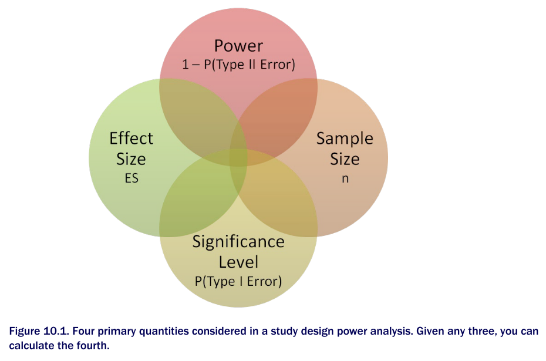

```{r setup, include=FALSE}
knitr::opts_chunk$set(echo = TRUE)
```


## Power analysis 
Power analysis allows you to determine the sample size required to detect an effect of a given size with a given degree of confidence. Conversely, it allows you to determine the probability of detecting an effect of a given size with a given level of confidence, under sample size constraints.

The *significance level* (also referred to as *alpha*) is defined as the probability of making a Type I error. The significance level can also be thought of as the probability of finding an effect that is *not* there.  

*Power* is defined as one minus the probability of making a Type II error. Power can be thought of as the probability of finding an effect that *is* there.  

*Effect size* is the magnitude of the effect under the alternate or research hypothesis. The formula for effect size depends on the statistical methodology employed in the hypothesis testing.  

```{r}

```


sample size, significance level, power, and effect size have an intimate relationship, given any three, you can determine the fourth. You'll use this fact to carry out various power analysis.  


### t-tests
```{r}
library(pwr)

pwr.t.test(d = 0.8, 
           sig.level = 0.05, 
           power = 0.9, 
           type = "two.sample", 
           alternative = "two.sided")
```

```{r}
pwr.t.test(n = 20, 
           d = 0.5, 
           sig.level = 0.01, 
           type = "two.sample", 
           alternative = "two.sided")
```


### ANOVA
```{r}
pwr.anova.test(k = 5, 
               f = 0.25,  # effect size
               sig.level = 0.05, 
               power = 0.8)
```

The total sample size is therefore 5 * 39.  


### Correlations 
```{r}
pwr.r.test(r = 0.25, # effect size, measured by a linear correlation coefficient
           sig.level = 0.05, 
           power = 0.9, 
           alternative = "greater")
```


### Linear models
```
pwr.f2.test(u = , v = , f2 = , sig.level = , power = )
```

- u: the numerator degrees of freedom  
- v: the denominator degrees of freedom  
- f2: the effect size  

$$f^2 = \frac{R^2}{1 - R^2}$$

- $R^2$ = population multiple correlation  


$$f^2 = \frac{R^2_{AB} - R^2_{AB}}{1 - R^2_{AB}}$$

- $R^2_{A}$ = variance accounted for in the population by variable set A.  
- $R^2_{AB}$ = variance accounted for in the population by variable set A and B together.  

The first formula for f2 is appropriate when you’re evaluating the impact of a set of predictors on an outcome. The second formula is appropriate when you’re evaluating the impact of one set of predictors above and beyond a second set of predictors (or covariates).  

```{r}
pwr.f2.test(u = 3, 
            f2 = 0.0769, 
            sig.level = 0.05, 
            power = 0.9)
```

In multiple regression, the denominator degrees of freedom equals N – k – 1, where N is the number of observations and k is the number of predictors. In this case, N – 7 – 1 = 185, which means the required sample size is N = 185 + 7 + 1 = 193.  


### Tests of proportions
```{r}
pwr.2p.test(h = ES.h(0.65, 0.6), # effect size
            sig.level = 0.05, 
            power = 0.9,
            alternative = "greater")
```


### Chi-square tests
```
pwr.chisq.test(w = , N = , df = , sig.level = , power = )
```

- `w` is the effect size  
- `N` is the total sample size  
- `df` is the degreees of freedom  

$$w = \sqrt{\sum_{i = 1}^{m}\frac{(p0_{i} - p1_{i})^2}{p0_{i}}}$$

The summation goes from 1 to m, where m is the number of cells in the contingency table. The function `ES.w2(P)` can be used to calculate the effect size corresponding the alternative hypothesis in a two-way contingency table. Here, P is a hypothesized two-way probability table.  

```{r}
prob <- matrix(c(0.42, 0.28, 0.03, 0.07, 0.10, 0.10), byrow = T, nrow = 3)
ES.w2(prob)

pwr.chisq.test(w = 0.1853, 
               df = 2, 
               sig.level = 0.05, 
               power = 0.9)
```


**Cohen's effect size benchmarks**  

|**Statistical method**|**Effect size measures**|**Suggested guidelines for effect size**|
|:--|:--|:--|
|||Small|Medium|Large|
|t-test|d|0.20|0.50|0.80|
|ANOVA|f|0.10|0.25|0.40|
|Linear models|f2|0.02|0.15|0.35|
|Test of proportions|h|0.20|0.50|0.80|
|Chi-square|w|0.10|0.30|0.50|


It’s important to keep in mind that Cohen’s benchmarks are just general suggestions derived from a range of social research studies and may not apply to your particular field of research.  


```{r}
library(pwr)
library(ggplot2)
library(magrittr)

es <- seq(0.1, 0.5, 0.01)
nes <- length(es)
samsize <- NULL

for(i in 1:nes){
    result <- pwr.anova.test(k = 5, f = es[i], sig.level = 0.05, power = 0.9)
    samsize[i] <- ceiling(result$n)
}

plotdata <- data.frame(es, samsize)

plotdata %>% 
    ggplot(aes(samsize, es)) +
    geom_line(color = "red", size = 1) +
    theme_bw() +
    labs(title = "One way ANOVA (5 groups)", 
         subtitle = "Power = 0.9, alpha = 0.05", 
         x = "Sample size (per group)", 
         y = "Effect Size")
```


```{r}
r <- seq(0.1, 0.5, 0.01)
p <- seq(0.4, 0.9, 0.1)

df <- expand.grid(r, p)
colnames(df) <- c("r", "p")

for(i in 1:nrow(df)){
    result <- pwr.r.test(r = df$r[i], 
                         sig.level = 0.05, 
                         power = df$p[i], 
                         alternative = "two.sided")
    df$n[i] <- ceiling(result$n)
}

df %>% 
    ggplot(aes(r, n, color = factor(p))) +
    geom_line(size = 1) +
    theme_bw() +
    labs(title = "Sample Size Estimation for Correlation Studies", 
         subtitle = "Sig = 0.05 (Two-tailed)", 
         x = "Correlation Coefficient (r)", 
         y = "Sample Size (n)", 
         color = "Power")
```


