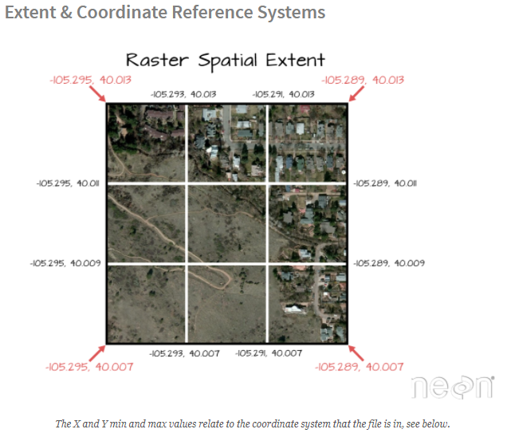

```{r setup, include=FALSE}
knitr::opts_chunk$set(echo = TRUE)
```


# The relationship between raster resolution, spatial extent and number of pixels  
```{r, message=FALSE, warning=FALSE}
library(raster)
library(rgdal)
```


## Spatial Resolution  
A raster consists of a series of pixels, each with the same dimensions and shape. In the case of raster derived from airborns sensors, each pixel represents an area of space on the Earth's surface. The size of the area on the surface that each pixel covers is known as the satial resolution of the image. For instance, an image that has a 1m spatial resolution means that each pixel in the image represents a 1m x 1m area.  

```{r}
knitr::include_graphics("images/spatial-resolution.PNG")
```

```{r}
knitr::include_graphics("images/diff-resolution.PNG")
```


## Load the data  
load an raster in R to see how the attributes are stored.  
```{r}
dem <- raster(x = "f:/NEON-DS-Field-Site-Spatial-Data/SJER/DigitalTerrainModel/SJER2013_DTM.tif")
```


View raster attributes  
```{r}
dem
```


## Spatial Extent  
The spatial extent of a raster, represents the 'X, Y' coordinates of the corners of the raster in geographic space. This information, in addition to the cell size or spatial resolution, tells the program how to place or render each pixel in 2 dimensional space. Tools like R, using supporting packages such as rgdal and associated raster tools have functions that allow you to view and define the extent of a new raster.  

```{r}
dem@extent
```

```{r}
knitr::include_graphics("images/raster-stretched-over-different-extents.PNG")
```


## Calculating Raster Extent  
Extent and spatial resolution are closely connected. To calculate the extent of a raster, we first need the bottom **left hand** (X,Y) coordinate of the raster. In the case of the UTM coordinate system which is in meters, to calculate the raster's extent, we can add the number of culumns and rows to the X, Y corner coordinate location of the raster, multiplied by the resolution (the pixel size) of the raster.  

```{r}
knitr::include_graphics("images/calculate-spatial-extent.PNG")
```

```{r}
# create a blank raster
my_raster1 <- raster(nrow = 4, ncol = 4)

#assign 'data' to raster: 1 to n based on the number of cells in the raster
my_raster1[] <- 1:ncell(my_raster1)
my_raster1
```

the crs value is define, this is the default values for something created with the `raster()` function if nothing is defined.  

```{r}
my_raster1@extent
```

```{r}
plot(my_raster1, main = "raster with 16 pixels")
```

We can resample the raster as well to adjust the resolution. If we want a higher resolution raster, we will apply a grid with more pixels within the same extent. If we want a lower resolution raster, we will apply a grid with fewer pixels within the same extent.  


One way to do this is to create a raster of the resolution you want and then `resample()` your original raster. The resampling will be done for either nearest neighbor assignments (for categorical data) or bilinear interpolation (for numerical data).  

```{r}
# higher resolution  
my_raster2 <- raster(nrow = 8, ncol = 8)

# resample 16 pix raster with 32 pix raster 
# use bilinear interpolation with our numeric data 
my_raster2 <- resample(x = my_raster1, y = my_raster2, method = "bilinear")
```

```{r}
plot(my_raster2, main = "Raster with 32 pixels")
```

```{r}
#low resolution  
my_raster3 <- raster(nrow = 2, ncol = 2)
my_raster3 <- resample(my_raster1, my_raster3, method = "bilinear")
my_raster3
```

```{r}
plot(my_raster3, main = "Raster with 4 pixels")
```


```{r}
# single pixel raster 
my_raster4 <- raster(nrow = 1, ncol = 1)
my_raster4 <- resample(my_raster1, my_raster4, method = "bilinear")
my_raster4
```

```{r}
plot(my_raster4, main = "Raster with 1 pixel")
```

To more easily compare them, let's create a graphic layout with 4 raster in it. Notice that each raster has the same extent but each a different resolution because it has a different number of pixels spread out over the same extent.  

```{r}
# change graphcal parameter to 2x2 grid
par(mfrow = c(2, 2))

plot(my_raster2, main = "ratsre with 32 pixels")
plot(my_raster1, main = "ratsre with 16 pixels")
plot(my_raster3, main = "ratsre with 4 pixels")
plot(my_raster4, main = "ratsre with 2 pixels")
```

```{r}
par(mfrow = c(1, 1))
```

```{r}

```


## Coordinate Reference System and Projection Information
The `rgdal` package has all the common ESPG codes with proj4string built in. We can see them by creating an objet of the function `make_ESPG()`.  

```{r}
# create an object with all ESPG code
espg <- make_EPSG()

# use View(espg) to see the full table - doesn't render on website well
head(espg, n = 5)
```


## Define the extent  
In the above raster example, we created serveral simple raster objects in R. R defaulted to a global lat/long extent. We can define the extent that we need to use too.  

Let's create a new raster with the same projection as our original DEM. We know that our data are in UTM zone 11N. For the sake of this exercise, let say we want to create a raster with the left hand cornore coordinate at:  

- xmin = 254570  
- ymin = 4107302  


The resolution of this new raster will be 1 meter and we will be working in UTM (meters). First, let's set up the raster.   

```{r}
# create 10x20 matrix with values 1-8
newMatrix <- matrix(1:8, nrow = 10, ncol = 20)

# convert to raster 
rasterNoProj <- raster(newMatrix)
rasterNoProj
```

Now we can define the new raster's extent by defining the lower left corner of the raster.  

```{r}
# define the xmin and ymin (the lower left hand corner of the raster)  

#1. define the xMin and yMin objects
xMin <- 254570
yMin <- 4107302

#2.grab the cols and rows for the raster using @ncols and @nros
rasterNoProj@ncols

rasterNoProj@nrows

#3. raster resolution
res <- 1.0

#4. add the numbers of cols and rows to the x,y corner location
# result = we get the bounds of our raster extent

xMax <- xMin + rasterNoProj@ncols * res
yMax <- yMin + rasterNoProj@nrows * res


#5. create a raster extent class
rasExt <- extent(xMin, xMax, yMin, yMax)
rasExt

#6. apply the extent to our raster 
rasterNoProj@extent <- rasExt

rasterNoProj
```

```{r}
plot(rasterNoProj, 
     main = "Raster in UTM coordinates, 1 meter resolution")
```


## Define Projection of a Raster  
We can define the projection of a raster that has a known CRS already. Sometimes we download data that have projection information associated with them but the CRS is not defined either in the GeoTIFF tags or in the raster itself. If this is the case, we can simply assign the raster the coorect projection.  

```{r}
rasterNoProj@crs

dem@crs
```


```{r}
# define the CRS using a CRS of another raster 
rasterNoProj@crs <- dem@crs

rasterNoProj
```

```{r}
rasterNoProj@crs
```

IMPORTANT: the above code does not reproject the raster. It simply defines the Coordinate Reference System based upon the CRS of another raster. If you want to actually change the CRS of a raster, you need to use the `projectRaster` function.  


