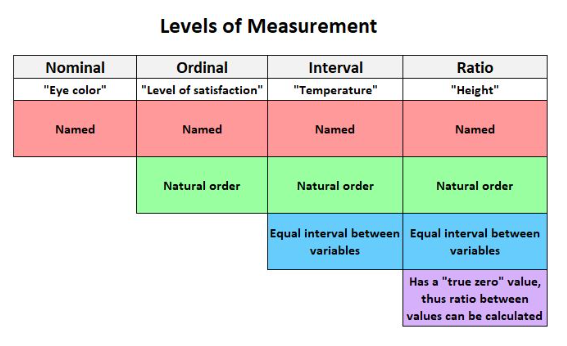

```{r setup, include=FALSE}
knitr::opts_chunk$set(echo = TRUE)
```

# Introduction to Statistics


## Levels of Measurement: Nominal, Ordinal, Interval and Ratio
There are four different data measurement scales that are used to categorize different types of data:

1. Norminal  
2. Ordinal  
3. Interval
4. Ratio

```{r}

```


## Describing Data
In Statistics, we're often interested in understanding how a dataset is distributed. In particular, there are four things that are helpful to know about a distribution:

1. Shape  
    - Is the distribution symmetrical or skewed to one side?  
    - Is the distribution unimodal (one peak) or bimodal (two peaks)?  

2. Outliers  
    - Are there any outliers present in the distribution?  
    
3. Center  
    - What is the mean, median, and mode of the distribution?  
    
4. Spread  
    - What is the range, interquartile range, standard deviation, and variance of the distribution?  
    


