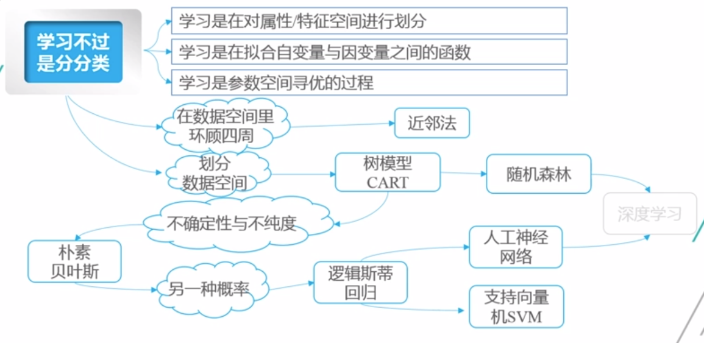
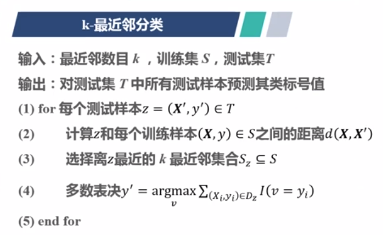

```{r setup, include=FALSE}
knitr::opts_chunk$set(echo = TRUE)
```

# 数据类型

-   vector\
-   factor\
-   data.frame\
-   matrix\
-   array\
-   list

# 向量类型

-   logical\
-   integer\
-   numeric\
-   complex\
-   character
-   raw

# association rules

```{r}
library(arules)
library(tidyverse)

load("../../RDataAnalytics/data/cjb.rda")
cjb
```

```{r}
as_five_grade_score <- function(x){
    cut(x, 
        breaks = c(0, seq(60, 100, 10)), 
        include.lowest = T, 
        right = FALSE, 
        ordered_result = T, 
        labels = c("不及格", "及格", "中", "良", "优"))
}

cjb %<>% 
    mutate_at(vars(xb, wlfk), factor) %>% 
    mutate_at(vars(yw:sw), as_five_grade_score) %>% 
    select(-c(1:2))

cjb_trans <- as(cjb, "transactions")
```

```{r}
inspect(head(cjb_trans))
cjb_trans %>% as("list")
```

```{r}
library(arulesViz)

irules_args_default <- apriori(data = cjb_trans)
```

用一句话来形容关联规则的挖掘

所谓关联规则的学习，其实就是观察历史记录

如果： B 总是频繁的和A 一起出现 （支持度）\
当 A 出现时，B 出现的概率很大 （置信度） 甚至是更大 （提升度）

那么： 很自然形成一条关联规则 A --\> B

# 分类与回归

根据目前所拥有的信息来建立人们所关心的变量和其他有关变量的关系。

当因变量为数量变量时，叫做回归， 而当因变量为类别变量（也叫名义变量或分类变量）时叫做分类。

分类：构造一个分类器 classifier 来预测类标号。\
回归：构造一个预测器 predictor 来预测一个数值。

```{r}

```

```{r}
library(caret)
modelLookup()$model %>% unique() %>% length()
```

```{r}
cv_kfold <- function(data, k = 10, seed = 2021){
    n_row <- nrow(data)
    n_foldmarkers <- rep(1:k, ceiling(n_row / k))[1:n_row]
    set.seed(seed)
    n_foldmarkers <- sample(n_foldmarkers)
    kfold <- lapply(1:k, function(i){
        (1:n_row)[n_foldmarkers == i]
    })
    return(kfold)
}

cv_kfold(cjb)
sapply(cv_kfold(cjb), length)
```

## 近临法

```{r}

```

```{r}
library(kknn)

help(package = "kknn")
```

## decision tree

### pruning tree

定义损失函数：

$$C_{a} = C_{(T)} + a|T|$$

其中C(T) 为对训练数据的预测误差， \|T\| 为叶子节点的个数

参数 $\alpha \geq 0$ 用于权衡训练数据拟合程度与模型的复杂度： 将 $\alpha$ 从小增到大， 不同的 $\alpha$ 对应着不同的最优子树。

当 $\alpha$ 小的时候，最优子树偏大。特别地， $\alpha = 0$ 时， 整体树是最优的；当 $\alpha$ 大的时候最优子树偏小。增大到某个特定值时，跟节点组成的单节点树最优。

更准确的讲： $\alpha$ 落入不同区间时， 对应着不同的最优子数。

$0 = \alpha_{0} < \alpha_{1} < ... < \alpha_{n} < \infty$, 产生一序列的区间： $[a_{i}, a_{i + 1}), i = 1, 2 ,..., n$

当 $a \subset [a_{i}, a_{i + 1}), i = 1, 2, ..., n$ 时， 对应最优子树序列 ${T_{0}, T_{1}, ..., T_{n}}$


对 $T_{0}$ 的任意内部节点 $t$: 
以 $t$ 为但节点树的损失函数： $C_{\alpha} = C_{(t) + \alpha}$  
以 $t$ 为根节点的子树 $T_{t}$ 的损失函数： $C_{\alpha}(T_{t}) = C(T_{t}) + \alpha|T_{t}|$  

当 $\alpha = 0$ 或 $\alpha$ 充分小时，有不等式： $C_{\alpha}(T_{t}) < C_{\alpha}(t)$  

当 $\alpha$ 增大时，在某一 $\alpha$ 有： $C_{\alpha}(T_{t}) = C_{\alpha}(t)$  

当 $\alpha$ 进一步增大时，不等式将反向  

当 $\alpha = \frac{C_{t} - C(T_{t})}{|T_{t}| - 1}$, $T_{t}$ 与 $t$ 具有相同的损失函数，而 $t$ 的节点少，因而 $t$ 比 $T_{t}$ 更可取，对 $T_{t}$ 进行剪枝。  


# 剪枝

输入：完全生长的决策树 $T_{0}$  
输出：最优决策树 $T_{\alpha}$  

1. 设 $k = 0, T = T_{0}$  
2. $\alpha = \infty$  
3. 自下而上对内部节点 $t$ 计算 $C(T_{t}), |T_{t}|$ 以及： $$g(t) = \frac{C_{t} - C(T_{t})}{|T_{t}| - 1}$$  
$$\alpha = min(\alpha, g(t))$$

4. 对$g(t) = \alpha$ 自内部节点 $t$ 进行剪枝， 并对叶节点 $t$ 以多数表决法决定其类，的到树 $T$  

5. 设$k = k + 1, \alpha_{k} = \alpha, T_{k} = T$  

6. 如果 $T$ 不是由根节点及两个叶节点组成的树，则回到步骤 2, 否则令 $n = k$  

7. 采用交叉验证法在子树序列 $T_{0}, T_{1}, ..., T_{n}$ 中选取最优子树 $T_{\alpha}$  


# 随机森林
集成学习， ensemble learning, 又称分类器组合学习  

将多个若分类器集成为强分类器  

组要算法包括 boosting, bagging, 随机森林，选择性集成等   


# 朴素贝叶斯


# 逻辑斯蒂回归


# 人工神经网络


