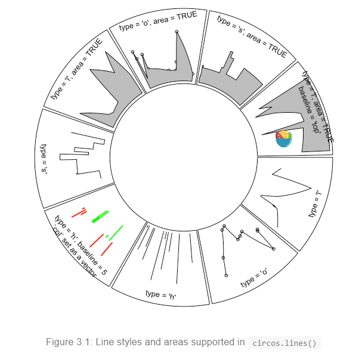
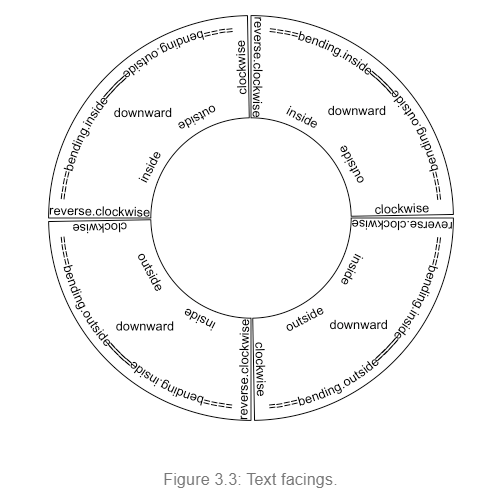
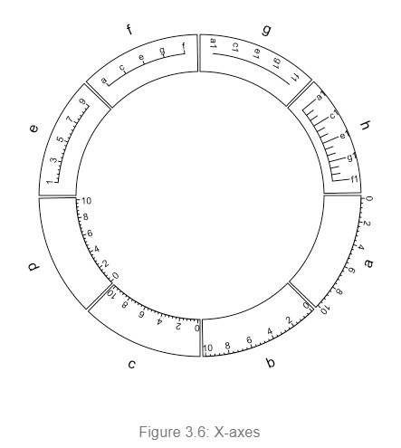

```{r setup, include=FALSE}
knitr::opts_chunk$set(echo = TRUE)
```

```{r, message=FALSE, warning=FALSE}
library(circlize)
```

# Chapter 1 Introduction  
Circular layout is very useful to represent complicated information. First, it elegantly represents information with long axes or a large amount of categories; second, it intuitively shows data with multiple tracks focusing on the same object; third, it easily demonstrates relations between elements. It provides an efficient way to arrange information on the circle and it is beautiful.  

Circos is a pioneer tool widely used for circular layout representations implemented in Perl. It greatly enhances the visualization of scientific results (especially in Genomics field). Thus, plots with circular layout are normally named as “circos plot”. Here the circlize package aims to implement Circos in R. One important advantage for the implementation in R is that R is an ideal environment which provides seamless connection between data analysis and data visualization. circlize is not a front-end wrapper to generate configuration files for Circos, while completely coded in R style by using R’s elegant statistical and graphic engine. We aim to keep the flexibility and configurability of Circos, but also make the package more straightforward to use and enhance it to support more types of graphics.  

In this book, chapters in Part I give detailed overviews of the general circlize functionalities. Part II introduces functions specifically designed for visualizing genomic datasets. Part III gives comprehensive guilds on visualizing relationships by Chord diagram.  

## Principle of design  
**A circular layout is composed of sectors and tracks**. For data in different categories, they are allocated into different sectors and for multiple measurements of the same category, they are represented as stacked tracks from outside of the circle to the inside. **The intersection of a sector and a track is called a cell (or a grid, a panel), which is the basic unit in a circular layout**. It is an imaginary plotting region for data points in a certain category.  

Since most of the figures are composed of simple graphics, such as points, lines, polygon, circlize implements low-level graphic functions for adding graphics in the circular plotting regions, so that more complicated graphics can be easily generated by different combinations of low-level graphic functions. This principle ensures the generality that types of high-level graphics are not restricted by the software itself and high-level packages focusing on specific interests can be built on it.  

Currently there are following low-level graphic functions that can be used for adding graphics. The usage is very similar to the functions without `circos`. prefix from the base graphic engine, except there are some enhancement specifically designed for circular visualization.  

+ `circos.points()`: adds points in a cell.  
+ `circos.lines()`: adds lines in a cell.  
+ `circos.segments()`: adds segments in a cell.  
+ `circos.rect()`: adds rectangles in a cell.  
+ `circos.polygon()`: adds polygons in a cell.  
+ `circos.text`: adds text in a cell.  
+ `circos.axis()` ands `circos.yaxis()`: add axis in a cell.  

Following functions arrange the circular layout  

+ `circos.initialize()`: allocates sectors on the circle.  
+ `circos.track()`: create plotting regions for cells in one single track.  
+ `circos.update()`: updates an existed cell.  
+ `circos.par()`: graphic parameters.  
+ `circos.clear()`: resets graphic parameters and internal variables.  

Thus, theoretically, you are able to draw most kinds of circular figures by the above functionalities. 

## A quick glance  
```{r}
set.seed(999)

n = 1000
df <- data.frame(
    factors = sample(letters[1:8], n , replace = T), 
    x = rnorm(n), 
    y = runif(n)
)
```

First we initialize the circular layout. The circle is split into sectors based on the data range on x-axes in each category. In following code, df$x is split by df$factors and the width of sectors are automatically calculated based on data ranges in each category. Be default, sectors are positioned started from  θ = 0 (in the polar coordinate system) and go along the circle clock-wisely. You may not see anything after running following code because no track has been added yet.  

We set a global parameter track.height to 0.1 by the option function `circis.par()` so that all tracks which will be added have a default height of 0.1. The circle used by circlize always has a radius of 1, so a height of 0.1 means 10% of the circle radius.  

**Note that the allocation of sectors only needs values on x direction (or on the circular direction), the values on y direction (radical direction) will be used in the step of creating tracks**.  

After the circular layout is initialized, graphics can be added to the plot in a track-by-track manner. Before drawing anything, we need to know that all tracks should be first created by `circos.trackPlotRegion()` or, for short, `circos.track()`, then the low-level functions can be added afterwards. Just think in the base R graphic engine, you need first call `plot()` then you can use functions such as `points()` and `lines()` to add graphics. Since x ranges for cells in the track have already been defined in the initialization step, here we only need to specify the y ranges for each cell. The y ranges can be specified by y argument as a numeric vector (so that y ranges will be automatically extracted and calculated in each cell) or ylim argument as a vector of length two. In principle, y ranges should be same for all cells in a same track.  
```{r, message=FALSE, warning=FALSE}
library(circlize)

circos.par("track.height" = 0.1)
circos.initialize(factors = df$factors, x = df$x)

# first track 
circos.track(factors = df$factors, y = df$y, 
             panel.fun = function(x, y){
                 circos.text(x = CELL_META$xcenter, 
                             y = CELL_META$cell.ylim[2] + uy(5, "mm"), 
                             labels = CELL_META$sector.index)
                 circos.axis(labels.cex = 0.6)
             })

col <- rep(c("#FF0000", "#00FF00"), 4)
circos.trackPoints(df$factors, df$x, df$y, col = col, pch = 16, cex = 0.5)
circos.text(x = -1, y = 0.5, label = "text", sector.index = "a", track.index = 1)

# second track
bgcol <- rep(c("#EFEFEF", "#CCCCCC"), 4)
circos.trackHist(factors = df$factors, x = df$x, bin.size = 0.2, bg.col = bgcol, col = NA)

# third track 
circos.track(factors = df$factors, x = df$x, y = df$y, 
             panel.fun = function(x, y){
               ind = sample(length(x), 10)
               x2 = x[ind]
               y2 = y[ind]
               od = order(x2)
               circos.lines(x2[od], y2[od])
             })

# update cell 'd' in second track 
circos.update(sector.index = "d", track.index = 2, bg.col = "#FF8080", bg.border = "black")
circos.points(x = -2.2, y = rep(0.5, 5), col = "white")
circos.text(x = CELL_META$xcenter, y = CELL_META$ycenter, labels = 'updated', col = "white")

# fourth track, heatmap 
circos.track(ylim = c(0, 1), panel.fun = function(x, y){
  xlim = CELL_META$xlim
  ylim = CELL_META$ylim
  breaks = seq(xlim[1], xlim[2], by = 0.1)
  n_breaks = length(breaks)
  circos.rect(xleft = breaks[-n_breaks], ybottom = rep(ylim[1], n_breaks - 1), 
              breaks[-1], rep(ylim[2], n_breaks -1), 
              col = rand_color(n_breaks), border = NA)
})

# fith track, links  
circos.link(sector.index1 = "a", point1 = 0, sector.index2 = "b", point2 = 0, h = 0.4)
circos.link(sector.index1 = "c", point1 = c(-0.5, 0.5), sector.index2 = "d", point2 = c(-0.5, 0.5), col = "red", 
            border = "blue", h = 0.2)
circos.link(sector.index1 = "e", point1 = 0, sector.index2 ="g", point2 = c(-1, 1), col = "green", border = "black", lwd = 2, lty  =2)

# reset the graphic parameters and internal variables, so that it will not mess up your next plot 
circos.clear()
```


# Chapter 2 Circular layout  
## Coordinate transformation  
o map graphics onto the circle, there exist transformations from several coordinate systems. First, there are data coordinate systems in which ranges for x-axes and y-axes are the ranges of original data. Second, there is a polar coordinate system in which these coordinates are mapped onto a circle. Finally, there is a canvas coordinate system in which graphics are really drawn on the graphical device.  

Each cell has its own data coordinate and they are independent. `circlize` first transforms coordinates from data coordinate system to polar coordinate system and finally transforms into canvas coordinate system.   

For users, they only need to imagine that each cell is a normal rectangular plotting region (data coordinate) in which x-lim and y-lim are ranges of data in that cell. `circlize` knows which cell you are in and does all the transformations automatically.  

The final canvas coordinate is in fact an ordinary coordinate in the base R graphic system with x range in (-1, 1) and y range in (-1, 1) by default. It should be noted that **the circular plot is always drawn inside the circle which has radius of 1 (which means it is always a unit circle), and from outside to inside**.   

## Rules for making the circular plot  
The rule for making the circular plot is rather simple. It follows the sequence of `initialize layout -> create track -> add graphics -> create track -> add graphics - ... -> clear`. Graphics can be added at any time as long as the tracks are created.  

1. Initialize the layout using `circos.initialize()`. Since circular layout in fact visualizs data which is in categories, there must be at least a categorial variable. Ranges of x values on each category can be specified as a vector or the range itself.  

2. Create plotting regions for the new track and add graphics. The new track is created just inside the previously created one. Only after the creation of the track can you add other graphics on it. There are three ways to add graphics in cells.  

+ After the creation of the track, use low-level graphic function like `circos.points()`, `circos.lines()`, … to add graphics cell by cell. It always involves a for loop and you need to subset the data by the categorical variable manually.  

+ Use `circos.trackPoints()`, `circos.trackLines()`, … to add simple graphics through all cells simultaneously.  

+ Use `panel.fun` argument in `circos.track()` to add graphics immediately after the creation of a certain cell. `panel.fun` needs two arguments `x` and `y` which are `x` values and `y` values that are in the current cell. This subset operation is applied automatically. This is the most recommended way. Section 2.7 gives detailed explanation of using panel.fun argument.  

+ Repeat step 2 to add more tracks on the circle unless it reaches the center of the circle.  

+ Call circos.clear() to clean up.  

As mentioned above, there are three ways to add graphics on a track.  

1. Create plotting regions for the whole track first and then add graphics by specifying `sector.index`. In the following pseudo code, `x1`, `y1` are data points in a given cell, which means you need to do data subsetting manually.  

In following code, circos.points() and circos.lines() are used separatedly from circos.track(), thus, the index for the sector needs to be explicitly specified by sector.index argument.  

There is also a `track.index` argument for both functions, however, the default value is the “current” track index and as the two functions are used just after `circos.track()`, the “current” track index is what the two functions expect and it can be ommited when calling the two functions.  

```
circos.initialize(factors = factors, x = xlim)
circos.track(factors, ylim)
for(sector.index in all.sector.index){
  circos.points(x1, y1, sector.index)
  circos.lines(x2, y2, sector.index)
}
```

2. Add graphics in a batch mode. In following code, `circos.trackPoints()` and `circos.trackLines()` need a categorical variable, a vector of x values and a vector of y values. X and y values will be split by the categorical variable and sent to corresponding cell to add the graphics. Internally, this is done by using `circos.points()` or `circos.lines()` in a for loop. This way to add graphics would be convenient if users only want to add a specific type of simple graphics (e.g. only points) to the track, but it is not recommended for making complex graphics.  

`circos.trackPoints()` and `circos.trackLines()` need a `track.index` to specify which track to add the graphics. Similarly, since these two are called just after `circos.track()`, the graphics are added in the newly created track right away.  
```
circos.initialize(factors, xlim)
circos.track(factors, ylim)
circos.trackPoints(factors, x, y)
circos.trackLines(factors, x, y)
```

3. Use a panel function to add self-defined graphics as soon as the cell has been created. This is the way recommended and you can find most of the code in this book uses `panel.fun`. `circos.track()` creates cells one by one and after the creation of a cell, and `panel.fun` is executed on this cell immediately. In this case, the “current” sector and “current” track are marked to this cell that you can directly use low-level functions without specifying sector index and track index.  

If you look at following code, you will find the code inside `panel.fun` is as natural as using `points()` or `lines()` in the normal R graphic system. This is a way to help you think a cell is an “imaginary rectangular plotting region”.  

```
circos.initialize(factors, xlim)
circos.track(factors, all_x, all_y, ylim, 
             panel.fun = function(x, y){
               circos.points(x, y)
               circos.lines(x, y)
             })
```

There are several internal variables keeping tracing of the current sector and track when applying `circos.track()` and `circos.update()`. Thus, although functions like `circos.points()`, `circos.lines()` need to specify the index of sector and track, they will take the current one by default. As a result, if you draw points, lines, text et al just after the creation of the track or cell, you do not need to set the sector index and the track index explicitly and it will be added in the most recently created or updated cell.  


## Sectors and tracks  
A circular layout is composed of sectors and tracks. As illustrated in Figure 2.3, the red circle is one track and the blue represents one sector. The intersection of a sector and a track is called a cell which can be thought as an imaginary plotting region for data points. In this section, we introduce how to set data ranges on x and y directions in cells.  
```{r, fig.align='center'}
knitr::include_graphics(path = "/home/yincy/git/R-codes/circlize/figures/Sectors-and-tracks.png")
```

Sectors are first allocated on the circle by `circos.initialize()`. There must be a categorical variable (say `factors`) that on the circle, each sector corresponds to one category. The width of sectors (measured by degree) are proportional to the data range in sectors on `x` direction (or the circular direction). The data range can be specified as a numeric vector `x` which has same length as `factors`, then `x` is split by `factors` and data ranges are calculated for each sector internally.   

Data ranges can also be specified directly by `xlim` argument. The valid value for `xilm` is a two-column matrix with same number of rows as number of sectors that each row in `xlim` corresponds to one sector. If `xlim` has row names which already cover sector names, row order of `xlim` is automatically adjusted. If `xlim` is a vector of length two, all sectors have the same `x` range.  
```
circos.initialize(factors, x = x)
circos.initialize(factors, xlim = xlim)
```

After the initialization of the layout, you may not see anything drawn or only an empty graphical device is opened. That is because no track has been created yet, however, the layout has already been recorded internally.  

In the initialization step, not only the width of each sector is assigned, but also the order of sectors on the circle is determined. **Order of the sectors are determined by the order of levels of the input factor**. If the value for `factors` is not a factor, the order of sectors is `unique(factors)`. Thus, if you want to change the order of sectors, you can just change of the level of `factors` variable. The following code generates plots with different sector orders.  
```
fa <- c('d', 'f', 'e', 'c', 'g', 'b', 'a')
f1 <- factor(fa)
circos.initialize(factors = f1, xlim = c(0, 1))
f2 <- factor(fa, levels = fa)
circos.initialize(factors = f2, xlim = c(0, 1))
```
```{r, fig.align='center'}
knitr::include_graphics("/home/yincy/git/R-codes/circlize/figures/sector-orders.png")
```

**In different tracks, cells in the same sector share the same data range on x-axes**. Then, for each track, we only need to specify the data range on y direction (or the radical direction) for cells. Similar as `circos.initialize()`, `circos.track()` also receives either `y` or `ylim` argument to specify the range of y-values. Since all cells in a same track shares a same `y` range, `ylim` is just a vector of length two if it is specified.  

`x` can also be specified in `circos.track()`, but it is only used to send to panel.fun. In Section 2.7, we will introduce how `x` and `y` are sent to each cell and how the graphics are added.  

```
circos.track(factors, y = y)
circos.track(factors, ylim = c(0, 1))
circos.track(factors, x = x, y = y)
```

In the track creation step, since all sectors have already been allocated in the circle, if `factors` argument is not set, `circos.track()` would create plotting regions for all available sectors. Also, levels of `factors` do not need to be specified explicitly because the order of sectors has already be determined in the initialization step. If users only create cells for a subset of sectors in the track (not all sectors), in fact, cells in remaining unspecified sectors are created as well, but with no borders (pretending they are not created).  

```
# assume 'factors' only covers a subset of sector  
# You will only see cells that are covered in 'factors' have borders  

circos.track(factors, y = y)

# You will see all cells have borders
circos.track(ylim = ranges(y))
```

Cells are basic units in the circular plot and are independent from each other. After the creation of cells, they have self-contained meta values of x-lim and y-lim (data range measured in data coordinate). So if you are adding graphics in one cell, you do not need to consider things outside the cell and also you do not need to consider you are in the circle. Just pretending it is normal rectangle region with its own coordinate.  

```{r, fig.align='center'}
knitr::include_graphics("/home/yincy/git/R-codes/circlize/figures/Sector-directions.png")
```

## Graphic parameters  
Some basic parameters for the circular layout can be set by `circos.par()`. These parameters are listed as follows. Note **some parameters can only be modified before the initialization of the circular layout**.  

+ `start.degree`: The starting degree where the first sector is put. Note this degree is measured in the standard polar coordinate system which means it is always reverse clockwise. E.g. if it is set to 90, sector start from the top of the circle.  

+ `gap.degree`: Gap between two neighbor sectors. It can be a single value which means all gaps share same degree, or a vector which has same number as sectors. **Note the first gap is after the first sector**.  

+ `gap.after`: Same as gap.degree, but more understandable. Modifying values of gap.after will also modify gap.degree and vice versa.  

+ `track.margin`: Like margin in Cascading Style Sheets (CSS), it is the blank area out of the plotting region, also outside of the borders. Since left and right margin are controlled by gap.after, only bottom and top margin need to be set. The value for `track.margin` is the percentage to the radius of the unit circle. The value can also be set by `convert_height()` or the short version `uh()` function with absolute units.  

+ `cell.padding`: Padding of the cell. Like padding in Cascading Style Sheets (CSS), it is the blank area around the plotting regions, but within the borders. The parameter has four values, which control the bottom, left, top and right padding respectively. The first and the third padding values are the percentages to the radius of the unit circle, and the second and fourth values are the degrees. The first and the third value can be set by uh() with absolute units.  

+ `unit.circle.segments`: Since curves are simulated by a series of straight lines, this parameter controls the amount of segments to represent a curve. The minimal length of the line segment is the length of the unit circle (2π) divided by `unit.circle.segments`. More segments means better approximation for the curves, while generate larger file size if figures are in PDF format.

+ `track.height`: The default height of tracks. It is the percentage to the radius of the unit circle. The height includes the top and bottom cell paddings but not the margins. The value can be set by `uh()` with absolute units.  

+ `points.overflow.warning`: Since each cell is in fact not a real plotting region but only an ordinary rectangle (or more precisely, a circular rectangle), it does not remove points that are plotted outside of the region. So if some points (or lines, text) are out of the plotting region, by default, the package would continue drawing the points but with warning messages. However, in some circumstances, drawing something out of the plotting region is useful, such as adding some text annotations (like the first track in Figure 1.2). Set this value to FALSE to turn off the warnings.  

+ `canvas.xlim`: The ranges in the canvas coordinate in x direction. **circlize** is forced to put everything inside the unit circle, so `canvas.xlim` and `canvas.ylim` is `c(-1, 1)` by default. However, you can set it to a more broad interval if you want to leave more spaces out of the circle. By choosing proper canvas.xlim and canvas.ylim, actually you can customize the circle. E.g. setting `canvas.xlim` to `c(0, 1)` and `canvas.ylim` to `c(0, 1)` would only draw 1/4 of the circle.  

+ clock.wise: The order for drawing sectors. Default is TRUE which means clockwise. **Note that inside each cell, the direction of x-axis is always clockwise and direction of y-axis is always from inside to outside in the circle**.   

```{r, fig.align='center'}
knitr::include_graphics("figures/regions-in-a-cell.PNG")
```

Default values for graphic parameters are listed in following table.  

`start.degree`              | 0
`gap.degree`/`gap.after`    | 1
`track.margin`              | c(0.01, 0.01)
`cell.padding`              | c(0.02, 1.00, 0.02, 1.00)
`unit.circle.segments`      | 500
`track.heigth`              | 0.2 
`points.overflow.warning`   | TRUE
`canvas.xlim`               | c(-1, 1)
`canvas.ylim`               | c(-1, 1)
`clock.wise`                | TRUE  

Parameters related to the allocation of sectors cannot be changed after the initialization of the circular layout. Thus, `start.degree`, `gap.degree`/`gap.after`, `canvas.xlim`, `canvas.ylim` and `clock.wise` can only be modified before `circos.initialize()`. The second and the fourth values of `cell.padding` (left and right paddings) can not be modified neither (or will be ignored).  

Similar reason, since some of the parameters are defined before the initialization of the circular layout, after making each plot, you need to call `circos.clear()` to manually reset all the parameters.  


## Create plotting regions  
As described above, only after creating the plotting region can you add low- level graphics on it. The minimal set of arguments for `circos.track()` is to set either `y` or `ylim` which assigns range of y values for this track. `circos.track()` creates tracks for all sectors although in some case only parts of them are visible.  

If `factors` is not specified, all cells in the track will be created with the same settings.If `factors`, `x` and `y` are set, they need to be vectors with the same length. Proper values of `x` and `y` that correspond to current cell will be passed to `panel.fun` by subsetting `factors` internally.  

Graphic arguments such as `bg.border` and `bg.col` can either be a scalar or a vector. If it is a vector, the length must be equal to the number of sectors and the order corresponds to the order of sectors. Thus, you can create plot regions with different styles of borders and background colors.  

If you are confused with the factors orders, you can also customize the borders and background colors inside `panel.fun`. `get.cell.meta.data("cell.xlim")` and `get.cell.meta.data("cell.ylim")` give you dimensions of the plotting region and you can customize plot regions directly by e.g. `circos.rect(col = "#FF000040", border = 1)`.  

`circos.track()` provides track.margin and cell.padding arguments that they only control track margins and cell paddings for the current track. Of course the second and fourth value in cell.padding are ignored.  


## Update plotting regions  
circos.track() creates new tracks, however, if track.index argument is set to a track which already exists, `circos.track()` actually `re-creates` this track. In this case, coordinates on y directions can be re-defined, but settings related to the positions of the track such as the height of the track can not be modified.  

```{r, eval=FALSE}
circos.track(factors, ylim = c(0,1), track.index = 1, ...)
```

For a single cell, `circos.update()` can be used to erase all graphics that have been already added in the cell. However, the data coordinate in the cell keeps unchanged.  

```{r, eval=FALSE}
circos.update(sector.index, track.index)
circos.points(x, y, sector.index, track.index)
```


## `panel.fun` argument  
```{r, eval=FALSE}
factors <- c("a", "a", "a", "b", "b")
x = 1:5
y = 5:1

circos.track(factors = factors, 
             x = x, 
             y = y, 
             panel.fun = function(x, y){
               circos.points(x, y)
             })
```

In `panel.fun`, one thing important is that if you use any low-level graphic functions, you don’t need to specify `sector.index` and `track.index` explicitly. Remember that when applying `circos.track()`, cells in the track are created one after one. When a cell is created, **circlize** would set the sector index and track index of the cell as the ‘current’ index. When the cell is created, panel.fun is executed immediately. Without specifying `sector.index` and `track.index`, the ‘current’ ones are used and that’s exactly what you need.  

The advantage of `panel.fun` is that it makes you feel you are using graphic functions in the base graphic engine (You can see it is almost the same of using `circos.points(x, y)` and `points(x, y)`). It will be much easier for users to understand and customize new graphics.  

Inside `panel.fun`, information of the ‘current’ cell can be obtained through `get.cell.meta.data()`. Also this function takes the ‘current’ sector and ‘current’ track by default.  
```{r, eval=FALSE}
get.cell.meta.data(name)
get.cell.meta.data(name, sector.index, track.index)
```

Information that can be extracted by get.cell.meta.data() are:  

+ `sector.index`: The name for the sector.  
+ `sector.numeric.index`: Numeric index for the sector.  
+ `track.index`: Numeric index for the track.  
+ `xlim`: Minimal and maximal values on the x-axis.  
+ `ylim`: Minimal and maximal values on the y-axis.  
+ `xcenter`: mean of xlim.  
+ `ycenter`: mean of ylim.  
+ `xrange`: defined as xlim[2] - xlim[1].  
+ `yrange`: defined as ylim[2] - ylim[1].  
+ `cell.xlim`: Minimal and maximal values on the x-axis extended by cell paddings.  
+ `cell.ylim`: Minimal and maximal values on the y-axis extended by cell paddings.  
+ `xplot`: Degree of right and left borders in the plotting region. The first element corresponds to the start point of values on x-axis and the second element corresponds to the end point of values on x-axis Since x-axis in data coordinate in cells are always clockwise, xplot[1] is larger than xplot[2].  
+ `yplot`: Radius of bottom and top radius in the plotting region.  
+ `cell.start.degree`: Same as xplot[1].  
+ `cell.end.degree`: Same as xplot[2].  
+ `cell.bottom.radius`: Same as yplot[1].  
+ `cell.top.radius`: Same as yplot[2]. 
+ `track.margin`: Margins of the cell.  
+ `cell.padding`: Paddings of the cell.  

Following example code uses `get.cell.meta.data()` to add sector index in the center of each cell.  

```{r, eval=FALSE}
circos.track(ylim = ylim, panel.fun = function(x, y){
  sector.index = get.cell.meta.data(name = "sector.index")
  xcenter = get.cell.meta.data(name = "xcenter")
  ycenter = get.cell.meta.data(name = "ycenter")
  circos.text(xcenter, ycenter, sector.index = sector.index)
})
```

`get.cell.meta.data()` can also be used outside `panel.fun`, but you need to explictly specify `sector.index` and `track.index` arguments unless the current index is what you want.   

There is a companion variable `CELL_META` which is identical to `get.cell.meta.data()`to get cell meta information, but easier and shorter to write. Actually, the value of `CELL_META` itself is meaningless, but e.g. `CELL_META$sector.index` is automatically redirected to get.cell.meta.data("`sector.index`"). Following code rewrites above example code with `CELL_META`.  

```{r, eval=FALSE}
circos.track(ylim = yim, panel.fun = function(x, y){
  circos.text(x = CELL_META$xcenter, y = CELL_META$ycenter, 
              labels = CELL_META$sector.index)
})
```

Please note `CELL_META` only extracts information for the “current” cell, thus, it is recommended to use only in `panel.fun`.  

Nevertheless, if you have several lines of code which need to be executed out of `panel.fun`, you can flag the specified cell as the 'current' cell by `set.current.cell()`, which can save you from typing too many `sector.index = ..., track.index = ...,`. E.g. following code  

```{r}
circos.text(get.cell.meta.data(name = "xcenter", sector.index, track.index), 
            get.cell.meta.data(name = "ycenter", sector.index, track.index), 
            get.cell.meta.data(name = "sector.index", sector.index, track.index), 
            sector.index, track.index)
```

can be simplified to  
```{r, eval=FALSE}
set.current.cell(sector.index, track.index)
circos.text(x = get.cell.meta.data(name = "xcenter"), 
            y = get.cell.meta.data(name = "ycenter"), 
            labels = get.cell.meta.data(name = "sector.index"))

# or more simple 
circos.text(x = CELL_META$xcenter, 
            y = CELL_META$ycenter, 
            labels = CELL_META$sector.index)
```


## Other utilities  
**circlize** transform data points in several coordinate systems and it is basically done by the core function `circlize()`. The function transforms from data coordinate (coordinate in the cell) to the polar coordinate and its companion `reverse.circlize()` transforms from polar coordinate to a specified data coordinate. The default transformation is applied in the `current` cell.  

```{r}
factors = c("a", "b")
circos.initialize(factors, xlim = c(0, 1))
circos.track(ylim = c(0, 1))
```

```{r}
# x = 0.5, y = 0.5 in sector a and track 1
circlize(x = 0.5, y = 0.5, sector.index = "a", track.index = 1)
```


```{r}
# theta = 90, rou = 0.9 in the polar coordinate  
reverse.circlize(x = 90, y = 0.9, sector.index = "a", track.index = 1)
```

`circlize()` and `reverse.circlize()` can be used to connect two circular plots if they are drawn on a same page. This provides a way to build more complex plots. Basically, the two circular plots share a same polar coordiante, then, the manipulation of `circlize->reverse.circlize->circlize` can transform coordinate for data points from the first circular plot to the second.  

The transformation between polar coordinate and canvas coordinate is simple. **circlize** has a `circlize:::polar2Cartesian()` function but this function is not exported.  

Following example (Figure 2.7) adds raster image to the circular plot. The raster image is added by `rasterImage()` which is applied in the canvas coordinate. Note how we change coordinate from data coordinate to canvas coordinate by using `circlize()` and `circlize:::polar2Cartesian()`.  


### The convert functions  
For the functions in circlize package, they needs arguments which are lengths measured either in the canvas coordinate or in the data coordinate. E.g. track.height argument in circos.track() corresponds to percent of radius of the unit circle. circlize package is built in the R base graphic system which is not straightforward to define a length with absolute units (e.g. a line of length 2 cm). To solve this problem, circlize provides three functions which convert absolute units to the canvas coordinate or the data coordinate accordingly.  

`convert_length()` converts absolute units to the canvas coordinate. Since the aspect ratio for canvas coordinate is always set to 1, it doesn’t matter whether to convert units in the x direction or in the y direction. The usage of `convert_length()` is straightforward, supported units are `mm`, `cm` and `inches`. If users want to convert a string height or width to the canvas coordinate, directly use `strheight()` or `strwidth()` functions.  

```{r}
convert_length(x = 2, unit = "mm")
```

Since `convert_length()` is mostly used to define heights on the radical direction, e.g. track height or height of track margins, the function has another name `convert_height()`, or the short name `uh()` (stands for unit height).  

`convert_x()` and `convert_y()`, or the short version `ux()` and `uy()` (unit x and unit y), convert absolute units to the data coordinate.  

By default, the conversion is applied in the “current” cell, but it can still be used in other cells by specifying `sector.index` and `track.index` arguments. Since the width of the cell is not identical from the top to the bottom in the cell, for `convert_x()` or `ux()` function, the position on y direction where the convert is applied needs to be specified. By default it is at the middle point on y-axis.  

```{r}
fa = letters[1:10]
circos.par(cell.padding = c(0, 0, 0, 0), track.margin = c(0, 0))
circos.initialize(fa, xlim = cbind(rep(0, 10), runif(10, 0.5, 1.5)))
circos.track(ylim = c(0, 1), track.height = uh(5, "mm"),
    panel.fun = function(x, y) {
        circos.lines(c(0, 0 + ux(5, "mm")), c(0.5, 0.5), col = "blue")
    })
circos.track(ylim = c(0, 1), track.height = uh(1, "cm"),
    track.margin = c(0, uh(2, "mm")),
    panel.fun = function(x, y) {
        xcenter = get.cell.meta.data("xcenter")
        circos.lines(c(xcenter, xcenter), c(0, uy(1, "cm")), col = "red")
    })
circos.track(ylim = c(0, 1), track.height = uh(1, "inches"),
    track.margin = c(0, uh(5, "mm")),
    panel.fun = function(x, y) {
        line_length_on_x = ux(1*sqrt(2)/2, "cm")
        line_length_on_y = uy(1*sqrt(2)/2, "cm")
        circos.lines(c(0, line_length_on_x), c(0, line_length_on_y), col = "orange")
    })
```

```{r}
circos.clear()
```


### `circos.info()` and `circos.clear()`  
You can ge basic information of your current circular plot by `circos.info()`. The function can be called at any time.  
```{r}
factors = letters[1:3]
circos.initialize(factors = factors, xlim = c(1, 2))
circos.info()
```

```{r}
circos.track(ylim = c(0, 1))
circos.info(sector.index = "a", track.index = 1)
```

```{r}
circos.clear()
```

It can also add labels to all cells by `circos.info(plot = TRUE`  


# Chapter 3 Graphics 
All low-level functions accept sector.index and track.index arguments which indicate which cell the graphics are added in. By default the graphics are added in the “current” sector and “current” track, so it is recommended to use them directly inside panel.fun function.  

```{r, eval=FALSE}
circos.track(..., panel.fun = function(x, y){
  circos.points(x, y)
})

circos.points(x, y, sector.index, track.index)
```


## Points  
`circos.points()` is similar as `points()` function  
```{r}
circos.points(x, y)
circos.points(x, y, sector.index, track.index)
circos.points(x, y, pch, col, cex)
```

There is a companion function circos.trackPoints() which adds points to all sectors in a same track simultaneously.  

The input of `circos.trackPoints()` must contain a vector of categorical factors, a vector of x values and a vector of y values. X values and y values are split by the categorical variable and corresponding subset of x and y values are internally sent to `circos.points()`.  

`circos.trackPoints()` adds points to the “current” track by default which is the most recently created track. Other tracks can also be selected by explictly setting `track.index` argument.  

```{r, eval=FALSE}
circos.track(...)
circos.trackPoints(fa, x, y)
```

`circos.trackPoints()` is simply implemented by `circos.points()` with a for loop. However, it is more recommended to directly use `circos.points()` and `panel.fun` which provides great more flexibility.  
```{r, eval=FALSE}
circos.track(fa, x, y, panel.fun = function(x, y){
  circos.points(x, y)
})
```

Other low-level functions also have their companion `circos.track*()` function. The usage is same as `circos.trackPoints()` and they will not be further discussed in following sections.  


## Lines  
Adding lines by · is similar as `lines()` function. One additional feature is that the areas under or above the lines can be filled by specifing `area` argument to TRUE. Position of the baseline can be set to a pre-defined string of `bottom` or `top`, or a numeric value which is the position on y-axis. When `area` is set to TRUE, `col` controls the filled color and `border` controls the color for the borders.  

`baseline` argument is also workable when `lty` is set to "h". Note when `lty` is set to "h", graphic parameters such as `col` can be set as a vector with same length as `x`.  

```{r, fig.align='center'}

```

```{r, eval=FALSE}
circos.lines(x, y)
circos.lines(x, y, sector.index, track.index)
circos.lines(x, y, col, lwd, lty, type, straight)
circos.lines(x, y, col, area, baseline, border)
```


## Segments  
Line segments can be added by `circos.segments()` function. The usage is simiar as `segments()`. Radical segments can be added by setting `straight` to `TRUE`.  
```{r, eval=FALSE}
circos.segments(x0, y0, x1, y1)
circos.segments(x0, y0, x1, y1, straight)
```


## Text  
Adding text by `circos.text()` is similar as `text()` function. Text is added on the plot for human reading, thus, when putting the text on the circle, the facing of text is very important. `circos.text()` supports seven facing options which are `inside`, `outside`, `clockwise`, `reverse.clockwise`, `downward`, `bending.inside` and `bending.outside`. Please note for `bending.inside` and `bending.outside`, currently, single line text is only supported. If you want to put bended text into two lines, you need to split text into two lines and add each line by `circos.text()` separately.  

```{r, fig.align='center'}

```

```{r}
circos.text(x, y, labels)
circos.text(x, y, labels, sector.index, track.index)
circos.text(x, y, labels, facing, niceFacing, adj, cex, col, font)
```

If, e.g., `facing` is set to `inside`, text which is on the bottom half of the circle is still facing to the top and hard to read. To make text more easy to read and not to hurt readers’ neck too much, `circos.text()` provides niceFacing option which automatically adjust text facing according to their positions in the circle. niceFacing only works for facing value of `inside`, `outside`, `clockwise`, `reverse.clockwise`, `bending.inside` and `bending.outside`.  

`adj` is internally passed to `text()`, thus, it actually adjusts text positions either horizontally or vertically (in the canvas coordinate).  

```{r, eval=FALSE}
circos.text(x, y, labels, adj = c(0, degree(5)), facing = "clockwise")
```

As `circos.text()` is applied in the data coordiante, offset can be directly added to x or/and y as a value measured in the data coordinate. An absolute offset can be set by using `ux()` (in x direction) and `uy()` (in y direction).  

```{r, eval=FALSE}
circos.text(x + ux(2, "mm"), y + uy(2, "mm"), labels)
```


## Rectangles and polygons  
Theoretically, circular rectangles and polygons are all polygons. If you imagine the plotting region in a cell as Cartesian coordinate, then `circos.rect()` draws rectangles. In the circle, the up and bottom edge become two arcs. Note this function can be vectorized.  
```{r, eval=FALSE}
circos.rect(xlef, ybottom, xright, ytop)
circos.rect(xleft, ybottom, xright, ytop, sector.index, track.index)
circos.rect(xleft, ybottom, xright, ytop, col, border, lty, lwd)
```

`circos.polygon()` draws a polygon through a series of points in a cell. Please note the first data point must overlap to the last data point.  

```{r, eval=FALSE}
circos.polygon(x, y)
circos.polygon(x, y, col, border, lty, lwd)
```


## Axes  
Mostly, we only draw x-axes on the circle. `circos.axis()` or `circos.xaxis()` privides options to customize x-axes which are on the circular direction. It supports basic functionalities as `axis()` such as defining the breaks and corresponding labels. Besides that, the function also supports to put x-axes to a specified position on y direction, to position the x-axes facing the center of the circle or outside of the circle, and to customize the axes ticks. The `at` and `labels` arguments can be set to a long vector that the parts which exceed the maximal value in the corresponding cell are removed automatically. The facing of labels text can be optimized by `labels.niceFacing` (by default it is `TRUE`).  

a: Major ticks are calculated automatically, other settings are defaults.  
b: Ticks are pointing to inside of the circle, facing of tick labels is set to outside.  
c: Position of x-axis is bottom in the cell.  
d: Ticks are pointing to the inside of the circle, facing of tick labels is set to reverse.clockwise.  
e: manually set major ticks and also set the position of x-axis.  
f: replace numeric labels to characters, with no minor ticks.  
g: No ticks for both major and minor, facing of tick labels is set to reverse.clockwise.  
h: Number of minor ticks between two major ticks is set to 2. Length of ticks is longer. Facing of tick labels is set to clockwise.  

```{r, fig.align='center'}

```

As you may notice in the above figure, when the first and last axis labels exceed data ranges on x-axis in the corresponding cell, their positions are automatically adjusted to be shifted inwards in the cell.  

Possible usage of `circos.axis()` is as follows. Note `h` can be `bottom`, `top` or a numeric value.  
```{r, eval=FALSE}
circos.axis(h)
circos.axis(h, sector.index, track.index)
circos.axis(h, major.at, labels, major.tick, direction)
circos.axis(h, major.at, labels, major.tick, labels.font, labels.cex, labels.facing, labels.niceFacing)
circos.axis(h, major.at, labels, major.tick, minor.tick, major.tick.length, lwd)
```

Y-axis is also supported by `circos.yaxis()`. The usage is similar as `circos.axis()` One thing that needs to be note is users need to manually adjust `gap.degree` in `circos.par()` to make sure there are enough spaces for y-axes.  
```{r, eval=FALSE}
circos.yaxis(side)
circos.yaxis(at, labels, sector.index, track.index)
```


## Circular arrows  
Circular arrows can be used to represent stages in a circle. `circos.arrow()` draws circular arrows parallel to the circle. Since the arrow is always parallel to the circle, on x-direction, the start and end position of the arrow need to be defined while on the y-direction, only the position of the center of arrow needs to be defined. Also `width` controls the width of the arrow and the length is defined by `x2 - x1`. `arrow.head.width` and `arrow.head.length` control the size of the arrow head, and values are measured in the data coordinate in corresponding cell. `tail` controls the shape of the arrow tail. Note for `width`, `arrow.head.width` and `arrow.head.length`, the value can be set by `ux()`, `uy()` with absolute units.  

```{r}
circos.initialize(factors = letters[1:4], xlim = c(0, 1))
col = rand_color(4)
tail = c("point", "normal", "point", "normal")
circos.track(ylim = c(0, 1), panel.fun = function(x, y) {
    circos.arrow(x1 = 0, x2 = 1, y = 0.5, width = 0.4, 
        arrow.head.width = 0.6, arrow.head.length = ux(1, "cm"), 
        col = col[CELL_META$sector.numeric.index], 
        tail = tail[CELL_META$sector.numeric.index])
}, bg.border = NA, track.height = 0.4)
```

```{r}
circos.clear()
```


```{r}
cell_cycle <- data.frame(phase = factor(c("G1", "S", "G2", "M"), levels = c("G1", "S", "G2", "M")), 
                         hour = c(11, 8, 4, 1))
color = c("#66C2A5", "#FC8D62", "#8DA0CB", "#E78AC3")
circos.par(start.degree = 90)
circos.initialize(factors = cell_cycle$phase, xlim = cbind(rep(0, 4), cell_cycle$hour))
circos.track(ylim = c(0, 1), panel.fun = function(x, y){
  circos.arrow(x1 = CELL_META$xlim[1], x2 = CELL_META$xlim[2], 
               arrow.head.width = CELL_META$yrange*0.8, 
               arrow.head.length = ux(0.5, "cm"), 
               col = color[CELL_META$sector.numeric.index])
  
  circos.text(x = CELL_META$xcenter, y = CELL_META$ycenter, 
              labels = CELL_META$sector.index, 
              facing = "downward")
  
  circos.axis(h = 1, 
              major.at = seq(0, round(CELL_META$xlim[2])), 
              minor.ticks = 1, 
              labels.cex = 0.6)
}, bg.border = NA, track.height = 0.3)

circos.clear()
```


## Raster image  
`circos.raster()` is used to add a raster image at a certain position in the circle with proper rotation. The first input variable should be a `raster` object or an object that can be converted by `as.raster()`.  

Facing of the image is controlled by `facing` and `niceFacing` arguments which are similar as in `circos.text()`. When value of facing is one of `inside`, `outside`, `reverse.clockwise`, `clockwise` and `downward`, the size of raster image should have absolute values which should be specified in the form of `number- unit` such as `"20mm"`, `"1.2cm"` or `"0.5inche"`. If only one of `width` and `height` is specified, the other one is automatically calculated by using the aspect ratio of the original image.  
```{r}
library(png)

image <- system.file("extdata", "Rlogo.png", package = "circlize")
image <- as.raster(readPNG(image))
circos.par(start.degree = 90)
circos.initialize(factors = letters[1:5], 
                  xlim = c(0, 1))

all_facing_option <- c("inside", "outside", "reverse.clockwise", "clockwise", "downward")

circos.track(ylim = c(-1, 1), panel.fun = function(x, y){
  circos.raster(image = image, 
                x = CELL_META$xcenter, 
                y = CELL_META$ycenter, 
                width = "1cm", 
                facing = all_facing_option[CELL_META$sector.numeric.index])
  
  circos.text(x = CELL_META$xcenter, 
              y = CELL_META$ycenter, 
              labels = all_facing_option[CELL_META$sector.numeric.index], 
              facing = "inside", 
              niceFacing = TRUE)
})

circos.clear()
```

Also `facing` can be set to `bending.inside` and `bending.outside` that the image is filled to a circular rectangle. The strategy is to plot each original pixel as a small circular rectangle by `circos.rect()`, thus, the plotting is quite slow. If the original image is too huge, `scaling` argument can be set to reduce the size of the original image.  

```{r}
load(system.file("extdata", "doodle.RData", package = "circlize"))
circos.par("cell.padding" = c(0, 0, 0, 0))
circos.initialize(factors = letters[1:5], xlim = c(0, 1))
circos.track(ylim = c(0, 1), panel.fun = function(x, y){
  img = img_list[[CELL_META$sector.numeric.index]]
  circos.raster(image = img, x = CELL_META$xcenter, y = CELL_META$ycenter, 
                width = CELL_META$xrange, height = CELL_META$yrange, 
                facing = "bending.inside")
}, track.height = 0.25, bg.border = NA)

circos.track(ylim = c(0, 1), panel.fun = function(x, y){
  img = img_list[[CELL_META$sector.numeric.index + 16]]
  circos.raster(image = img, 
                x = CELL_META$xcenter, 
                y = CELL_META$ycenter, 
                width = CELL_META$xrange, 
                height = CELL_META$yrange, 
                facing = "bending.inside")
}, track.height = 0.25, bg.border = NA)

circos.clear()
```


## Links  
Links or ribbons are important part for the circular visualization. They are used to represent relations or interactions between sectors. In **circlize**, `circos.link()` draws links between single points and intervals. There are four mandatory arguments which are index for the first sector, positions on the first sector, index for the second sector and positions on the second sector. If the positions on the two sectors are all single points, the link represents as a line. If the positions on the two sectors are intervals, the link represents as a robbon.  

```{r, eval=FALSE}
circos.link(sector.index1, 0, sector.index2, 0)
circos.link(sector.index1, c(0,1), sector.index2, 0)
circos.link(sector.index1, c(0, 1), sector.index2, c(1, 2))
circos.link(sector.index1, c(0, 1), sector.index2, 0, col, lwd, lty, border)
```

The position of link end is controlled by rou. By default, it is the bottom of the most inside track and normally, you don’t need to care about this setting. The two ends of the link are located in a same circle by default. The positions of two ends can be adjusted with different values for rou1 and rou2 arguments.  

```{r, eval=FALSE}
circos.link(sector.index1, 0, sector.index2, 0, rou)
circos.link(sector.index1, 0, sector.index2, 0, rou1, rou2)
```

The height of the link is controlled by h argument. In most cases, you don’t need to care about the value of h because they are internally calculated based on the width of each link. However, when the link represents as a ribbon (i.e. link from point to interval or from interval to interval), It can not always ensure that one border is always below or above the other, which means, in some extreme cases, the two borders are intersected and the link would be messed up. It happens especially when position of the two ends are too close or the width of one end is extremely large while the width of the other end is too small. In that case, users can manually set height of the top and bottom border by h and h2.  

```{r, eval=FALSE}
circos.link(sector.index1, 0, sector.index2, 0, h)
circos.link(sector.index1, 0, sector.index2, 0, h, h2)
```

When there are many links, the height of all links can be systematically adjusted by `h.ratio`. The value is between 0 and 1.  

The border of link (if it is a ribbon) or the link itself (if it is a line) is in fact a quadratic Bezier curve, thus you can control the shape of the link by w and w2 (w2 controls the shape of bottom border).  
```{r, eval=FALSE}
circos.link(sector.index1, 0, sector.index2, 0, w)
circos.link(sector.index1, 0, sector.index2, 0, w, w2)
```

When the links represent as ribbons and the two ends overlap, the links will be de-generated as a ‘hill’.  

Links can have arrows to represent the directions. The `directional` argument controls how to add arrows. A value of 0 means there is no direction, `1` means the direction is from end 1 to end 2, `-1` means the direction is from end 2 to end 1, and `2` means bi-direction. If the link represents as a ribbon, a line with arrow will be added in the center of the link to represent directions.  

Type of arrows is controlled by `arr.type` argument and it is actually passed to `Arrowhead()` defined in **shape** package. Besides the arrow types supported in shape package, there is an additional arrow type `big.arrow` which turns the robbon into a big arrow.  
```{r, eval=FALSE}
circos.link(sector.index1, 0, sector.index2, 0, directional = 1)
circos.link(sector.index1, c(0, 1), sector.index2, c(0, 1), directional = -1)
```


## Highlight sector and tracks  
`draw.sector()` draws sectors, rings or their parts. This function is useful if you want to highlight some parts of your circular plot. it needs arguments of the position of circle center (by default c(0, 0)), the start degree and the end degree for sectors, and radius for two edges (or one edge) which are up or bottom borders. `draw.sector()` is independent from the circular plot.  

Possible usage of `draw.sector()` is as follows.  
```{r, eval=FALSE}
draw.sector(start.degree, end.degree, rou1)
draw.sector(start.degree, end.degree, rou1, rou2, center)
draw.sector(start.degree, end.degree, rou1, rou2, center, col, border, lwd, lty)
```

Directions from `start.degree` and `end.degree` is important for drawing sectors. By default, it is clock wise.  

```{r, eval=FALSE}
draw.sector(start.degree, end.degree, clock.wise = F)
```

Following code shows examples of `draw.sector()`.  

```{r}
par(mar = c(1, 1, 1, 1))
plot(c(-1, 1), c(-1, 1), type = "n", axes = F, ann = F, asp = 1)
draw.sector(start.degree = 20, end.degree = 0)
draw.sector(start.degree = 30, end.degree = 90, rou1 = 0.8, rou2 = 0.5, clock.wise = F, col = "#FF0080")
draw.sector(start.degree = 350, end.degree = 1000, col = "#00FF80", border = NA)
draw.sector(start.degree = 0, end.degree = 180, rou1 = 0.25, center = c(-0.5, 0.5), border = 2, lwd = 2)
draw.sector(start.degree = 0, end.degree = 360, rou1 = 0.7, rou2 = 0.6, col = "#0000FF80")
```

In order to highlight cells in the circular plot, we can use `get.cell.meta.data()` to get the information of positions of cells. E.g. the start degree and end degree can be obtained through `cell.start.degree` and `cell.end.degree`, and the position of the top border and bottom border can be obtained through `cell.top.radius` and `cell.bottom.radius`. Following code shows several examples to highlight sectors and tracks.  

First we create a circular plot with eight sectors and three tracks.  
```{r}
factors <- letters[1:8]
circos.initialize(factors = factors, xlim = c(0, 1))
for(i in 1:3){
  circos.track(ylim = c(0, 1))
}
circos.info(plot = TRUE)

# highlight sector a 
draw.sector(start.degree = get.cell.meta.data(name = "cell.start.degree", sector.index = "a"), 
            end.degree = get.cell.meta.data(name = "cell.end.degree", sector.index = "a"), 
            rou1 = get.cell.meta.data(name = "cell.top.radius", track.index = 1), 
            rou2 = get.cell.meta.data(name = "cell.bottom.radius", track.index = 3),
            col = "#FF000040")

# highlight track 2 and 3 in sector e and f
draw.sector(start.degree = get.cell.meta.data(name = "cell.start.degree", sector.index = "e"), 
            end.degree = get.cell.meta.data(name = "cell.end.degree", sector.index = "f"), 
            rou1 = get.cell.meta.data(name = "cell.top.radius", track.index = 2), 
            rou2 = get.cell.meta.data(name = "cell.bottom.radius", track.index = 3), 
            col = "#0000FF40")

# highlight specific regions  
pos <- circlize(x = c(0.2, 0.8), y = c(0.2, 0.8), 
                sector.index = "h", 
                track.index = 2)

draw.sector(start.degree = pos[1, "theta"], 
            end.degree = pos[2, "theta"], 
            rou1 = pos[1, "rou"], 
            rou2 = pos[2, "rou"], 
            clock.wise = TRUE, 
            col = "#00FFFF40")


# highlight track 1
draw.sector(start.degree = 0, end.degree = 360, 
            rou1 = get.cell.meta.data(name = "cell.top.radius", track.index = 1), 
            rou2 = get.cell.meta.data(name = "cell.bottom.radius", track.index = 1), 
            col = "#00FF0030")

circos.clear()
```

If the purpose is to simply highlight complete cells, there is a helper function `highlight.sector()` for which you only need to specify index for sectors and tracks that you want to to highlight. Paddings of the highligted regions can be set by `padding` argument which should contain four values representing ratios of the width or height of the highlighted region.  

One advantage of `highlight.sector()` is that it supports to add text in the highlighted regions. By default, the text is drawn at that center of the highlighted region. The position on the radical direction can be set by `text.vjust` argument either by a numeric value or a string in form of "2 inches"`` or“-1.2cm”`.   

```{r}
factors <- letters[1:8]
circos.initialize(factors = factors, xlim = c(0, 1))
for(i in 1:4){
  circos.track(ylim = c(0, 1))
}

circos.info(plot = T)

# highlight sector a and h in track 1
highlight.sector(sector.index = c("a", "h"), 
                 track.index = 1, 
                 text = "a and h belong to a same group", 
                 facing = "bending.inside", 
                 niceFacing = TRUE, 
                 text.vjust = "6mm", 
                 cex = 0.8)

# highlight sector 1
highlight.sector(sector.index = "c", 
                 col = "#0000FF40")

# highlight sector d 
highlight.sector(sector.index = "d", 
                 col = NA, 
                 border = "red", 
                 lwd = 2)

# highlight sector e  
highlight.sector(sector.index = "e", 
                 col = "#0000FF40", 
                 track.index = c(2, 3))

# highlight sector f and g
highlight.sector(sector.index = c("f", "g"), 
                 col = NA, 
                 border = "green", 
                 lwd = 2, 
                 track.index = c(2, 3), 
                 padding = c(0.1, 0.1, 0.1, 0.1))

# highlight track 4  
highlight.sector(sector.index = factors, 
                 col = "#FFFF0040", 
                 track.index = 4)

circos.clear()
```


## Work together with the base graphic system  
**circlize** is built on the base R graphic system, then, of course the base graphic functions can be used in combination with circlize functions. On the other hand, `circlize()` converts data points from the data coordinates to the canvas coordinates where the base graphic function can be directly applied.  

Normally, the base functions such as `title()`, `text()`, `legend()` can be used to add extra information on the plot.  

Sometimes, when the text or other graphics are far from the circle, you may set · so that the plotting is not clipped.  

```{r}
factors <- letters[1:4]
circos.initialize(factors = factors, 
                  xlim = c(0, 1))

circos.track(ylim = c(0, 1), panel.fun = function(x, y){
  circos.points(x = 1:20/20, y = 1:20/20)
})

text(x = 0, y = 0, labels = "This is\nthe center", cex = 1.5)
legend("bottomleft", pch = 1, legend = "This is the legend", bty = "n")
title(main = "This is the title")

circos.clear()
```


# Chapter 4 Legends  
**circlize** provides complete freedom for users to design their own graphics by implementing the self-defined function `panel.fun`. However one drawback arises that **circlize** is completely blind to users’ data so that one important thing is missing for the visualization which is the legend.  

```{r}
library(circlize)

col_fun <- colorRamp2(breaks = c(-2, 0, 2), c("green", "yellow", "red"))
circlize_plot <- function(){
  set.seed(12345)
  fa <- letters[1:10]
  circos.initialize(factors = fa, xlim = c(0, 1))
  circos.track(ylim = c(0, 1), panel.fun = function(x, y){
    circos.points(x = runif(20), y = runif(20), cex = 0.5, pch = 16, col = 2)
    circos.points(x = runif(20), y = runif(20), cex = 0.5, col = 3)
  })
  
  circos.track(ylim = c(0, 1), panel.fun = function(x, y){
    circos.lines(x = sort(runif(20)), y = runif(20), col = 4)
    circos.lines(x = sort(runif(20)), runif(20), col = 5)
  })
  
  for(i in 1:10){
    circos.link(sector.index1 = sample(fa, 1), point1 = sort(runif(10))[1:2], 
                sector.index2 = sample(fa, 1), point2 = sort(runif(10))[1:2], 
                col = add_transparency(col_fun(rnorm(1))))
  }
  circos.clear()
}
```

```{r}
library(ComplexHeatmap)

# discrete  
lgd_points <- Legend(at = c("label1", "label2"), type = "points", 
                     legend_gp = gpar(col = 2:3), title_position = "topleft", 
                     title = "Track1")

# discrete 
lgd_lines <- Legend(at = c("label3", "label4"), 
                    type = "lines", 
                    legend_gp = gpar(col = 4:5, lwd = 2), 
                    title_position = "topleft", 
                    title = "Track2")

# continuous  
lgd_links <- Legend(at = c(-2, -1, 0, 1, 2), 
                    col_fun = col_fun, 
                    title_position = "topleft",
                    title = "Links")

lgd_list_vertical <- packLegend(lgd_points, lgd_lines, lgd_links)
                                #, direction = c("vertical", "horizontal")
lgd_list_vertical
```

`lgd_points`, `lgd_lines`, `lgd_links` and `lgd_list_vertical` are all grob objects (graphical objects) defined by **grid** package, which you can think as boxes which contain all graphical elements for legends and they can be added to the plot by `grid.draw()`.  

**circlize** is implemented in the base graphic system while **ComplexHeatmap** is implemented by **grid** graphic system. However, these two systems can be mixed somehow. We can directly add grid graphics to the base graphics. (Actually they are two independent layers but drawn on a same graphic device.)  

```{r}
circlize_plot()
draw(object = lgd_list_vertical, 
     x = unit(4, "mm"), 
     y = unit(4, "mm"), 
     just = c("left", "bottom"))
```


# Chapter 5 Implement high-level circular plots  
## Circular barplots  
```{r}
category <- paste0("category", "_", 1:9)
percent <- sort(sample(40:80, 9))
color <- rev(rainbow(length(percent)))

library(circlize)
circos.par("start.degree" = 90, cell.padding = c(0, 0, 0, 0))
circos.initialize(factors = "a", xlim = c(0, 100))
# there is only one sector  

circos.track(ylim = c(0.5, length(percent) + 0.5), 
             track.height = 0.8, 
             bg.border = NA, 
             panel.fun = function(x, y){
               xlim = CELL_META$xlim 
               circos.segments(x0 = rep(xlim[1], 9), y0 = 1:9, 
                               x1 = rep(xlim[2], 9), y1 = 1:9, 
                               col = "#CCCCCC")
               
               circos.rect(xleft = rep(0, 9), ybottom = 1:9 - 0.45, 
                           xright = percent, 1:9 + 0.45, 
                           col = color, 
                           border = "white")
               
               circos.text(x = rep(xlim[1], 9), 1:9, 
                           labels = paste(category, " - ", percent, "%"), 
                           facing = "downward", 
                           adj = c(1.05, 0.5), 
                           cex = 0.8)
               breaks = seq(0, 85, by = 5)
               
               circos.axis(h = "top", 
                           major.at = breaks, 
                           labels = paste0(breaks, "%"), 
                           labels.cex = 0.6)
             })
circos.clear()
```


## Histograms  
circlize ships a `circos.trackHist()` function which draws histograms in cells. This function is a high-level function which caculates data ranges on y axes and creates a new track. The implement of this function is simple, that it first calculates the histogram in each cell by `hist()` function, then draws histogram by using `circos.rect()`.  

Users can choose to visualize data distributions by density lines by setting `draw.density = TRUE`.  

a histogram track with specified `bin.size` and a track with density lines. By default, bin size of histogram in each cell is calculated separatedly and they will be different between cells, which makes it not consistent to compare. Manually setting `bin.size` in all cells to a same value helps to compare the distributions between cells.  

```{r}
x <- rnorm(1600)
factors <- sample(x = letters[1:16], size = 1600, replace = TRUE)
circos.initialize(factors = factors, x = x)
circos.trackHist(factors = factors, x = x, col = "#999999", border = "#999999")
circos.trackHist(factors = factors, x = x, bin.size = 0.1, col = "#999999", border = "#999999")
circos.trackHist(factors = factors, x = x, draw.density = TRUE, col = "#999999", border = "#999999")
circos.clear()
```


## Phylogenetic trees  
Circular dendrograms have many applications, one of which is to visualize phylogenetic trees. Basically, a phylogenetic tree is a dendrogram which is a combination of lines. In R, there are several classes that describe such type of tree such as `hclust`, `dendrogram` and `phylo`. In this example, we will demonstrate how to draw the tree from the dendrogram class. Nevertheless, other classes can be converted to `dendrogram` without too much difficulty.  

The `bird.orders` data we are using here is from **ape** package. This data set is related to species of birds.  

```{r}
library(ape)
data(bird.orders)

hc <- as.hclust(bird.orders)
```

We split the tree into six sub trees by `cutree()` and convert the data into a `dendrogram` object.  

```{r}
labels <- hc$labels # name of birds  
ct <- cutree(tree = hc, k = 6) # cut tree into 6 pieces  
n = length(labels)
dend <- as.dendrogram(object = hc)
```

As we mentioned before, the x-value for the phylogenetic tree is in fact index. Thus, the x-lim is just the minimum and maximum index of labels in the tree. Since there is only one phylogenetic tree, we only need one “big” sector.  

In the first track, we plot the name of each bird, with different colors to represent different sub trees.  

In the above code, setting `xlim` to `c(0, n)` is very important because the leaves of the dendrogram are drawn at `x = seq(0.5, n - 0.5)`.  

In the second track, we plot the circular dendrogram by `circos.dendrogram()`. You can render the dendrogram by **dendextend** package.  
```{r}
circos.par(cell.padding = c(0, 0, 0, 0))
circos.initialize(factors = "a", xlim = c(0, n))

dend <- color_branches(dend, k = 6, col = 1:6)
dend_height <- attr(x = dend, which = "height")

circos.track(ylim = c(0, 1), 
             bg.border = NA, 
             track.height = 0.3, 
             panel.fun = function(x, y){
               for(i in seq_len(n)){
                 circos.text(x = i - 0.5, 
                             y = 0, 
                             labels = labels[i], 
                             adj = c(0, 0.5), 
                             facing = "clockwise", 
                             niceFacing = TRUE, 
                             col = ct[labels[i]], 
                             cex = 0.5)
               }
})

suppressPackageStartupMessages(library(dendextend))

circos.track(ylim = c(0, dend_height), 
             bg.border = NA, 
             track.height = 0.4, 
             panel.fun = function(x, y){
               circos.dendrogram(dend)
             })

circos.clear()
```


