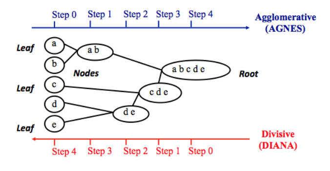

```{r setup, include=FALSE}
knitr::opts_chunk$set(echo = TRUE)
```

**The goal of clustering is to identify pattern or groups of similar objects within a data set of interest**.  

# I Basics  
## Chapter 1  
## Introduction to R  

## Chapter 2  
## Data Preparation  
To perform a cluster analysis in R, generally, the data should be prepared as follow:  
1. Rows are observations (individuals) and columns are variables.  
2. Any missing value in the data must be removed or estimated.  
3. The data must be standardized (i.e., scaled) to make variables comparable. Recall that, standardization consists of transforming the variables such that they have mean zero and standard deviation one.   

```{r}
library(magrittr)

data("USArrests")

df <- USArrests
df <- na.omit(df) # remove observations that contain missing values
df <- scale(df)
df %>% head()
```

|**Functions**|**Description**|  
|:--|:--|
|dist(fviz_dist, get_dist)| Distance Matrix Computation and Visualization|
|get_clust_tendency|Assessing Clustering Tendency|
|fviz_nbclust(fviz_gap_stat)|Determining the Optimal Number of Clusters|
|fviz_dend|Enhanced Visualization of Dendrogram|
|fviz_cluster|Visualize Clustering Results|
|fviz_mclust|Visualize Model-based Clustering Results|
|fviz_silhouette|Visualize Silhouette Information from Clustering|
|hcut|Computes Hierarchical Clustering and Cut the Tree|
|hkmeans|Hierarchical k-means clustering|
|eclust|Visual enhancement of clustering analysis|


Required R Packages  
```{r}
library(cluster)
library(factoextra)
```


## Chapter 3  
## Clustering Distance Measures  
The classification of observations into groups requires some methods for computing the **distance** or the (dis)**similarity** between each pair of observations. The result of this computation is known as a dissimilarity or **distance matrix**.  

### Methods for measuring distances  
1. Euclidean distance  
The distance between two points.  
$$d_{euc}(x,y) = \sqrt{(\sum_{i=1}^{n}(x_{i} - y_{i})^2}$$
2. Manhattan distance  
$$d_{man}(x, y) = \sum_{i=1}^{n}|(x_{i} - y_{i})|$$
> below is correlation base distance, which is widely used for gene expression data analysis  

3. Pearson correlation distance  
Pearson correlation measures the degree of a linear relationship between two profiles.  

4. Eisen cosine correlation distance  
It's a special case of Pearson's correlation distance with ${\tilde{x}}$ and ${\tilde{y}}$ both replaced by zero.  

5. Spearman correlation distance  
The spearman correlation method computes the correlation between the rank of x and the rank of y variables.  

6. Kendall correlation distance  
Kendall correlation method measures the correspondence between the ranking of x and y variables.  


**Note**  
1. pearson correlation analysis is the most commonly used method. It is also known as a parametric correlation which depends on the distribution of the data.  
2. Kendall and Spearman correlations are non-parametric and they are used to perform rank-based correlation analysis.  

### What type of distance measures should we choose?  
The choice of distance measures is very important, as it has a strong influence on the clustering results. For most common clustering software, the default distance measure is the Euclidean distance.  

Correlation-based distance considers two objects to be similar if their features are highly correlated, even though the observed values may be far apart in terms of Euclidean distance.  

The distance between two objects is 0 when they are perfectly correlated. Pearson’s correlation is quite sensitive to outliers. This does not matter when clustering samples, because the correlation is over thousands of genes. When clustering genes, it is important to be aware of the possible impact of outliers. This can be mitigated by using Spearman’s correlation instead of Pearson’s correlation.  

If Euclidean distance is chosen, then observations with high values of features will be clustered together. The same holds true for observations with low values of features.  

### Data standardization  
The value of distance measures is intimately related to the scale on which measurements are made. Therefore, variables are often scaled (i.e. standardized) before measuring the inter-observation dissimilarities. This is particularly recommended when variables are measured in different scales (e.g: kilograms, kilometers, centimeters,...); otherwise, the dissimilarity measures obtained will be severely affected.  

**The goal is to make the variables comparable**. Generally variables are scaled to have i) standard deviation one and ii) mean zero.  

The standardization of data is an approach widely used in the context of gene expression data analysis before clustering. We might also want to scale the data when the mean and/or the standard deviation of variables are largely different.  

When scaling variables, the data can be transformed as follow:  

$$\frac{x_{i} - center(x)}{scale(x)}$$

Where `center(x)` can be the mean or the median of x values, and `scale(x)` can be the standard deviation(SD), the interquartile range, or the MAD (median absolute deviation).  

The R base function `scale()` can be used to standardize the data. It takes a numeric matrix as an input and performs the scaling on the columns.  

> Standardization makes the four distance measure methods - Euclidean, Manhattan, Correlation and Eisen - more similar than they would be with non-transformed data. 
Note that, when the data are standardized, there is a functional relation- ship between the Pearson correlation coe?cient r(x, y) and the Euclidean distance.  
With some maths, the relationship can be defined as follow:

$$d_{euc}(x,y) = \sqrt{2m[1-r(x,y)]}$$

### Distance matrix computation  
```{r}
ss <- sample(50, 15)
df <- USArrests[ss, ]
df_scaled <- scale(df)
```

1. `dist()` in `stats` package accepts only numeric data as input  

2. `get_dist()` in `factoextra` package accepts only numeric data as input. compare to the standard `dist()` function, it supports correlation-based distance measures including 'pearson', 'kendall' and 'spearman' methods.  

3. `daisy()` function in `cluster` package able to handle other variable types (e.g. nominal, ordinal, (a)symmetric binary). In that case, the Gower's coefficient will be automatically used as the metric. It's one of the most popular measures of proximity for mixed data types.  

> All these functions compute distance between rows of the data.  

Euclidean distance  
```{r}
dist.eucl <- dist(x = df_scaled, method = "euclidean")
round(as.matrix(dist.eucl)[1:3, 1:3], 1)
```

Correlation based distances  
```{r}
dist_cor <- get_dist(x = df_scaled, method = "pearson")
round(as.matrix(dist_cor)[1:3, 1:3], 1)
```

Computing distance for mixed data  
```{r}
library(cluster)
data("flower")
flower %>% head()
```

```{r}
str(flower)
```

```{r}
dd <- daisy(x = flower)

round(as.matrix(dd)[1:3, 1:3], 1)
```

### Visualizing distance matrices  
A simple solution for visualizing the distance matrices is to use the function `fviz_dist()` in `factoextra` package.  

```{r}
library(factoextra)
fviz_dist(dist.eucl)
```


# II Partitioning Clustering  
Partitioning clustering are clustering methods used to classify observations, within a data set, into multiple groups based on their similarity. The algorithms require the analyst to specify the number of clusters to be generated.  

## Chapter 4
## K-means 
In k-means clustering, each cluster is represented by its center (i.e, centroid) which corresponds to the mean of points assigned to the cluster. The K-means method is sensitive to anomalous data points and outliers.  

The basic idea behind k-means clustering consists of defining clusters so that the total intra-cluster variation (known as total within-cluster variation) is minimized.  

```{r}
data("USArrests")
df <- scale(USArrests)
df %>% head()

# estimating the optima number of clusters  
fviz_nbclust(x = df, FUNcluster = kmeans, method = "wss") +
    geom_vline(xintercept = 4, linetype = 2)
```

```{r}
km.res <- kmeans(df, centers = 4, nstart = 25)
```

`nstart = 25`. This means that R will try 25 different random starting assignments and then select the best results corresponding to the one with the lowest within cluster variation.  

```{r}
print(km.res)
```

```{r}
aggregate(USArrests, by = list(cluster = km.res$cluster), FUN = mean)
```

```{r}
dd <- cbind(USArrests, cluster = km.res$cluster)
dd %>% head()
```

components returned by `kmeans` cluster  
```{r}
km.res %>% names
```

```{r}
fviz_cluster(object = km.res, 
             data = df, 
             palette = c("#2E9FDF", "#00AFBB", "#E7B800", "#FC4E07"), 
             ellipse.type = "euclid", 
             star.plot = F, 
             repel = T, 
             ggtheme = theme_minimal(), 
             show.clust.cent = F)
```

**K-means clustering advantages and disadvantages**  

weaknesses:  
1. It assumes prior knowledge of the data and requires the analyst to choose the appropriate number of cluster (k) in advance.  

2. The final results obtained is sensitive to the initial random selection of cluster centers. Why is this a problem? Because, for every different run of the algorithm on the same data set, you may choose different set of initial centers. This may lead to different clustering results on different runs of the algorithm.  

3. It’s sensitive to outliers.  

4. If you rearrange your data, it’s very possible that you’ll get a different solution every time you change the ordering of your data.  


Solutions to these weaknesses:  
1. Compute k-means for a range of k values, for example by varying k between 2 and 10. Then, choose the best k by comparing the clustering results obtained for the different k values.  

2. Compute K-means algorithm several times with different initial cluster centers. The run with the lowest total within-cluster sum of square is selected as the final clustering solution.  

3. To avoid distortions caused by excessive outliers, it’s possible to use PAM algorithm, which is less sensitive to outliers.  


## Chapter 5  
## K-medoids (PAM)  
K-medoids clustering or PAM (Partitioning Around Medoids) each cluster is represented by one of the objects in the cluster. PAM is less sensitive to outliers compared to k-means.

1. Select k object to become the medoids, or in case these objects were provided use them as the medoids.  
2. Calculate the dissimilarity matrix if it was not provided.  
3. Assign every object to its cloest medoid.  
4. For each cluster search if any of the object of the cluster decreases the average dissimilarity coefficient, if it does, select the enttity that decreases this coefficient the most as the medoid for this cluster.  
5. If at least one medoid has changed go to step 3, else end the algorithm.  


### Computing PAM in R  
```{r}
data("USArrests")

df <- scale(USArrests)
df %>% head
```

The function `pam()` in `cluster` package and `pamk()` in `fpc` package can be used to compute PAM.  

### Estimating the optimal number of clusters  
```{r}
fviz_nbclust(x = df, FUNcluster = pam, method = "silhouette") +
    theme_classic()
```

```{r}
pam.res <- pam(x = df, k = 2)
pam.res %>% names()

cbind(USArrests, cluster = pam.res$clustering)
```

```{r}
library(RColorBrewer)
fviz_cluster(object = pam.res, 
             palette = brewer.pal(n = 3, name = "Set1")[1:2], 
             ellipse.type = "t", 
             repel = T, 
             ggtheme = theme_classic()) +
    theme(legend.position = "bottom")
```

> Note that, for large data set, `pam()` may need too much memory or too much computation time. In this case, the function `clara()` is preferable.   


## Chapter 6 
## CLARA - Clustering Large Applications  
CLARA algorithm (Clustering Large Applications), which is an extension to PAM adapted for large data sets in order to reduce computing time, this is achieved using the sampling approach.  

1. Split randomly the data sets in multiple subsets with fixed size (sampsize).  
2. Compute PAM algorithm on each subset and choose the corresponding k representative objects (medoids). Assign each observation of the entire data set to the closest medoid.  
3. Calculate the mean (or the sum) of the dissimilarities of the observations to their closest medoid. This is used as a measure of the goodness of the clustering.  
4. Retain the sub-data set for which the mean (or sum) is minimal. A furether analysis is carried out on the final partition.  

```{r}
set.seed(1234)
df <- rbind(cbind(rnorm(200, 0, 8), rnorm(200, 0, 8)), 
            cbind(rnorm(300, 50, 8), rnorm(300, 50, 8)))

colnames(df) <- c("x", "y")
rownames(df) <- paste("S", 1:nrow(df), sep = "")
df %>% head
```

The function `clara()` in `cluster` package can be used to compute CLARA.  

### Estimating the optimal number of clusters  
```{r}
fviz_nbclust(x = df, 
             FUNcluster = clara, 
             method = "silhouette") +
    theme_classic()
```

```{r}
clara.res <- clara(x = df, 
                   k = 2, 
                   samples = 50, 
                   pamLike = T)
clara.res
```

```{r}
clara.res %>% names()
```

```{r}
cbind(df, cluster = clara.res$clustering) %>% head
```

```{r}
fviz_cluster(object = clara.res, 
             palette = brewer.pal(n = 3, name = "Set1")[1:2], 
             ellipse.type = "t", 
             geom = "point") +
    theme_classic()
```


# III Hierarchical Clustering  
**Hierarchical clustering** [or **hierarchical cluster analysis** (**HCA**)] is an alternative approach to partitioning clustering for grouping objects based on their similarity. In contrast to partitioning clustering, hierarchical clustering does not require to pre-specify the number of clusters to be produced.  

Hierarchical clustering can be subdivided into two types:  

- **Agglomerative clustering** in which, each observation is initially considered as a cluster of its own (leaf). Then, the most similar clusters are successively merged until there is just one single big cluster (root).  

- **Divise clustering**, an inverse of agglomerative clustering, begins with the root, in which all objects are included in one cluster. Then the most heterogeneous clusters are successively divided until all observation are in their own cluster.  

## Chapter 7
## Agglomerative Clustering  
The **agglomerative clustering** is the most common type of hierarchical clustering use to group objects in clusters based on their similarity. It’s also known as AGNES (*Agglomerative Nesting*). The algorithm starts by treating each object as a single- ton cluster. Next, pairs of clusters are successively merged until all clusters have been merged into one big cluster containing all objects. The result is a tree-based representation of the objects, named *dendrogram*.  

Agglomerative clustering works in a “bottom-up” manner. That is, each object is initially considered as a single-element cluster (leaf). At each step of the algorithm, the two clusters that are the most similar are combined into a new bigger cluster
(nodes). This procedure is iterated until all points are member of just one single big cluster (root).  

The inverse of agglomerative clustering is divisive clustering, which is also known as DIANA (Divise Analysis) and it works in a “top-down” manner. It begins with the root, in which all objects are included in a single cluster. At each step of iteration, the most heterogeneous cluster is divided into two. The process is iterated until all objects are in their own cluster.  

```{r, fig.align='center'}

```

> Note that, agglomerative clustering is good at identifying small clusters. Divisive clustering is good at identifying large clusters.  

```{r}
data("USArrests")
df <- scale(USArrests)
df %>% head
```

```{r}
res.dist <- dist(x = df, method = "euclidean")
res.dist %>% as.matrix() %>% .[1:3, 1:3]
```

### Linkage  
The linkage function takes the distance information, returned by the function dist(), and groups pairs of objects into clusters based on their similarity. Next, these newly formed clusters are linked to each other to create bigger clusters. This process is iterated until all the objects in the original data set are linked together in a hierarchical tree.  

```{r}
res.hc <- hclust(d = res.dist, method = "ward.D2")
```

- **d**: a dissimilarity structure as produced by the **dist()** function.  
- **method**: The agglomeration (linkage) method to be used for computing distance between clusters. Allowed values is one of "ward.D", "ward.D2", "single", "complete", "average", "mcquitty", "median" or "centroid".  

The most common likage methods are described below:  

1. *Maximum or complete linkage*: The distance between two clusters is defined as the maximum value of all pairwise distances between the elements in cluster 1 and the elements in clsuter 2. It tends to produce more compact clusters.  

2. *Minimum or single linkage*: The distance between two clsuters is defined as the minimum value of all pairwise distances between the elements in cluster 1 and the elements in cluster 2. It tends to produce long, "loose" clusters.  

3. *Mean or average linkage*: The distance between two clusters is defined as the average distance between the elements in cluster 1 and the elements in cluster 2.  

4. *Centroid linkage*: The distance between two clusters is defined as the distance between the centroid for cluster 1 (a mean vector of length p variables) and the centroid for clsuter 2.  

5. *Ward's minimum variance method*: It minmizes the total within-cluster variance. At each step the pair of clusters with minimum between-cluster distance are merged.  

> Complete linkage and Ward's method are generally prefered.  

```{r}
fviz_dend(x = res.hc, cex = 0.5)
```

> Note that, conclusions about the proximity of two objects can be drawn only based on the height where branches containing those two objects first are fused. We cannot use the proximity of two objects along the horizontal axis as a criteria of their similarity.  

### Verify the cluster tree  
After linking the objects in a data set into a hierarchical cluster tree, you might want to assess that the distances (i.e., heights) in the tree reflect the original distances accurately.  

One way to measure how well the cluster tree generated by the `hclust()` function reflects your data is to compute the correlation between the *cophenetic* distances and the original distance data generated by the `dist()` function. If the clustering is valid, the linking of objects in the cluster tree should have a strong correlation with the distances between objects in the original distance matrix.  

The closer the value of the correlation coeffcient is to 1, the more accurately the
clustering solution reflects your data. Values above 0.75 are felt to be good. The “average” linkage method appears to produce high values of this statistic. This may be one reason that it is so popular.  

The R base function `cophenetic()` can be used to compute the cophenetic distances for hierarchical clustering.  

```{r}
res.coph <- cophenetic(res.hc)

# correlation between cophenetic distance and the origional distance  
cor(res.dist, res.coph)
```

```{r}
res.hc2 <- hclust(res.dist, method = "average")

cor(res.dist, cophenetic(res.hc2))
```

### Cut the dendrogram into different groups  
You can cut the hierarchical tree at a given height in order to partition your data into clusters. The R base function `cutree()` can be used to cut a tree, generated by the `hclust()` function, into several groups either by specifying the desired number of groups or the cut height. It returns a vector containing the cluster number of each observation.  

```{r}
# cut the tree into 4 groups
grp <- cutree(res.hc, k = 4)
grp %>% head
table(grp)
```

```{r}
rownames(df)[grp == 1]
```

```{r}
fviz_dend(x = res.hc, 
          k = 4, 
          cex = 0.5, 
          k_colors = brewer.pal(4, "Set1"), 
          color_labels_by_k = T, 
          rect = T)
```

```{r}
fviz_cluster(list(data = df, cluster = grp), 
             palette = brewer.pal(4, "Set1"), 
             ellipse = T, 
             repel = T, 
             show.clust.cent = F) +
    theme_classic()
```

### Cluster R package  
The R package `cluster` makes it easy to perform cluster analysis in R. It provides the function `agnes()` and `diana()` for computing agglomerative and divisive clustering, respectively. These functions perform all the necessary steps for you. You don't need to execute the `scale()`, `dist()` and `hclust()` function separately.  

```{r}
library(cluster)
# Agglomerative Nesting (Hierarchical Clustering)
res.agnes <- agnes(x = USArrests, 
                   stand = T, 
                   metric = "euclidean", 
                   method = "ward")

# Divisive Analysis Clustering
res.diana <- diana(x = USArrests, 
                   stand = T, 
                   metric = "euclidean")
```

```{r}
fviz_dend(x = res.agnes, 
          cex = 0.6, 
          k = 4, 
          rect = T, 
          rect_fill = T)
```

## Chapter 8
## Comparing Dendrograms  


- Visualizing Dendrograms  
- Heatmap: Static & Interactive  

# IV Cluster Validation  
- Clustering Tendency  
- Optimal Number of Clusters  
- Validation Statistics  
- P-value for Hierarchical Clustering  

# V Advanced Clustering  
- Hybrid Methods  
- Fuzzy Clustering  
- Model-Based Clustering  
- Density-Based Clustering  


