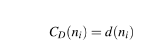
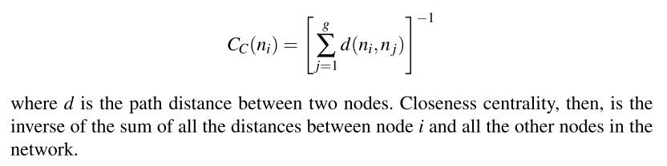
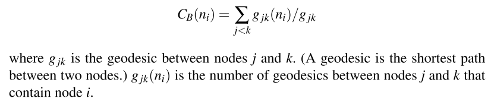

```{r setup, include=FALSE}
knitr::opts_chunk$set(echo = TRUE)
```

# Part I netWork Analysis Fundamentals  
## Chapter 2 The network Analysis `Five-number Summary`  
```{r}
library(statnet)
library(UserNetR)
data("Moreno")
```

```{r}
gender <- Moreno %v% "gender" 
class(Moreno)
plot(Moreno, vertex.col = gender + 2, vertex.cex = 1.2)
```

### Size  
```{r}
network.size(Moreno)
```

```{r}
summary(Moreno, print.adj = F)
```


### density  
density is the proportion of observed ties (also called edges, arcs, or relations) in a network to the maximum number of possible ties.  

```{r}
2*46/(33*32)
gden(Moreno)
```


### Components  
An informal definition of a component is a subgroup in which all actors are connencted directed or indirectly.  
```{r}
sna::components(Moreno)
```


### Diameter  
A path is the series of steps required to go from node A to node B in a network. The diameter for an entire network is the longest of the shortest paths across all pairs of nodes.  
```{r}
lgc <- component.largest(Moreno, result = "graph")
gd <- geodist(lgc)
max(gd$gdist)
```


### Clustering Coefficient  
One of the fundamental characteristics of social networks (compared to random networks) is the presence of clustering, or the tendency to formed closed triangles.

Transitivity is defined as the proportion of closed triangles (triads where all three ties are observed) to the total number of open and closed triangles (triads where either two or all three ties are observed).  
```{r}
gtrans(Moreno, mode = "graph")
```


## Chapter 3 Network Data Management in R  
```
Knowledge is of two kinds. We know a subject ourselves, or we known where we can find information upon it.  
```

### Network data structure  
- **sociomatrix** also called **adjacency matrix**   
- **edge-list**  


### information stored in network objects  
In general, a network data object can contain up to five types of information  
1. Nodes: list of nodes in network, along with node labels  
2. Ties: List of ties in the network  
3. Node attributes: attributes of the nodes  
4. Tie attributes: attributes of the ties  
5. Metadata: other information about the entrie network  


### Creating and Managing Network Objects in R  

create network object from adjacency matrix  
```{r}
netmat1 <- rbind(c(0,1,1,0,0),
                 c(0,0,1,1,0),
                 c(0,1,0,0,0),
                 c(0,0,0,0,0),
                 c(0,0,1,0,0))

rownames(netmat1) <- c("A", "B", "C", "D", "E")
colnames(netmat1) <- c("A", "B", "C", "D", "E")
```

```{r}
net1 <- network(x = netmat1, 
                matrix.type = "adjacency")
```


```{r}
class(net1)
```

```{r}
summary(net1)
```

```{r}
gplot(net1, 
      vertex.col = 2, 
      displaylabels = T)
```


create network object from edge list  
```{r}
netmat2 <- rbind(
  c(1,2),
  c(1,3),
  c(2,3),
  c(2,4),
  c(3,2),
  c(5,3)
)

net2 <- network(x = netmat2,
                matrix.type = "edgelist")

network.vertex.names(net2) <- c("A", "B", "C", "D", "E")
summary(net2)
```

```{r}
gplot(net2)
```

```{r}
as.sociomatrix(net1)
```

```{r}
as.matrix(net1, matrix.type = "edgelist")
```


```{r}
class(as.sociomatrix(net1))
```

#### Node and tie attributes  
```{r}
set.vertex.attribute(x = net1, "gender", c("F", "F", "M", "F", "M"))

net1 %v% "alldeg" <- degree(net1)

list.vertex.attributes(net1)
```

```{r}
summary(net1)
```

```{r}
list.vertex.attributes(net1)
```

```{r}
list.edge.attributes(net1)
```

```{r}
get.vertex.attribute(x = net1, "gender")
```

```{r}
net1 %v% "gender"
```


```{r}
set.edge.attribute(net1, "rndval", runif(network.size(net1), 0, 1))
```

```{r}
list.edge.attributes(net1)
```

```{r}
get.edge.attribute(net1, "rndval")
```

```{r}
net1 %e% "rndval"
```

```{r}
summary(net1 %e% "rndval")
```

```{r}
summary(get.edge.attribute(net1, "rndval"))
```


```{r}
netval1 <- rbind(
  c(0,2,3,0,0),
  c(0,0,3,1,0),
  c(0,1,0,0,0),
  c(0,0,0,0,0),
  c(0,0,2,0,0)
)

netval1 <- network(netval1, 
                   matrix.type = "adjacency",
                   ignore.eval = F,
                   names.eval = "like")

network.vertex.names(netval1) <- c("A", "B", "C", "D", "E")
list.edge.attributes(netval1)
```

```{r}
gplot(netval1)
```


```{r}
get.edge.attribute(netval1, "like")
```

```{r}
as.sociomatrix(netval1)
```

```{r}
as.sociomatrix(netval1, "like")
```


```{r}
detach(package:statnet)
library(igraph)
```


### Ceating a Network object in igraph  
```{r}
inet1 <- graph.adjacency(netmat1)
class(inet1)
```

```{r}
summary(inet1)
```

```{r}
inet1
```


```{r}
inet2 <- graph.edgelist(el = netmat2)
summary(inet2)
```

```{r}
V(inet2)$name <- c("A", "B", "C", "D", "E")
E(inet2)$val <- c(1:6)

summary(inet2)
```

```{r}
inet2
```

convert between igraph object and statnet object  
```{r}
library(intergraph)
```

```{r}
class(net1)
```

```{r}
net1igraph <- asIgraph(net1)
class(net1igraph)
net1igraph
```


```{r}
inet1network <- asNetwork(inet1)
class(inet1network)
inet1network
```

### import network data  
```{r}
library(statnet)
```

```{r}
netmat3 <- rbind(
  c("A", "B"),
  c("A", "C"),
  c("B", "C"),
  c("B", "D"),
  c("C", "B"),
  c("E", "C")
)
```

```{r}
net_df <- data.frame(netmat3, stringsAsFactors = F)
```

```{r}
write.csv(net_df, file = "MyData.csv", row.names = F)
net_edge <- read.csv(file = "MyData.csv")
net_import <- network(x = net_edge,
                      matrix.type = "edgelist")
summary(net_import)
```

```{r}
gden(net_import)
```


### Common Network Data Tasks  
1. Filtering networks based on vertex or edge attribute values  
2. Filtering based on node value  
3. removing isolates  
4. Filtering based on edge values  

```{r}
n1F <- get.inducedSubgraph(x = net1, which(net1 %v% "gender" == "F"))
```

the `get.inducedSubgraph()` function returns a new network object that is filtered based on the vertex attribute criteria.  

This works because the %v% operator returns a list of vertex ids.  

```{r}
gplot(n1F, displaylabels = T)
```


```{r}
data("ICTS_G10")
gden(ICTS_G10)
```

```{r}
length(isolates(ICTS_G10))
```
the `isolates()` function returns a vector of vertex IDs. This can be fed to the `delete.vertices()` function.   
```{r}
n3 <- asIgraph(ICTS_G10)
n4 <- delete.vertices(n3, v = V(n3)[degree(n3) == 0])

pdf(file = "isolates.pdf")
plot(n4, 
     vertex.size = 5,
     vertex.label.cex = 0.7)

dev.off()
```


```{r}
data(DHHS)
d <- DHHS
```


```{r}
op <- par(mar = rep(0, 4))
gplot(d, 
      gmode = "graph",
      edge.lwd = d %e% "collab",
      edge.col = "grey50",
      vertex.col = "lightblue",
      vertex.cex = 1.0,
      vertex.sides = 20)
```


```{r}
library(igraph)
d <- asIgraph(d)
d1 <- delete.edges(d, edges = E(d)[E(d)$collab < 3])
rglplot(d1,
     edge.width = E(d1)$collab,
     layout = layout_with_fr,
     vertex.label = NA,
     vertex.size = 10)
```


### Transforming a Directed network to a non-directed network  
```{r}
net1mat <- symmetrize(net1, rule = "week")
```


```{r}
net1symm <- network(net1mat, matrix.type = "adjacency")
network.vertex.names(net1symm) <- c("A", "B", "C", "D", "E")
summary(net1symm)
```

# PartII Visualization  
## Chapter 4 Basic network plotting and layout  
```{r}
data(Moreno)

op <- par(mar = rep(0, 4), mfrow = c(1,2))
plot(Moreno,
     mode = "circle",
     vertex.cex = 1.5)
```

```{r}
plot(Moreno, mode = "fruchtermanreingold", vertex.cex = 1.5)
par(op)
```


```{r}
gplot(Moreno, gmode = "graph", mode = "random", vertex.cex = 1.5, main = "Random layout")
```

```{r}
gplot(Moreno, gmode = "graph", mode = "fruchtermanreingold", vertex.cex = 1.5, main = "Fruchterman-Reingold")
```


## Basic plotting algorithms and methods  

```{r}
data("Bali")
mycoords1 <- gplot(Bali, gmode = "graph", vertex.cex = 1.5)
```

```{r}
mycoords2 <- mycoords1

mycoords2[, 2] <- mycoords1[, 2] * 1.5

mycoords1;mycoords2
```


```{r}
par(mfrow = c(1,2))
gplot(Bali, 
      gmode = "graph", 
      coord = mycoords1, 
      vertex.cex = 1.5, 
      suppress.axes = F,
      ylim = c(min(mycoords2[, 2]) - 1, max = mycoords2[, 2] + 1),
      main = "Original coordinates")

gplot(Bali,
      gmode = "graph",
      coord = mycoords2,
      vertex.cex = 1.5,
      suppress.axes = F,
      ylim = c(min(mycoords2[,2]) - 1, max(mycoords2[,2]) - 1),
      main = "Modified coordinates")
```


```{r}
detach(package:statnet)
library(igraph)
library(intergraph)
```

```{r}
iBali <- asIgraph(Bali)
par(mfrow = c(1, 3), mar = c(0,0,3,0))
plot(iBali,
     layout = layout_in_circle,
     main = "Circle")

plot(iBali,
     layout = layout_randomly,
     main = "Randomly")

plot(iBali,
     layout = layout_with_kk,
     main = "Kamada-Kawai")
```


## Chapter 5 Effective network graphic design  
```{r}
library(RColorBrewer)
iBali <- asIgraph(Bali)

get.vertex.attribute(iBali, "role")

cols <- brewer.pal(n = length(unique(V(iBali)$role)), name = "Set1")
names(cols) <- unique(V(iBali)$role)
l <- layout_with_fr(iBali)
```


```{r}
plot(iBali, vertex.color = cols[V(iBali)$role], vertex.label = V(iBali)$role, vertex.label.cex = 0.7,
     layout = l)
legend("bottomleft", legend = unique(V(iBali)$role), pch = 19, pt.cex = 2, col = cols, bty = "n")
```


```{r}
op <- par(mar = c(0, 0, 0, 0))
plot(Bali, displaylabels = TRUE, label.cex = 0.8,
     pad = 0.4, label.col = "darkblue")

par(op)
```


```{r}
rolelab <- get.vertex.attribute(asIgraph(Bali), "role")
plot(Bali,
    usearrows = F,
    label = rolelab,
    displaylabels = T,
    label.col = "darkblue")
```


## Chapter 6 Advanced network graphics  
## Interactive network graphics  
```{r}
library(intergraph)
library(igraph)
data(Bali)
```

```{r}
iBali <- asIgraph(Bali)
coord <- tkplot(iBali, vertex.size = 3, 
                vertex.label = V(iBali)$role,
                vertex.color = "darkgreen")

MCoord <- tkplot.getcoords(coord)
tkplot.close(coord)

plot(iBali, layout = MCoord, vertex.size = 5, 
     vertex.label = NA, 
     vertex.color = "lightblue")
```


```{r}
library("networkD3")
```


```{r}
src <- c("A", "A", "B", "B", "C", "E")
target <- c("B", "C", "C", "D", "B", "C")
net_edge <- data.frame(src, target)
simpleNetwork(net_edge)
```

```{r}
net_D3 <- simpleNetwork(net_edge)
saveNetwork(network = net_D3, 
            file = "Net_test1.html", 
            selfcontained = T)
```


```{r}
iBali_edge <- get.edgelist(iBali)
iBali_edge <- iBali_edge - 1

iBali_edge <- data.frame(iBali_edge)

iBali_nodes <- data.frame(
  node_id = as.numeric(V(iBali) -1),
  group = V(iBali)$role,
  node_size = degree(iBali))
```


```{r}
net_D3 <- forceNetwork(Links = iBali_edge,
                       Nodes = iBali_nodes,
                       Source = 'X1',
                       Target = "X2",
                       NodeID = "node_id",
                       Nodesize = "node_size",
                       radiusCalculation = "Math.sqrt(d.nodesize)*3",
                       Group = "group",
                       opacity = 0.8,
                       legend = TRUE)
```

# Part III Description and Analysis  
## Chapter 7 Actor Prominence  
#### Centrality: Prominence for Undirected Networks  
```{r}
par(mar = rep(0,4))
gplot(Bali,
     vertex.cex = 2,
     label = Bali %v% 'vertex.names',
     gmode = "graph",
     label.cex = 0.7,
     vertex.col = "orange")
```

```{r}
Bali %v% "vertex.names"
```


Three Common Measures of Centrality  
- Degreee centrality  
> The simplest measure of centrality by far is based on the notion that a node that has more direct ties is more prominent than nodes with fewer or no ties.  


```{r}
data("Bali")
sna::degree(Bali)
```


- Closeness Centrality  
> Instead of examining only the direct connections of the nodes, we can focus on how close each node is to every other node in a network. This leads to the concept of closeness centrality, where nodes are more prominent to the extent they are close to all other nodes in the network.  


```{r}
sna::closeness(Bali)
```

- Betweenness Centrality  
> Betweenness centrality measures the extent that a node sits ‘between’ pairs of other nodes in the network, such that a path between the other nodes has to go through that node. A node with high betweenness is prominent, then, because that node is in a position to observe or control the flow of information in the network.  



```{r}
dum1 <- rbind(c(1,2), c(1,3), c(1, 4), c(1,5))
start_net <- network(dum1, directed = F)

dum2 <- rbind(c(1, 2), c(2, 3), c(3, 4), c(4, 5), c(5, 1))
circle_net <- network(dum2, directed = F)
```


```{r}
par(mar = c(4, 4, 0.1, 0.1))
my_pal <- RColorBrewer::brewer.pal(5, "Set1")
gplot(start_net, 
      usearrows = F, 
      displaylabels = F,
      vertex.cex = 2, 
      vertex.col = my_pal[1],
      edge.lwd = 0, 
      edge.col = "grey50",
      xlab = "Star graph")
```

```{r}
gplot(circle_net,
      usearrows = F,
      displaylabels = F,
      vertex.cex = 2,
      vertex.col = my_pal[1],
      edge.lwd = 0,
      edge.col = "grey50",
      xlab = "Circle graph")
```


  