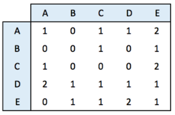
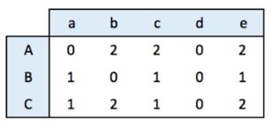
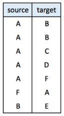

```{r setup, include=FALSE}
knitr::opts_chunk$set(echo = TRUE)
```


# Create network object  
## Adjacency matrix  
**An adjacency matrix is a square matrix** where individuals in rows and columns are the same.  

It's typically the kind of matrix you get when calculating the correlation between each pair of individual. By default, we get an unweighted and oriented network.  

adjacency matrix: 

```{r}
library(igraph)
set.seed(10)
```


```{r}
data <- matrix(sample(x = 0:2, size = 25, replace = T), nrow = 5)
rownames(data) <- LETTERS[1:5]; colnames(data) <- LETTERS[1:5]
```

```{r}
network <- graph_from_adjacency_matrix(data)

plot(network,
     edge.arrow.size = 0.5,
     edge.curved = 0)
```

## Incidence matrix  
An incidence matrix is not square and entites provided in rows and columns are not necessary the same.  

By default, the graph object is directed from rows to columns.  


incidency matrix: 

```{r}
data <- matrix(sample(x = 0:2, size = 15, replace = T), nrow = 3)
colnames(data) <- letters[1:5]; rownames(data) <- LETTERS[1:3]
```

```{r}
network <- graph_from_incidence_matrix(incidence = data, directed = T, mode = "out")

plot(network)
```


## edge list  
An edge list has 2 columns, each row represents a connection between an origin (first column) and a destination (left column).  

** This kind of input often goes with another dataframe providing features for each node.**  

it is also possible to add information concerning each link in the edge list.  

edge list: 

```{r}
links <- data.frame(
    source = c("A", "A", "A", "A", "A", "F", "B"),
    target = c("B", "B", "C", "D", "F", "A", "E")
)

network <- graph_from_data_frame(d = links, directed = F, vertices = NULL)

plot(network)
```


## Literal list of connections  
```{r}
network <- graph_from_literal(A-B-C-D, E-A-E-A, D-C-A, D-A-D-C, simplify = T)

plot(network)
```


## default network chart with igraph  
```{r}
data <- matrix(sample(0:1, 100, replace = T, prob = c(0.8, 0.2)), ncol = 10)
```

```{r}
network <- graph_from_adjacency_matrix(adjmatrix = data,
                                       mode = "undirected",
                                       diag = F)

par(mar = c(0,0,0,0))
plot(network)
```


# customize features

Nodes features  
```{r}
plot(network,
     vertex.color = rgb(0.8, 0.2, 0.2, 0.7),
     vertex.frame.color = "grey50",
     vertex.shape = c('circle', "square"),
     vertex.size = c(15:24),
     vertex.size2 = NA)
```

  
## label features  
```{r}
plot(network,
     vertex.label = LETTERS[1:10],
     vertex.label.color = c("red", "blue"),
     vertex.label.frame = "Times",
     vertex.label.cex = c(0.5, 1, 1.5),
     vertex.label.font = c(1, 2, 3, 4),
     vertex.label.dist = 0,
     vertex.label.degree = 0)
```
Note that when several values are provided to an option, values are used subsequently and recycled.


## link features   
```{r}
plot(network,
     edge.color = rep(c("red", "pink"), 5),
     edge.width = seq(1:10),
     edge.arrow.size = 1,
     edge.arrow.width = 1,
     edge.lty = "solid", # could be 0 or "blank", 1 or "solid", 2 or "dashed", 3 or "dotted", 4 or "dotdash", 5 or "longdash", 6 or "twodash"
     edge.curved = 0) # from 0 to 1
```


## all customization  
```{r}
par(bg = "black", mar = c(0,0,0,0))

plot(network,
     #-- vertex
     vertex.color = "tomato",
     vertex.frame.color = "white",
     vertex.shape = "circle",
     vertex.size = 18,
     vertex.size2 = NA,
     
     #-- vertex label
     vertex.label = LETTERS[1:10],
     vertex.label.color = "white",
     vertex.label.family = "Times",
     vertex.label.font = 1,
     vertex.label.cex = 1,
     vertex.label.dist = 0,
     vertex.label.degree = 0,
     
     #-- edge
     edge.color = "white",
     edge.width = 2,
     edge.arrow.size = 1,
     edge.arrow.width = 1,
     edge.lty = 1,
     edge.curved = 0.3)
```


# layout  
network layouts are algorithms that return coordinates for each node in a network.   

Usually, algorithms try to minimize edge crossing and prevent overlap. Edges can have uniform length or not.  

type `help(layout` to see all the possibilities.  
```{r}
data <- matrix(sample(0:1, 400, replace = T, prob = c(0.8, 0.2)), nrow = 20)
network <- graph_from_adjacency_matrix(data, mode = "undirected", diag = F)
```


```{r}
par(mfrow = c(2, 2), mar = c(1,1,1,1))
plot(network, layout = layout.sphere, main = "sphere")
plot(network, layout = layout.circle, main = "circle")
plot(network, layout = layout.random, main = "random")
plot(network, layout = layout.fruchterman.reingold, main = "fruchterman.reingold")
```


# map variable to features  
## map variable to node feature
```{r}
links <- data.frame(
    source = c("A","A", "A", "A", "A","J", "B", "B", "C", "C", "D","I"),
    target=c("B","B", "C", "D", "J","A","E", "F", "G", "H", "I","I"),
    importance = (sample(1:4, 12, replace = T))
)

nodes <- data.frame(
    name = LETTERS[1:10],
    carac = c(rep("young", 3), rep("adult", 2), rep("old", 5))
)
```


```{r}
network <- graph_from_data_frame(d = links, vertices = nodes, directed = F)

library(RColorBrewer)
coul <- brewer.pal(3, "Set1")
names(coul) <- c("young", "adult", "old")
```

```{r}
plot(network,
     vertex.color = coul[V(network)$carac])

legend("bottomleft", 
       legend = c("young", "adult", "old"),
       col = coul,
       bty = "n",
       pch = 20,
       pt.cex = 2, 
       cex = 1.2,
       text.col = coul,
       horiz = F, 
       inset = c(0.1, 0.1))
```

## map variable to link feature  
```{r}
plot(network,
     vertex.color = coul[V(network)$carac],
     edge.width = E(network)$importance)

legend("bottomleft",
       legend = c("young", "adult", "old"),
       col = coul,
       bty = "n",
       pch = 20,
       pt.cex = 2, 
       cex = 1.2, 
       text.col = coul,
       horiz = F,
       inset = c(0.1, 0.1))
```


## example  
```{r}
mat <- cor(t(mtcars[, c(1, 3:6)]))
```


```{r}
mat[mat < 0.995] <- 0
```


```{r}
network <- graph_from_adjacency_matrix(mat, weighted = T, mode = "undirected", diag = F)
plot(network)
```


### customization  
```{r}
col <- brewer.pal(nlevels(as.factor(mtcars$cyl)), "Set1")
names(col) <- unique(mtcars$cyl)
```


```{r}
l <- layout_with_fr(network)
```


```{r}
par(bg = "grey13", mar = c(0,0,0,0))
plot(network,
     vertex.size = 12,
     vertex.color = col[as.character(mtcars$cyl)],
     vertex.label.cex = 0.5,
     vertex.label.color = "white",
     vertex.frame.color = "transparent",
     layout = l)

text(x = 0, y = 0, labels = "mtcars network", col = "white", cex = 1.5)
legend(x = -0.25, y = -0.12, 
       legend = c("4 cylinder", "6 cylinders", "8 cylinders"),
       col = col,
       bty = "n",
       pch = 20,
       pt.cex = 2,
       cex = 1,
       text.col = "white",
       horiz = F)
```


link features  
```{r}
plot(network,
     edge.color = rep(c("red", "pink"), 5),
     edge.width = seq(1:10),
     edge.size = 1,
     edge.arrow.size = 1,
     edge.arrow.width = 1,
     edge.lty = 1,
     edge.curved = 0.3,
     layout = l)
```

```{r}
par(bg = "black", mar = c(0,0,0,0))
plot(network,
     #-- vertex
     vertex.color = rgb(0.8, 0.4, 0.3, 0.8),
     vertex.frame.color = "white",
     vertex.shape = "circle",
     vertex.size = 14,
     vertex.size2 = NA,
     
     #-- vertex.label
     vertex.label = rownames(mtcars),
     vertex.label.color = "white",
     vertex.label.family = "Times",
     vertex.label.font = 2,
     vertex.label.cex = 0.5,
     vertex.label.dist = 0,
     vertex.label.degree = 0,
     
     #-- edge
     edge.color = "white",
     edge.width = 4,
     edge.arrow.size = 1,
     edge.arrow.width = 1,
     edge.lty = 1,
     edge.curved = 0.3,
     layout = l)
```


### node size and degree  
```{r}
links <- data.frame(
    source = c("A","A", "A", "A", "A","J", "B", "B", "C", "C", "D","I"),
    target = c("B","B", "C", "D", "J","A","E", "F", "G", "H", "I","I")
)
```

```{r}
network <- graph_from_data_frame(d = links, directed = F)
```

```{r}
deg <- degree(network, mode = "all")
```

```{r}
plot(network,
     vertex.size = deg*6,
     vertex.color = rgb(0.3, 0.5, 0.2, 0.8))
```


