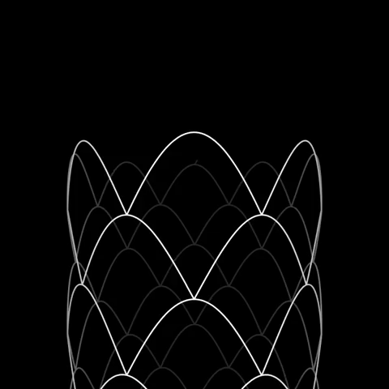

```{r setup, include=FALSE}
knitr::opts_chunk$set(echo = TRUE)
```


# Abstract  
Age-related macular degeneration (AMD) is a complex eye disease, which charcaterized with the death of photoreceptors and degeneration of retina pigment epithelium (RPE) and choriocapillaris (CC) in the macular region. In the early stage of AMD, CC dropout has been identified. This implies that CC changes may be the eariest onset site in AMD pathogenesis. Exploring the role of CC in AMD progression will provide better understanding of AMD pathogenesis, and more valuable therapeutic targets.  


# Introduction  
To date, most of the research about the pathgenesis of AMD are focused on the retine pigment epithelium (RPE), more and more evidence have found that changes have taken place in the CC in the early stage of AMD, such as reduced blood flow and CC dropout, and the progression is positively correlated with the severity of AMD [@Sohn2019;@Chatziralli2018;@Chirco2017;@Seddon2016]. The well known function of choricapillaris (CC) is supplying oxygen and nutrients to the out retina and retina pigment epithelium (RPE) while removing waste especially in the macular region. These functions are critical in light of the substantial metabolic activity of the neural retina. 


# References  


<!--chapter:end:journal.Rmd-->

---
title: "Output-formats"
author: "yincy"
date: "`r Sys.Date()`"
output: 
    html_document: 
        toc: true
        toc_depth: 2 
        toc_float: true
        collapsed: true
        smooth_scroll: true
        number_sections: true
        theme: united
        highlight: tango
        df_print: paged
        code_folding: show
        keep_md: false
---

```{r setup, include=FALSE}
knitr::opts_chunk$set(echo = TRUE)
```


# HTML document  
Markdown was originally designed for HTML output, so it may not be surprising that the HTML format has the richest features among all output formats.  

## Table of Content
```
---
title: "Habits"
output:
    html_document:
        toc: true
        toc_depth: 2
---
```


## Floating TOC
```
---
title: "Habits"
output: 
    html_document:
        toc: true
        toc_float: true
        collapse: true
        smooth_scroll: true
---

```


## Section numbering  
```
---
title: "Habites"
output:
    html_document:
        toc: true
        number_sections: true
---
```


## Appearance and style  
There are several options that control the appearance of HTML documents:  
    - `theme`: specifies the Bootstrap theme to use for the page (themes are drawn from the Bootswatch1 theme library). Pass null for no theme (in this case you can use the css parameter to add your own styles).    

    - `highlight`:specifies the syntax highlighting style.   

    - `smart`:indicates whether to produce typographically correct output, con- verting straight quotes to curly quotes, --- to em-dashes, -- to en-dashes, and ... to ellipses.  


### Custom CSS  
```
title: "Habits"
output:
    html_document:
        theme: null
        highlight: null
        css: styles.css
```


## Figure options  
There are a number of options that affect the output of figures within HTML documents:  

- `fig_width` and `fig_height` can be used to control the default figure width and height (7x5 is used by default).  

- `fig_retina` specifies the scaling to perform for retina displays (defaults to 2, which currently works for all widely used retina displays). Set to null to prevent retina scaling.  

- `fig_captions` controls whether figures are rendered with captions.  

- `dev` controls the graphics device used to render figures (defualts to png).  

```
---
title: "Habits"
output: 
    html_document:
        fig_width: 7
        fig_hight: 6
        fig_caption: true
---
```


## Data frame printing  
You can enhance the default display of data frames via the df_print option.  

Option  | Description  
--------|--------------------------
default | Call the `print.data.frame` generic method  
kable   | Use the `knitr::kable` function  
tibble  | Use the `tibble::print.tbl_df` function  
paged   | Use `rmarkdown::print.paged_df` to create a pageable table  

```
---
title: "Motor trend car road tests"
output: 
    html_document:
        df_print: paged
---
```

**The options for paged HTML tables**  

Option         | Description
-------------  |----------------------
max.print      | The number of rows to print  
row.print      | The number of rows to display  
cols.print     | The number of columns to display  
cols.min.print | The minimum number of columns to display  
pages.print    | The number of pages to display under page navigation  
paged.print    | When set to FALSE turns off paged tables  
rownames.print | When set to FALSE turns off row names  


```{r, rows.print = 5, cols.print = 4, rownames.print = T}
mtcars
```


## Code folding  
The code_folding: hide option enables you to include R code but have it hidden by default. Users can then choose to show hidden R code chunks either individually or document wide.  

You can specify code_folding: show to still show all R code by default but then allow users to hide the code if they wish.  

```
title: "Habits"
output: 
    HTML_document:  
    code_folding: hide
```

## Document dependencies  
By default, R Markdown produces standalone HTML files with no external dependencies, using data: URIs to incorporate the contents of linked scripts, stylesheets, images, and videos.   

This means you can share or publish the file just like you share Office documents or PDFs. If you would rather keep dependencies in external files, you can specify `self_contained: false`.  
```
title: "Habits" 
output:
    html_document: 
        self_contained: false
        lib_dir: libs
```

When knitr processes an R Markdown input file, it creates a Markdown (*.md) file that is subsequently transformed into HTML by Pandoc. If you want to keep a copy of the Markdown file after rendering, you can do so using the keep_md option:  
```
title: "Habits"
output: 
    html_document: 
        keep_md: true
```


## Advanced customization  
### Keeping Markdown  
```
title: "habits"
output:
    html_document:
        keep_md: true
```

### Includes  
You can do more advanced customization of output by including additional HTML content or by replacing the core Pandoc template entirely.  

To include content in the document header or before/after the document body, you use the includes option as follows  

```
title: "Habits"
output:
    html_document:
        in_header: header.html
        before_body:doc_prefix.html
        after_body: doc_suffix.html
```


### Custim templates  


<!--chapter:end:Output-formats.Rmd-->

---
title: "prettydoc"
author: "yincy"
date: "`r Sys.Date()`"
output: 
    prettydoc::html_pretty:
    theme: leonids
    highlight: github
---

```{r setup, include=FALSE}
knitr::opts_chunk$set(echo = TRUE)
```

## Basics  

```` ```code``` ````

[Rstudio](https://www.rstudio.com)  

H~3~PO~4~  
Cu^2+^




```{r, out.width="50%", fig.align="center", fig.cap="figure caption"}
knitr::include_graphics(path = "./figures/11.gif")
```


- one item  
- one item  
- one item  
    - one more  
    - one more  
    - one more  
        - two  
        - two  
        
        
        
1. the first item  
2. the second item  
3. the third item  
    - one unordered  
    - one unordered  

back quotes  

> "I thoroughly disapprove of duels. If a man should challenge me, I would take him kindly and forgiving by hte hand and lead him to a quiet place and kill him."  

> --  Mark Twain  


plain code blocks  

```
This text is displayed verbatin / preformatted

```

    This text is displayed verbatin / preformatted


## Math expression  

inline style of math expression  
$f(k) = {n \choose k} p^{k}(1-p)^{n - k}$  


display style of math expression  
$$f(k) = {n \choose k} p^{k}(1-p)^{n - k}$$ 

math environment inside `$ $ or $$ $$` inline and display style    


array  
$$\begin{array}{ccc}
x_{11} & x_{12} & x_{13} \\
x_{21} & x_{22} & x_{23}  
\end{array}$$


bmatrix  
$X = \begin{bmatrix}1 & x_{1}\\
1 & x_{2} \\
1 & x_{3}
\end{bmatrix}$


pmatrix  
$$\Theta = \begin{pmatrix}\alpha & \beta\\  
\gamma & \delta 
\end{pmatrix}$$


vmatrix  
$\begin{vmatrix}a & b \\
c & d
\end{vmatrix}=ad-bc$ 


```{r}
# execute code if the date is later than a specified day  
do_it = Sys.Date() > "2018-12-04"
```


```{r, eval=do_it}
x = rnorm(100)
```


## Tables  
```{r tables-mtcars}
knitr::kable(x = iris[1:5, ], caption = "table caption")
```


## Other language engines  
```{r}
names(knitr::knit_engines$get())
```


```{python}
x = "hello, python world!"
print(x.split(" "))
```


```{python}
import sys
print(sys.version)
```


## Interactive documents  
There two types of interactive R Markdown documents: HTML Widgets framework and the Shiny framework.  


### HTML widgets  
```{r}
library(leaflet)
leaflet() %>% addTiles() %>% 
    setView(lng = -93.65, lat = 42.0285, zoom = 17) %>% 
    addPopups(lng = -93.65, lat = 42.0285, popup = "Here is the <b>Department of Statistics</b>, ISU")
```


<!--chapter:end:prettydoc.Rmd-->

---
title: "Shiny-interactive"
author: "yincy"
date: "12/7/2019"
output: html_document
runtime: shiny
---

```{r setup, include=FALSE}
knitr::opts_chunk$set(echo = TRUE)
```

A standard R plot can be made interactive by wrapping it in the Shiny `renderPlot()` function. The `selectInput()` function creates the input widget to drive the plot.  

```{r eruption, echo = F}
selectInput('breaks', label = "Number of bins:", 
            choices = c(10, 20, 35, 50),
            selected = 20)

renderPlot({
    par(mar = c(4, 4, 0.1, 0.5))
    
    hist(faithful$eruptions, as.numeric(input$breaks),
     col = "gray", border = "white", xlab = "Duration (minutes)",
     main = "",
     ylim = c(0, 45))
})
```


<!--chapter:end:Shiny-interactive.Rmd-->

