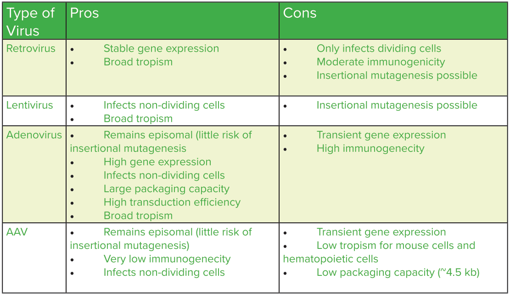
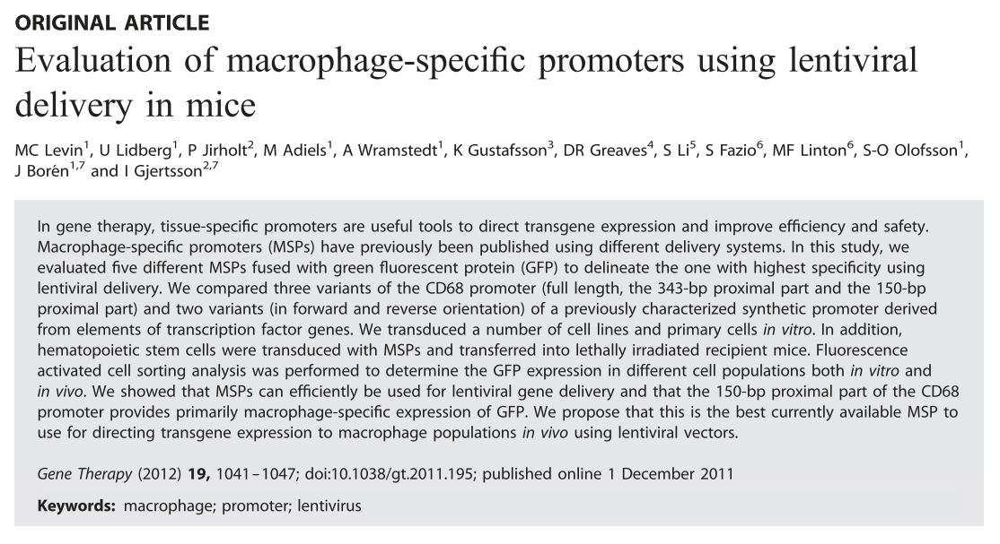

```{r setup, include=FALSE}
knitr::opts_chunk$set(echo = FALSE)
```


**This project is to study how dividing macrophage in tumor promoter tumor progression**.  

## type of virus  
```{r, fig.cap="retrovirus can only infects dividing cells, this can be using to infect self-maintaining macrophage."}

```

## by using macrophage specifc promoter to knock-down/knock-out gene in self-maintaining macrophage
We can use retrovirus to delivery Cas9 or shRNA to interfer genes expressed in self-maintaining macropage by using macropage specific promoter.  

```{r}

```


