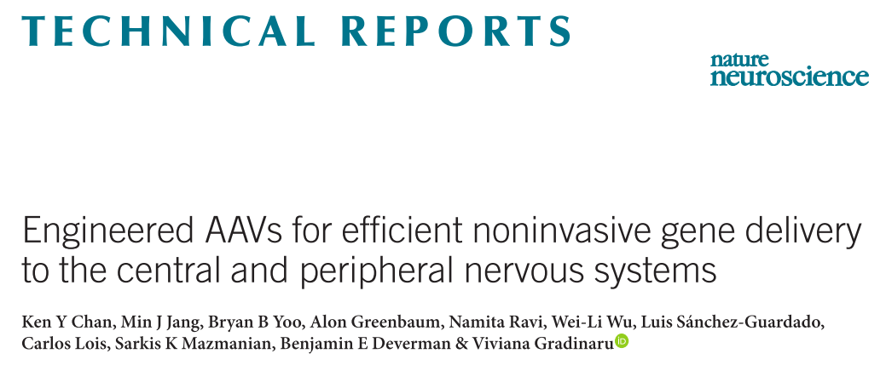
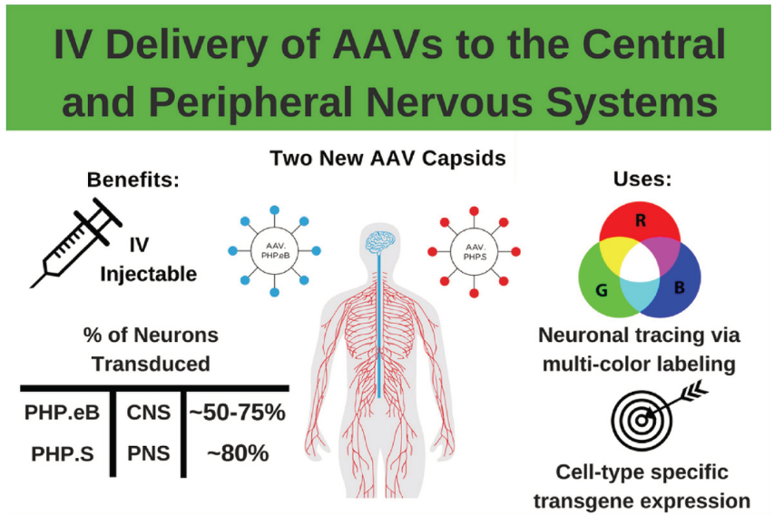

```{r setup, include=FALSE}
knitr::opts_chunk$set(echo = TRUE)
```

## Virus can specificly infect peripheral nervous system  
This paper discrebe an AAV can specificly infects peripheral nervous system with high efficency.   

```{r}

```


```{r}

```


## which type of nervs inflence tumor progression 
if surgically ablate all type of nerves in kidney can slow tumor progression  

### sympathetic nerve  
- 6OHDA ablate sympathetic nerve  

### parasympathetic nerve  
- botulinum toxin A (Botox) denervate both sensory and parasympathetic nerve  

### sensor nerve  
- capsaicin denervate sensor nerve  


## readouts  
- tumor volumn   
- metastasis  
- tumor stem cell  
- maliganance 


## Science paper 2013    
```{r}

```

- sympathetic nerve are critical at early stage of tumor development  
- sympathetic nerve influence tumor progress by Adrβ2 and Adrβ3  
- Sympathectomy had no effect on tumorigenesis after tumor has onset  
- synpathetic nerve mainly innervated normal tissue surrounding the tumor  

- parasympathetic nerve influence tumor metastasis  
- parasympathetic nerve exert is effect through *Chrm1*, cholinergic receptor.  
- parasympathetic nerve mainly in the tumor   

