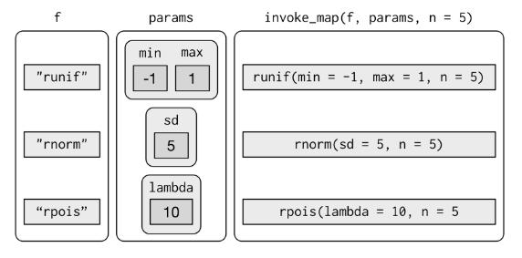

```{r setup, include=FALSE}
knitr::opts_chunk$set(echo = TRUE)
```


```{r, message=FALSE}
library(tidyverse)
```

## Loops  
```{r}
df <- tibble(
  a = rnorm(10),
  b = rnorm(10), 
  c = rnorm(10), 
  d = rnorm(10)
)

df
```

```{r}
output <- vector(mode = "double", length = ncol(df))

for(i in seq_along(df)){
  output[[i]] <- median(df[[i]])
}
output
```


```{r}
# 1. 
col_m <- vector(mode = "numeric", length = dim(mtcars)[2])

for(i in seq_along(mtcars)){
  col_m[[i]] = mean(mtcars[, i, drop = T])
}

col_m

# 2. 
library(nycflights13)

col_class <- vector(mode = "character", length = dim(flights)[2])

for(i in seq_along(flights)){
  col_class[i] = class(flights[, i, drop = T])[[1]]
}

col_class

# 3. 
col_uniq <- vector(mode = "numeric", length = dim(iris)[2])

for(i in seq_along(iris)){
  col_uniq[i] = length(unique(iris[, i, drop = T]))
}

col_uniq

# 4.  
mu <- c(-10, 0, 10, 100)
outs <- matrix(data = NA, nrow = 10, ncol = 4)

for(i in seq_along(mu)){
  outs[, i] <- rnorm(n = 10, mean = mu[i])
}

outs
```


## The Map functions  
- `map()` makes a list.  
- `map_lgl()` makes a logical vector.  
- `map_int()` makes an integer vector.  
- `map_dbl()` makes a double vector.  
- `map_chr()` makes a character vector.  

Each function takes a **vector as input**, applies a function to each piece, and then returns a new vector that's the same length (and has the same names) as the input. The type of the vector is determined by the suffix to the map function.  

```{r}
map_dfc(c(-10, 0, 10, 100), rnorm, n = 10) # the first argument passed to rnorm 

map2_dfc(10, c(-10, 0, 10, 100), rnorm) # first two argument passed to rnorm 

do.call(what = "rnorm", 
        args = list(n = rep(rep(10, 4), 10), mean = rep(c(-10, 0, 10, 100), each = 10))) %>% 
  matrix(nrow = 10, ncol = 4, byrow = F)
```

```{r}
map_lgl(df, is.factor)
```

```{r}
map(1:5, runif, min = 10, max = 100)
```

```{r}
map_dfc(-2:2, rnorm, n = 5)
```


```{r}
# 1. 
## a
map_dbl(mtcars, mean, na.rm = T)


## b
map(flights, class) %>% unlist

## c 
map(iris, unique) %>% map_dbl(length)

## d 
map_dfc(c(-10, 0, 10, 100), rnorm, n = 10)

# 2.  
map_lgl(df, is.factor)


# 3. 
map(1:5, runif)

# 4. 
map(-2:2, rnorm, n = 5)

# 5.
models <- mtcars %>% 
  split(.$cyl) %>% 
  map(~ lm(mpg ~ wt, data = .)) %>% 
  print
```

### Dealing with Failure  
- `safely()`  
- `possibly()`: like `safely` is return a default value you give to it. 
- `quietly()`  


```{r}
safely_log <- safely(log)

safely_log(10) %>% str

map(c(8:10, "a"), .f = safely(runif, otherwise = -1)) %>% 
  map_dbl(.f = function(x) mean(x[[1]]))

map(c(4:5, "a"), possibly(runif, "NA")) %>% 
  map_dbl(function(x) mean(x))

map(c(4:5, -1), quietly(log)) %>% str
```

### Mapping over Multiple Arguments  
- `map2`  
- `pmap`

```{r}
mu <- c(5, 10, -3)
sigma <- c(1, 5, 10)

map2(mu, sigma, rnorm, n = 5)
```

```{r}
mu <- c(5, 10, -3)
sigma <- c(1, 5, 10)
n <- c(3, 5, 7)

data.frame(n = n, mean = mu, sd = sigma) %>% 
  as_tibble() %>% 
  pmap(rnorm)

pmap(list(n, mu, sigma), rnorm)
```

### Invoking Different Functions  
```{r, fig.cap = "invoke_map function"}

```


```{r,, message=FALSE}
f <- c("runif", "rnorm", "rpois")
param <- list(
  list(min = -1, max = 1), 
  list(sd = 5), 
  list(lambda = 10)
)

invoke_map(f, param, n = 5)

invoke_map_dfc(f, param, n = 5)
```

```{r}
sim <- tibble(
  f = c("runif", "rnorm", "rpois"),
  param = list(list(min = -1, max = 1), list(sd = 5), list(lambda = 10))
)


x <- sim %>% mutate(sim = invoke_map(f, param, n = 10))
x %>% class()
x[1,3, drop = T]
```

## Walk  
Walk is an alternative to map you use **when you want to call a function for its side effects**, rather than for its return value. You typically do this because you want to render output to the screen or save files to disk - the important thing is the action, not the return value.  

```{r}
x <- list(1, "a", 3)
x %>% walk(print)
```

```{r}
library(ggplot2)

plots <- mtcars %>% 
  split(.$cyl) %>% 
  map(~ ggplot(., aes(mpg, wt)) + geom_point())

names(plots)
file_name <- str_c(names(plots), ".pdf")
pwalk(.l = list(file_name, plots), .f = ggsave, path = "./")

# pwalk just like mapply
mapply(ggsave, paths, plots, path = tempdir())
```


```{r}
iris %>% 
  keep(is.factor) %>% 
  str()
```

```{r}
iris %>% 
  discard(is.factor) %>% 
  str()
```


