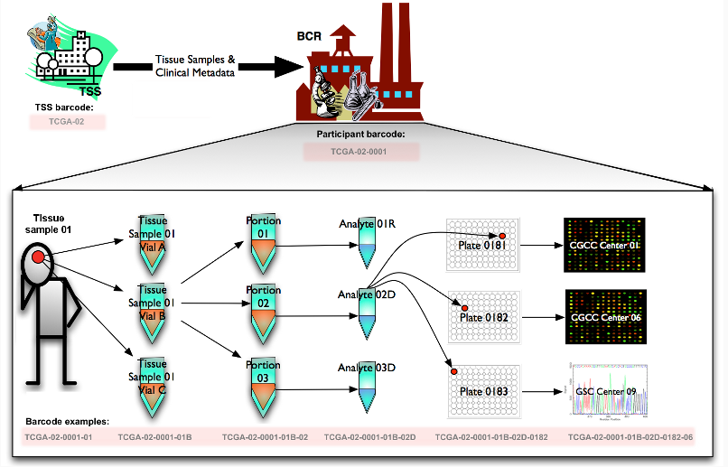

```{r setup, include=FALSE}
knitr::opts_chunk$set(echo = TRUE)
```

# TCGA Barcode  
## Description  
The TCGA barcode is the primary identifier of biospecimen data within the TCGA project.  


## Overview   
Historically, the BCR received participant samples and their associated metadata from TSSs. The BCR then assigned human-readable IDs, referred to as TCGA barcodes, representing the metadata of the participants and their samples. TCGA barcodes were used to tie together data that spans TCGA network, since the IDs uniquely identify a set of results for a particular sample produced by a particular data-generating center (i.e. GCC, GCS or GDAC). The constitutive parts of this barcode provided metadata values for a sample.  

Currently the BCR is assigning both a TCGA barcode and a UUID to samples. The UUID is the primary identifer. For more information on the ID transition, see UUIDs.  


### Creating Barcodes  
All TCGA barcodes are created by the BCR. The following figure illustrates how a sample is processed and assigned a TCGA barcode at each step. Starting from the Tissue Source Site (TSS) and the participant (who donated a tissue sample to the TSS), the barcodes TCGA-02 and TCGA-02-001 are assigned respectively. The sample itself is also assigned a barcode: TCGA-02-0001-01. The sample is split into vials (e.g. TCGA-02-0001-01B) which are divided into portions (e.g. TCGA-02-0002-01B-02). Analytes (e.g. TCGA-02-0001-01B-02D) are extracted from each portion and distributed across one or more plates (e.g. TCGA-02-0001-01B-02D-0182), where each well is identified as an aliquot (e.g. TCGA-02-0001-01B-02D-0182-06). These plates are sent to GCCs or GSCs for characterization and sequencing.   
```{r}

```


### Reading Barcodes  
A TCGA barcode is composed of a collection of identifiers. Each specifically identifies a TCGA data element. Refer to the following figure for an illustration of how metadata identifiers comprise a barcode. An aliquot barcode, an example of which shows in the illustration, contains the highest number of identifiers.  
```{r, fig.align='center'}
knitr::include_graphics("figures/reading-barcode.png")
```

**Label**      | **Identifier for**                     | **Value**    | **Value Description**      | **Posiible Values**   
---------------|----------------------------------------|--------------|-------------------------   |---------------------
Analyte|Molecular type of analyte for analysis|D|The analyte is a DNA sample| See Code Tables Report  
Plate|Order of plate in a sequence of 96-well|182|The 182nd plate|4-digit alphanumeric value
Portion|Order of portion in a sequence of 100-120 mg sample portions|1|The first portion of the sample|01-99  
Vial|Order of sample in a sequence of samples|C|The third vial|A to Z
Project|Project name|TCGA|TCGA project|TCGA
Sample|Sample type|1|A solid tumor|Tumor types range from 01-99, normal types from 10-19 and control samples from 20-29.  
Center|Sequencing or characterization center that will receive the aliquot for analysis|1|The Broad Institution|See Code Tables Report  
Participant|Study participant|1|The first particitant from MD Anderson|Any alpha-numeric value  
TSS|Tissue source site|2|GBM (brain tumor) Anderson|See Code Tables Report  


### Barocde Types  
Barcodes can also be visualized hierarchically, with TSS barcodes at the top of the tree and aliquot barcodes at the bottom. A parent barcode prefixes any of its descendent barcodes, reflecting the derivation of one biospecimen type from another. For example, sample are collected from a participant and so the corresponding sample barcodes contain the participant barcode from which they were derived.  
```{r, fig.align='center'}
knitr::include_graphics("figures/barcode-tree.PNG")
```

Using the aliquot barcode example from the figure in Reading Barcodes, the following table displays a possible set of related barcodes at each level of the hierarchy.  

**Level**| **Barcode**| **Comment**  
---------|------------|----------------
Analyte|TCGA-02-0001-01C-01D|Analytes of W and X both refer to analytes derived from whole genome amplification  
Drug|TCGA-02-0001-E3124|Drug ID is "C", "D", "H", "I" or "T" followed by a number  
Examination|TCGA-02-0001-E3124|Examination ID is 'E' followed by a number  
Participant|TCGA-02-0001|--
Portion|TCGA-02-0001-01C-01|--
Radiation|TCGA-02-0001-R2|Radiation ID is 'R' followed by a number  
Sample|TCGA-02-0001-01|--
Shipped Portion|TCGA-CM-5341-01A-21-1933-20|Used in the platform of MDA_RPPA_CORE only 
Slide|TCGA-02-0001-S145|Tissue slide IDcan be 'TS' ('Top Slide'), 'BS' ('Bottom Slide') or 'MS' ('Middle slide'), followed by a number or letter to indicate slide order  
Surgery|TCGA-02-0001-S145|Surgery ID is 'S' followed by a number  
TSS|TCGA-02|--


