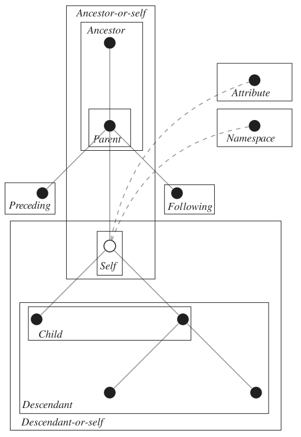
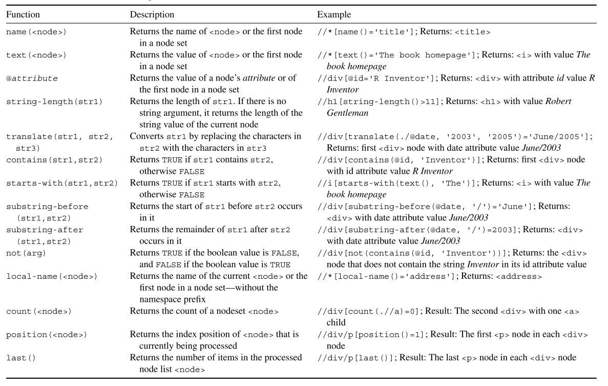

```{r setup, include=FALSE}
knitr::opts_chunk$set(echo = TRUE)
```


## XPath
XPath is a query language that is useful for addressing and extracting parts from HTML/XML documents. XPath is best categorized as a domain-specific language, which indicates that its field of application is a rather narrow one—it is simply a very helpful tool for selecting information from marked up documents such as HTML, XML, or any variant of it such as SVG or RSS  

XPath only works on the DOM representation of a document and cannot be applied on the native code.  

```{r}
library(XML)

parsed_doc <- htmlParse("../../../Book-sources/Wiley-ADCR/ch-4-xpath/fortunes/fortunes.html")
```

**absolute paths**  
```{r}
xpathSApply(doc = parsed_doc, 
            path = "/html/body/div/p/i")
```

**relative paths**  
```{r}
xpathSApply(doc = parsed_doc, 
            path = "//body//p/i")
```

```{r}
xpathSApply(doc = parsed_doc, 
            path = "//p/i")
```

Relative path statements result in complete traversals of the document tree, which is rather expensive computationally and decreases the efficiency of the query.  

```{r}
xpathSApply(doc = parsed_doc, 
            path = "/html/body/div/*/i")
```

```{r}
xpathSApply(parsed_doc, 
            path = "//title/..") # The parent node of title
```

```{r}
xpathSApply(doc = parsed_doc, 
            path = "//address|//title")
```

```{r}
twoQueries <- c(address = "//address", title = "//title")
xpathSApply(doc = parsed_doc, 
            path = twoQueries)
```

### Node relations
```{r}
xpathSApply(doc = parsed_doc, 
            path = "//a/ancestor::div//i", 
            fun = xmlValue)
```

```{r}
xpathSApply(doc = parsed_doc, 
            path = "//p/preceding-sibling::h1")
```

```{r}
xpathSApply(doc = parsed_doc, 
            path = "//title/parent::*")
```

```{r}
xpathSApply(doc = parsed_doc, 
            path = "//address/preceding-sibling::div/h1") 
```

### XPath predicates
Beside exploiting relationship properties of the tree, we can use predicates to obtain and process numerical and textual properties of the document. Applying these features in a conditioning statement for the node selection adds another level of expressiveness to XPath statements. Put simply, predicates are nothing but simple functions that are applied to a node’s name, value, or attribute, and which evaluate whether a condition (or set of conditions) is true or false. Internally, a predicate returns a logical response. Nodes where the response is true are selected.  

```{r}

```

Important XPath functions  
```{r}

```

```{r}
xpathSApply(doc = parsed_doc, 
            path = "//div/p[position() = 1]")
```

```{r}
xpathSApply(doc = parsed_doc, 
            path = "//div/p[last() - 1]")
```

filtering based on the number of descendant <a> nodes  
```{r}
xpathSApply(doc = parsed_doc, 
            path = "//div[count(.//a) > 0]")
```

filtering based on the number of attributes  
```{r}
xpathSApply(doc = parsed_doc, 
            path = "//div[count(./@*) > 2]")
```

based on the number of content of an element.  
```{r}
xpathSApply(doc = parsed_doc, 
            path = "//*[string-length(text()) > 50]")
```

```{r}
xpathSApply(doc = parsed_doc, 
            path = "//div[not(count(text()) > 50)]")

xpathSApply(doc = parsed_doc, 
            path = "//div[not(count(./@*) > 2)]")
```

```{r}
xpathSApply(doc = parsed_doc, 
            path = "//div[@date = 'October/2011']")
```

```{r}
xpathSApply(doc = parsed_doc, 
            path = "//*[contains(text(), 'magic')]")

xpathSApply(doc = parsed_doc, 
            path = "//*[contains(name(), 'div')]")
```

**Please note that all partial matching functions are case sensitive, so capitalized versions of the term would not be matched.**  

```{r}
xpathSApply(doc = parsed_doc, 
            path = "//div[starts-with(./@id, 'R')]")
```

```{r}
xpathSApply(doc = parsed_doc, 
            path = "//div[substring-after(./@date, '/') = '2011']//i")
```

## Extracting node elements  
```{r}
xpathSApply(doc = parsed_doc, 
            path = "//div", 
            fun = xmlGetAttr, 
            name = "lang")
```

**XML extractor functions**  
|**Function**|**Argument**|**Return value**|
|:--|:--|:--|
|xmlName||Node name|
|xmlValue||Node value|
|xmlGetAttr|name|Node attribute|
|xmlAttrs||all node attributes|
|xmlChildren||Node children|
|xmlSize||Node size|  


### Extending the `fun` argument  
Processing returned node sets from XPath can easily extend beyond mere feature extraction as introduced in the last section. Rather than extracting information from the node, we can adapt the fun argument to perform any available numerical or textual operation on the node element. We can build novel functions for particular purposes or modify existing extractor functions for our specific needs and pass them to xpathSApply(). The goal of further processing can either lie in cleansing the numeric or textual content of the node, or some kind of exception handling in order to deal with extraction failures.  

```{r}
lowerCaseFun <- function(x){
    x <- tolower(xmlValue(x))
    return(x)
}

xpathSApply(doc = parsed_doc, 
            path = "//div//i", 
            fun = lowerCaseFun)
```

```{r}
dateFun <- function(x){
    require(stringr)
    date = xmlGetAttr(node = x, name = "date")
    year = str_extract(date, "[0-9]{4}")
    return(year)
}

xpathSApply(doc = parsed_doc, 
            path = "//div", 
            fun = dateFun)
```

In XML’s DOM the `NULL` object is used to indicate a node that does not exist.  

```{r}
idFun <- function(x){
    id <- xmlGetAttr(x, "id")
    id <- ifelse(is.null(id), "NA", id)
    return(id)
}

xpathSApply(doc = parsed_doc, 
            path = "//div", 
            fun = idFun)
```

#### Using variables in XPath expressions
```{r}
parsed_stocks <- xmlParse("../../../Book-sources/Wiley-ADCR/ch-4-xpath/technology/technology.xml")

companies <- c("Apple", "IBM", "Google")
expQuery <- sprintf("//%s/close", companies)

getClose <- function(node){
    value <- xmlValue(node)
    company <- xmlName(xmlParent(node))
    mat <- c(company = company, value = value) # one pair per cycle
    return(mat)
}
# apply does column combination of the results
# this can explain why mat has a dimension of (2, 660)

stocks <- xpathSApply(parsed_stocks, expQuery, getClose) %>% 
    t() %>% 
    as.data.frame()

stocks
```


### XML namespaces
```{r}
parsed_xml <- xmlParse("../../../Book-sources/Wiley-ADCR/ch-4-xpath/title.xml")
```

```{r}
xpathSApply(doc = parsed_xml, 
            path = "//title", 
            fun = xmlValue)
```

The key problem is that neither of the two <title> nodes in the document has been defined under the default namespace on which standard XPath operatoes.  

**One way to bypass the unique namespaces is to make a query directly to the local name of interest**:  

```{r}
xpathSApply(doc = parsed_xml, 
            path = "//*[local-name() = 'title']", 
            fun = xmlValue)
```

To conduct namespace-aware XPath queries on the document, we can extend the function and use the namespaces argument in the xpathSApply() function to refer to the particular namespace under which the second <title> node has been defined.  

```{r}
xpathSApply(doc = parsed_xml, 
            path = "//x:title", 
            namespaces = c(x = "http://funnybooknames.com/crockford"), 
            fun = xmlValue)
```

```{r}
ns <- xmlNamespaceDefinitions(parsed_xml) %>% 
    extract2(2) %>% 
    extract2("uri")

xpathSApply(doc = parsed_xml, 
            path = "//x:title", 
            namespaces = c(x = ns), 
            fun = xmlValue)
```

