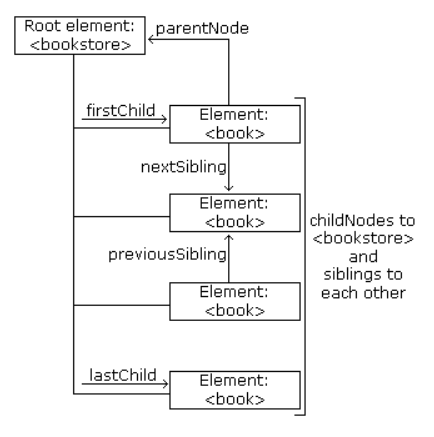

```{r setup, include=FALSE}
knitr::opts_chunk$set(echo = TRUE)
```


# XML DOM
## DOM Introduction  
### What is the DOM?
The DOM defines a standard for accessing and manipulating documents:  

> "The W3C Document Object Model (DOM) is a platform and language-neutral interface that allows programs and scripts to dynamically access and update the content, structure, and style of a document."  

The HTML DOM defines a standard way for accessing and manipulating HTML documents. It presents an HTML document as a tree-structure.  

The XML DOM defines a standard way for accessing and manipulating XML documents. It presents an XML document as a tree-structure.  

> Understanding the DOM is a must for anyone working with HTML or XML.  

### The HTML DOM
All HTML elements can be accessed through the HTML DOM.

This example changes the value of an HTML element with id="demo":  
```
<h1 id="demo">This is a Heading</h1>

<script>
document.getElementById("demo").innerHTML = "Hello World!";
</script>
```

This example changes the value of the first <h1> element in an HTML document:  
```
<h1>This is a Heading</h1>

<h1>This is a Heading</h1>

<script>
document.getElementsByTagName("h1")[0].innerHTML = "Hello World!";
</script>
```

**Note**: Even if the HTML document contains only ONE <h1> element you still have to specify the array index [0], because the getElementsByTagName() method always returns an array.  


### The XML DOM
All XML elements can be accessed through the XML DOM.  

The XML DOM is:  
- A standard object model for XML  
- A standard programming interface for XML  
- Platform-and language-independent  
- A W3C standard  

In other words: **The XML DOM is a standard for how to get, change, add, or delete XML elements**.  

### Get the Value of an XML Element  
This code retrieves the text value of the first <title> element in an XML document:  

```
txt = xmlDoc.getElementsByTagName("title")[0].childNodes[0].nodeValue;
```

### Loading an XML File  
The example file 'books.xml'  
```
<bookstore>
   <book category="cooking">
       <title lang="en">Everyday Italian</title>
       <author>Giada De Laurentiis</author>
       <year>2005</year>
       <price>30.00</price> </book>
   <book category="children">
       <title lang="en">Harry Potter</title>
       <author>J K. Rowling</author>
       <year>2005</year>
       <price>29.99</price> </book>
   <book category="web">
       <title lang="en">XQuery Kick Start</title>
       <author>James McGovern</author>
       <author>Per Bothner</author>
       <author>Kurt Cagle</author>
       <author>James Linn</author>
       <author>Vaidyanathan Nagarajan</author>
       <year>2003</year>
       <price>49.99</price> </book>
   <book category="web" cover="paperback">
       <title lang="en">Learning XML</title>
       <author>Erik T. Ray</author>
       <year>2003</year>
       <price>39.95</price> </book>
</bookstore>
```

This example reads "books.xml" into xmlDoc and retrives the text value of the first <title> element in books.xml:  

```
<!DOCTYPE html>
<html>
<body>

<p id="demo"></p>

<script>
var xhttp = new XMLHttpRequest();
xhttp.onreadystatechange = function() {
    if (this.readyState == 4 && this.status == 200) {
    myFunction(this);
    }
};
xhttp.open("GET", "books.xml", true);
xhttp.send();

function myFunction(xml) {
    var xmlDoc = xml.responseXML;
    document.getElementById("demo").innerHTML =
    xmlDoc.getElementsByTagName("title")[0].childNodes[0].nodeValue;
}
</script>

</body>
</html>
```

### Example Explained  
- **xmlDoc** - the XML DOM object created by the parser.  
- **getElementsByTagName("title")[0]** - get the first <title> element  
- **childNodes[0]** - the first child of the <title> element  
- **nodeValue** - the value of the node (the text itself)  


### Loading an XML String  
This example loads a text string into an XML DOM object, and extracts the info from it with JavaScript:

```
<html>
<body>

<p id="demo"></p>

<script>
var text, parser, xmlDoc;

text = "<bookstore><book>" +
"<title>Everyday Italian</title>" +
"<author>Giada De Laurentiis</author>" +
"<year>2005</year>" +
"</book></bookstore>";

parser = new DOMParser();
xmlDoc = parser.parseFromString(text,"text/xml");

document.getElementById("demo").innerHTML =
xmlDoc.getElementsByTagName("title")[0].childNodes[0].nodeValue;
</script>

</body>
</html>
```

### Programming Interface
The DOM models XML as a set of node objects. The nodes can be accessed with JavaScript or other programming languages. In this tutorial we use JavaScript.

The programming interface to the DOM is defined by a set standard properties and methods.  

**Properties** are often referred to as something that is (i.e. nodename is "book").  

**Methods** are often referred to as something that is done (i.e. delete "book").  

### XML DOM Properties  
These are some typical DOM properties:  
- x.nodeName - the name of x  
- x.nodeValue - the value of x  
- x.parentNode - the parent node of x  
- x.childNodes - the child nodes of x  
- x.attributes - the attributes nodes of x  

Note: In the list above, x is an node object.  

### XML DOM Methods  
- x.getElementsByTagName(name) - get all elements with a specified tag name  
- x.appendChild(node) - insert a child node to x  
- x.removeChild(node) - remove a child node from x  

Note: In the list above, x is a node object.  


## DOM Nodes
According to the XML DOM, everything in an XML document is a node:  
- The entire document is a document node  
- Every XML element is an element node  
- The text in the XML elements are text nodes  
- Every attribute is an attribute node  
- Comments are comment nodes  

### DOM Example
The books.xml file  

```
<?xml version="1.0" encoding="UTF-8"?>
<bookstore>
  <book category="cooking">
    <title lang="en">Everyday Italian</title>
    <author>Giada De Laurentiis</author>
    <year>2005</year>
    <price>30.00</price>
  </book>
  <book category="children">
    <title lang="en">Harry Potter</title>
    <author>J K. Rowling</author>
    <year>2005</year>
    <price>29.99</price>
  </book>
  <book category="web">
    <title lang="en">XQuery Kick Start</title>
    <author>James McGovern</author>
    <author>Per Bothner</author>
    <author>Kurt Cagle</author>
    <author>James Linn</author>
    <author>Vaidyanathan Nagarajan</author>
    <year>2003</year>
    <price>49.99</price>
  </book>
  <book category="web" cover="paperback">
    <title lang="en">Learning XML</title>
    <author>Erik T. Ray</author>
    <year>2003</year>
    <price>39.95</price>
  </book>
</bookstore>
```


The root node in the XML above is named <bookstore>.

All other nodes in the document are contained within <bookstore>.

The root node <bookstore> holds 4 <book> nodes.

The first <book> node holds the child nodes: <title>, <author>, <year>, and <price>.

The child nodes contain one text node each, "Everyday Italian", "Giada De Laurentiis", "2005", and "30.00".  

### Text is Always Stored in Text Nodes
A common error in DOM processing is to expect an element node to contain text.

However, the text of an element node is stored in a text node.  

In this example: **<year>2005</year>**, the element node <year> holds a text node with the value "2005".  

"2005" is **not** the value of the <year> element!


### The XML DOM Node Tree
The XML DOM views an XML document as a tree-structure. The tree structure is called a **node-tree**.

All nodes can be accessed through the tree. Their contents can be modified or deleted, and new elements can be created.

The node tree shows the set of nodes, and the connections between them. **The tree starts at the root node and branches out to the text nodes at the lowest level of the tree**:  

```{r}
knitr::include_graphics("figures/DOM-node-tree.png")
```

### Node Parents, Children, and Siblings  
The nodes in the node tree have a hierarchical relationship to each other.

The terms parent, child, and sibling are used to describe the relationships. Parent nodes have children. Children on the same level are called siblings (brothers or sisters).  

- In a node tree, the top node is called the root  
- Every node, except the root, has exactly one parent node  
- A node can have any number of children  
- A leaf is a node with no children  
- Siblings are nodes with the same parent  

The following image illustrates a part of the node tree and the relationship between the nodes:  

```{r}
knitr::include_graphics("figures/DOM-node-relationship.png")
```

Because the XML data is structured in a tree form, it can be traversed without knowing the exact structure of the tree and without knowing the type of data contained within.  

### First Child - Last Child  
```
<bookstore>
  <book category="cooking">
    <title lang="en">Everyday Italian</title>
    <author>Giada De Laurentiis</author>
    <year>2005</year>
    <price>30.00</price>
  </book>
</bookstore>
```

In the XML above, the <title> element is the first child of the <book> element, and the <price> element is the last child of the <book> element.

Furthermore, the <book> element is the parent node of the <title>, <author>, <year>, and <price> elements.  

## XML DOM Accessing Nodes  
With the DOM, you can access every node in an XML document.  

### Accessing Nodes
You can access a node in three ways:  
1. By using the `getElementsByTagName()` method.  
2. By looping through (traversing) the nodes tree.  
3. By navigating the node tree, using the node relationships.  

### The `getElementsByTagName()` Method  
`getElementsByTagName()` returns all elements with a specified tag name.  

#### Syntax  
```
node.getElementsByTagName("tagname");
```

#### Example
The following example returns all <title> elements under the x element:  

```{r}
x.getElementsByTagName("title");
```

Note that the example above only returns <title> elements under the x node. To return all <title> elements in the XML document use:  

```
xmlDoc.getElementsByTagName("title");
```

where xmlDoc is the document itself (document node).  

### DOM Node List
The `getElementsByTagName()` method returns a node list. A node list is an array of nodes.  

```
x = xmlDoc.getElementsByTagName("title");
```

The <title> elements in x can be accessed by index number. To access the third <title> you can write:  

```
y = x[2]
```

**Note**: The index starts at 0.  

### DOM Node List length  
The length property defines the length of a node list (the number of nodes).

You can loop through a node list by using the length property:  

**Example**  
```
var x = xmlDoc.getElementsByTagName("title");

for (i = 0; i <x.length; i++) {
  // do something for each node
  }
```

### Node Types
The **documentElement** property of the XML document is the root node.

The **nodeName** property of a node is the name of the node.

The **nodeType** property of a node is the type of the node.

### Traversing Nodes
The following code loops through the child nodes, that are also element nodes, of the root node:  

```
txt = "";
x = xmlDoc.documentElement.childNodes;

for (i = 0; i <x.length; i++) {
  // Process only element nodes (type 1)
  if (x[i].nodeType == 1) {
    txt += x[i].nodeName + "<br>";
  }
}
```

Example explained:  
1. Suppose you have loaded "books.xml" into xmlDoc  
2. Get the child nodes of the root element (xmlDoc)  
3. For each child node, check the node type. If the node type is '1' it is an element node.  
4. Output the name of the node if it is an element node.  

### Navigating Node Relationships  
The following code navigates the node tree using the node relationships:  

**Example**  
```
x = xmlDoc.getElementsByTagName("book")[0];
xlen = x.childNodes.length;
y = x.firstChild;

txt = "";
for (i = 0; i <xlen; i++) {
  // Process only element nodes (type 1)
  if (y.nodeType == 1) {
    txt += y.nodeName + "<br>";
  }
  y = y.nextSibling;
}
```

Example explained:  
1. Suppose you have loaded "books.xml" into xmlDoc  
2. Get the child nodes of the first book element  
3. Set the "y" variable to be the first child node of the first book element  
4. For each child node (starting with the first child node "y")  
5. Check the node type. If the node type is "1" it is an element node  
6. Output the name of the node if it is an element node  
7. Set the "y" variable to be the next sibling node, and run through the loop again  

### DOM Node information
The `nodeName`, `nodeValue`, and `nodeType` properties contain information about nodes.  

### Node Properties  
In the XML DOM, each node is an **object**.  
Objects have methods and properties, that can be accessed and manipulated by JavaScript.  

Three important node properties are:  
- nodeName  
- nodeValue  
- nodeType  

### The nodeName Property
The nodeName property specifies the name of a node.  
- nodeName is read-only  
- nodeName of an element node is the same as the tag name  
- nodeName of an attribute node is the attribute name  
- nodeName of a text node is always #text  
- nodeName of the document node is always #document  

### The nodeValue Property
The nodeValue property specifies the value of a node.  
- nodeValue for element nodes is undefined
- nodeValue for text nodes is the text itself
- nodeValue for attribute nodes is the attribute value

### Get the Value of an Element  
The following code retrieves the text node value of the first <title> element:

**Example**  
```
var x = xmlDoc.getElementsByTagName("title")[0].childNodes[0];
var txt = x.nodeValue;
```

Result: txt = 'Everyday Italian'

Example explained:  
1. Suppose you have loaded "books.xml" into xmlDoc  
2. Get text node of the first <title> element node  
3. Set the txt variable to be the value of the text node  

### Change the Value of an Element  
The following code changes the text node value of the first <title> element:  

**Example**  
```
var x = xmlDoc.getElementsByTagName("title")[0].childNodes[0];
x.nodeValue = "Easy Cooking";
```

Example explained:  
1. Suppose you have loaded "books.xml" into xmlDoc  
2. Get text node of the first <title> element node  
3. Change the value of the text node to "Easy Cooking"  

### The nodeType Property  
The nodeType property specifies the type of node.

**nodeType is read only**.

The most important node types are:  

|**Node type**|**NodeType**|  
|:-|:-|  
|Element|1|
|Attribute|2|
|Text|3|
|Comment|8|
|Document|9|


## DOM Node List  
A list of nodes is returned by the `getElementsByTagName()` method and the childNodes property.  

### DOM Node List
When using properties or methods like `childNodes` or `getElementsByTagName()`, a node list object is returned.  

A node list object represents a list of nodes, in the same order as in the XML.

Nodes in the node list are accessed with index numbers starting from 0.

The following image represents a node list of the <title> elements in "books.xml":  

```{r}
knitr::include_graphics("figures/DOM-node-list.png")
```

Suppose "books.xml" is loaded into the variable xmlDoc.

This code fragment returns a node list of title elements in "books.xml":  

```
x = xmlDoc.getElementsByTagName("title");
```

After the execution of the statement above, x is a node list object.

The following code fragment returns the text from the first <title> element in the node list (x):  

**Example**  
```
var txt = x[0].childNodes[0].nodeValue;
```
After the execution of the statement above, txt = "Everyday Italian".  

### Node List Length  
A node list object keeps itself up-to-date. If an element is deleted or added, the list is automatically updated.

The length property of a node list is the number of nodes in the list.

This code fragment returns the number of <title> elements in "books.xml":  

```
x = xmlDoc.getElementsByTagName('title').length;
```

After the execution of the statement above, the value of x will be 4.

The length of the node list can be used to loop through all the elements in the list.

This code fragment uses the length property to loop through the list of <title> elements:  

**Example**  
```
x = xmlDoc.getElementsByTagName('title');
xLen = x.length;

for (i = 0; i <xLen; i++) {
    txt += x[i].childNodes[0].nodeValue) + " ";
}
```

**Output**  
```
Everyday Italian
Harry Potter
XQuery Kick Start
Learning XML
```

Example explained:

1. Suppose "books.xml" is loaded into xmlDoc  
2. Set the x variable to hold a node list of all title elements  
3. Collect the text node values from <title> elements  

### DOM Attribute List (Named Node Map)  
The attributes property of an element node returns a list of attribute nodes.

This is called a named node map, and is similar to a node list, except for some differences in methods and properties.

**An attribute list keeps itself up-to-date. If an attribute is deleted or added, the list is automatically updated**.

This code fragment returns a list of attribute nodes from the first <book> element in "books.xml":  

```
x = xmlDoc.getElementsByTagName('book')[0].attributes;
```

After the execution of the code above, `x.length` is the number of attributes and `x.getNamedItem()` can be used to return an attribute node.

This code fragment gets the value of the "category" attribute, and the number of attributes, of a book:  

**Example**
```
x = xmlDoc.getElementsByTagName("book")[0].attributes;

txt = x.getNamedItem("category").nodeValue + " " + x.length;
```

**Output**
```
cooking 1
```

Example explained:

1. Suppose "books.xml" is loaded into xmlDoc  
2. Set the x variable to hold a list of all attributes of the first <book> element  
3. Get the value of the "category" attribute and the length of the attribute list  


## DOM Traverse Node Tree
Traversing means looping through or traveling across the node tree.  

### Traversing the Node Tree
Often you want to loop an XML document, for example: when you want to extract the value of each element.

This is called "Traversing the node tree"  

The example below loops through all child nodes of <book>, and displays their names and values:  

```
<!DOCTYPE html>
<html>
<body>

<p id="demo"></p>

<script>
var x, i ,xmlDoc;
var txt = "";
var text = "<book>" +
"<title>Everyday Italian</title>" +
"<author>Giada De Laurentiis</author>" +
"<year>2005</year>" +
"</book>";

parser = new DOMParser();
xmlDoc = parser.parseFromString(text,"text/xml");

// documentElement always represents the root node
x = xmlDoc.documentElement.childNodes;
for (i = 0; i < x.length ;i++) {
    txt += x[i].nodeName + ": " + x[i].childNodes[0].nodeValue + "<br>";
}
document.getElementById("demo").innerHTML = txt;
</script>

</body>
</html>
```

**Output**
```
title: Everyday Italian
author: Giada De Laurentiis
year: 2005
```

**Example explained**   
1. Load the XML string into xmlDoc  
2. Get the child nodes of the root element  
3. For each child node, output the node name and the node value of the text node  

### Browser Differences in DOM Parsing
All modern browsers support the W3C DOM specification.  
However, there are some differences between browsers. One important difference is:

- The way they handle white-spaces and new lines  

### DOM - White Spaces and New Lines
XML often contains new line, or white space characters, between nodes. This is often the case when the document is edited by a simple editor like Notepad.  

The following example (edited by Notepad) contains CR/LF (new line) between each line and two spaces in front of each child node:  

```
<book>
  <title>Everyday Italian</title>
  <author>Giada De Laurentiis</author>
  <year>2005</year>
  <price>30.00</price>
</book>
```

Internet Explorer 9 and earlier do NOT treat empty white-spaces, or new lines as text nodes, while other browsers do.

The following example will output the number of child nodes the root element (of books.xml) has. IE9 and earlier will output 4 child nodes, while IE10 and later versions, and other browsers will output 9 child nodes:  

```
function myFunction(xml) {
var xmlDoc = xml.responseXML;
    x = xmlDoc.documentElement.childNodes;
    document.getElementById("demo").innerHTML =
    "Number of child nodes: " + x.length;
}
```

### PCDATA - Parsed Character Data
XML parsers normally parse all the text in an XML document.

When an XML element is parsed, the text between the XML tags is also parsed:  

```
<message>This text is also parsed</message>
```

The parser does this because XML elements can contain other elements, as in this example, where the <name> element contains two other elements (first and last):  

```
<name><first>Bill</first><last>Gates</last></name>
```

and the parser will break it up into sub-elements like this:  

```
<name>
  <first>Bill</first>
  <last>Gates</last>
</name>
```

Parsed Character Data (PCDATA) is a term used about text data that will be parsed by the XML parser.  

### CDATA - (Unparsed) Character Data
The term CDATA is used about text data that should not be parsed by the XML parser.  

Characters like "<" and "&" are illegal in XML elements.  

"<" will generate an error because the parser interprets it as the start of a new element.  

"&" will generate an error because the parser interprets it as the start of an character entity.  

Some text, like JavaScript code, contains a lot of "<" or "&" characters. To avoid errors script code can be defined as CDATA.  

A CDATA section starts with "**<![CDATA[**" and ends with "**]]>**":  

```
<script>
<![CDATA[
function matchwo(a,b) {
    if (a < b && a < 0) {
        return 1;
    } else {
        return 0;
    }
}
]]>
</script>
```

In the example above, everything inside the CDATA section is ignored by the parser.  

**Notes on CDATA sections:**  
A CDATA section cannot contain the string "]]>". Nested CDATA sections are not allowed.  

The "]]>" that marks the end of the CDATA section cannot contain spaces or line breaks.  


## XML DOm - Navigating Nodes
Nodes can be navigated using node relationships.  

### Navigating DOM Nodes
Accessing nodes in the node tree via the relationship between nodes, is often called "navigating nodes".  

In the XML DOM, node relationships are defined as properties to the nodes:  

- parentNode  
- childNodes  
- firstChild  
- lastChild  
- nextSibling  
- previousSibling  

The following image illustrates a part of the node tree and the relationship between nodes in books.xml:  

```{r}

```

### DOM - Parent Node
All nodes have exactly one parent node. The following code navigates to the parent node of <book>:  

```
function myFunction(xml) {
var xmlDoc = xml.responseXML;
    var x = xmlDoc.getElementsByTagName("book")[0];
    document.getElementById("demo").innerHTML = x.parentNode.nodeName;
}
```

Example explained:  

1. Load "books.xml" into xmlDoc  
2. Get the first <book> element  
3. Output the node name of the parent node of "x"  

### Avoid Empty Text Nodes
Firefox, and some other browsers, will treat empty white-spaces or new lines as text nodes, Internet Explorer will not.  

This causes a problem when using the properties: firstChild, lastChild, nextSibling, previousSibling.  

To avoid navigating to empty text nodes (spaces and new-line characters between element nodes), we use a function that checks the node type:  

```
function get_nextSibling(n) {
    var y = n.nextSibling;
    while (y.nodeType! = 1) {
        y = y.nextSibling;
    }
    return y;
}
```

The function above allows you to use get_nextSibling(node) instead of the property node.nextSibling.  

Code explained:  

Element nodes are type 1. If the sibling node is not an element node, it moves to the next nodes until an element node is found. This way, the result will be the same in both Internet Explorer and Firefox.  

### Get the First Child Element  
The following code displays the first element node of the first <book>:  

```
<!DOCTYPE html>
<html>
<body>

<p id="demo"></p>

<script>
var xhttp = new XMLHttpRequest();
xhttp.onreadystatechange = function() {
    if (this.readyState == 4 && this.status == 200) {
        myFunction(this);
    }
};
xhttp.open("GET", "books.xml", true);
xhttp.send();

function myFunction(xml) {
    var xmlDoc = xml.responseXML;
    var x = get_firstChild(xmlDoc.getElementsByTagName("book")[0]);
    document.getElementById("demo").innerHTML = x.nodeName;
}

//check if the first node is an element node
function get_firstChild(n) {
    var y = n.firstChild;
    while (y.nodeType != 1) {
        y = y.nextSibling;
    }
    return y;
}
</script>

</body>
</html>
```

Output:  
```
title
```

Example explained:

1. Load "books.xml" into xmlDoc  
2. Use the get_firstChild function on the first <book> element node to get the first child node that is an element node  
3. Output the node name of first child node that is an element node  


## DOM Get Node Values
The `nodeValue` property is used to get the text value of a node.

The `getAttribute()` method returns the value of an attribute.  

### Get the Value of an Element
In the DOM, everything is a node. Element nodes do not have a text value.

The text value of an element node is stored in a child node. This node is called a text node.  

> To retrieve the text value of an element, you must retrieve the value of the elements' text node.  

### The getElementsByTagName Method
The `getElementsByTagName()` method returns a **node list of all elements**, with the specified tag name, in the same order as they appear in the source document.

Suppose "books.xml" has been loaded into xmlDoc.

This code retrieves the first <title> element:  

```
var x = xmlDoc.getElementsByTagName("title")[0];
```

### The ChildNodes Property
The `childNodes` property returns a list of an element's child nodes.

The following code retrieves the text node of the first <title> element:

```
x = xmlDoc.getElementsByTagName("title")[0];
y = x.childNodes[0];
```

### The nodeValue Property
The `nodeValue` property returns the **text value of a text node**.

The following code retrieves the text value of the text node of the first <title> element:  

```
x = xmlDoc.getElementsByTagName("title")[0];
y = x.childNodes[0];
z = y.nodeValue;
```

Result in z: "Everyday Italian"  

### Complete Example
```
<!DOCTYPE html>
<html>
<body>

<p id="demo"></p>

<script>
var xhttp = new XMLHttpRequest();
xhttp.onreadystatechange = function() {
    if (this.readyState == 4 && this.status == 200) {
        myFunction(this);
    }
};
xhttp.open("GET", "books.xml", true);
xhttp.send();

function myFunction(xml) {
    var xmlDoc = xml.responseXML;
    var x = xmlDoc.getElementsByTagName('title')[0];
    var y = x.childNodes[0];
    document.getElementById("demo").innerHTML = y.nodeValue;
}
</script>

</body>
```

### Get the Value of an Attribute
In the DOM, attributes are nodes. Unlike element nodes, attribute nodes have text values.

The way to get the value of an attribute, is to get its text value.

This can be done using the getAttribute() method or using the nodeValue property of the attribute node.  

### Get an Attribute Value - getAttribute()
The getAttribute() method returns an attribute's value.  

```
x = xmlDoc.getElementsByTagName("title")[0];
txt = x.getAttribute("lang");
```

Result in txt: "en"  

### Get an Attribute Value - getAttributeNode()  
The getAttributeNode() method returns an attribute node.

The following code retrieves the text value of the "lang" attribute of the first <title> element:

```
x = xmlDoc.getElementsByTagName("title")[0];
y = x.getAttributeNode("lang");
txt = y.nodeValue;
```


## DOM Change Node Values
The `nodeValue` property is used to change a node value.

The `setAttribute()` method is used to change an attribute value.

### Change the Value of an Element
In the DOM, everything is a node. Element nodes do not have a text value.

The text value of an element node is stored in a child node. This node is called a text node.  

> To change the text value of an element, you must change the value of the elements's text node.  

### Change the Value of a Text Node
The **nodeValue** property can be used to change **the value of a text node**.

Suppose "books.xml" has been loaded into xmlDoc.

This code changes the text node value of the first <title> element:  

```
xmlDoc.getElementsByTagName("title")[0].childNodes[0].nodeValue = "new content"
```

Example explained:

1. Suppose "books.xml" is loaded into xmlDoc  
2. Get the first child node of the <title> element  
3. Change the node value to "new content"  

### Change the Value of an Attribute
In the DOM, attributes are nodes. Unlike element nodes, attribute nodes have text values.

The way to change the value of an attribute, is to change its text value.

This can be done using the setAttribute() method or setting the nodeValue property of the attribute node.  

### Change an Attribute Using setAttribute()
The setAttribute() method changes the value of an attribute.

If the attribute does not exist, a new attribute is created.

This code changes the category attribute of the <book> element:  

```
xmlDoc.getElementsByTagName("book")[0].setAttribute("category","food");
```

Example explained:

1. Suppose "books.xml" is loaded into xmlDoc  
2. Get the first <book> element  
3. Change the "category" attribute value to "food"  

### Change an Attribute Using nodeValue
The nodeValue property is the value of a attribute node.

Changing the value property changes the value of the attribute.  

```
xmlDoc.getElementsByTagName("book")[0].getAttributeNode("category").nodeValue = "food";
```

Example explained:

1. Suppose "books.xml" is loaded into xmlDoc  
2. Get the "category" attribute of the first <book> element  
3. Change the attribute node value to "food"  


## DOM Remove Nodes
The removeChild() method removes a specified node.

The removeAttribute() method removes a specified attribute.  

### Remove an Element Node
The `removeChild()` method removes a specified node.

**When a node is removed, all its child nodes are also removed**.

This code will remove the first <book> element from the loaded xml:  

```
y = xmlDoc.getElementsByTagName("book")[0];

xmlDoc.documentElement.removeChild(y);
```

Example explained:

1. Suppose "books.xml" is loaded into xmlDoc  
2. Set the variable y to be the element node to remove  
3. Remove the element node by using the removeChild() method from the parent node  

### Remove Myself - Remove the Current Node  
The `removeChild()` method is the only way to remove a specified node.

When you have navigated to the node you want to remove, it is possible to remove that node using the parentNode property and the `removeChild()` method:  

```
x = xmlDoc.getElementsByTagName("book")[0];

x.parentNode.removeChild(x);
```

Example explained:

1. Suppose "books.xml" is loaded into xmlDoc  
2. Set the variable y to be the element node to remove  
3. Remove the element node by using the parentNode property and the removeChild() method  

### Remove a Text Node
The `removeChild()` method can also be used to remove a text node:  

```
x = xmlDoc.getElementsByTagName("title")[0];
y = x.childNodes[0];
x.removeChild(y);
```

Example explained:

1. Suppose "books.xml" is loaded into xmlDoc  
2. Set the variable x to be the first title element node  
3. Set the variable y to be the text node to remove  
4. Remove the element node by using the `removeChild()` method from the parent node  

It is not very common to use removeChild() just to remove the text from a node. The nodeValue property can be used instead.  

### Clear a Text Node
The nodeValue property can be used to change the value of a text node:  

```
xmlDoc.getElementsByTagName("title")[0].childNodes[0].nodeValue = "";
```

Example explained:

1. Suppose "books.xml" is loaded into xmlDoc  
2. Get the first title element's first child node.  
3. Use the nodeValue property to clear the text from the text node  

### Remove an Attribute Node by Name  
The `removeAttribute()` method removes an attribute node by its name.

Example: removeAttribute('category')

This code removes the "category" attribute in the first <book> element:  

```
x = xmlDoc.getElementsByTagName("book");
x[0].removeAttribute("category");
```

Example explained:

1. Suppose "books.xml" is loaded into xmlDoc  
2. Use getElementsByTagName() to get book nodes  
3. Remove the "category" attribute form the first book element node  

### Remove Attribute Nodes by Object
The removeAttributeNode() method removes an attribute node, using the node object as parameter.  

Example: removeAttributeNode(x)

This code removes all the attributes of all <book> elements:  

```
x = xmlDoc.getElementsByTagName("book");

for (i = 0; i < x.length; i++) {
    while (x[i].attributes.length > 0) {
        attnode = x[i].attributes[0];
        old_att = x[i].removeAttributeNode(attnode);
    }
}
```

Example explained:

1. Suppose "books.xml" is loaded into xmlDoc  
2. Use getElementsByTagName() to get all book nodes  
3. For each book element check if there are any attributes  
4. While there are attributes in a book element, remove the attribute  


## DOM Replace Nodes
The replaceChild() method replaces a specified node.

The nodeValue property replaces text in a text node.  

### Replace an Element Node
The replaceChild() method is used to replace a node.

The following code fragment replaces the first <book> element:  

```
xmlDoc=loadXMLDoc("books.xml");

x=xmlDoc.documentElement;

//create a book element, title element and a text node
newNode=xmlDoc.createElement("book");
newTitle=xmlDoc.createElement("title");
newText=xmlDoc.createTextNode("A Notebook");

//add the text node to the title node,
newTitle.appendChild(newText);
//add the title node to the book node
newNode.appendChild(newTitle);

y=xmlDoc.getElementsByTagName("book")[0]
//replace the first book node with the new node
x.replaceChild(newNode,y);
```

Example explained:

1. Load "books.xml" into xmlDoc  
2. Create a new element node <book>  
3. Create a new element node <title>  
4. Create a new text node with the text "A Notebook"  
5. Append the new text node to the new element node <title>  
6. Append the new element node <title> to the new element node <book>  
7. Replace the first <book> element node with the new <book> element node  

### Replace Data In a Text Node
The replaceData() method is used to replace data in a text node.

The replaceData() method has three parameters:  

- offset - Where to begin replacing characters. Offset value starts at zero  
- length - How many characters to replace  
- string - The string to insert  

```
xmlDoc=loadXMLDoc("books.xml");

x=xmlDoc.getElementsByTagName("title")[0].childNodes[0];

x.replaceData(0,8,"Easy");
```

Example explained:

1. Load "books.xml" into xmlDoc  
2. Get the text node of the first <title> element node  
3. Use the replaceData method to replace the eight first characters from the text node with "Easy"  

### Use the nodeValue Property Instead
It is easier to replace the data in a text node using the nodeValue property.

The following code fragment will replace the text node value in the first <title> element with "Easy Italian":  

```
xmlDoc=loadXMLDoc("books.xml");

x=xmlDoc.getElementsByTagName("title")[0].childNodes[0];

x.nodeValue="Easy Italian";
```

Example explained:

1. Load "books.xml" into xmlDoc  
2. Get the text node of the first <title> element node  
3. Use the nodeValue property to change the text of the text node  


## DOM Create Nodes
### Create a New Eleemnt Node
The `createElement()` method creates a new element node:

```
newElement = xmlDoc.createElement("edition");

xmlDoc.getElementsByTagName("book")[0].appendChild(newElement);
```

Example explained:

1. Suppose "books.xml" is loaded into xmlDoc  
2. Create a new element node <edition>  
3. Append the element node to the first <book> element  

### Create a New Attribute Node
The createAttribute() is used to create a new attribute node:  

```
newAtt = xmlDoc.createAttribute("edition");
newAtt.nodeValue = "first";

xmlDoc.getElementsByTagName("title")[0].setAttributeNode(newAtt);
```

Example explained:

1. Suppose "books.xml" is loaded into xmlDoc  
2. Create a new attribute node "edition"  
3. Set the value of the attribute node to "first"  
4. Add the new attribute node to the first <title> element  

> If the attribute already exists, it is replaced by the new one.  

### Create an Attribute Using setAttribute()
Since the setAttribute() method creates a new attribute if the attribute does not exist, it can be used to create a new attribute.  

```
xmlDoc.getElementsByTagName('book')[0].setAttribute("edition","first");
```

Example explained:

1. Suppose "books.xml" is loaded into xmlDoc
2. Set the attribute "edition" value to "first" for the first <book> element  

### Create a Text Node
The createTextNode() method creates a new text node:  

```
newEle = xmlDoc.createElement("edition");
newText = xmlDoc.createTextNode("first");
newEle.appendChild(newText);

xmlDoc.getElementsByTagName("book")[0].appendChild(newEle);
```

Example explained:

1. Suppose "books.xml" is loaded into xmlDoc  
2. Create a new element node <edition>  
3. Create a new text node with the text "first"  
4. Append the new text node to the element node  
5. Append the new element node to the first <book> element  

### Create a CDATA Section Node
The createCDATASection() method creates a new CDATA section node.  

```
newCDATA = xmlDoc.createCDATASection("Special Offer & Book Sale");

xmlDoc.getElementsByTagName("book")[0].appendChild(newCDATA);
```

Example explained:

1. Suppose "books.xml" is loaded into xmlDoc  
2. Create a new CDATA section node  
3. Append the new CDATA node to the first <book> element  

### Create a Comment Node  
The createComment() method creates a new comment node.  

```
newComment = xmlDoc.createComment("Revised March 2015");

xmlDoc.getElementsByTagName("book")[0].appendChild(newComment);
```

Example explained:

1. Suppose "books.xml" is loaded into xmlDoc using  
2. Create a new comment node  
3. Append the new comment node to the first <book> element  


## DOM Add Nodes
### Add a Node - appendChild()  
The appendChild() method adds a child node to an existing node.

The new node is added (appended) after any existing child nodes.  

**Note**: Use insertBefore() if the position of the node is important.

This code fragment creates an element (<edition>), and adds it after the last child of the first <book> element:  

```
newEle = xmlDoc.createElement("edition");

xmlDoc.getElementsByTagName("book")[0].appendChild(newEle);
```

Example explained:

1. Suppose "books.xml" is loaded into xmlDoc  
2. Create a new node <edition>  
3. Append the node to the first <book> element  
4. This code fragment does the same as above, but the new element is added with a value:  

```
newEle = xmlDoc.createElement("edition");
newText=xmlDoc.createTextNode("first");
newEle.appendChild(newText);

xmlDoc.getElementsByTagName("book")[0].appendChild(newEle);
```

Example explained:

1. Suppose "books.xml" is loaded into xmlDoc  
2. Create a new node <edition>  
3. Create a new text node "first"  
4. Append the text node to the <edition> node  
5. Append the <addition> node to the <book> element  

### Insert a Node - insertBefore()
The insertBefore() method inserts a node before a specified child node.

This method is useful when the position of the added node is important:  

```
newNode = xmlDoc.createElement("book");

x = xmlDoc.documentElement;
y = xmlDoc.getElementsByTagName("book")[3];

x.insertBefore(newNode,y);
```

Example explained:

1. Suppose "books.xml" is loaded into xmlDoc  
2. Create a new element node <book>  
3. Insert the new node in front of the last <book> element node  

If the second parameter of insertBefore() is null, the new node will be added after the last existing child node.  

**x.insertBefore(newNode,null)** and **x.appendChild(newNode)** will both append a new child node to x.  

### Add a New Attribute
The setAttribute() method sets the value of an attribute.  

```
xmlDoc.getElementsByTagName('book')[0].setAttribute("edition","first");
```

Example explained:

1. Suppose "books.xml" has been loaded into xmlDoc  
2. Set the value of the attribute "edition" to "first" for the first <book> element  

> There is no method called add Attribute()
The setAttribute() will create a new attribute if the attribute does not exist.  

**Note**: If the attribute already exists, the setAttribute() method will overwrite the existing value.

### Add Text to a Text Node - insertData()
The insertData() method inserts data into an existing text node.  

The insertData() method has two parameters:

- offset - Where to begin inserting characters (starts at zero)  
- string - The string to insert  

The following code fragment will add "Easy" to the text node of the first <title> element of the loaded XML:  

```
xmlDoc.getElementsByTagName("title")[0].childNodes[0].insertData(0,"Easy ");
```


## DOM Clone Nodes
example file  

```
<bookstore>
   <book category="cooking">
       <title lang="en">Everyday Italian</title>
       <author>Giada De Laurentiis</author>
       <year>2005</year>
       <price>30.00</price> </book>
   <book category="children">
       <title lang="en">Harry Potter</title>
       <author>J K. Rowling</author>
       <year>2005</year>
       <price>29.99</price> </book>
   <book category="web">
       <title lang="en">XQuery Kick Start</title>
       <author>James McGovern</author>
       <author>Per Bothner</author>
       <author>Kurt Cagle</author>
       <author>James Linn</author>
       <author>Vaidyanathan Nagarajan</author>
       <year>2003</year>
       <price>49.99</price> </book>
   <book category="web" cover="paperback">
       <title lang="en">Learning XML</title>
       <author>Erik T. Ray</author>
       <year>2003</year>
       <price>39.95</price> </book>
</bookstore>
```

Copy a node and append it to an existing node
This example uses cloneNode() to copy a node and append it to the root node of the XML document  

### Copy a Node
The cloneNode() method creates a copy of a specified node.  

The cloneNode() method has a parameter (true or false). This parameter indicates if the cloned node should include all attributes and child nodes of the original node.  

The following code fragment copies the first <book> node and appends it to the root node of the document:  

```
oldNode = xmlDoc.getElementsByTagName('book')[0];
newNode = oldNode.cloneNode(true);
xmlDoc.documentElement.appendChild(newNode);
```

Result:  
```
Everyday Italian
Harry Potter
XQuery Kick Start
Learning XML
Everyday Italian
```

Example explained:

1. Suppose "books.xml" is loaded into xmlDoc  
2. Get the node to copy (oldNode)  
3. Clone the node into "newNode"  
4. Append the new node to the root node of the XML document  


