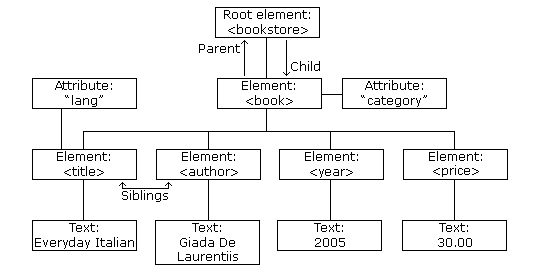
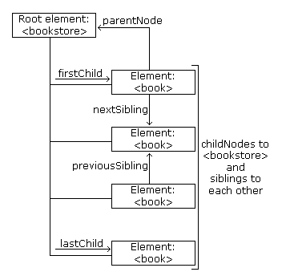
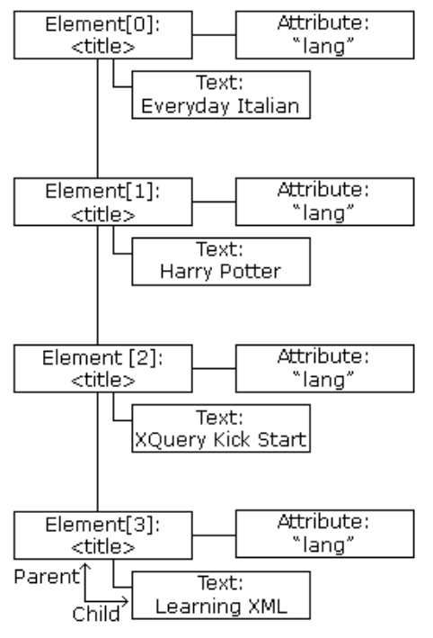

```{r setup, include=FALSE}
knitr::opts_chunk$set(echo = TRUE)
```


# XML DOM
## DOM Introduction  
### What is the DOM?
The DOM defines a standard for accessing and manipulating documents:  

> "The W3C Document Object Model (DOM) is a platform and language-neutral interface that allows programs and scripts to dynamically access and update the content, structure, and style of a document."  

The HTML DOM defines a standard way for accessing and manipulating HTML documents. It presents an HTML document as a tree-structure.  

The XML DOM defines a standard way for accessing and manipulating XML documents. It presents an XML document as a tree-structure.  

> Understanding the DOM is a must for anyone working with HTML or XML.  

### The HTML DOM
All HTML elements can be accessed through the HTML DOM.

This example changes the value of an HTML element with id="demo":  
```
<h1 id="demo">This is a Heading</h1>

<script>
document.getElementById("demo").innerHTML = "Hello World!";
</script>
```

This example changes the value of the first <h1> element in an HTML document:  
```
<h1>This is a Heading</h1>

<h1>This is a Heading</h1>

<script>
document.getElementsByTagName("h1")[0].innerHTML = "Hello World!";
</script>
```

**Note**: Even if the HTML document contains only ONE <h1> element you still have to specify the array index [0], because the getElementsByTagName() method always returns an array.  


### The XML DOM
All XML elements can be accessed through the XML DOM.  

The XML DOM is:  
- A standard object model for XML  
- A standard programming interface for XML  
- Platform-and language-independent  
- A W3C standard  

In other words: **The XML DOM is a standard for how to get, change, add, or delete XML elements**.  

### Get the Value of an XML Element  
This code retrieves the text value of the first <title> element in an XML document:  

```
txt = xmlDoc.getElementsByTagName("title")[0].childNodes[0].nodeValue;
```

### Loading an XML File  
The example file 'books.xml'  
```
<bookstore>
   <book category="cooking">
       <title lang="en">Everyday Italian</title>
       <author>Giada De Laurentiis</author>
       <year>2005</year>
       <price>30.00</price> </book>
   <book category="children">
       <title lang="en">Harry Potter</title>
       <author>J K. Rowling</author>
       <year>2005</year>
       <price>29.99</price> </book>
   <book category="web">
       <title lang="en">XQuery Kick Start</title>
       <author>James McGovern</author>
       <author>Per Bothner</author>
       <author>Kurt Cagle</author>
       <author>James Linn</author>
       <author>Vaidyanathan Nagarajan</author>
       <year>2003</year>
       <price>49.99</price> </book>
   <book category="web" cover="paperback">
       <title lang="en">Learning XML</title>
       <author>Erik T. Ray</author>
       <year>2003</year>
       <price>39.95</price> </book>
</bookstore>
```

This example reads "books.xml" into xmlDoc and retrives the text value of the first <title> element in books.xml:  

```
<!DOCTYPE html>
<html>
<body>

<p id="demo"></p>

<script>
var xhttp = new XMLHttpRequest();
xhttp.onreadystatechange = function() {
    if (this.readyState == 4 && this.status == 200) {
    myFunction(this);
    }
};
xhttp.open("GET", "books.xml", true);
xhttp.send();

function myFunction(xml) {
    var xmlDoc = xml.responseXML;
    document.getElementById("demo").innerHTML =
    xmlDoc.getElementsByTagName("title")[0].childNodes[0].nodeValue;
}
</script>

</body>
</html>
```

### Example Explained  
- **xmlDoc** - the XML DOM object created by the parser.  
- **getElementsByTagName("title")[0]** - get the first <title> element  
- **childNodes[0]** - the first child of the <title> element  
- **nodeValue** - the value of the node (the text itself)  


### Loading an XML String  
This example loads a text string into an XML DOM object, and extracts the info from it with JavaScript:

```
<html>
<body>

<p id="demo"></p>

<script>
var text, parser, xmlDoc;

text = "<bookstore><book>" +
"<title>Everyday Italian</title>" +
"<author>Giada De Laurentiis</author>" +
"<year>2005</year>" +
"</book></bookstore>";

parser = new DOMParser();
xmlDoc = parser.parseFromString(text,"text/xml");

document.getElementById("demo").innerHTML =
xmlDoc.getElementsByTagName("title")[0].childNodes[0].nodeValue;
</script>

</body>
</html>
```

### Programming Interface
The DOM models XML as a set of node objects. The nodes can be accessed with JavaScript or other programming languages. In this tutorial we use JavaScript.

The programming interface to the DOM is defined by a set standard properties and methods.  

**Properties** are often referred to as something that is (i.e. nodename is "book").  

**Methods** are often referred to as something that is done (i.e. delete "book").  

### XML DOM Properties  
These are some typical DOM properties:  
- x.nodeName - the name of x  
- x.nodeValue - the value of x  
- x.parentNode - the parent node of x  
- x.childNodes - the child nodes of x  
- x.attributes - the attributes nodes of x  

Note: In the list above, x is an node object.  

### XML DOM Methods  
- x.getElementsByTagName(name) - get all elements with a specified tag name  
- x.appendChild(node) - insert a child node to x  
- x.removeChild(node) - remove a child node from x  

Note: In the list above, x is a node object.  


## DOM Nodes
According to the XML DOM, everything in an XML document is a node:  
- The entire document is a document node  
- Every XML element is an element node  
- The text in the XML elements are text nodes  
- Every attribute is an attribute node  
- Comments are comment nodes  

### DOM Example
The books.xml file  
```
<?xml version="1.0" encoding="UTF-8"?>
<bookstore>
  <book category="cooking">
    <title lang="en">Everyday Italian</title>
    <author>Giada De Laurentiis</author>
    <year>2005</year>
    <price>30.00</price>
  </book>
  <book category="children">
    <title lang="en">Harry Potter</title>
    <author>J K. Rowling</author>
    <year>2005</year>
    <price>29.99</price>
  </book>
  <book category="web">
    <title lang="en">XQuery Kick Start</title>
    <author>James McGovern</author>
    <author>Per Bothner</author>
    <author>Kurt Cagle</author>
    <author>James Linn</author>
    <author>Vaidyanathan Nagarajan</author>
    <year>2003</year>
    <price>49.99</price>
  </book>
  <book category="web" cover="paperback">
    <title lang="en">Learning XML</title>
    <author>Erik T. Ray</author>
    <year>2003</year>
    <price>39.95</price>
  </book>
</bookstore>
```


The root node in the XML above is named <bookstore>.

All other nodes in the document are contained within <bookstore>.

The root node <bookstore> holds 4 <book> nodes.

The first <book> node holds the child nodes: <title>, <author>, <year>, and <price>.

The child nodes contain one text node each, "Everyday Italian", "Giada De Laurentiis", "2005", and "30.00".  


### The XML DOM Node Tree
The XML DOM views an XML document as a tree-structure. The tree structure is called a **node-tree**.

All nodes can be accessed through the tree. Their contents can be modified or deleted, and new elements can be created.

The node tree shows the set of nodes, and the connections between them. The tree starts at the root node and branches out to the text nodes at the lowest level of the tree:  

```{r}

```

### Node Parents, Children, and Siblings  
The nodes in the node tree have a hierarchical relationship to each other.

The terms parent, child, and sibling are used to describe the relationships. Parent nodes have children. Children on the same level are called siblings (brothers or sisters).  

- In a node tree, the top node is called the root  
- Every node, except the root, has exactly one parent node  
- A node can have any number of children  
- A leaf is a node with no children  
- Siblings are nodes with the same parent  

The following image illustrates a part of the node tree and the relationship between the nodes:  

```{r}

```

Because the XML data is structured in a tree form, it can be traversed without knowing the exact structure of the tree and without knowing the type of data contained within.  

### First Child - Last Child  
```
<bookstore>
  <book category="cooking">
    <title lang="en">Everyday Italian</title>
    <author>Giada De Laurentiis</author>
    <year>2005</year>
    <price>30.00</price>
  </book>
</bookstore>
```

In the XML above, the <title> element is the first child of the <book> element, and the <price> element is the last child of the <book> element.

Furthermore, the <book> element is the parent node of the <title>, <author>, <year>, and <price> elements.  


### DOM Accessing Nodes  
With the DOM, you can access every node in an XML document.  

### Accessing Nodes
You can access a node in three ways:  
1. By using the getElementsByTagName() method.  
2. By looping through (traversing) the nodes tree.  
3. By navigating the node tree, using the node relationships.  

### The getElementsByTagName() Method  
getElementsByTagName() returns all elements with a specified tag name.  

#### Syntax  
```
node.getElementsByTagName("tagname");
```

#### Example
The following example returns all <title> elements under the x element:  

```{r}
x.getElementsByTagName("title");
```

Note that the example above only returns <title> elements under the x node. To return all <title> elements in the XML document use:  

```
xmlDoc.getElementsByTagName("title");
```

where xmlDoc is the document itself (document node).  

### DOM Node List
The getElementsByTagName() method returns a node list. A node list is an array of nodes.  

```
x = xmlDoc.getElementsByTagName("title");
```

The <title> elements in x can be accessed by index number. To access the third <title> you can write:  

```
y = x[2]
```

**Note**: The index starts at 0.  

### DOM Node List length  
The length property defines the length of a node list (the number of nodes).

You can loop through a node list by using the length property:  

**Example**  
```
var x = xmlDoc.getElementsByTagName("title");

for (i = 0; i <x.length; i++) {
  // do something for each node
  }
```

### Node Types
The **documentElement** property of the XML document is the root node.

The **nodeName** property of a node is the name of the node.

The **nodeType** property of a node is the type of the node.

### Traversing Nodes
The following code loops through the child nodes, that are also element nodes, of the root node:  

```
txt = "";
x = xmlDoc.documentElement.childNodes;

for (i = 0; i <x.length; i++) {
  // Process only element nodes (type 1)
  if (x[i].nodeType == 1) {
    txt += x[i].nodeName + "<br>";
  }
}
```

Example explained:  
1. Suppose you have loaded "books.xml" into xmlDoc  
2. Get the child nodes of the root element (xmlDoc)  
3. For each child node, check the node type. If the node type is '1' it is an element node.  
4. Output the name of the node if it is an element node.  

### Navigating Node Relationships  
The following code navigates the node tree using the node relationships:  

**Example**  
```
x = xmlDoc.getElementsByTagName("book")[0];
xlen = x.childNodes.length;
y = x.firstChild;

txt = "";
for (i = 0; i <xlen; i++) {
  // Process only element nodes (type 1)
  if (y.nodeType == 1) {
    txt += y.nodeName + "<br>";
  }
  y = y.nextSibling;
}
```

Example explained:  
1. Suppose you have loaded "books.xml"into xmlDoc  
2. Get the child nodes of the first book element  
3. Set the "y" variable to be the first child node of the first book element  
4. For each child node (starting with the first child node "y"):  
5. Check the node type. If the node type is "1" it is an element node  
6. Output the name of the node if it is an element node  
7. Set the "y" variable to be the next sibling node, and run through the loop again  

### DOM Node information
The nodeName, nodeValue, and nodeType properties contain information about nodes.  

### Node Properties  
In the XML DOM, each node is an **object**.  

Objects have methods and properties, that can be accessed and manipulated by JavaScript.  

Three important node properties are:  
- nodeName  
- nodeValue  
- nodeType  

### The nodeName Property
The nodeName property specifies the name of a node.  
- nodeName is read-only  
- nodeName of an element node is the same as the tag name  
- nodeName of an attribute node is the attribute name  
- nodeName of a text node is always #text  
- nodeName of the document node is always #document  

### The nodeValue Property
The nodeValue property specifies the value of a node.  
- nodeValue for element nodes is undefined
- nodeValue for text nodes is the text itself
- nodeValue for attribute nodes is the attribute value


### Get the Value of an Element  
The following code retrieves the text node value of the first <title> element:

**Example**  
```
var x = xmlDoc.getElementsByTagName("title")[0].childNodes[0];
var txt = x.nodeValue;
```

Result: txt = 'Everyday Italian'

Example explained:  
1. Suppose you have loaded "books.xml" into xmlDoc  
2. Get text node of the first <title> element node  
3. Set the txt variable to be the value of the text node  


### Change the Value of an Element  
The following code changes the text node value of the first <title> element:  

**Example**  
```
var x = xmlDoc.getElementsByTagName("title")[0].childNodes[0];
x.nodeValue = "Easy Cooking";
```

Example explained:  
1. Suppose you have loaded "books.xml" into xmlDoc  
2. Get text node of the first <title> element node  
3. Change the value of the text node to "Easy Cooking"  

### The nodeType Property  
The nodeType property specifies the type of node.

nodeType is read only.

The most important node types are:  

|**Node type**|**NodeType**|  
|:-|:-|  
|Element|1|
|Attribute|2|
|Text|3|
|Comment|8|
|Document|9|

## DOM Node List  
A list of nodes is returned by the getElementsByTagName() method and the childNodes property.  

### DOM Node List
When using properties or methods like childNodes or getElementsByTagName(), a node list object is returned.  

A node list object represents a list of nodes, in the same order as in the XML.

Nodes in the node list are accessed with index numbers starting from 0.

The following image represents a node list of the <title> elements in "books.xml":  

```{r}

```

Suppose "books.xml" is loaded into the variable xmlDoc.

This code fragment returns a node list of title elements in "books.xml":  

```
x = xmlDoc.getElementsByTagName("title");
```

After the execution of the statement above, x is a node list object.

The following code fragment returns the text from the first <title> element in the node list (x):  

**Example**  
```
var txt = x[0].childNodes[0].nodeValue;
```
After the execution of the statement above, txt = "Everyday Italian".  

### Node List Length  
A node list object keeps itself up-to-date. If an element is deleted or added, the list is automatically updated.

The length property of a node list is the number of nodes in the list.

This code fragment returns the number of <title> elements in "books.xml":  

```
x = xmlDoc.getElementsByTagName('title').length;
```

After the execution of the statement above, the value of x will be 4.

The length of the node list can be used to loop through all the elements in the list.

This code fragment uses the length property to loop through the list of <title> elements:  

**Example**  
```
x = xmlDoc.getElementsByTagName('title');
xLen = x.length;

for (i = 0; i <xLen; i++) {
    txt += x[i].childNodes[0].nodeValue) + " ";
}
```

**Output**  
```
Everyday Italian
Harry Potter
XQuery Kick Start
Learning XML
```

Example explained:

1. Suppose "books.xml" is loaded into xmlDoc  
2. Set the x variable to hold a node list of all title elements  
3. Collect the text node values from <title> elements  


### DOM Attribute List (Named Node Map)  
The attributes property of an element node returns a list of attribute nodes.

This is called a named node map, and is similar to a node list, except for some differences in methods and properties.

An attribute list keeps itself up-to-date. If an attribute is deleted or added, the list is automatically updated.

This code fragment returns a list of attribute nodes from the first <book> element in "books.xml":  

```
x = xmlDoc.getElementsByTagName('book')[0].attributes;
```

After the execution of the code above, x.length = is the number of attributes and x.getNamedItem() can be used to return an attribute node.

This code fragment gets the value of the "category" attribute, and the number of attributes, of a book:  

**Example**
```
x = xmlDoc.getElementsByTagName("book")[0].attributes;

txt = x.getNamedItem("category").nodeValue + " " + x.length;
```

**Output**
```
cooking 1
```

Example explained:

1. Suppose "books.xml" is loaded into xmlDoc  
2. Set the x variable to hold a list of all attributes of the first <book> element  
3. Get the value of the "category" attribute and the length of the attribute list  


