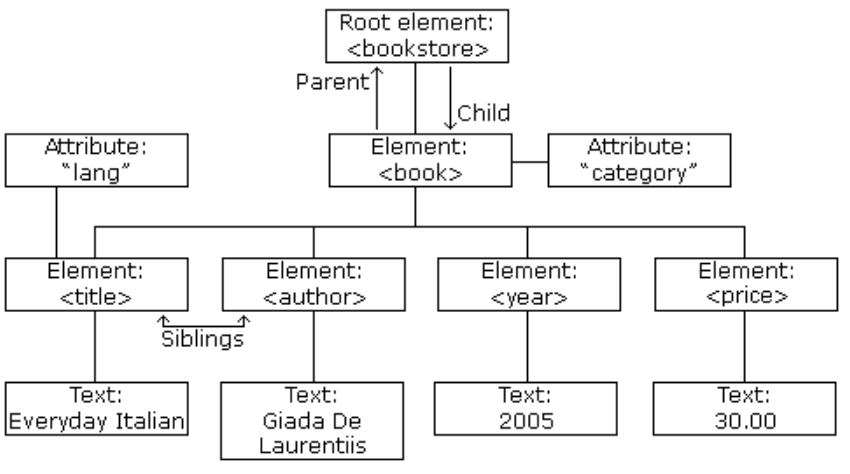
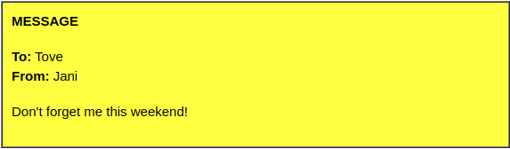
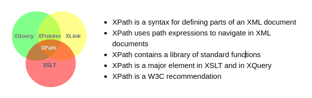

```{r setup, include=FALSE}
knitr::opts_chunk$set(echo = TRUE)
```

# XML tutorial

## XML HOME

### Why Study XML?

-   XML plays an important role in many different IT systems.\
-   XML is often used for distributing data over the internet.\
-   It is important (for all types of software developers!) to have a good understanding of XML.

### Important XML Standards

-   XML AJAX\
-   XML DOM\
-   XML XPath\
-   XML XSLT\
-   XML DTD\
-   XML Schema\
-   XML Services

## Introduction to XML

XML is a software - and hardware-independent tool for storing and transporting data.

### What is XML?

-   XML stands for eXtensible Markup Language\
-   XML is a markup language much like HTML\
-   XML was designed to store and transport data\
-   XML was designed to be self-descriptive\
-   XML is a W3C Recommendation

### XML Does Not DO Anything

Maybe it is a little hard to understand, but XML does not DO anything.

This note is a note to Tove from Jani, stored as XML:

```
    <note>
        <to>Tove</to>
        <from>Jani</from>
        <heading>Reminder</heading>
        <body>Don't forget me this weekend!</body>
    </note>
```

The XML above is quite self-descriptive:

-   It has sender information.  
-   It has receiver information.  
-   It has a heading.  
-   It has a message body.  

But still, the XML above does not DO anything. XML is just information wrapped in tags.

Someone must write a piece of software to send, receive, store, or display it.

### The Difference Between XML and HTML

XML and HTML were designed with different goals:

-   XML was designed to carry data - with focus on what data is.  
-   HTML was designed to display data - with focus on how data looks.  
-   XML tags are not predefined like HTML tags are.  

### XML Does Not Use Predefined Tags

The XML language has no predefined tags.

The tags in the example above (like <to> and <from>) are not defined in any XML standard. These tags are "invented" by the author of the XML document.

HTML works with predefined tags like <p>, <h1>, <table>, etc.

With XML, the author must define both the tags and the document structure.

### XML is Extensible

Most XML applications will work as expected even if new data is added (or removed).

Imagine an application designed to display the original version of note.xml (<to> <from> <heading><body>).

Then imagine a newer version of note.xml with added <date> and <hour> elements, and a removed <heading>.

The way XML is constructed, older version of the application can still work:

    <note>
      <date>2015-09-01</date>
      <hour>08:30</hour>
      <to>Tove</to>
      <from>Jani</from>
      <body>Don't forget me this weekend!</body>
    </note>

### XML Simplifies Things

-   It simplifies data sharing.  
-   It simplifies data transport.  
-   It simplifies platform changes.  
-   It simplifies data availability.  

Many computer systems contain data in incompatible formats. Exchanging data between incompatible systems (or upgraded systems) is a time-consuming task for web developers. Large amounts of data must be converted, and incompatible data is often lost.

XML stores data in plain text format. This provides a software- and hardware-independent way of storing, transporting, and sharing data.

XML also makes it easier to expand or upgrade to new operating systems, new applications, or new browsers, without losing data.

With XML, data can be available to all kinds of "reading machines" like people, computers, voice machines, news feeds, etc.

## XML How to use

### How Can XML be used?

XML is used in many aspects of web development.

XML is often used to separate data from presentation.

### XML Separates Data from Presentation

XML does not carry any information about how to be displayed.

The same XML data can be used in many different presentation scenarios.

Because of this, with XML, there is a full separation between data and presentation.

### XML is Often a Complement to HTML

In many HTML applications, XML is used to store or transport data, while HTML is used to format and display the same data.

### XML Separates Data from HTML

When displaying data in HTML, you should not have to edit the HTML file when the data changes.

With XML, the data can be stored in separate XML files.

With a few lines of JavaScript code, you can read an XML file and update the data content of any HTML page.

### Transaction Data

Thousands of XML formats exist, in many different industries, to describe day-to-day data transactions:

|                         |
|:------------------------|
| Stocks and Shares       |
| Financial transactions  |
| Medical data            |
| Mathematical data       |
| Scientific measurements |
| News information        |
| Weather services        |

### Example: XML News

**XMLNews is a specification for exchanging news and other information.**

Using a standard makes it easier for both news producers and news consumers to produce, receive, and archive any kind of news information across different hardware, software, and programming languages.

An example XMLNews document:

```
    <?xml version="1.0" encoding="UTF-8"?>
    <nitf>
      <head>
        <title>Colombia Earthquake</title>
      </head>
      <body>
        <headline>
          <hl1>143 Dead in Colombia Earthquake</hl1>
        </headline>
        <byline>
          <bytag>By Jared Kotler, Associated Press Writer</bytag>
        </byline>
        <dateline>
          <location>Bogota, Colombia</location>
          <date>Monday January 25 1999 7:28 ET</date>
        </dateline>
      </body>
    </nitf>
```

### Example: XML Weather Service

An XML national weather service from NOAA (National Oceanic and Atmospheric Administration):

```
    <?xml version="1.0" encoding="UTF-8"?>
    <current_observation>

    <credit>NOAA's National Weather Service</credit>
    <credit_URL>http://weather.gov/</credit_URL>

    <image>
      <url>http://weather.gov/images/xml_logo.gif</url>
      <title>NOAA's National Weather Service</title>
      <link>http://weather.gov</link>
    </image>

    <location>New York/John F. Kennedy Intl Airport, NY</location>
    <station_id>KJFK</station_id>
    <latitude>40.66</latitude>
    <longitude>-73.78</longitude>
    <observation_time_rfc822>Mon, 11 Feb 2008 06:51:00 -0500 EST
    </observation_time_rfc822>

    <weather>A Few Clouds</weather>
    <temp_f>11</temp_f>
    <temp_c>-12</temp_c>
    <relative_humidity>36</relative_humidity>
    <wind_dir>West</wind_dir>
    <wind_degrees>280</wind_degrees>
    <wind_mph>18.4</wind_mph>
    <wind_gust_mph>29</wind_gust_mph>
    <pressure_mb>1023.6</pressure_mb>
    <pressure_in>30.23</pressure_in>
    <dewpoint_f>-11</dewpoint_f>
    <dewpoint_c>-24</dewpoint_c>
    <windchill_f>-7</windchill_f>
    <windchill_c>-22</windchill_c>
    <visibility_mi>10.00</visibility_mi>

    <icon_url_base>http://weather.gov/weather/images/fcicons/</icon_url_base>
    <icon_url_name>nfew.jpg</icon_url_name>
    <disclaimer_url>http://weather.gov/disclaimer.html</disclaimer_url>
    <copyright_url>http://weather.gov/disclaimer.html</copyright_url>

    </current_observation>
```


## XML Tree

XML documents form a tree structure that starts at "the root" and branches to "the leaves".

XML Tree Structure

```{r}

```

### An Example XML Document

The image above represents books in this XML:
```
    <?xml version="1.0" encoding="UTF-8"?>
    <bookstore>
      <book category="cooking">
        <title lang="en">Everyday Italian</title>
        <author>Giada De Laurentiis</author>
        <year>2005</year>
        <price>30.00</price>
      </book>
      <book category="children">
        <title lang="en">Harry Potter</title>
        <author>J K. Rowling</author>
        <year>2005</year>
        <price>29.99</price>
      </book>
      <book category="web">
        <title lang="en">Learning XML</title>
        <author>Erik T. Ray</author>
        <year>2003</year>
        <price>39.95</price>
      </book>
    </bookstore>
```


### XML Tree Structure

XML documents are formed as element trees.

An XML tree starts at a root element and branches from the root to child elements.

All elements can have sub elements (child elements):
```
    <root>
      <child>
        <subchild>.....</subchild>
      </child>
    </root>
```

The terms parent, child, and sibling are used to describe the relationships between elements.

Parents have children. Children have parents. Siblings are children on the same level (brothers and sisters).

All elements can have text content (Harry Potter) and attributes (category="cooking").

### Self-Describing Syntax

XML uses a much self-describing syntax.

A prolog defines the XML version and the character encoding:  

```
    <?xml version="1.0" encoding="UTF-8"?>
```

The next line is the root element of the document:  

```
    <bookstore>
```

The next line starts a <book> element:
```
    <book category="cooking">
```

The <book> elements have 4 child elements:

<title>, <author>, <year>, <price>.  

```
    <title lang="en">Everyday Italian</title>
    <author>Giada De Laurentiis</author>
    <year>2005</year>
    <price>30.00</price>
```

The next line ends the book element:

```
</book>
```
You can assume, from this example, that the XML document contains information about books in a bookstore.

## XML Syntax

The syntax rules of XML are very simple and logical. The rules are easy to learn, and easy to use.

### XML Documents Must Have a Root Element

XML documents must contain one root element that is the parent of all other elements:
```
    <root>
      <child>
        <subchild>.....</subchild>
      </child>
    </root>
```

In this example
```
<note>
```

is the root element:

```
    <?xml version="1.0" encoding="UTF-8"?>
    <note>
      <to>Tove</to>
      <from>Jani</from>
      <heading>Reminder</heading>
      <body>Don't forget me this weekend!</body>
    </note>
```

### The XML Prolog

This line is called the XML **prolog**:
```
<?xml version="1.0" encoding="UTF-8"?>
```

The XML prolog is optional. If it exists, it must come first in the document.

XML documents can contain international characters, like Norwegian øæå or French êèé.

To avoid errors, you should specify the encoding used, or save your XML files as UTF-8.

UTF-8 is the default character encoding for XML documents.

### All XML Elements Must Have a Closing Tag

In XML, it is illegal to omit the closing tag. All elements must have a closing tag:
```
    <p>This is a paragraph.</p>
    <br />
```

> Note: The XML prolog does not have a closing tag! This is not an error. The prolog is not a part of the XML document.

### XML Tags are Case Sensitive

XML tags are case sensitive. The tag <Letter> is different from the tag <letter>.

Opening and closing tags must be written with the same case:
```
    <message>This is correct</message>
```

"Opening and closing tags" are often referred to as "Start and end tags". Use whatever you prefer. It is exactly the same thing.

### XML Elements Must be Properly Nested

In HTML, you might see improperly nested elements:
```
    <b><i>This text is bold and italic</b></i>
```

In XML, all elements must be properly nested within each other:
```
    <b><i>This text is bold and italic</i></b>
```

In the example above, "Properly nested" simply means that since the <i> element is opened inside the <b> element, it must be closed inside the <b> element.

### XML Attribute Values Must Always be Quoted

XML elements can have attributes in name/value pairs just like in HTML.

In XML, the attribute values must always be quoted:
```
    <note date="12/11/2007">
      <to>Tove</to>
      <from>Jani</from>
    </note>
```

### Entity References

Some characters have a special meaning in XML.

If you place a character like "<" inside an XML element, it will generate an error because the parser interprets it as the start of a new element.

This will generate an XML error:
```
    <message>salary < 1000</message>
```

To avoid this error, replace the "<" character with an **entity reference**:
```
    <message>salary &lt; 1000</message>
```
There are 5 pre-defined entity references in XML:

|     |          |                |
|:----|:---------|:---------------|
| <   | &lt;     | less than      |
| >   | &gt;     | greater than   |
| &   | &amp;    | ampersand      |
| '   | &apos;   | apostrophe     |
| "   | &quot;   | quotation mark |

> Only < and & are strictly illegal in XML, but it is a good habit to replace > with  as well.

### Comments in XML

The syntax for writing comments in XML is similar to that of HTML:
```
    <!-- This is a comment -->
```

Two dashes in the middle of a comment are not allowed:
```
    <!-- This is an invalid -- comment -->
```

### White-space is Preserved in XML

XML does not truncate multiple white-spaces (HTML truncates multiple white-spaces to one single white-space):

```
XML:	Hello           Tove
HTML:	Hello Tove
```

### XML Stores New Lines as LF
Windows applications store a new line as: carriage return and line feed (CR+LF).  

Unix and Mac OSX use LF.

Old Mac systems use CR.

XML stores a new line as LF.  


### Well Formed XML
XML documents that conform to the syntax rules above are said to be "Well Formed" XML documents.  


## XML Elements
An XML document contains XML Elements.

### What is an XML Element?
An XML element is everything from (including) the element's start tag to (including) the element's end tag.

```
<price>29.99</price>
```

An element can contain:  

- text  
- attributes  
- other elements  
- or a mix of the above  

```
<bookstore>
  <book category="children">
    <title>Harry Potter</title>
    <author>J K. Rowling</author>
    <year>2005</year>
    <price>29.99</price>
  </book>
  <book category="web">
    <title>Learning XML</title>
    <author>Erik T. Ray</author>
    <year>2003</year>
    <price>39.95</price>
  </book>
</bookstore>
```

In the example above:

<title>, <author>, <year>, and <price> have text content because they contain text (like 29.99).

<bookstore> and <book> have element contents, because they contain elements.

<book> has an attribute (category="children").  

### Empty XML Elements
An element with no content is said to be empty.

In XML, you can indicate an empty element like this:  

```
<element></element>
```

You can also use a so called self-closing tag:  

```
<element />
```

The two forms produce identical results in XML software (Readers, Parsers, Browsers).  

> Empty elements can have attributes.  

### XML Naming Rules  
XML elements must follow these naming rules:  

- Element names are case-sensitive  
- Element names must start with a letter or underscore  
- Element names cannot start with the letters xml (or XML, or Xml, etc)  
- Element names can contain letters, digits, hyphens, underscores, and periods  
- Element names cannot contain spaces  

Any name can be used, no words are reserved (except xml).  

### Best Naming Practices
Create descriptive names, like this: <person>, <firstname>, <lastname>.  

Create short and simple names, like this: <book_title> not like this: <the_title_of_the_book>.  

Avoid "-". If you name something "first-name", some software may think you want to subtract "name" from "first".  

Avoid ".". If you name something "first.name", some software may think that "name" is a property of the object "first".  

Avoid ":". Colons are reserved for namespaces (more later).  

Non-English letters like éòá are perfectly legal in XML, but watch out for problems if your software doesn't support them.  

### Naming Styles
There are no naming styles defined for XML elements. But here are some commonly used:  

|**Style**|**Example**|**Description**|
|:--|:--|:--|
|Lower case|<firstname>|All letters lower case|
|Upper case|<FIRSTNAME>|Aall letters upper case|
|Underscore|<first_name>|Underscore separates words|
|Pascal case|<FirstName>|Uppercase first letter in each word|
|Camel case|<firstName>|Uppercase first letter in each word except the first|  

If you choose a naming style, it is good to be consistent!  

XML documents often have a corresponding database. A common practice is to use the naming rules of the database for the XML elements.  

> Camel case is a common naming rule in JavaScripts.  

### XML Elements are Extensible  
XML elements can be extended to carry more information.

Look at the following XML example:  

```
<note>
  <to>Tove</to>
  <from>Jani</from>
  <body>Don't forget me this weekend!</body>
</note>
```

Let's imagine that we created an application that extracted the <to>, <from>, and <body> elements from the XML document to produce this output:  

```{r}

```

Imagine that the author of the XML document added some extra information to it:  

```
<note>
  <date>2008-01-10</date>
  <to>Tove</to>
  <from>Jani</from>
  <heading>Reminder</heading>
  <body>Don't forget me this weekend!</body>
</note>
```

Should the application break or crash?

No. The application should still be able to find the <to>, <from>, and <body> elements in the XML document and produce the same output.

This is one of the beauties of XML. It can be extended without breaking applications.


## XML Attributes
XML elements can have attributes, just like HTML.

Attributes are designed to contain data related to a specific element.  

### XML Attibutes Must be Quoted
Attribute values must always be quoted. Either single or double quotes can be used.

For a person's gender, the <person> element can be written like this:  

```
<person gender="female">
```

or like this:  

```
<person gender='female'>
```

If the attribute value itself contains double quotes you can use single quotes, like in this example:  

If the attribute value itself contains double quotes you can use single quotes, like in this example:  

```
<gangster name='George "Shotgun" Ziegler'>
```

or you can use character entities:  

```
<gangster name="George &quot;Shotgun&quot; Ziegler">
```

### XML Elements vs Attributes
Take a look at these two examples:  

```
<person gender="female">
  <firstname>Anna</firstname>
  <lastname>Smith</lastname>
</person>
```

```
<person>
  <gender>female</gender>
  <firstname>Anna</firstname>
  <lastname>Smith</lastname>
</person>
```

In the first example, gender is an attribute. In the last example, gender is an element. Both examples provide the same information.

There are no rules about when to use attributes or when to use elements in XML.  

### My Favorite Way
The following three XML documents contain exactly the same information:

A date attribute is used in the first example:  

```
<note date="2008-01-10">
  <to>Tove</to>
  <from>Jani</from>
</note>
```

A <date> element is used in the second example:

```
<note>
  <date>2008-01-10</date>
  <to>Tove</to>
  <from>Jani</from>
</note>
```

An expanded <date> element is used in the third example: (THIS IS MY FAVORITE):  

```
<note>
  <date>
    <year>2008</year>
    <month>01</month>
    <day>10</day>
  </date>
  <to>Tove</to>
  <from>Jani</from>
</note>
```

### Avoid XML Attributes?
Some things to consider when using attributes are:  

- attributes cannot contain multiple values (elements can)  
- attributes cannot contain tree structures (elements can)  
- attributes are not easily expandable (for future changes)  

Don't end up like this:  

```
<note day="10" month="01" year="2008"
to="Tove" from="Jani" heading="Reminder"
body="Don't forget me this weekend!">
</note>
```

### XML Attributes for Metadata
Sometimes ID references are assigned to elements. These IDs can be used to identify XML elements in much the same way as the id attribute in HTML. This example demonstrates this:  

```
<messages>
  <note id="501">
    <to>Tove</to>
    <from>Jani</from>
    <heading>Reminder</heading>
    <body>Don't forget me this weekend!</body>
  </note>
  <note id="502">
    <to>Jani</to>
    <from>Tove</from>
    <heading>Re: Reminder</heading>
    <body>I will not</body>
  </note>
</messages>
```

The id attributes above are for identifying the different notes. It is not a part of the note itself.

**What I'm trying to say here is that metadata (data about data) should be stored as attributes, and the data itself should be stored as elements**.  


## XML Namespaces
XML Namespaces provide a method to avoid element name conflicts.  

### Name Conflicts
In XML, element names are defined by the developer. This often results in a conflict when trying to mix XML documents from different XML applications.  

This XML carries HTML table information:  

```
<table>
  <tr>
    <td>Apple</td>
    <td>Banana</td>
  </tr>
</table>
```

This XML carries information about a table (a piece of furniture):  

```
<table>
  <name>African Coffee Table</name>
  <width>80</width>
  <length>120</length>
</table>
```

If these XML fragments were added together, there would be a name conflict. Both contain a <table> element, but the elements have different content and meaning.

A user or an XML application will not know how to handle these differences.

### Solving the Name Conflicts Using a Prefix
Name conflicts in XML can easily be avoided using a name prefix.  

This XML carries information about an HTML table, and a piece of furniture:  

```
<h:table>
  <h:tr>
    <h:td>Apples</h:td>
    <h:td>Bananas</h:td>
  </h:tr>
</h:table>

<f:table>
  <f:name>African Coffee Table</f:name>
  <f:width>80</f:width>
  <f:length>120</f:length>
</f:table>
```

In the example above, there will be no conflict because the two <table> elements have different names.  

### XML Namespaces - The xmlns Attribute
When using prefixes in XML, a **namespace** for the prefix must be defined.

The namespace can be defined by an **xmlns** attribute in the start tag of an element.

The namespace declaration has the following syntax. `xmlns:prefix="URI"`.  

```
<root>

<h:table xmlns:h="http://www.w3.org/TR/html4/">
  <h:tr>
    <h:td>Apples</h:td>
    <h:td>Bananas</h:td>
  </h:tr>
</h:table>

<f:table xmlns:f="https://www.w3schools.com/furniture">
  <f:name>African Coffee Table</f:name>
  <f:width>80</f:width>
  <f:length>120</f:length>
</f:table>

</root>
```

In the example above:

The xmlns attribute in the first <table> element gives the h: prefix a qualified namespace.

The xmlns attribute in the second <table> element gives the f: prefix a qualified namespace.

When a namespace is defined for an element, all child elements with the same prefix are associated with the same namespace.

Namespaces can also be declared in the XML root element:  

```
<root xmlns:h="http://www.w3.org/TR/html4/" xmlns:f="https://www.w3schools.com/furniture">

<h:table>
  <h:tr>
    <h:td>Apples</h:td>
    <h:td>Bananas</h:td>
  </h:tr>
</h:table>

<f:table>
  <f:name>African Coffee Table</f:name>
  <f:width>80</f:width>
  <f:length>120</f:length>
</f:table>

</root>
```

Note: The namespace URI is not used by the parser to look up information.

The purpose of using an URI is to give the namespace a unique name.

However, companies often use the namespace as a pointer to a web page containing namespace information.  

### Uniform Resource Identifier (URI)
A **Uniform Resource Identifier** (URI) is a string of characters which identifies an Internet Resource.

The most common URI is the **Uniform Resource Locator** (URL) which identifies an Internet domain address. Another, not so common type of URI is the **Uniform Resource Name** (URN).  


### Default Namespaces
Defining a default namespace for an element saves us from using prefixes in all the child elements. It has the following syntax:  

```
xmlns="namespaceURI"
```

This XML carries HTML table information:

```
<table xmlns="http://www.w3.org/TR/html4/">
  <tr>
    <td>Apples</td>
    <td>Bananas</td>
  </tr>
</table>
```

This XML carries information about a piece of furniture:

```
<table xmlns="https://www.w3schools.com/furniture">
  <name>African Coffee Table</name>
  <width>80</width>
  <length>120</length>
</table>
```

### Namespaces in Real Use
XSLT is a language that can be used to transform XML documents into other formats.

The XML document below, is a document used to transform XML into HTML.  

The namespace "http://www.w3.org/1999/XSL/Transform" identifies XSLT elements inside an HTML document:  

```
<?xml version="1.0" encoding="UTF-8"?>

<xsl:stylesheet version="1.0" xmlns:xsl="http://www.w3.org/1999/XSL/Transform">

<xsl:template match="/">
<html>
<body>
  <h2>My CD Collection</h2>
  <table border="1">
    <tr>
      <th style="text-align:left">Title</th>
      <th style="text-align:left">Artist</th>
    </tr>
    <xsl:for-each select="catalog/cd">
    <tr>
      <td><xsl:value-of select="title"/></td>
      <td><xsl:value-of select="artist"/></td>
    </tr>
    </xsl:for-each>
  </table>
</body>
</html>
</xsl:template>

</xsl:stylesheet>
```

## XML Display
Raw XML files can be viewed in all major browsers.

Don't expect XML files to be displayed as HTML pages.  

### Viewing XML Files
```
<?xml version="1.0" encoding="UTF-8"?>
  -<note>
       <to>Tove</to>
       <from>Jani</from>
       <heading>Reminder</heading>
       <body>Don't forget me this weekend!</body>
   </note>
```

Often a plus (+) or minus sign (-) to the left of the elements can be clicked to expand or collapse the element structure.

To view raw XML source, try to select "View Page Source" or "View Source" from the browser menu.  

### Viewing an Invalid XML File
If an erroneous XML file is opened, some browsers will report the error, and some will display it, or display it incorrectly.  

```
<?xml version="1.0" encoding="UTF-8"?>
 - <note>
       <to>Tove</to>
       <from>Jani</Ffrom>
       <heading>Reminder</heading>
       <body>Don't forget me this weekend!</body>
   </note>
```

### Other XML Examples
Viewing some XML documents will help you get the XML feeling:  

*An XML breakfast menu*  
```
<breakfast_menu>
   <food>
       <name>Belgian Waffles</name>
       <price>$5.95</price>
       <description>Two of our famous Belgian Waffles with plenty of real maple syrup</description>
       <calories>650</calories> </food>
   <food>
       <name>Strawberry Belgian Waffles</name>
       <price>$7.95</price>
       <description>Light Belgian waffles covered with strawberries and whipped cream</description>
       <calories>900</calories> </food>
   <food>
       <name>Berry-Berry Belgian Waffles</name>
       <price>$8.95</price>
       <description>Light Belgian waffles covered with an assortment of fresh berries and whipped cream</description>
       <calories>900</calories> </food>
   <food>
       <name>French Toast</name>
       <price>$4.50</price>
       <description>Thick slices made from our homemade sourdough bread</description>
       <calories>600</calories> </food>
   <food>
       <name>Homestyle Breakfast</name>
       <price>$6.95</price>
       <description>Two eggs, bacon or sausage, toast, and our ever-popular hash browns</description>
       <calories>950</calories> </food>
</breakfast_menu>
```

*An XML CD catalog*  
```
<CATALOG>
   <CD>
       <TITLE>Empire Burlesque</TITLE>
       <ARTIST>Bob Dylan</ARTIST>
       <COUNTRY>USA</COUNTRY>
       <COMPANY>Columbia</COMPANY>
       <PRICE>10.90</PRICE>
       <YEAR>1985</YEAR> </CD>
   <CD>
       <TITLE>Hide your heart</TITLE>
       <ARTIST>Bonnie Tyler</ARTIST>
       <COUNTRY>UK</COUNTRY>
       <COMPANY>CBS Records</COMPANY>
       <PRICE>9.90</PRICE>
       <YEAR>1988</YEAR> </CD>
   <CD>
       <TITLE>Greatest Hits</TITLE>
       <ARTIST>Dolly Parton</ARTIST>
       <COUNTRY>USA</COUNTRY>
       <COMPANY>RCA</COMPANY>
       <PRICE>9.90</PRICE>
       <YEAR>1982</YEAR> </CD>
   <CD>
       <TITLE>Still got the blues</TITLE>
       <ARTIST>Gary Moore</ARTIST>
       <COUNTRY>UK</COUNTRY>
       <COMPANY>Virgin records</COMPANY>
       <PRICE>10.20</PRICE>
       <YEAR>1990</YEAR> </CD>
   <CD>
       <TITLE>Eros</TITLE>
       <ARTIST>Eros Ramazzotti</ARTIST>
       <COUNTRY>EU</COUNTRY>
       <COMPANY>BMG</COMPANY>
       <PRICE>9.90</PRICE>
       <YEAR>1997</YEAR> </CD>
   <CD>
       <TITLE>One night only</TITLE>
       <ARTIST>Bee Gees</ARTIST>
       <COUNTRY>UK</COUNTRY>
       <COMPANY>Polydor</COMPANY>
       <PRICE>10.90</PRICE>
       <YEAR>1998</YEAR> </CD>
   <CD>
       <TITLE>Sylvias Mother</TITLE>
       <ARTIST>Dr.Hook</ARTIST>
       <COUNTRY>UK</COUNTRY>
       <COMPANY>CBS</COMPANY>
       <PRICE>8.10</PRICE>
       <YEAR>1973</YEAR> </CD>
   <CD>
       <TITLE>Maggie May</TITLE>
       <ARTIST>Rod Stewart</ARTIST>
       <COUNTRY>UK</COUNTRY>
       <COMPANY>Pickwick</COMPANY>
       <PRICE>8.50</PRICE>
       <YEAR>1990</YEAR> </CD>
   <CD>
       <TITLE>Romanza</TITLE>
       <ARTIST>Andrea Bocelli</ARTIST>
       <COUNTRY>EU</COUNTRY>
       <COMPANY>Polydor</COMPANY>
       <PRICE>10.80</PRICE>
       <YEAR>1996</YEAR> </CD>
   <CD>
       <TITLE>When a man loves a woman</TITLE>
       <ARTIST>Percy Sledge</ARTIST>
       <COUNTRY>USA</COUNTRY>
       <COMPANY>Atlantic</COMPANY>
       <PRICE>8.70</PRICE>
       <YEAR>1987</YEAR> </CD>
   <CD>
       <TITLE>Black angel</TITLE>
       <ARTIST>Savage Rose</ARTIST>
       <COUNTRY>EU</COUNTRY>
       <COMPANY>Mega</COMPANY>
       <PRICE>10.90</PRICE>
       <YEAR>1995</YEAR> </CD>
   <CD>
       <TITLE>1999 Grammy Nominees</TITLE>
       <ARTIST>Many</ARTIST>
       <COUNTRY>USA</COUNTRY>
       <COMPANY>Grammy</COMPANY>
       <PRICE>10.20</PRICE>
       <YEAR>1999</YEAR> </CD>
   <CD>
       <TITLE>For the good times</TITLE>
       <ARTIST>Kenny Rogers</ARTIST>
       <COUNTRY>UK</COUNTRY>
       <COMPANY>Mucik Master</COMPANY>
       <PRICE>8.70</PRICE>
       <YEAR>1995</YEAR> </CD>
   <CD>
       <TITLE>Big Willie style</TITLE>
       <ARTIST>Will Smith</ARTIST>
       <COUNTRY>USA</COUNTRY>
       <COMPANY>Columbia</COMPANY>
       <PRICE>9.90</PRICE>
       <YEAR>1997</YEAR> </CD>
   <CD>
       <TITLE>Tupelo Honey</TITLE>
       <ARTIST>Van Morrison</ARTIST>
       <COUNTRY>UK</COUNTRY>
       <COMPANY>Polydor</COMPANY>
       <PRICE>8.20</PRICE>
       <YEAR>1971</YEAR> </CD>
   <CD>
       <TITLE>Soulsville</TITLE>
       <ARTIST>Jorn Hoel</ARTIST>
       <COUNTRY>Norway</COUNTRY>
       <COMPANY>WEA</COMPANY>
       <PRICE>7.90</PRICE>
       <YEAR>1996</YEAR> </CD>
   <CD>
       <TITLE>The very best of</TITLE>
       <ARTIST>Cat Stevens</ARTIST>
       <COUNTRY>UK</COUNTRY>
       <COMPANY>Island</COMPANY>
       <PRICE>8.90</PRICE>
       <YEAR>1990</YEAR> </CD>
   <CD>
       <TITLE>Stop</TITLE>
       <ARTIST>Sam Brown</ARTIST>
       <COUNTRY>UK</COUNTRY>
       <COMPANY>A and M</COMPANY>
       <PRICE>8.90</PRICE>
       <YEAR>1988</YEAR> </CD>
   <CD>
       <TITLE>Bridge of Spies</TITLE>
       <ARTIST>T'Pau</ARTIST>
       <COUNTRY>UK</COUNTRY>
       <COMPANY>Siren</COMPANY>
       <PRICE>7.90</PRICE>
       <YEAR>1987</YEAR> </CD>
   <CD>
       <TITLE>Private Dancer</TITLE>
       <ARTIST>Tina Turner</ARTIST>
       <COUNTRY>UK</COUNTRY>
       <COMPANY>Capitol</COMPANY>
       <PRICE>8.90</PRICE>
       <YEAR>1983</YEAR> </CD>
   <CD>
       <TITLE>Midt om natten</TITLE>
       <ARTIST>Kim Larsen</ARTIST>
       <COUNTRY>EU</COUNTRY>
       <COMPANY>Medley</COMPANY>
       <PRICE>7.80</PRICE>
       <YEAR>1983</YEAR> </CD>
   <CD>
       <TITLE>Pavarotti Gala Concert</TITLE>
       <ARTIST>Luciano Pavarotti</ARTIST>
       <COUNTRY>UK</COUNTRY>
       <COMPANY>DECCA</COMPANY>
       <PRICE>9.90</PRICE>
       <YEAR>1991</YEAR> </CD>
   <CD>
       <TITLE>The dock of the bay</TITLE>
       <ARTIST>Otis Redding</ARTIST>
       <COUNTRY>USA</COUNTRY>
       <COMPANY>Stax Records</COMPANY>
       <PRICE>7.90</PRICE>
       <YEAR>1968</YEAR> </CD>
   <CD>
       <TITLE>Picture book</TITLE>
       <ARTIST>Simply Red</ARTIST>
       <COUNTRY>EU</COUNTRY>
       <COMPANY>Elektra</COMPANY>
       <PRICE>7.20</PRICE>
       <YEAR>1985</YEAR> </CD>
   <CD>
       <TITLE>Red</TITLE>
       <ARTIST>The Communards</ARTIST>
       <COUNTRY>UK</COUNTRY>
       <COMPANY>London</COMPANY>
       <PRICE>7.80</PRICE>
       <YEAR>1987</YEAR> </CD>
   <CD>
       <TITLE>Unchain my heart</TITLE>
       <ARTIST>Joe Cocker</ARTIST>
       <COUNTRY>USA</COUNTRY>
       <COMPANY>EMI</COMPANY>
       <PRICE>8.20</PRICE>
       <YEAR>1987</YEAR> </CD>
</CATALOG>
```

*An XML plant catalog*  
```
<CATALOG>
   <PLANT>
       <COMMON>Bloodroot</COMMON>
       <BOTANICAL>Sanguinaria canadensis</BOTANICAL>
       <ZONE>4</ZONE>
       <LIGHT>Mostly Shady</LIGHT>
       <PRICE>$2.44</PRICE>
       <AVAILABILITY>031599</AVAILABILITY> </PLANT>
   <PLANT>
       <COMMON>Columbine</COMMON>
       <BOTANICAL>Aquilegia canadensis</BOTANICAL>
       <ZONE>3</ZONE>
       <LIGHT>Mostly Shady</LIGHT>
       <PRICE>$9.37</PRICE>
       <AVAILABILITY>030699</AVAILABILITY> </PLANT>
   <PLANT>
       <COMMON>Marsh Marigold</COMMON>
       <BOTANICAL>Caltha palustris</BOTANICAL>
       <ZONE>4</ZONE>
       <LIGHT>Mostly Sunny</LIGHT>
       <PRICE>$6.81</PRICE>
       <AVAILABILITY>051799</AVAILABILITY> </PLANT>
   <PLANT>
       <COMMON>Cowslip</COMMON>
       <BOTANICAL>Caltha palustris</BOTANICAL>
       <ZONE>4</ZONE>
       <LIGHT>Mostly Shady</LIGHT>
       <PRICE>$9.90</PRICE>
       <AVAILABILITY>030699</AVAILABILITY> </PLANT>
   <PLANT>
       <COMMON>Dutchman's-Breeches</COMMON>
       <BOTANICAL>Dicentra cucullaria</BOTANICAL>
       <ZONE>3</ZONE>
       <LIGHT>Mostly Shady</LIGHT>
       <PRICE>$6.44</PRICE>
       <AVAILABILITY>012099</AVAILABILITY> </PLANT>
   <PLANT>
       <COMMON>Ginger, Wild</COMMON>
       <BOTANICAL>Asarum canadense</BOTANICAL>
       <ZONE>3</ZONE>
       <LIGHT>Mostly Shady</LIGHT>
       <PRICE>$9.03</PRICE>
       <AVAILABILITY>041899</AVAILABILITY> </PLANT>
   <PLANT>
       <COMMON>Hepatica</COMMON>
       <BOTANICAL>Hepatica americana</BOTANICAL>
       <ZONE>4</ZONE>
       <LIGHT>Mostly Shady</LIGHT>
       <PRICE>$4.45</PRICE>
       <AVAILABILITY>012699</AVAILABILITY> </PLANT>
   <PLANT>
       <COMMON>Liverleaf</COMMON>
       <BOTANICAL>Hepatica americana</BOTANICAL>
       <ZONE>4</ZONE>
       <LIGHT>Mostly Shady</LIGHT>
       <PRICE>$3.99</PRICE>
       <AVAILABILITY>010299</AVAILABILITY> </PLANT>
   <PLANT>
       <COMMON>Jack-In-The-Pulpit</COMMON>
       <BOTANICAL>Arisaema triphyllum</BOTANICAL>
       <ZONE>4</ZONE>
       <LIGHT>Mostly Shady</LIGHT>
       <PRICE>$3.23</PRICE>
       <AVAILABILITY>020199</AVAILABILITY> </PLANT>
   <PLANT>
       <COMMON>Mayapple</COMMON>
       <BOTANICAL>Podophyllum peltatum</BOTANICAL>
       <ZONE>3</ZONE>
       <LIGHT>Mostly Shady</LIGHT>
       <PRICE>$2.98</PRICE>
       <AVAILABILITY>060599</AVAILABILITY> </PLANT>
   <PLANT>
       <COMMON>Phlox, Woodland</COMMON>
       <BOTANICAL>Phlox divaricata</BOTANICAL>
       <ZONE>3</ZONE>
       <LIGHT>Sun or Shade</LIGHT>
       <PRICE>$2.80</PRICE>
       <AVAILABILITY>012299</AVAILABILITY> </PLANT>
   <PLANT>
       <COMMON>Phlox, Blue</COMMON>
       <BOTANICAL>Phlox divaricata</BOTANICAL>
       <ZONE>3</ZONE>
       <LIGHT>Sun or Shade</LIGHT>
       <PRICE>$5.59</PRICE>
       <AVAILABILITY>021699</AVAILABILITY> </PLANT>
   <PLANT>
       <COMMON>Spring-Beauty</COMMON>
       <BOTANICAL>Claytonia Virginica</BOTANICAL>
       <ZONE>7</ZONE>
       <LIGHT>Mostly Shady</LIGHT>
       <PRICE>$6.59</PRICE>
       <AVAILABILITY>020199</AVAILABILITY> </PLANT>
   <PLANT>
       <COMMON>Trillium</COMMON>
       <BOTANICAL>Trillium grandiflorum</BOTANICAL>
       <ZONE>5</ZONE>
       <LIGHT>Sun or Shade</LIGHT>
       <PRICE>$3.90</PRICE>
       <AVAILABILITY>042999</AVAILABILITY> </PLANT>
   <PLANT>
       <COMMON>Wake Robin</COMMON>
       <BOTANICAL>Trillium grandiflorum</BOTANICAL>
       <ZONE>5</ZONE>
       <LIGHT>Sun or Shade</LIGHT>
       <PRICE>$3.20</PRICE>
       <AVAILABILITY>022199</AVAILABILITY> </PLANT>
   <PLANT>
       <COMMON>Violet, Dog-Tooth</COMMON>
       <BOTANICAL>Erythronium americanum</BOTANICAL>
       <ZONE>4</ZONE>
       <LIGHT>Shade</LIGHT>
       <PRICE>$9.04</PRICE>
       <AVAILABILITY>020199</AVAILABILITY> </PLANT>
   <PLANT>
       <COMMON>Trout Lily</COMMON>
       <BOTANICAL>Erythronium americanum</BOTANICAL>
       <ZONE>4</ZONE>
       <LIGHT>Shade</LIGHT>
       <PRICE>$6.94</PRICE>
       <AVAILABILITY>032499</AVAILABILITY> </PLANT>
   <PLANT>
       <COMMON>Adder's-Tongue</COMMON>
       <BOTANICAL>Erythronium americanum</BOTANICAL>
       <ZONE>4</ZONE>
       <LIGHT>Shade</LIGHT>
       <PRICE>$9.58</PRICE>
       <AVAILABILITY>041399</AVAILABILITY> </PLANT>
   <PLANT>
       <COMMON>Anemone</COMMON>
       <BOTANICAL>Anemone blanda</BOTANICAL>
       <ZONE>6</ZONE>
       <LIGHT>Mostly Shady</LIGHT>
       <PRICE>$8.86</PRICE>
       <AVAILABILITY>122698</AVAILABILITY> </PLANT>
   <PLANT>
       <COMMON>Grecian Windflower</COMMON>
       <BOTANICAL>Anemone blanda</BOTANICAL>
       <ZONE>6</ZONE>
       <LIGHT>Mostly Shady</LIGHT>
       <PRICE>$9.16</PRICE>
       <AVAILABILITY>071099</AVAILABILITY> </PLANT>
   <PLANT>
       <COMMON>Bee Balm</COMMON>
       <BOTANICAL>Monarda didyma</BOTANICAL>
       <ZONE>4</ZONE>
       <LIGHT>Shade</LIGHT>
       <PRICE>$4.59</PRICE>
       <AVAILABILITY>050399</AVAILABILITY> </PLANT>
   <PLANT>
       <COMMON>Bergamot</COMMON>
       <BOTANICAL>Monarda didyma</BOTANICAL>
       <ZONE>4</ZONE>
       <LIGHT>Shade</LIGHT>
       <PRICE>$7.16</PRICE>
       <AVAILABILITY>042799</AVAILABILITY> </PLANT>
   <PLANT>
       <COMMON>Black-Eyed Susan</COMMON>
       <BOTANICAL>Rudbeckia hirta</BOTANICAL>
       <ZONE>Annual</ZONE>
       <LIGHT>Sunny</LIGHT>
       <PRICE>$9.80</PRICE>
       <AVAILABILITY>061899</AVAILABILITY> </PLANT>
   <PLANT>
       <COMMON>Buttercup</COMMON>
       <BOTANICAL>Ranunculus</BOTANICAL>
       <ZONE>4</ZONE>
       <LIGHT>Shade</LIGHT>
       <PRICE>$2.57</PRICE>
       <AVAILABILITY>061099</AVAILABILITY> </PLANT>
   <PLANT>
       <COMMON>Crowfoot</COMMON>
       <BOTANICAL>Ranunculus</BOTANICAL>
       <ZONE>4</ZONE>
       <LIGHT>Shade</LIGHT>
       <PRICE>$9.34</PRICE>
       <AVAILABILITY>040399</AVAILABILITY> </PLANT>
   <PLANT>
       <COMMON>Butterfly Weed</COMMON>
       <BOTANICAL>Asclepias tuberosa</BOTANICAL>
       <ZONE>Annual</ZONE>
       <LIGHT>Sunny</LIGHT>
       <PRICE>$2.78</PRICE>
       <AVAILABILITY>063099</AVAILABILITY> </PLANT>
   <PLANT>
       <COMMON>Cinquefoil</COMMON>
       <BOTANICAL>Potentilla</BOTANICAL>
       <ZONE>Annual</ZONE>
       <LIGHT>Shade</LIGHT>
       <PRICE>$7.06</PRICE>
       <AVAILABILITY>052599</AVAILABILITY> </PLANT>
   <PLANT>
       <COMMON>Primrose</COMMON>
       <BOTANICAL>Oenothera</BOTANICAL>
       <ZONE>3 - 5</ZONE>
       <LIGHT>Sunny</LIGHT>
       <PRICE>$6.56</PRICE>
       <AVAILABILITY>013099</AVAILABILITY> </PLANT>
   <PLANT>
       <COMMON>Gentian</COMMON>
       <BOTANICAL>Gentiana</BOTANICAL>
       <ZONE>4</ZONE>
       <LIGHT>Sun or Shade</LIGHT>
       <PRICE>$7.81</PRICE>
       <AVAILABILITY>051899</AVAILABILITY> </PLANT>
   <PLANT>
       <COMMON>Blue Gentian</COMMON>
       <BOTANICAL>Gentiana</BOTANICAL>
       <ZONE>4</ZONE>
       <LIGHT>Sun or Shade</LIGHT>
       <PRICE>$8.56</PRICE>
       <AVAILABILITY>050299</AVAILABILITY> </PLANT>
   <PLANT>
       <COMMON>Jacob's Ladder</COMMON>
       <BOTANICAL>Polemonium caeruleum</BOTANICAL>
       <ZONE>Annual</ZONE>
       <LIGHT>Shade</LIGHT>
       <PRICE>$9.26</PRICE>
       <AVAILABILITY>022199</AVAILABILITY> </PLANT>
   <PLANT>
       <COMMON>Greek Valerian</COMMON>
       <BOTANICAL>Polemonium caeruleum</BOTANICAL>
       <ZONE>Annual</ZONE>
       <LIGHT>Shade</LIGHT>
       <PRICE>$4.36</PRICE>
       <AVAILABILITY>071499</AVAILABILITY> </PLANT>
   <PLANT>
       <COMMON>California Poppy</COMMON>
       <BOTANICAL>Eschscholzia californica</BOTANICAL>
       <ZONE>Annual</ZONE>
       <LIGHT>Sun</LIGHT>
       <PRICE>$7.89</PRICE>
       <AVAILABILITY>032799</AVAILABILITY> </PLANT>
   <PLANT>
       <COMMON>Shooting Star</COMMON>
       <BOTANICAL>Dodecatheon</BOTANICAL>
       <ZONE>Annual</ZONE>
       <LIGHT>Mostly Shady</LIGHT>
       <PRICE>$8.60</PRICE>
       <AVAILABILITY>051399</AVAILABILITY> </PLANT>
   <PLANT>
       <COMMON>Snakeroot</COMMON>
       <BOTANICAL>Cimicifuga</BOTANICAL>
       <ZONE>Annual</ZONE>
       <LIGHT>Shade</LIGHT>
       <PRICE>$5.63</PRICE>
       <AVAILABILITY>071199</AVAILABILITY> </PLANT>
   <PLANT>
       <COMMON>Cardinal Flower</COMMON>
       <BOTANICAL>Lobelia cardinalis</BOTANICAL>
       <ZONE>2</ZONE>
       <LIGHT>Shade</LIGHT>
       <PRICE>$3.02</PRICE>
       <AVAILABILITY>022299</AVAILABILITY> </PLANT>
</CATALOG>
```

### Why Does XML Display Like This?  
XML documents do not carry information about how to display the data.

Since XML tags are "invented" by the author of the XML document, browsers do not know if a tag like <table> describes an HTML table or a dining table.

Without any information about how to display the data, the browsers can just display the XML document as it is.

> Tip: If you want to style an XML document, use XSLT.  


## XML HttpRequest  
All modern browsers have a built-in XMLHttpRequest object to request data from a server.  

### The XMLHttpRequest Object
The XMLHttpRequest object can be used to request data from a web server.  

The XMLHttpRequest object is a developers dream, because you can:  

- Update a web page without reloading the page  
- Request data from a server - after the page has loaded  
- Receive data from a server  - after the page has loaded  
- Send data to a server - in the background  

## XML Parser
All major browsers have a built-in XML parser to access and manipulate XML.  

### XML Parser
The XML DOM (Document Object Model) defines the properties and methods for accessing and editing XML.  

However, before an XML document can be accessed, it must be loaded into an XML DOM object.  

All modern browsers have a built-in XML parser that can convert text into an XML DOM object.  

### Parsing a Text String
This example parses a text string into an XML DOM object, and extracts the info from it with JavaScript:  

```
<html>
<body>

<p id="demo"></p>

<script>
var text, parser, xmlDoc;

text = "<bookstore><book>" +
"<title>Everyday Italian</title>" +
"<author>Giada De Laurentiis</author>" +
"<year>2005</year>" +
"</book></bookstore>";

parser = new DOMParser();
xmlDoc = parser.parseFromString(text,"text/xml");

document.getElementById("demo").innerHTML =
xmlDoc.getElementsByTagName("title")[0].childNodes[0].nodeValue;
</script>

</body>
</html>
```

## XML DOM
### What is the DOM?
The DOM defines a standard for accessing and manipulating documents:  

```
"The W3C Document Object Model (DOM) is a platform and language-neutral interface that allows programs and scripts to dynamically access and update the content, structure, and style of a document."
```

The HTML DOM defines a standard way for accessing and manipulating HTML documents. It presents an HTML document as a tree-structure.

The XML DOM defines a standard way for accessing and manipulating XML documents. It presents an XML document as a tree-structure.  

**Understanding the DOM is a must for anyone working with HTML or XML**.  

### The HTML DOM
All HTML elements can be accessed through the HTML DOM.

This example changes the value of an HTML element with id="demo":  

```
<h1 id="demo">This is a Heading</h1>

<button type="button"
onclick="document.getElementById('demo').innerHTML = 'Hello World!'">Click Me!
</button>
```

### The XML DOM
All XML elements can be accessed through the XML DOM.  

```
<?xml version="1.0" encoding="UTF-8"?>
<bookstore>

  <book category="cooking">
    <title lang="en">Everyday Italian</title>
    <author>Giada De Laurentiis</author>
    <year>2005</year>
    <price>30.00</price>
  </book>

  <book category="children">
    <title lang="en">Harry Potter</title>
    <author>J K. Rowling</author>
    <year>2005</year>
    <price>29.99</price>
  </book>

</bookstore>
```

This code retrieves the text value of the first <title> element in an XML document:  

```
txt = xmlDoc.getElementsByTagName("title")[0].childNodes[0].nodeValue;
```

**The XML DOM is a standard for how to get, change, add, and delete XML elements**.  

This example loads a text string into an XML DOM object, and extracts the info from it with JavaScript:  

```
<html>
<body>

<p id="demo"></p>

<script>
var text, parser, xmlDoc;

text = "<bookstore><book>" +
"<title>Everyday Italian</title>" +
"<author>Giada De Laurentiis</author>" +
"<year>2005</year>" +
"</book></bookstore>";

parser = new DOMParser();
xmlDoc = parser.parseFromString(text,"text/xml");

document.getElementById("demo").innerHTML =
xmlDoc.getElementsByTagName("title")[0].childNodes[0].nodeValue;
</script>

</body>
</html>
```

## XML and XPath
### What is XPath?
XPath is a major element in the XSLT standard.

XPath can be used to navigate through elements and attributes in an XML document.  

```{r}

```

### XPath Path Expressions
XPath uses path expressions to select nodes or node-sets in an XML document. These path expressions look very much like the expressions you see when you work with a traditional computer file system.  

XPath expressions can be used in JavaScript, Java, XML Schema, PHP, Python, C and C++, and lots of other languages.  

### XPath is Used in XSLT
XPath is a major element in the XSLT standard.

With XPath knowledge you will be able to take great advantage of XSL.  

### XPath Example
The XML document

```
<?xml version="1.0" encoding="UTF-8"?>

<bookstore>

<book category="cooking">
  <title lang="en">Everyday Italian</title>
  <author>Giada De Laurentiis</author>
  <year>2005</year>
  <price>30.00</price>
</book>

<book category="children">
  <title lang="en">Harry Potter</title>
  <author>J K. Rowling</author>
  <year>2005</year>
  <price>29.99</price>
</book>

<book category="web">
  <title lang="en">XQuery Kick Start</title>
  <author>James McGovern</author>
  <author>Per Bothner</author>
  <author>Kurt Cagle</author>
  <author>James Linn</author>
  <author>Vaidyanathan Nagarajan</author>
  <year>2003</year>
  <price>49.99</price>
</book>

<book category="web">
  <title lang="en">Learning XML</title>
  <author>Erik T. Ray</author>
  <year>2003</year>
  <price>39.95</price>
</book>

</bookstore>
```

In the table below we have listed some XPath expressions and the result of the expressions:  

|**XPath Expression**|**Result**|
|:--|:--|
|/bookstore/book[1]|selects the first book element that is the child of the bookstore element|  
|/bookstore/book[last()]|selects the last book element that is the child of the bookstore element| 
|/bookstore/book[last()-1]|selects the last but one book element that is the child of the bookstore element|
|/bookstore/book[position()<3]|selects the first two book elements that are children of the bookstore element|
|//title[@lang]|selects all the title elements that have a 'lang' attribute|
|//title[@lang='en']|selects all the title elements that have a 'lang' attribute with a value of "en"|
|/bookstore/book[price>35.00]|selects all the book elements of the bookstore element that have a price element with a value greater than 35.00|
|/bookstore/book[price>35.00]/title|selects all the title elements of the book elements of the bookstore element that have a price element with a value greater than 35.00|


## XML XSLT
With XSLT you can transform an XML document into HTML.  

### Displaying XML with XSLT
XSLT (eXtensible Stylesheet Language Transformations) is the recommended style sheet language for XML.  

XSLT is far more sophisticated than CSS. With XSLT you can add/remove elements and attributes to or from the output file. You can also rearrange and sort elements, perform tests and make decisions about which elements to hide and display, and a lot more.  

XSLT uses XPath to find information in an XML document.  

### XSLT Example
We will use the following XML document:  

```
<?xml version="1.0" encoding="UTF-8"?>
<breakfast_menu>

<food>
<name>Belgian Waffles</name>
<price>$5.95</price>
<description>Two of our famous Belgian Waffles with plenty of real maple syrup</description>
<calories>650</calories>
</food>

<food>
<name>Strawberry Belgian Waffles</name>
<price>$7.95</price>
<description>Light Belgian waffles covered with strawberries and whipped cream</description>
<calories>900</calories>
</food>

<food>
<name>Berry-Berry Belgian Waffles</name>
<price>$8.95</price>
<description>Light Belgian waffles covered with an assortment of fresh berries and whipped cream</description>
<calories>900</calories>
</food>

<food>
<name>French Toast</name>
<price>$4.50</price>
<description>Thick slices made from our homemade sourdough bread</description>
<calories>600</calories>
</food>

<food>
<name>Homestyle Breakfast</name>
<price>$6.95</price>
<description>Two eggs, bacon or sausage, toast, and our ever-popular hash browns</description>
<calories>950</calories>
</food>

</breakfast_menu>
```

Use XSLT to transform XML into HTML, before it is displayed in a browser:  

```
<?xml version="1.0" encoding="UTF-8"?>
<html xsl:version="1.0" xmlns:xsl="http://www.w3.org/1999/XSL/Transform">
<body style="font-family:Arial;font-size:12pt;background-color:#EEEEEE">
<xsl:for-each select="breakfast_menu/food">
  <div style="background-color:teal;color:white;padding:4px">
    <span style="font-weight:bold"><xsl:value-of select="name"/> - </span>
    <xsl:value-of select="price"/>
    </div>
  <div style="margin-left:20px;margin-bottom:1em;font-size:10pt">
    <p>
    <xsl:value-of select="description"/>
    <span style="font-style:italic"> (<xsl:value-of select="calories"/> calories per serving)</span>
    </p>
  </div>
</xsl:for-each>
</body>
</html>
```

## XML XQuery
### What is XQuery?
XQuery is to XML what SQL is to databases.

XQuery was designed to query XML data.  

### XQuery Example
```
for $x in doc("books.xml")/bookstore/book
where $x/price>30
order by $x/title
return $x/title
```

### What is Xquery?
- Xquery is **the** language for query XML data  
- XQuery for XML is like SQL for database  
- XQuery is built on XPath expressions  
- XQuery is supported by all major databases  
- XQuery is a W3C recommendation  

### XQuery is About Querying XML  
XQuery is a language for finding and extracting elements and attributes from XML documents.

Here is an example of what XQuery could solve:  

"Select all CD records with a price less than $10 from the CD collection stored in cd_catalog.xml"  

### XQuery and XPath
XQuery 1.0 and XPath 2.0 share the same data model and support the same functions and operators. If you have already studied XPath you will have no problems with understanding XQuery.  

### XQuery - Examples of Use
XQuery can be used to:  
- Extract information to use in a Web Service  
- Generate summary reports  
- Transform XML data to XHTML  
- Search Web documents for relevant information  

### XQuery is a W3C Recommendation
XQuery is compatible with several W3C standards, such as XML, Namespaces, XSLT, XPath, and XML Schema.

XQuery 1.0 became a W3C Recommendation in 2007.  


## XML XLink and XPointer
XLink is used to create hyperlinks in XML documents.  

- XLink is used to create hyperlinks within XML documents  
- Any element in an XML document can behave as a link  
- With XLink, the links can be defined outside the linked files  
- Xlink is a W3C Recommendation  

### XLink Browser Support
There is no browser support for XLink in XML documents.

However, all major browsers support XLinks in SVG.

### XLink Syntax
In HTML, the <a> element defines a hyperlink. However, this is not how it works in XML. In XML documents, you can use whatever element names you want - therefore it is impossible for browsers to predict what link elements will be called in XML documents.  

Below is a simple example of how to use XLink to create links in an XML document:  

```
<?xml version="1.0" encoding="UTF-8"?>

<homepages xmlns:xlink="http://www.w3.org/1999/xlink">
  <homepage xlink:type="simple" xlink:href="https://www.w3schools.com">Visit W3Schools</homepage>
  <homepage xlink:type="simple" xlink:href="http://www.w3.org">Visit W3C</homepage>
</homepages>
```

To get access to the XLink features we must declare the XLink namespace. The XLink namespace is: "http://www.w3.org/1999/xlink".  

The xlink:type and the xlink:href attributes in the <homepage> elements come from the XLink namespace.  

The xlink:type="simple" creates a simple "HTML-like" link (means "click here to go there").

The xlink:href attribute specifies the URL to link to.  

### XLink Example  
The following XML document contains XLink features:

```
<?xml version="1.0" encoding="UTF-8"?>

<bookstore xmlns:xlink="http://www.w3.org/1999/xlink">

<book title="Harry Potter">
  <description
  xlink:type="simple"
  xlink:href="/images/HPotter.gif"
  xlink:show="new">
  As his fifth year at Hogwarts School of Witchcraft and
  Wizardry approaches, 15-year-old Harry Potter is.......
  </description>
</book>

<book title="XQuery Kick Start">
  <description
  xlink:type="simple"
  xlink:href="/images/XQuery.gif"
  xlink:show="new">
  XQuery Kick Start delivers a concise introduction
  to the XQuery standard.......
  </description>
</book>

</bookstore>
```

**Example explained**:  
- The XLink namespace is declared at the top of the document (xmlns:xlink='http://www.w3.org/1999/xlink')  
- The xlink:type='simple' creates a simple 'HTML-like' link  
- The xlink:href attribute specifies the URL to link to (in this case - an image)  
- The xlink:show='new' specifies that the link should open in a new window  

### XLink - Going Further  
In the example above we have demonstrated simple XLinks. XLink is getting more interesting when accessing remote locations as resources, instead of standalone pages.  

If we set the value of the xlink:show attribute to "embed", the linked resource should be processed inline within the page. When you consider that this could be another XML document you could, for example, build a hierarchy of XML documents.  

You can also specify WHEN the resource should appear, with the xlink:actuate attribute.  

### XLink Attribute Reference  

|**Attribute**|**Value**|**Description**|
|:--|:--|:--|
|xlink:actuate|onLoad <br> onRequest <br> other <br> none| Define when the linked resource is read and shown: <br> onLoad - the resource should be loaded and shown when the document loads <br> onRequest - the resource is not read or shown before the link is clicked|  
|xlink:href|URL|Specifies where to open the link. Default is "replace"|
|xlink:show|embed<br>new<br>replace<br>other<br>none|Specifies where to open the link. Default is "replace"|
|xlink:type|simple<br>extended<br>locator<br>arc<br>resource<br>title<br>none|Specifies the type of link|

### XPointer
- XPointer allows links to point to specific parts of an XML document  
- XPointer uses XPath expressions to navigate in the XML  
- XPointer is a W3C Recommendation  

### XPointer Browser Support 
There is no browser support for XPointer. But XPointer is used in other XML languages.  

### XPointer Example
In this example, we will use XPointer in conjunction with XLink to point to a specific part of another document.  

We will start by looking at the target XML document (the document we are linking to):  

```
<?xml version="1.0" encoding="UTF-8"?>

<dogbreeds>

<dog breed="Rottweiler" id="Rottweiler">
  <picture url="https://dog.com/rottweiler.gif" />
  <history>The Rottweiler's ancestors were probably Roman
  drover dogs.....</history>
  <temperament>Confident, bold, alert and imposing, the Rottweiler
  is a popular choice for its ability to protect....</temperament>
</dog>

<dog breed="FCRetriever" id="FCRetriever">
  <picture url="https://dog.com/fcretriever.gif" />
  <history>One of the earliest uses of retrieving dogs was to
  help fishermen retrieve fish from the water....</history>
  <temperament>The flat-coated retriever is a sweet, exuberant,
  lively dog that loves to play and retrieve....</temperament>
</dog>

</dogbreeds>
```

Note that the XML document above uses id attributes on each element!  

So, instead of linking to the entire document (as with XLink), XPointer allows you to link to specific parts of the document. To link to a specific part of a page, add a number sign (#) and an XPointer expression after the URL in the xlink:href attribute, like this: xlink:href="https://dog.com/dogbreeds.xml#xpointer(id('Rottweiler'))". The expression refers to the element in the target document, with the id value of "Rottweiler".  

XPointer also allows a shorthand method for linking to an element with an id. You can use the value of the id directly, like this: xlink:href="https://dog.com/dogbreeds.xml#Rottweiler".  

The following XML document contains links to more information of the dog breed for each of my dogs:  

```
<?xml version="1.0" encoding="UTF-8"?>

<mydogs xmlns:xlink="http://www.w3.org/1999/xlink">

<mydog>
  <description>
  Anton is my favorite dog. He has won a lot of.....
  </description>
  <fact xlink:type="simple" xlink:href="https://dog.com/dogbreeds.xml#Rottweiler">
  Fact about Rottweiler
  </fact>
</mydog>

<mydog>
  <description>
  Pluto is the sweetest dog on earth......
  </description>
  <fact xlink:type="simple" xlink:href="https://dog.com/dogbreeds.xml#FCRetriever">
  Fact about flat-coated Retriever
  </fact>
</mydog>

</mydogs>
```


## XML Validator
Use our XML validator to syntax-check your XML.  

### Well Formed XML Documents  
An XML document with correct syntax is called "Well Formed".  

The syntax rules were described in the previous chapters:  
- XML documents must have a root element
- XML elements must have a closing tag
- XML tags are case sensitive
- XML elements must be properly nested
- XML attribute values must be quoted

```
<?xml version="1.0" encoding="UTF-8"?>
<note>
<to>Tove</to>
<from>Jani</from>
<heading>Reminder</heading>
<body>Don't forget me this weekend!</body>
</note>
```

### XML Errors Will Stop You
Errors in XML documents will stop your XML applications.

The W3C XML specification states that a program should stop processing an XML document if it finds an error. The reason is that XML software should be small, fast, and compatible.

HTML browsers are allowed to display HTML documents with errors (like missing end tags).

**With XML, errors are not allowed**.

### Valid XML Documents
A "well formed" XML document is not the same as a "valid" XML document.

A "valid" XML document must be well formed. In addition, it must conform to a document type definition.  

There are two different document type definitions that can be used with XML:  
- DTD - The original Document Type Definition  
- XML Schema - An XML-based alternative to DTD  

A document type definition defines the rules and the legal elements and attributes for an XML document.  


## XML DTD
An XML document with correct syntax is called "Well Formed".

An XML document validated against a DTD is both "Well Formed" and "Valid".  

### What is a DTD?
DTD stands for Document Type Definition.

A DTD defines the structure and the legal elements and attributes of an XML document.

### Valid XML Documents  
A "Valid" XML document is "Well Formed", as well as it conforms to the rules of a DTD:  

```
<?xml version="1.0" encoding="UTF-8"?>
<!DOCTYPE note SYSTEM "Note.dtd">
<note>
<to>Tove</to>
<from>Jani</from>
<heading>Reminder</heading>
<body>Don't forget me this weekend!</body>
</note>
```

The DOCTYPE declaration above contains a reference to a DTD file. The content of the DTD file is shown and explained below.  

### XML DTD
The purpose of a DTD is to define the structure and the legal elements and attributes of an XML document:  

**Note.dtd**
```
<!DOCTYPE note
[
<!ELEMENT note (to,from,heading,body)>
<!ELEMENT to (#PCDATA)>
<!ELEMENT from (#PCDATA)>
<!ELEMENT heading (#PCDATA)>
<!ELEMENT body (#PCDATA)>
]>
```

The DTD above is interpreted like this:  
- !DOCTYPE note -  Defines that the root element of the document is note  
- !ELEMENT note - Defines that the note element must contain the elements: "to, from, heading, body"  
- !ELEMENT to - Defines the to element to be of type "#PCDATA"  
- !ELEMENT from - Defines the from element to be of type "#PCDATA"  
- !ELEMENT heading  - Defines the heading element to be of type "#PCDATA"  
- !ELEMENT body - Defines the body element to be of type "#PCDATA"  

> Tip: #PCDATA means parseable character data.  

### Using DTD for Entity Declaration  
A DOCTYPE declaration can also be used to define special characters or strings, used in the document:

**Example**  
```
<?xml version="1.0" encoding="UTF-8"?>

<!DOCTYPE note [
<!ENTITY nbsp "&#xA0;">
<!ENTITY writer "Writer: Donald Duck.">
<!ENTITY copyright "Copyright: W3Schools.">
]>

<note>
<to>Tove</to>
<from>Jani</from>
<heading>Reminder</heading>
<body>Don't forget me this weekend!</body>
<footer>&writer;&nbsp;&copyright;</footer>
</note>
```

> An entity has three parts: it starts with an ampersand (&), then comes the entity name, and it ends with a semicolon (;).  

### When to Use a DTD?
With a DTD, independent groups of people can agree to use a standard DTD for interchanging data.  

With a DTD, you can verify that the data you receive from the outside world is valid.  

You can also use a DTD to verify your own data.  

### When NOT to Use a DTD?
XML does not require a DTD.  

When you are experimenting with XML, or when you are working with small XML files, creating DTDs may be a waste of time.  

If you develop applications, wait until the specification is stable before you add a DTD. Otherwise, your software might stop working because of validation errors.  


## XML Schema
An XML Schema describes the structure of an XML document, just like a DTD.

An XML document with correct syntax is called "Well Formed".

An XML document validated against an XML Schema is both "Well Formed" and "Valid".  

### XML Schema
XML Schema is an XML-based alternative to DTD:  

```
<xs:element name="note">

<xs:complexType>
  <xs:sequence>
    <xs:element name="to" type="xs:string"/>
    <xs:element name="from" type="xs:string"/>
    <xs:element name="heading" type="xs:string"/>
    <xs:element name="body" type="xs:string"/>
  </xs:sequence>
</xs:complexType>

</xs:element>
```

The Schema above is interpreted like this:  
- <xs:element name="note"> defines the element called "note"  
- <xs:complexType> the "note" element is a complex type  
- <xs:sequence> the complex type is a sequence of elements  
- <xs:element name="to" type="xs:string"> the element "to" is of type string (text)  
- <xs:element name="from" type="xs:string"> the element "from" is of type string  
- <xs:element name="heading" type="xs:string"> the element "heading" is of type string  
- <xs:element name="body" type="xs:string"> the element "body" is of type string  

### XML Schema are More powerful than DTD
- XML Schemas are written in XML  
- XML Schemas are extensible to additions  
- XML Schemas support data types  
- XML Schemas support namespaces  

### Why Use an XML Schema?
With XML Schema, your XML files can carry a description of its own format.

With XML Schema, independent groups of people can agree on a standard for interchanging data.

With XML Schema, you can verify data.  

### XML Schemas Support Data Types
One of the greatest strengths of XML Schemas is the support for data types:  
- It is easier to describe document content  
- It is easier to define restrictions on data  
- It is easier to validate the correctness of data  
- It is easier to convert data between different data types  


### XML Schemas use XML Syntax
Another great strength about XML Schemas is that they are written in XML:  
- You don't have to learn a new language  
- You can use your XML editor to edit your Schema files  
- You can use your XML parser to parse your Schema files  
- You can manipulate your Schemas with the XML DOM  
- You can transform your Schemas with XSLT  


## XML Server
XML files are plain text files just like HTML files.

XML can easily be stored and generated by a standard web server.  

### Storing XML Files on the Server
XML files can be stored on an Internet server exactly the same way as HTML files.

Start Windows Notepad and write the following lines:  

```
<?xml version="1.0" encoding="UTF-8"?>
<note>
  <from>Jani</from>
  <to>Tove</to>
  <message>Remember me this weekend</message>
</note>
```

Save the file on your web server with a proper name like "note.xml".  

### Generating XML with XSLT on the Server
This ASP transforms an XML file to XHTML on the server:  

```
<%
'Load XML
set xml = Server.CreateObject("Microsoft.XMLDOM")
xml.async = false
xml.load(Server.MapPath("simple.xml"))

'Load XSL
set xsl = Server.CreateObject("Microsoft.XMLDOM")
xsl.async = false
xsl.load(Server.MapPath("simple.xsl"))

'Transform file
Response.Write(xml.transformNode(xsl))
%>
```

Example explained:  
- The first block of code creates an instance of the Microsoft XML parser (XMLDOM), and loads the XML file into memory.  
- The second block of code creates another instance of the parser and loads the XSL file into memory.  
- The last line of code transforms the XML document using the XSL document, and sends the result as XHTML to your browser. Nice!  


## XML Examples
### Viewing XML Files
a simple xml file
```
<note>
<to>Tove</to>
<from>Jani</from>
<heading>Reminder</heading>
<body>Don't forget me this weekend!</body>
</note>
```

an XML CD catalog  
```
<CATALOG>
<CD>
<TITLE>Empire Burlesque</TITLE>
<ARTIST>Bob Dylan</ARTIST>
<COUNTRY>USA</COUNTRY>
<COMPANY>Columbia</COMPANY>
<PRICE>10.90</PRICE>
<YEAR>1985</YEAR>
</CD>
<CD>
<TITLE>Hide your heart</TITLE>
<ARTIST>Bonnie Tyler</ARTIST>
<COUNTRY>UK</COUNTRY>
<COMPANY>CBS Records</COMPANY>
<PRICE>9.90</PRICE>
<YEAR>1988</YEAR>
</CD>
<CD>
<TITLE>Greatest Hits</TITLE>
<ARTIST>Dolly Parton</ARTIST>
<COUNTRY>USA</COUNTRY>
<COMPANY>RCA</COMPANY>
<PRICE>9.90</PRICE>
<YEAR>1982</YEAR>
</CD>
<CD>
<TITLE>Still got the blues</TITLE>
<ARTIST>Gary Moore</ARTIST>
<COUNTRY>UK</COUNTRY>
<COMPANY>Virgin records</COMPANY>
<PRICE>10.20</PRICE>
<YEAR>1990</YEAR>
</CD>
<CD>
<TITLE>Eros</TITLE>
<ARTIST>Eros Ramazzotti</ARTIST>
<COUNTRY>EU</COUNTRY>
<COMPANY>BMG</COMPANY>
<PRICE>9.90</PRICE>
<YEAR>1997</YEAR>
</CD>
<CD>
<TITLE>One night only</TITLE>
<ARTIST>Bee Gees</ARTIST>
<COUNTRY>UK</COUNTRY>
<COMPANY>Polydor</COMPANY>
<PRICE>10.90</PRICE>
<YEAR>1998</YEAR>
</CD>
<CD>
<TITLE>Sylvias Mother</TITLE>
<ARTIST>Dr.Hook</ARTIST>
<COUNTRY>UK</COUNTRY>
<COMPANY>CBS</COMPANY>
<PRICE>8.10</PRICE>
<YEAR>1973</YEAR>
</CD>
<CD>
<TITLE>Maggie May</TITLE>
<ARTIST>Rod Stewart</ARTIST>
<COUNTRY>UK</COUNTRY>
<COMPANY>Pickwick</COMPANY>
<PRICE>8.50</PRICE>
<YEAR>1990</YEAR>
</CD>
<CD>
<TITLE>Romanza</TITLE>
<ARTIST>Andrea Bocelli</ARTIST>
<COUNTRY>EU</COUNTRY>
<COMPANY>Polydor</COMPANY>
<PRICE>10.80</PRICE>
<YEAR>1996</YEAR>
</CD>
<CD>
<TITLE>When a man loves a woman</TITLE>
<ARTIST>Percy Sledge</ARTIST>
<COUNTRY>USA</COUNTRY>
<COMPANY>Atlantic</COMPANY>
<PRICE>8.70</PRICE>
<YEAR>1987</YEAR>
</CD>
<CD>
<TITLE>Black angel</TITLE>
<ARTIST>Savage Rose</ARTIST>
<COUNTRY>EU</COUNTRY>
<COMPANY>Mega</COMPANY>
<PRICE>10.90</PRICE>
<YEAR>1995</YEAR>
</CD>
<CD>
<TITLE>1999 Grammy Nominees</TITLE>
<ARTIST>Many</ARTIST>
<COUNTRY>USA</COUNTRY>
<COMPANY>Grammy</COMPANY>
<PRICE>10.20</PRICE>
<YEAR>1999</YEAR>
</CD>
<CD>
<TITLE>For the good times</TITLE>
<ARTIST>Kenny Rogers</ARTIST>
<COUNTRY>UK</COUNTRY>
<COMPANY>Mucik Master</COMPANY>
<PRICE>8.70</PRICE>
<YEAR>1995</YEAR>
</CD>
<CD>
<TITLE>Big Willie style</TITLE>
<ARTIST>Will Smith</ARTIST>
<COUNTRY>USA</COUNTRY>
<COMPANY>Columbia</COMPANY>
<PRICE>9.90</PRICE>
<YEAR>1997</YEAR>
</CD>
<CD>
<TITLE>Tupelo Honey</TITLE>
<ARTIST>Van Morrison</ARTIST>
<COUNTRY>UK</COUNTRY>
<COMPANY>Polydor</COMPANY>
<PRICE>8.20</PRICE>
<YEAR>1971</YEAR>
</CD>
<CD>
<TITLE>Soulsville</TITLE>
<ARTIST>Jorn Hoel</ARTIST>
<COUNTRY>Norway</COUNTRY>
<COMPANY>WEA</COMPANY>
<PRICE>7.90</PRICE>
<YEAR>1996</YEAR>
</CD>
<CD>
<TITLE>The very best of</TITLE>
<ARTIST>Cat Stevens</ARTIST>
<COUNTRY>UK</COUNTRY>
<COMPANY>Island</COMPANY>
<PRICE>8.90</PRICE>
<YEAR>1990</YEAR>
</CD>
<CD>
<TITLE>Stop</TITLE>
<ARTIST>Sam Brown</ARTIST>
<COUNTRY>UK</COUNTRY>
<COMPANY>A and M</COMPANY>
<PRICE>8.90</PRICE>
<YEAR>1988</YEAR>
</CD>
<CD>
<TITLE>Bridge of Spies</TITLE>
<ARTIST>T'Pau</ARTIST>
<COUNTRY>UK</COUNTRY>
<COMPANY>Siren</COMPANY>
<PRICE>7.90</PRICE>
<YEAR>1987</YEAR>
</CD>
<CD>
<TITLE>Private Dancer</TITLE>
<ARTIST>Tina Turner</ARTIST>
<COUNTRY>UK</COUNTRY>
<COMPANY>Capitol</COMPANY>
<PRICE>8.90</PRICE>
<YEAR>1983</YEAR>
</CD>
<CD>
<TITLE>Midt om natten</TITLE>
<ARTIST>Kim Larsen</ARTIST>
<COUNTRY>EU</COUNTRY>
<COMPANY>Medley</COMPANY>
<PRICE>7.80</PRICE>
<YEAR>1983</YEAR>
</CD>
<CD>
<TITLE>Pavarotti Gala Concert</TITLE>
<ARTIST>Luciano Pavarotti</ARTIST>
<COUNTRY>UK</COUNTRY>
<COMPANY>DECCA</COMPANY>
<PRICE>9.90</PRICE>
<YEAR>1991</YEAR>
</CD>
<CD>
<TITLE>The dock of the bay</TITLE>
<ARTIST>Otis Redding</ARTIST>
<COUNTRY>USA</COUNTRY>
<COMPANY>Stax Records</COMPANY>
<PRICE>7.90</PRICE>
<YEAR>1968</YEAR>
</CD>
<CD>
<TITLE>Picture book</TITLE>
<ARTIST>Simply Red</ARTIST>
<COUNTRY>EU</COUNTRY>
<COMPANY>Elektra</COMPANY>
<PRICE>7.20</PRICE>
<YEAR>1985</YEAR>
</CD>
<CD>
<TITLE>Red</TITLE>
<ARTIST>The Communards</ARTIST>
<COUNTRY>UK</COUNTRY>
<COMPANY>London</COMPANY>
<PRICE>7.80</PRICE>
<YEAR>1987</YEAR>
</CD>
<CD>
<TITLE>Unchain my heart</TITLE>
<ARTIST>Joe Cocker</ARTIST>
<COUNTRY>USA</COUNTRY>
<COMPANY>EMI</COMPANY>
<PRICE>8.20</PRICE>
<YEAR>1987</YEAR>
</CD>
</CATALOG>
```

XML plant catalog
```
<CATALOG>
<PLANT>
<COMMON>Bloodroot</COMMON>
<BOTANICAL>Sanguinaria canadensis</BOTANICAL>
<ZONE>4</ZONE>
<LIGHT>Mostly Shady</LIGHT>
<PRICE>$2.44</PRICE>
<AVAILABILITY>031599</AVAILABILITY>
</PLANT>
<PLANT>
<COMMON>Columbine</COMMON>
<BOTANICAL>Aquilegia canadensis</BOTANICAL>
<ZONE>3</ZONE>
<LIGHT>Mostly Shady</LIGHT>
<PRICE>$9.37</PRICE>
<AVAILABILITY>030699</AVAILABILITY>
</PLANT>
<PLANT>
<COMMON>Marsh Marigold</COMMON>
<BOTANICAL>Caltha palustris</BOTANICAL>
<ZONE>4</ZONE>
<LIGHT>Mostly Sunny</LIGHT>
<PRICE>$6.81</PRICE>
<AVAILABILITY>051799</AVAILABILITY>
</PLANT>
<PLANT>
<COMMON>Cowslip</COMMON>
<BOTANICAL>Caltha palustris</BOTANICAL>
<ZONE>4</ZONE>
<LIGHT>Mostly Shady</LIGHT>
<PRICE>$9.90</PRICE>
<AVAILABILITY>030699</AVAILABILITY>
</PLANT>
<PLANT>
<COMMON>Dutchman's-Breeches</COMMON>
<BOTANICAL>Dicentra cucullaria</BOTANICAL>
<ZONE>3</ZONE>
<LIGHT>Mostly Shady</LIGHT>
<PRICE>$6.44</PRICE>
<AVAILABILITY>012099</AVAILABILITY>
</PLANT>
<PLANT>
<COMMON>Ginger, Wild</COMMON>
<BOTANICAL>Asarum canadense</BOTANICAL>
<ZONE>3</ZONE>
<LIGHT>Mostly Shady</LIGHT>
<PRICE>$9.03</PRICE>
<AVAILABILITY>041899</AVAILABILITY>
</PLANT>
<PLANT>
<COMMON>Hepatica</COMMON>
<BOTANICAL>Hepatica americana</BOTANICAL>
<ZONE>4</ZONE>
<LIGHT>Mostly Shady</LIGHT>
<PRICE>$4.45</PRICE>
<AVAILABILITY>012699</AVAILABILITY>
</PLANT>
<PLANT>
<COMMON>Liverleaf</COMMON>
<BOTANICAL>Hepatica americana</BOTANICAL>
<ZONE>4</ZONE>
<LIGHT>Mostly Shady</LIGHT>
<PRICE>$3.99</PRICE>
<AVAILABILITY>010299</AVAILABILITY>
</PLANT>
<PLANT>
<COMMON>Jack-In-The-Pulpit</COMMON>
<BOTANICAL>Arisaema triphyllum</BOTANICAL>
<ZONE>4</ZONE>
<LIGHT>Mostly Shady</LIGHT>
<PRICE>$3.23</PRICE>
<AVAILABILITY>020199</AVAILABILITY>
</PLANT>
<PLANT>
<COMMON>Mayapple</COMMON>
<BOTANICAL>Podophyllum peltatum</BOTANICAL>
<ZONE>3</ZONE>
<LIGHT>Mostly Shady</LIGHT>
<PRICE>$2.98</PRICE>
<AVAILABILITY>060599</AVAILABILITY>
</PLANT>
<PLANT>
<COMMON>Phlox, Woodland</COMMON>
<BOTANICAL>Phlox divaricata</BOTANICAL>
<ZONE>3</ZONE>
<LIGHT>Sun or Shade</LIGHT>
<PRICE>$2.80</PRICE>
<AVAILABILITY>012299</AVAILABILITY>
</PLANT>
<PLANT>
<COMMON>Phlox, Blue</COMMON>
<BOTANICAL>Phlox divaricata</BOTANICAL>
<ZONE>3</ZONE>
<LIGHT>Sun or Shade</LIGHT>
<PRICE>$5.59</PRICE>
<AVAILABILITY>021699</AVAILABILITY>
</PLANT>
<PLANT>
<COMMON>Spring-Beauty</COMMON>
<BOTANICAL>Claytonia Virginica</BOTANICAL>
<ZONE>7</ZONE>
<LIGHT>Mostly Shady</LIGHT>
<PRICE>$6.59</PRICE>
<AVAILABILITY>020199</AVAILABILITY>
</PLANT>
<PLANT>
<COMMON>Trillium</COMMON>
<BOTANICAL>Trillium grandiflorum</BOTANICAL>
<ZONE>5</ZONE>
<LIGHT>Sun or Shade</LIGHT>
<PRICE>$3.90</PRICE>
<AVAILABILITY>042999</AVAILABILITY>
</PLANT>
<PLANT>
<COMMON>Wake Robin</COMMON>
<BOTANICAL>Trillium grandiflorum</BOTANICAL>
<ZONE>5</ZONE>
<LIGHT>Sun or Shade</LIGHT>
<PRICE>$3.20</PRICE>
<AVAILABILITY>022199</AVAILABILITY>
</PLANT>
<PLANT>
<COMMON>Violet, Dog-Tooth</COMMON>
<BOTANICAL>Erythronium americanum</BOTANICAL>
<ZONE>4</ZONE>
<LIGHT>Shade</LIGHT>
<PRICE>$9.04</PRICE>
<AVAILABILITY>020199</AVAILABILITY>
</PLANT>
<PLANT>
<COMMON>Trout Lily</COMMON>
<BOTANICAL>Erythronium americanum</BOTANICAL>
<ZONE>4</ZONE>
<LIGHT>Shade</LIGHT>
<PRICE>$6.94</PRICE>
<AVAILABILITY>032499</AVAILABILITY>
</PLANT>
<PLANT>
<COMMON>Adder's-Tongue</COMMON>
<BOTANICAL>Erythronium americanum</BOTANICAL>
<ZONE>4</ZONE>
<LIGHT>Shade</LIGHT>
<PRICE>$9.58</PRICE>
<AVAILABILITY>041399</AVAILABILITY>
</PLANT>
<PLANT>
<COMMON>Anemone</COMMON>
<BOTANICAL>Anemone blanda</BOTANICAL>
<ZONE>6</ZONE>
<LIGHT>Mostly Shady</LIGHT>
<PRICE>$8.86</PRICE>
<AVAILABILITY>122698</AVAILABILITY>
</PLANT>
<PLANT>
<COMMON>Grecian Windflower</COMMON>
<BOTANICAL>Anemone blanda</BOTANICAL>
<ZONE>6</ZONE>
<LIGHT>Mostly Shady</LIGHT>
<PRICE>$9.16</PRICE>
<AVAILABILITY>071099</AVAILABILITY>
</PLANT>
<PLANT>
<COMMON>Bee Balm</COMMON>
<BOTANICAL>Monarda didyma</BOTANICAL>
<ZONE>4</ZONE>
<LIGHT>Shade</LIGHT>
<PRICE>$4.59</PRICE>
<AVAILABILITY>050399</AVAILABILITY>
</PLANT>
<PLANT>
<COMMON>Bergamot</COMMON>
<BOTANICAL>Monarda didyma</BOTANICAL>
<ZONE>4</ZONE>
<LIGHT>Shade</LIGHT>
<PRICE>$7.16</PRICE>
<AVAILABILITY>042799</AVAILABILITY>
</PLANT>
<PLANT>
<COMMON>Black-Eyed Susan</COMMON>
<BOTANICAL>Rudbeckia hirta</BOTANICAL>
<ZONE>Annual</ZONE>
<LIGHT>Sunny</LIGHT>
<PRICE>$9.80</PRICE>
<AVAILABILITY>061899</AVAILABILITY>
</PLANT>
<PLANT>
<COMMON>Buttercup</COMMON>
<BOTANICAL>Ranunculus</BOTANICAL>
<ZONE>4</ZONE>
<LIGHT>Shade</LIGHT>
<PRICE>$2.57</PRICE>
<AVAILABILITY>061099</AVAILABILITY>
</PLANT>
<PLANT>
<COMMON>Crowfoot</COMMON>
<BOTANICAL>Ranunculus</BOTANICAL>
<ZONE>4</ZONE>
<LIGHT>Shade</LIGHT>
<PRICE>$9.34</PRICE>
<AVAILABILITY>040399</AVAILABILITY>
</PLANT>
<PLANT>
<COMMON>Butterfly Weed</COMMON>
<BOTANICAL>Asclepias tuberosa</BOTANICAL>
<ZONE>Annual</ZONE>
<LIGHT>Sunny</LIGHT>
<PRICE>$2.78</PRICE>
<AVAILABILITY>063099</AVAILABILITY>
</PLANT>
<PLANT>
<COMMON>Cinquefoil</COMMON>
<BOTANICAL>Potentilla</BOTANICAL>
<ZONE>Annual</ZONE>
<LIGHT>Shade</LIGHT>
<PRICE>$7.06</PRICE>
<AVAILABILITY>052599</AVAILABILITY>
</PLANT>
<PLANT>
<COMMON>Primrose</COMMON>
<BOTANICAL>Oenothera</BOTANICAL>
<ZONE>3 - 5</ZONE>
<LIGHT>Sunny</LIGHT>
<PRICE>$6.56</PRICE>
<AVAILABILITY>013099</AVAILABILITY>
</PLANT>
<PLANT>
<COMMON>Gentian</COMMON>
<BOTANICAL>Gentiana</BOTANICAL>
<ZONE>4</ZONE>
<LIGHT>Sun or Shade</LIGHT>
<PRICE>$7.81</PRICE>
<AVAILABILITY>051899</AVAILABILITY>
</PLANT>
<PLANT>
<COMMON>Blue Gentian</COMMON>
<BOTANICAL>Gentiana</BOTANICAL>
<ZONE>4</ZONE>
<LIGHT>Sun or Shade</LIGHT>
<PRICE>$8.56</PRICE>
<AVAILABILITY>050299</AVAILABILITY>
</PLANT>
<PLANT>
<COMMON>Jacob's Ladder</COMMON>
<BOTANICAL>Polemonium caeruleum</BOTANICAL>
<ZONE>Annual</ZONE>
<LIGHT>Shade</LIGHT>
<PRICE>$9.26</PRICE>
<AVAILABILITY>022199</AVAILABILITY>
</PLANT>
<PLANT>
<COMMON>Greek Valerian</COMMON>
<BOTANICAL>Polemonium caeruleum</BOTANICAL>
<ZONE>Annual</ZONE>
<LIGHT>Shade</LIGHT>
<PRICE>$4.36</PRICE>
<AVAILABILITY>071499</AVAILABILITY>
</PLANT>
<PLANT>
<COMMON>California Poppy</COMMON>
<BOTANICAL>Eschscholzia californica</BOTANICAL>
<ZONE>Annual</ZONE>
<LIGHT>Sun</LIGHT>
<PRICE>$7.89</PRICE>
<AVAILABILITY>032799</AVAILABILITY>
</PLANT>
<PLANT>
<COMMON>Shooting Star</COMMON>
<BOTANICAL>Dodecatheon</BOTANICAL>
<ZONE>Annual</ZONE>
<LIGHT>Mostly Shady</LIGHT>
<PRICE>$8.60</PRICE>
<AVAILABILITY>051399</AVAILABILITY>
</PLANT>
<PLANT>
<COMMON>Snakeroot</COMMON>
<BOTANICAL>Cimicifuga</BOTANICAL>
<ZONE>Annual</ZONE>
<LIGHT>Shade</LIGHT>
<PRICE>$5.63</PRICE>
<AVAILABILITY>071199</AVAILABILITY>
</PLANT>
<PLANT>
<COMMON>Cardinal Flower</COMMON>
<BOTANICAL>Lobelia cardinalis</BOTANICAL>
<ZONE>2</ZONE>
<LIGHT>Shade</LIGHT>
<PRICE>$3.02</PRICE>
<AVAILABILITY>022299</AVAILABILITY>
</PLANT>
</CATALOG>
```

XML food catalog
```
<breakfast_menu>
<food>
<name>Belgian Waffles</name>
<price>$5.95</price>
<description>Two of our famous Belgian Waffles with plenty of real maple syrup</description>
<calories>650</calories>
</food>
<food>
<name>Strawberry Belgian Waffles</name>
<price>$7.95</price>
<description>Light Belgian waffles covered with strawberries and whipped cream</description>
<calories>900</calories>
</food>
<food>
<name>Berry-Berry Belgian Waffles</name>
<price>$8.95</price>
<description>Light Belgian waffles covered with an assortment of fresh berries and whipped cream</description>
<calories>900</calories>
</food>
<food>
<name>French Toast</name>
<price>$4.50</price>
<description>Thick slices made from our homemade sourdough bread</description>
<calories>600</calories>
</food>
<food>
<name>Homestyle Breakfast</name>
<price>$6.95</price>
<description>Two eggs, bacon or sausage, toast, and our ever-popular hash browns</description>
<calories>950</calories>
</food>
</breakfast_menu>
```

### XML and CSS
an XML CD catalog  
```
<CATALOG>
<CD>
<TITLE>Empire Burlesque</TITLE>
<ARTIST>Bob Dylan</ARTIST>
<COUNTRY>USA</COUNTRY>
<COMPANY>Columbia</COMPANY>
<PRICE>10.90</PRICE>
<YEAR>1985</YEAR>
</CD>
<CD>
<TITLE>Hide your heart</TITLE>
<ARTIST>Bonnie Tyler</ARTIST>
<COUNTRY>UK</COUNTRY>
<COMPANY>CBS Records</COMPANY>
<PRICE>9.90</PRICE>
<YEAR>1988</YEAR>
</CD>
<CD>
<TITLE>Greatest Hits</TITLE>
<ARTIST>Dolly Parton</ARTIST>
<COUNTRY>USA</COUNTRY>
<COMPANY>RCA</COMPANY>
<PRICE>9.90</PRICE>
<YEAR>1982</YEAR>
</CD>
<CD>
<TITLE>Still got the blues</TITLE>
<ARTIST>Gary Moore</ARTIST>
<COUNTRY>UK</COUNTRY>
<COMPANY>Virgin records</COMPANY>
<PRICE>10.20</PRICE>
<YEAR>1990</YEAR>
</CD>
<CD>
<TITLE>Eros</TITLE>
<ARTIST>Eros Ramazzotti</ARTIST>
<COUNTRY>EU</COUNTRY>
<COMPANY>BMG</COMPANY>
<PRICE>9.90</PRICE>
<YEAR>1997</YEAR>
</CD>
<CD>
<TITLE>One night only</TITLE>
<ARTIST>Bee Gees</ARTIST>
<COUNTRY>UK</COUNTRY>
<COMPANY>Polydor</COMPANY>
<PRICE>10.90</PRICE>
<YEAR>1998</YEAR>
</CD>
<CD>
<TITLE>Sylvias Mother</TITLE>
<ARTIST>Dr.Hook</ARTIST>
<COUNTRY>UK</COUNTRY>
<COMPANY>CBS</COMPANY>
<PRICE>8.10</PRICE>
<YEAR>1973</YEAR>
</CD>
<CD>
<TITLE>Maggie May</TITLE>
<ARTIST>Rod Stewart</ARTIST>
<COUNTRY>UK</COUNTRY>
<COMPANY>Pickwick</COMPANY>
<PRICE>8.50</PRICE>
<YEAR>1990</YEAR>
</CD>
<CD>
<TITLE>Romanza</TITLE>
<ARTIST>Andrea Bocelli</ARTIST>
<COUNTRY>EU</COUNTRY>
<COMPANY>Polydor</COMPANY>
<PRICE>10.80</PRICE>
<YEAR>1996</YEAR>
</CD>
<CD>
<TITLE>When a man loves a woman</TITLE>
<ARTIST>Percy Sledge</ARTIST>
<COUNTRY>USA</COUNTRY>
<COMPANY>Atlantic</COMPANY>
<PRICE>8.70</PRICE>
<YEAR>1987</YEAR>
</CD>
<CD>
<TITLE>Black angel</TITLE>
<ARTIST>Savage Rose</ARTIST>
<COUNTRY>EU</COUNTRY>
<COMPANY>Mega</COMPANY>
<PRICE>10.90</PRICE>
<YEAR>1995</YEAR>
</CD>
<CD>
<TITLE>1999 Grammy Nominees</TITLE>
<ARTIST>Many</ARTIST>
<COUNTRY>USA</COUNTRY>
<COMPANY>Grammy</COMPANY>
<PRICE>10.20</PRICE>
<YEAR>1999</YEAR>
</CD>
<CD>
<TITLE>For the good times</TITLE>
<ARTIST>Kenny Rogers</ARTIST>
<COUNTRY>UK</COUNTRY>
<COMPANY>Mucik Master</COMPANY>
<PRICE>8.70</PRICE>
<YEAR>1995</YEAR>
</CD>
<CD>
<TITLE>Big Willie style</TITLE>
<ARTIST>Will Smith</ARTIST>
<COUNTRY>USA</COUNTRY>
<COMPANY>Columbia</COMPANY>
<PRICE>9.90</PRICE>
<YEAR>1997</YEAR>
</CD>
<CD>
<TITLE>Tupelo Honey</TITLE>
<ARTIST>Van Morrison</ARTIST>
<COUNTRY>UK</COUNTRY>
<COMPANY>Polydor</COMPANY>
<PRICE>8.20</PRICE>
<YEAR>1971</YEAR>
</CD>
<CD>
<TITLE>Soulsville</TITLE>
<ARTIST>Jorn Hoel</ARTIST>
<COUNTRY>Norway</COUNTRY>
<COMPANY>WEA</COMPANY>
<PRICE>7.90</PRICE>
<YEAR>1996</YEAR>
</CD>
<CD>
<TITLE>The very best of</TITLE>
<ARTIST>Cat Stevens</ARTIST>
<COUNTRY>UK</COUNTRY>
<COMPANY>Island</COMPANY>
<PRICE>8.90</PRICE>
<YEAR>1990</YEAR>
</CD>
<CD>
<TITLE>Stop</TITLE>
<ARTIST>Sam Brown</ARTIST>
<COUNTRY>UK</COUNTRY>
<COMPANY>A and M</COMPANY>
<PRICE>8.90</PRICE>
<YEAR>1988</YEAR>
</CD>
<CD>
<TITLE>Bridge of Spies</TITLE>
<ARTIST>T'Pau</ARTIST>
<COUNTRY>UK</COUNTRY>
<COMPANY>Siren</COMPANY>
<PRICE>7.90</PRICE>
<YEAR>1987</YEAR>
</CD>
<CD>
<TITLE>Private Dancer</TITLE>
<ARTIST>Tina Turner</ARTIST>
<COUNTRY>UK</COUNTRY>
<COMPANY>Capitol</COMPANY>
<PRICE>8.90</PRICE>
<YEAR>1983</YEAR>
</CD>
<CD>
<TITLE>Midt om natten</TITLE>
<ARTIST>Kim Larsen</ARTIST>
<COUNTRY>EU</COUNTRY>
<COMPANY>Medley</COMPANY>
<PRICE>7.80</PRICE>
<YEAR>1983</YEAR>
</CD>
<CD>
<TITLE>Pavarotti Gala Concert</TITLE>
<ARTIST>Luciano Pavarotti</ARTIST>
<COUNTRY>UK</COUNTRY>
<COMPANY>DECCA</COMPANY>
<PRICE>9.90</PRICE>
<YEAR>1991</YEAR>
</CD>
<CD>
<TITLE>The dock of the bay</TITLE>
<ARTIST>Otis Redding</ARTIST>
<COUNTRY>USA</COUNTRY>
<COMPANY>Stax Records</COMPANY>
<PRICE>7.90</PRICE>
<YEAR>1968</YEAR>
</CD>
<CD>
<TITLE>Picture book</TITLE>
<ARTIST>Simply Red</ARTIST>
<COUNTRY>EU</COUNTRY>
<COMPANY>Elektra</COMPANY>
<PRICE>7.20</PRICE>
<YEAR>1985</YEAR>
</CD>
<CD>
<TITLE>Red</TITLE>
<ARTIST>The Communards</ARTIST>
<COUNTRY>UK</COUNTRY>
<COMPANY>London</COMPANY>
<PRICE>7.80</PRICE>
<YEAR>1987</YEAR>
</CD>
<CD>
<TITLE>Unchain my heart</TITLE>
<ARTIST>Joe Cocker</ARTIST>
<COUNTRY>USA</COUNTRY>
<COMPANY>EMI</COMPANY>
<PRICE>8.20</PRICE>
<YEAR>1987</YEAR>
</CD>
</CATALOG>
```

the corresponding CSS file  
```
CATALOG {
    background-color: #ffffff;
    width: 100%;
}
CD {
    display: block;
    margin-bottom: 30pt;
    margin-left: 0;
}
TITLE {
    display: block;
    color: #ff0000;
    font-size: 20pt;
}
ARTIST {
    display: block;
    color: #0000ff;
    font-size: 20pt;
}
COUNTRY, PRICE, YEAR, COMPANY {
    display: block;
    color: #000000;
    margin-left: 20pt;
}
```

Display the CD catalog formatted with the CSS file  
```
<?xml version="1.0" encoding="UTF-8"?>
<?xml-stylesheet type="text/css" href="cd_catalog.css"?>
<CATALOG>
  <CD>
    <TITLE>Empire Burlesque</TITLE>
    <ARTIST>Bob Dylan</ARTIST>
    <COUNTRY>USA</COUNTRY>
    <COMPANY>Columbia</COMPANY>
    <PRICE>10.90</PRICE>
    <YEAR>1985</YEAR>
  </CD>
  <CD>
    <TITLE>Hide your heart</TITLE>
    <ARTIST>Bonnie Tyler</ARTIST>
    <COUNTRY>UK</COUNTRY>
    <COMPANY>CBS Records</COMPANY>
    <PRICE>9.90</PRICE>
    <YEAR>1988</YEAR>
  </CD>
  <CD>
    <TITLE>Greatest Hits</TITLE>
    <ARTIST>Dolly Parton</ARTIST>
    <COUNTRY>USA</COUNTRY>
    <COMPANY>RCA</COMPANY>
    <PRICE>9.90</PRICE>
    <YEAR>1982</YEAR>
  </CD>
  <CD>
    <TITLE>Still got the blues</TITLE>
    <ARTIST>Gary Moore</ARTIST>
    <COUNTRY>UK</COUNTRY>
    <COMPANY>Virgin records</COMPANY>
    <PRICE>10.20</PRICE>
    <YEAR>1990</YEAR>
  </CD>
  <CD>
    <TITLE>Eros</TITLE>
    <ARTIST>Eros Ramazzotti</ARTIST>
    <COUNTRY>EU</COUNTRY>
    <COMPANY>BMG</COMPANY>
    <PRICE>9.90</PRICE>
    <YEAR>1997</YEAR>
  </CD>
  <CD>
    <TITLE>One night only</TITLE>
    <ARTIST>Bee Gees</ARTIST>
    <COUNTRY>UK</COUNTRY>
    <COMPANY>Polydor</COMPANY>
    <PRICE>10.90</PRICE>
    <YEAR>1998</YEAR>
  </CD>
  <CD>
    <TITLE>Sylvias Mother</TITLE>
    <ARTIST>Dr.Hook</ARTIST>
    <COUNTRY>UK</COUNTRY>
    <COMPANY>CBS</COMPANY>
    <PRICE>8.10</PRICE>
    <YEAR>1973</YEAR>
  </CD>
  <CD>
    <TITLE>Maggie May</TITLE>
    <ARTIST>Rod Stewart</ARTIST>
    <COUNTRY>UK</COUNTRY>
    <COMPANY>Pickwick</COMPANY>
    <PRICE>8.50</PRICE>
    <YEAR>1990</YEAR>
  </CD>
  <CD>
    <TITLE>Romanza</TITLE>
    <ARTIST>Andrea Bocelli</ARTIST>
    <COUNTRY>EU</COUNTRY>
    <COMPANY>Polydor</COMPANY>
    <PRICE>10.80</PRICE>
    <YEAR>1996</YEAR>
  </CD>
  <CD>
    <TITLE>When a man loves a woman</TITLE>
    <ARTIST>Percy Sledge</ARTIST>
    <COUNTRY>USA</COUNTRY>
    <COMPANY>Atlantic</COMPANY>
    <PRICE>8.70</PRICE>
    <YEAR>1987</YEAR>
  </CD>
  <CD>
    <TITLE>Black angel</TITLE>
    <ARTIST>Savage Rose</ARTIST>
    <COUNTRY>EU</COUNTRY>
    <COMPANY>Mega</COMPANY>
    <PRICE>10.90</PRICE>
    <YEAR>1995</YEAR>
  </CD>
  <CD>
    <TITLE>1999 Grammy Nominees</TITLE>
    <ARTIST>Many</ARTIST>
    <COUNTRY>USA</COUNTRY>
    <COMPANY>Grammy</COMPANY>
    <PRICE>10.20</PRICE>
    <YEAR>1999</YEAR>
  </CD>
  <CD>
    <TITLE>For the good times</TITLE>
    <ARTIST>Kenny Rogers</ARTIST>
    <COUNTRY>UK</COUNTRY>
    <COMPANY>Mucik Master</COMPANY>
    <PRICE>8.70</PRICE>
    <YEAR>1995</YEAR>
  </CD>
  <CD>
    <TITLE>Big Willie style</TITLE>
    <ARTIST>Will Smith</ARTIST>
    <COUNTRY>USA</COUNTRY>
    <COMPANY>Columbia</COMPANY>
    <PRICE>9.90</PRICE>
    <YEAR>1997</YEAR>
  </CD>
  <CD>
    <TITLE>Tupelo Honey</TITLE>
    <ARTIST>Van Morrison</ARTIST>
    <COUNTRY>UK</COUNTRY>
    <COMPANY>Polydor</COMPANY>
    <PRICE>8.20</PRICE>
    <YEAR>1971</YEAR>
  </CD>
  <CD>
    <TITLE>Soulsville</TITLE>
    <ARTIST>Jorn Hoel</ARTIST>
    <COUNTRY>Norway</COUNTRY>
    <COMPANY>WEA</COMPANY>
    <PRICE>7.90</PRICE>
    <YEAR>1996</YEAR>
  </CD>
  <CD>
    <TITLE>The very best of</TITLE>
    <ARTIST>Cat Stevens</ARTIST>
    <COUNTRY>UK</COUNTRY>
    <COMPANY>Island</COMPANY>
    <PRICE>8.90</PRICE>
    <YEAR>1990</YEAR>
  </CD>
  <CD>
    <TITLE>Stop</TITLE>
    <ARTIST>Sam Brown</ARTIST>
    <COUNTRY>UK</COUNTRY>
    <COMPANY>A and M</COMPANY>
    <PRICE>8.90</PRICE>
    <YEAR>1988</YEAR>
  </CD>
  <CD>
    <TITLE>Bridge of Spies</TITLE>
    <ARTIST>T`Pau</ARTIST>
    <COUNTRY>UK</COUNTRY>
    <COMPANY>Siren</COMPANY>
    <PRICE>7.90</PRICE>
    <YEAR>1987</YEAR>
  </CD>
  <CD>
    <TITLE>Private Dancer</TITLE>
    <ARTIST>Tina Turner</ARTIST>
    <COUNTRY>UK</COUNTRY>
    <COMPANY>Capitol</COMPANY>
    <PRICE>8.90</PRICE>
    <YEAR>1983</YEAR>
  </CD>
  <CD>
    <TITLE>Midt om natten</TITLE>
    <ARTIST>Kim Larsen</ARTIST>
    <COUNTRY>EU</COUNTRY>
    <COMPANY>Medley</COMPANY>
    <PRICE>7.80</PRICE>
    <YEAR>1983</YEAR>
  </CD>
  <CD>
    <TITLE>Pavarotti Gala Concert</TITLE>
    <ARTIST>Luciano Pavarotti</ARTIST>
    <COUNTRY>UK</COUNTRY>
    <COMPANY>DECCA</COMPANY>
    <PRICE>9.90</PRICE>
    <YEAR>1991</YEAR>
  </CD>
  <CD>
    <TITLE>The dock of the bay</TITLE>
    <ARTIST>Otis Redding</ARTIST>
    <COUNTRY>USA</COUNTRY>
    <COMPANY>Stax Records</COMPANY>
    <PRICE>7.90</PRICE>
    <YEAR>1968</YEAR>
  </CD>
  <CD>
    <TITLE>Picture book</TITLE>
    <ARTIST>Simply Red</ARTIST>
    <COUNTRY>EU</COUNTRY>
    <COMPANY>Elektra</COMPANY>
    <PRICE>7.20</PRICE>
    <YEAR>1985</YEAR>
  </CD>
  <CD>
    <TITLE>Red</TITLE>
    <ARTIST>The Communards</ARTIST>
    <COUNTRY>UK</COUNTRY>
    <COMPANY>London</COMPANY>
    <PRICE>7.80</PRICE>
    <YEAR>1987</YEAR>
  </CD>
  <CD>
    <TITLE>Unchain my heart</TITLE>
    <ARTIST>Joe Cocker</ARTIST>
    <COUNTRY>USA</COUNTRY>
    <COMPANY>EMI</COMPANY>
    <PRICE>8.20</PRICE>
    <YEAR>1987</YEAR>
  </CD>
</CATALOG>
```

### XML and XSLT

an XML food menu
```
<breakfast_menu>
<food>
<name>Belgian Waffles</name>
<price>$5.95</price>
<description>Two of our famous Belgian Waffles with plenty of real maple syrup</description>
<calories>650</calories>
</food>
<food>
<name>Strawberry Belgian Waffles</name>
<price>$7.95</price>
<description>Light Belgian waffles covered with strawberries and whipped cream</description>
<calories>900</calories>
</food>
<food>
<name>Berry-Berry Belgian Waffles</name>
<price>$8.95</price>
<description>Light Belgian waffles covered with an assortment of fresh berries and whipped cream</description>
<calories>900</calories>
</food>
<food>
<name>French Toast</name>
<price>$4.50</price>
<description>Thick slices made from our homemade sourdough bread</description>
<calories>600</calories>
</food>
<food>
<name>Homestyle Breakfast</name>
<price>$6.95</price>
<description>Two eggs, bacon or sausage, toast, and our ever-popular hash browns</description>
<calories>950</calories>
</food>
</breakfast_menu>
```

Display the food menu styled with XSLT style sheet  
```
<?xml version="1.0" encoding="UTF-8"?>
<?xml-stylesheet type="text/xsl" href="simple.xsl" ?>
<breakfast_menu>
  <food>
    <name>Belgian Waffles</name>
    <price>$5.95</price>
    <description>Two of our famous Belgian Waffles with plenty of real maple syrup</description>
    <calories>650</calories>
  </food>
  <food>
    <name>Strawberry Belgian Waffles</name>
    <price>$7.95</price>
    <description>Light Belgian waffles covered with strawberries and whipped cream</description>
    <calories>900</calories>
  </food>
  <food>
    <name>Berry-Berry Belgian Waffles</name>
    <price>$8.95</price>
    <description>Light Belgian waffles covered with an assortment of fresh berries and whipped cream</description>
    <calories>900</calories>
  </food>
  <food>
    <name>French Toast</name>
    <price>$4.50</price>
    <description>Thick slices made from our homemade sourdough bread</description>
    <calories>600</calories>
  </food>
  <food>
    <name>Homestyle Breakfast</name>
    <price>$6.95</price>
    <description>Two eggs, bacon or sausage, toast, and our ever-popular hash browns</description>
    <calories>950</calories>
  </food>
</breakfast_menu>
```

